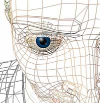

Title: Evil Eye - hið illa auga sálarinnar
Slug: evil-eye-hid-illa-auga-salarinnar
Date: 2006-07-21 18:02:00
Part: 1/2
UID: 86
Lang: is
Author: Eiríkur Valdimarsson
Author URL:
Category: Þjóðfræði
Tags:

„Að gefa einhverjum illt auga“ er stundum sagt um það þegar einhver gerir eitthvað á hlut annars. Merkingin sem við drögum af þessari athöfn er oftast bundin við hugsanir, þ.e. illar hugsanir á meðan hið illa auga er framreitt, en alls ekki að einhver yfirnáttúrulegur kraftur birtist með blossum og blóðhlaupi og með einhverjum hætti „hlýði“ hinu illa auga sem við gefum. Þannig er ekki að hlutunum staðið hér á Íslandi að minnsta kosti. En í útlöndum? Er til eitthvað kröftugra og hættulegra augnsamband þar, heldur en gengur og gerist hér á Fróni? „Augun eru spegill sálarinnar“ segir einhversstaðar og sannar það að menn hafa lengi reynt að spá í tilfinningar, hugsanir og jafnvel eitthvað meira tengt augunum. Sumir hafa reynt að rýna í kraftinn sem býr að baki þeirri vél sem manneskjan er og velt því fyrir sér hvort hún geti framkvæmt einhverja yfirnáttúrulega hluti.

Augun eru töfrandi, marglit og virðast bjóða upp á spurningar sem fólk kann að velta fyrir sér. Sá sem beðið hefur hnekki eða finnst hann vera minni maður að einhverju leyti, gefur hinum illt auga. Það er gott og gilt en hingað til hefur merking þess verið höfundi hulin. Hvað er það sem er svona öflugt þegar maður gefur illt auga? Hvaða afleiðingar hefur það í för með sér? Höfundur veit að á ensku er nokkuð til sem kallast evil eye, þannig að þetta hugtak er því greinilega alþjóðlegt. En hversu alþjóðlegt er þetta hugtak? Er einhverjum hættara við að fá illt auga á sig heldur en öðrum? Hverjir senda það frá sér?

### Alþjóðleg hjátrú frá (þús-) aldaöðli

Illt auga, eða evil eye eins og það nefnist á ensku þekkist um víða veröld. Á frönsku nefnist trúin mauvais oeil, á ítölsku maloccio, á þýsku er það bose blik, ayin harsha á arabísku, ayin horeh á hebresku og droch shuil á gelísku svo dæmi séu tekin. Þessi þjóðtrú er talin ein sú útbreiddasta sem mannkynið býr yfir.[^1] Að uppruna þessarar trúar hefur höfundur ekki komist frekar en nokkur annar, en útbreiðslan er mikil sem bendir til þess að þetta er mjög gömul trú sem hefur náð að ferðast á milli samfélaga hægt en örugglega.

Augun eru afar merklegur og áberandi hluti hverrar manneskju og í þeim má oft lesa gleði, sorgir og margar aðrar tilfinningar sem annars væri mjög erfitt að ráða í. Menn hafa meira að segja reynt að ráða í tilfinningar í augum dýra, hvort þau séu glöð eða sorgmædd, sbr. selir sem hafa sérstök augu. Segir þjóðtrúin að þeir séu menn í álögum og hafi þessvegna svo sorgmædd augu. Fyrir tíma tungumálsins má kannski álykta að tjáning og samskipti hafi verið að mörgu leyti upp á augun og augnsamband komin. Slíkar pælingar hljóta að vekja ýmsar athyglisverðar spurningar, svo sem hvort hjátrúin sem umlykur hið illa auga hafi verið farin að þróast strax á þeim tímum sem tungumálið var að slíta barnskónum og augun hafi verið mikilvægur þáttur í að tjá og skynja tilfinningar.

Yfirleitt reynist ómögulegt að segja til um aldur nokkurrar hjátrúar sem manneskjan hefir hlaðið í kringum sig í gegnum tíðina. Eitt elsta og þekktast dæmið sem tengist hjátrúnni á illt auga er að finna í grísku goðafræðinni. Þar er Perseifur sendur af stað af Polydectesi konungi og er ætlað að ná höfðinu af henni Medúsu. Polydectes óskar Perseifi dauða svo hann geti fengið móður hans, og veit að augnráð Medúsu er banvænt og breytir hverjum þeim sem í það lítur í stein. Perseifur er klókur og fær lánaðan gljáfægðan skjöld hjá Aþenu og horfir aðeins á spegilmynd Medúsu og nær þannig að drepa hana og ná af henni höfðinu. Þetta hættulega augnráð Medúsu hefur oft verið notað í tengslum við trúna á illt auga. Meðal annars er það siður að nota höfuð Medúsu sem verndargrip gegn illu auga, t.d. með því að mála mynd af því í botninn á ýmsum drykkjarmálum og þannig horfir sá sem sýpur í augun á Medúsu sem verndar hann gegn öllu illu á meðan.

Samkvæmt korti í bókinni The Evil Eye sem Clarence Maloney ritstýrði er þessa trú að finna um allan heim, í mismunandi samfélögum. Öll lönd Evrópu fyrir utan Ísland hafa þessa trú innanborðs, í Mið-, Austur- og Norður-Afríku þekkist trúin, á Indlandi og einnig í Mið-Ameríku. Svo eimir af þessari trú í Norður- og Suður-Ameríku, í Rússland, Eyjaálfu og í Asíu.[^2] Því er það greinilegt að þessi trú á sér djúpar rætur á meðal mannfólksins og hefur náð mikilli útbreiðslu. Hún hefur ferðast með fólki við landafundi og fólksflutninga á milli heimsálfa. Ekki er þessa trú þó að finna hér á Íslandi eins og áður var bent á. Skýringar á því hefur höfundur ekki, en engu að síður höfum við hugtök eins og „að gefa einhverjum illt auga“, eða „öfundar-augu“. Merkingin að baki þessum hugtökum ekkert flóknari en þau segja, en þó má með ákveðnum fyrirvara ætla að skyldleiki sé á milli hinna íslensku orðtaka og evil eye hins erlenda. Tengslin eru reyndar helst að finna í þeirri hjátrú sem fram kemur í bók Jónasar frá Hrafnagili, Íslenzkir þjóðhættir, að loka augum dáinna manna svo þeir geti ekkert séð.[^3] Einnig var til ráð til að komast að því hver hefði stolið af manni, með því að nota galdrastafinn Þórshamar, en með því að rista hann upp við ákveðin skilyrði og fara með tiltekinn formála fékk þjófurinn gríðarlegan sting í augun og ef hann skilaði ekki ránsfeng sínum missti hann annað augað.[^4]

### Hjátrúin

Börnum, þá helst ungabörnum, stafar afar mikil hætta af að verða fyrir hinu illa auga. Þó eru mörg dæmi þess að hlutir, jurtir og dýr verði fyrir þessum álögum [5]. Sumsstaðar þykir það stórhættulegt að hrósa ungabarni fyrir fegurð þess, það jafngildir að kasta álögum hins illa auga á það. Eins og gefur að skilja eru það falleg börn sem eru í hvað mestri hættu á að verða fyrir þessum álögum. Það eru til margar sögur af foreldrum þar sem þeir hafa verið úti á meðal almennings, með gesti í heimsókn eða sjálfir í heimsókn, og eru ávallt stoltir með börnin sín í fararbroddi. Síðan kemur einhver að þeim, oftast einhver ókunnugur, og fer að skoða barnið gaum-gæfilega eins og flestir gera, hæla síðan barninu fyrir fegurð þess og kjassa við það. Svo þegar heim er komið fer barninu að líða illa, það fer að gráta, er illt í maganum, svitnar eða fær jafnvel niðurgang. Því næst fara foreldrarnir með barnið á spítala og læknirinn segist ekkert geta gert fyrir barnið. Þá er farið til manneskju sem fæst við ólærðar lækningar (local healer) og er sú manneskja oftast gömul kona. Finnur hún ávallt hina réttu orsök og kemur í veg fyrir að álögin nái sínu fram að ganga, þ.e. að  þau gangi frá barninu.

Þessi víðdreifða trú hefur þau einkenni að það er eitthvað við augu náungans sem getur verið stórhættulegt. Ef manneskja starir á einhvern hlut eða aðra manneskju, er mikil hætta á að afleiðingarnar gætu orðið uggvænlegar fyrir fórnarlambið, í versta falli dauði. Oft þarf augnaráðið að vera framkvæmt með ákveðnum hætti svo álögin verði að raunveruleika. Til dæmis skiptir það sumsstaðar máli hvort sá sem kastar álögunum líti upp eða niður eftir að hafa horft staðfastlega á eitthvað. Þá þykir augnráðið hættulaust ef litið er til himins en banvænt ef litið er niður [^6]. Á meðal Amhara-fólksins í Eþíópíu er það stéttaskipting sem veldur því hverjir geta orðið fyrir illu auga. Þar eru það annarsvegar buda-fólkið sem er fátækari hópur, og hinsvegar rega-fólkið sem aftur á móti eru vel stætt fólk og eru það fyrrnefndi hópurinn sem getur gefið hið illa auga [^7]. Þau þeirra rega-fólks sem eru í hvað mestri hættu eru þeir sem eru hvað myndarlegastir, þeir sem kunna að vera taldir ívið ríkari en aðrir, þeir sem hæla börnunum sínum ótt og títt og ekki hvað síst þeir sem gerast óþarflega kunnugir manneskju úr flokki þeirra úr lægri stéttinni [^8].

Einnig virðist vera til hjátrú sem er skyld hinu illa auga og virðist sömuleiðis vera útbreidd um jörðina. Þetta er máttur orðsins, en þar virðist vera hægt að valda t.d. ungabarni fjörtjóni með því einu að tala fallega um það, án þess þó að þær hörmulegu afleiðingar hafi nokkurn tíma hvarflað að viðkomandi. Máttur tungunnar kemur í stað augnanna [^9]. Þetta er frægt í Norður-Ameríku á meðal indíána, sem eru gefin tvö nöfn, eitt sem allir þekkja og viðkomandi er ávarpaður með, og annað sem enginn veit nema hann sjálfur, móðirin og höfðinginn. Nafnið er því talið alheilagt og hluti af sál manneskjunnar og er talið að hver sem er geti valdið skaða ef hann kemst yfir það. Þessi trú er þónokkuð útbreidd og á sér sérstaka gerð (AT 500) í gerðaskrá Anttis Aarne og Stiths Thomson, þar sem nafnið skiptir sköpum, og er sennilega þekktasta íslenska ævintýrið í þeim flokki „Gilirutt“ [^10].

[^1]: Símon Jón Jóhannsson. 1999. _Stóra hjátrúarbókin_. Reykjavík: Vaka-Helgafell. Bls. 191.

[^2]: Maloney, Clarence (ritstj.). 1972. _The Evil Eye_. New York, NY: Columbia University Press. Bls. xii-xiii

[^3]: Jónas Jónasson frá Hrafnagili. _1961. Íslenzkir þjóðhættir_. Reykjavík: Ísafoldar-prentsmiðja. Bls. 421.

[^4]: Jón Hnefill Aðalsteinsson. 1988. ,,Þjóðtrú". Í _Frosti_ F. Jóhannsson (Ritsj.), Íslensk þjóðmenning V. Trúarhættir, (bls. 341-400). Reykjavík: Bókaútgáfan Þjóðsaga. Bls. 384

[^5]: Dundes, Alan. (Ritstj.). 1981. _The Evil Eye. A Casebook_. Madison, WI: The University of Wisconsin Press.Bls. 125

[^6]: Dundes. 1981. Bls. 214

[^7]: Reminick, Ronald A. 1985. ,,The Evil Eye Belief Among the Amhara and Ethiopia". Í Arthur C. Lehmann og James E. Myers, _Magic, Witchcraft, and Religion_. An Anthropological Study and the Supernatural, (bls. 175-183). Palo Alto, CA: Mayfield Publishing Company. Bls. 176-177

[^8]: Reminick. 1985. Bls. 178

[^9]: Zumwalt, Rosemary Lévy. 1996. The 1996 Archer Taylor Memorial Lecture: “Let it Go to the Garlic!“_ Evil Eye and the Fertility of Women among the Sephardim_. Western Folklore, 55(4), 261-278. Bls. 264

[^10]: Aðalheiður Guðmundsdóttir. 2003. Gilitrutt, hin forna gyðja. Í Friðrik H. Jónsson (Ritstj.),_ Rannsóknir í Félagsvísindum IV_. Félagsvísindadeild, (bls. 451-462) Reykjavík: Háskólaútgáfan.Bls. 452

