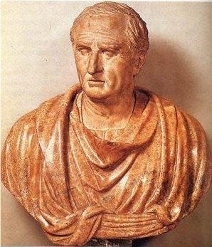

Title: Faðir þýðingafræðinnar
Slug: fadir-thydingafraedinnar
Date: 2008-04-29 10:17:39
UID: 277
Lang: is
Author: Tinna Ásgeirsdóttir
Author URL: 
Category: Þýðingafræði
Tags: Þýðingafræði, Cíceró, ræðumennska, merking fyrir merking, til varnar þýðingum

Markus Túllíus Cíceró (106-43 f.Kr.) sem við þekkjum sem hinn mikla ræðumann og rithöfund fornaldar er stundum einnig nefndur faðir vestrænnar þýðingarfræði því hann var fyrstur til að fjalla um þýðingarferlið og gefa ráð um hvernig best sé að þýða.[^1] Í þó nokkrum ritum sínum um ræðumennsku og stjórnmál, svo sem _De Oratore_, _De finibus bonorum et malorum_ og _De optimo genere oratorum_, fjallar hann um þýðingar og beinir spjótum sínum að andstæðingum þýðinga.

Eitt af meginmarkmiðum Cícerós þegar hann fjallaði um þýðingarferlið var að verja þýðingar og tilverurétt þeirra. Cíceró hafði ákveðna hugmynd um hvernig þýðingar á ræðum aþensku ræðumannanna gætu haft kennslufræðilegt gildi í þjálfun ræðumanna og í þessum tilgangi hafi hann sjálfur tekið að sér að þýða ræður grískra ræðumanna yfir á latínu. Í varnarræðum Cícerós fyrir þýðingum kemur glöggt í ljós að ákveðnar gerðir þýðinga virðast hafa átt í vök að verjast í Róm. Menn snobbuðu fyrir grískunni og lásu ýmsa texta, til dæmis ræður, frekar á frummálinu en í latneskri þýðingu. En Cíceró var í mun að Rómverjar læsu og þroskuðu latínuna sína eins og Grikkirnir grískuna og trúði því á mátt þýðinga og hann greindi aðallega tvenns konar afstöðu sem honum sýndist standa í vegi þýðinga. Annars vegar þótti honum sem menn hefðu tilhneigingu til að telja þýðingar slakari en frumtexta og hins vegar virtist fólk líta svo á að það gæti allt eins lesið frumtextann eins og latneska þýðingu. Þessa hugsunarhætti taldi Cíceró aðallega stafa af því að menn hefðu lesið of mikið af lélegum grískum skáldskap í enn verri latneskum þýðingum og að þetta hefði komið oórði á þýðingar almennt.[^2] Hann fékk hér tækifæri til að benda Rómverjum á tvískinnunginn í því að lesa sumar gerðir þýðinga en ekki aðrar og spurði af hverju menn sem virtust ekki hafa neitt á móti því að lesa þýddan skáldskap, því Rómverjar lásu t.a.m. grísk ljóð á latínu, sæu ástæðu til að setja sig upp á móti þýddum ræðum. Þeim sem fannst latneskar þýðingar ekki nógu góðar benti hann svo aftur á móti á að þeim væri frjálst að reyna að gera betur sjálfir. Um þá gagnrýni hafði hann ekki fleiri orð.[^3]

En Cíceró lætur sér ekki nægja að verja þýðingar almennt heldur er hann í ritum sínum í rauninni að þróa ákveðna þýðingaraðferð. Í _De optimo genere oratorum_ lýsir hann aðferð sinni og segist hafa þýtt Demosþenes, fremsta ræðusnilling Aþenu, ekki þannig að hann hafi elst við hann orð fyrir orð heldur hafi hann reynt að varðveita hugmyndir hans, stíl og málþrótt þannig að vel færi á latínu.[^4] Þar mælir Cíceró ákaft fyrir „frjálslegum“ þýðingum. Hann staðhæfir að góð ræðumennska felist t.a.m. í því að fræða, vekja ánægju og hreyfa við áheyrendum og að ekki sé hægt að miðla þessu með þýðingu öðruvísi en að þýða merkingu fyrir merkingu andstætt því að þýða orð fyrir orð.[^5]

Það sést glöggt þegar kenning Cíceró um þýðingar er skoðuð að þær hugsjónir sem hann hafði um þýðingar eru sprottnar úr ákveðnum hugmyndum um eðli ræðumennskunnar. Að baki kenningu hans um merkingu fyrir merkingu býr mjög pragmatísk hugmynd. Þótt ætið sé vitnað til Cícerós þegar verja á „frjálslegar“ þýðingar er mikilvægt að muna að hann er að fjalla sérstaklega um þýðingar á ræðum. Ræðumennska var lykilgrein í rómverskri menntun og Cíceró hélt því fram að einungis væri mark takandi á einni tegund ræðumennsku, þeirri sem stunduð var í Aþenu, og lagði það til að menn líktu eftir hinum aþensku ræðumönnum til að ná frama í ræðumennsku.[^6]

Hugmynd Cícerós um þýðingar byggir nefnilega á því að hann telur að ákveðið frjálsræði í þýðingum geri mönnum kleift að tileinka sér sannfæringakraft grísku ræðumennskunnar. Það sést glöggt hversu sérhæft Cíceró hugsar þýðingaraðferð sína. Hann tekur það fram að mikilvægt sé að vanda orðaval, velja fáguð orð, forðast langsóttan samanburð og fara varlega í myndlíkingar.[^7] Það sem hann hefur í huga er auðvitað hvað hentar best í flutningi á ræðu sem er byggð upp með þeim hætti að hún sannfæri fólk um ákveðinn málstað. Hann tekur það fram að sjálfur hafi hann ekki þýtt ræðurnar þeirra Demosþenesar og Æskínesar sem túlkandi heldur sem ræðumaður! Þá segist hann hafa haldið í hugmyndir og ákveðnar gerðir hugsana en gert þetta á málfari sem samræmdist hefbundinni notkun latínunnar. Enn fremur segist hann af þessum sökum ekki hafa þýtt orð fyrir orð heldur hafi hann viljað skila stíl og krafti tungumálsins. Hann virðist eiga við það að mikilvægara sé að miðla það sem textinn felur í sér heldur en textanum sjálfum.[^8] Þetta segir hann gert til þess að Rómverjar kynnist því hver séu einkenni aþenskra ræðumanna.[^9] Markmið hans er augljóst. Hann vill tileinka sér kraftinn og tæknina sem aþensku ræðusnillingarnir bjuggu yfir og þýðingaraðferð hans er þróuð með þetta markmið í huga. Að færa á milli menninga og tungumála kjarnann í aþenskri ræðusnilld.

Það var sem sagt út frá þessari hugmynd sem Cíceró gekk þegar hann fjallaði um það hvernig þýðingar úr grísku yfir á latínu geti haft kennslufræðilegt gildi í þjálfun ræðumanna. Besti undirbúningurinn fyrir verðandi ræðumenn fólst í því að lesa og hlusta á ræður annarra ræðumanna og Cíceró lýsir því í m.a. _De oratore_ hvernig hann tileinkaði sér ungur nýja námstækni sem fólst í því að þýða frjálslega yfir á latínu ræður hinna bestu grísku ræðumanna og hann segist hafa tekið eftir því að hann greip til bestu mögulegu lausnanna í orðavali og bjó til ný orð sem hentuðu.[^10] Cíceró hafði því eins og sjá má mjög frjálslegt og pragmatísk viðhorf til þýðinga. Hann þýddi verk því ekki verkanna vegna eða í þeim tilgangi að miðla þeim sem heildstæðum verkum, heldur vildi hann miðla kjarna þeirra og notaðist við annarra manna verk og bætti þau þar sem honum fannst þörf á. Þetta sést vel á afstöðu hans þegar hann þýddi aðra fræðimenn, því hann lét sér ekki alltaf nægja að þýða heldur tileinkaði hann sér kenningar þeirra og útfærði þær jafnvel. Eins og í annarri bók _De oratore_ þar sem hann fjallar um ræðutækni og hefur til grundvallar kerfi Aristótelesar um sannanir. Cíceró vildi víkka ræðulistina út fyrir svið dómsstólanna og hann setti sér það markmið að skrifa fyrir breiðan hóp menntamanna, en til að halda athygli þeirra í gegnum tæknilega útlistun Aristótelesar bætir hann við bókmenntalegum tilvitinunum og umræðum.[^11] Það er því óhætt að segja að viðhorf Cícerós til þýðinga hafi verið mun frjálslyndara og merkingin sem hann lagði í þýðingar mun víðari en það sem tíðkast nú til dags.

[^1]: Douglas Robinson, _Western Translation Theory: from Herodotus to Nietzsche_, Manchester: St. Jerome Publishing, 1997, bls. 7.

[^2]: Sama rit, bls. 11.

[^3]: Marcus Tullius Cicero, „De optimo genere oratorum,“ Cicero, H. M. Hubbell, London: William Heineman, 1949, 354-373, bls. 369.

[^4]: Ástráður Eysteinsson, _Tvímæli_, Reykjavík: Háskólaútgáfan, 1996, bls. 38-40.

[^5]: Daniel Wiessbort and Astradur Eysteinsson (ritstj.), _Translation – theory and practice, a historical reader_, Oxford: Oxford University Press, 2006, bls. 21

[^6]: Ástráður Eysteinsson, _Tvímæli_, bls. 38.

[^7]: Marcus Tullius Cicero, „De optimo genere oratorum,“ bls. 357.

[^8]: Sama rit, bls. 365.

[^9]: Sama rit, bls. 367.

[^10]: Elaine Fantham, _The Roman World of Cicero´s De Oratore_, Oxford: Oxford University Press, 2004, bls. 131.

[^11]: Sama rit, bls. 164-167.
