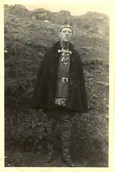

Title: Fáeinir óreiðukenndir kaflar um Jóhannes úr Kötlum og brjóstvit alþýðunnar
Slug: faeinir-oreidukenndir-kaflar-um-johannes-ur-kotlum
Date: 2008-04-15 13:19:00
UID: 260
Lang: is
Author: Kristín Svava Tómasdóttir
Author URL: 
Category: Bókmenntafræði, Bókmenntir, Sagnfræði
Tags: Kristinn E. Andrésson, Jóhannes úr Kötlum, Kommúnismi, Ljóð, Bí bí og blaka, Álftirnar kvaka, Samt mun ég vaka, Ég læt sem ég sofi, Ungmennafélög, Steinn Steinarr, Jóhannes á Borg, sjálfstæðisbarátta, Íþróttir, Íslendingasögur, Stefán frá Hvítadal, Alþingishátíðin, Ungmennasamband Dalamanna, Iðunn, Réttur, Fjölnismenn, Alþingi, Jón Sigurðsson, Þingvellir, Einar Olgeirsson, Hrímhvíta móðir, Hannes Sigfússon, Geir Jónasson, sósíalismi, Jón Sigurðsson1, Halldór Guðmundsson, sr. Magnús Helgason

## I

„Skáldið fór hávaðalaust af stað undir vöggusöng og álftakvaki, lét sem hann svæfi, hræddist heiminn og forðaðist borgir… Skáldið úr Kötlum fór ekki af stað með neinum ærslum… En þá fló honum í brjóst hinn ósýnilegi fugl: hugsjónin, og brá birtu á allt, líf sögu og þjóðfélag, og veröldin skein í nýju ljósi, varð víð og björt…“[^1]

Þannig lýsir Kristinn E. Andrésson því þegar kommúnisminn nær tökum á Jóhannesi úr Kötlum, og skyldi engan svo sem undra að Kristinn geri mikið úr dýrðum þeirrar hugsjónar. Þar að auki er engu líkara en Jóhannesi hafi vitrast þessi pólitísku tímamót í lífi sínu nokkrum árum áður en þau áttu sér stað, þegar hann ákveður að kalla fyrstu ljóðabókina sína _Bí bí og blaka_. Henni fylgir hann eftir með _Álftirnar kvaka_ eins og lög gera ráð fyrir, þá kemur_ Ég læt sem ég sofi_– og örlar á fyrirboða í titlinum, hann er bara að þykjast – loks stígur glaðvaknaður bolséviki fram á sjónarsviðið með _Samt mun ég vaka_. Þetta passar næstum því of vel, enda hafa menn verið óþreytandi að nýta sér þessa líkingu.

Í skrifum á borð við þau sem vitnað er í hér að ofan birtist Jóhannes úr Kötlum okkur sem hálfgert puntstrá áður en hann frelsast til rauðu hugsjónarinnar. Hann er bara að leika sér við svani úti í sveit, eins og persóna í drengjabók sem á enn eftir að fara í sollinn. Þó er Jóhannes enginn drengur þegar hann kynnist kommúnismanum. Hann er fæddur árið 1899 en kemur til Reykjavíkur í kringum 1930 eftir að hafa stundað farkennslu í Dölum og Breiðafjarðareyjum í áratug.[^2] Það er þá sem ódælum nemanda hans úr Dölunum sem tekið hefur upp nafnið Steinn Steinarr tekst að pranga inn á hann kommúnisma sem honum „hafði einhvers staðar áskotnast fyrir lítið“.[^3] Þar með er lagður grundvöllur að hlutverki Jóhannesar sem eins helsta byltingarskálds íslenskra kommúnista.

## II

Það verður að teljast hugmyndafræðilegur hroki af hálfu Kristins E. Andréssonar að láta eins og veröld Jóhannesar hafi ekki verið víð og björt fyrr en hann varð kommúnisti. Löngu áður en hann fór til Reykjavíkur hafði Jóhannes verið virkur þátttakandi í annarri hreyfingu sem ekki var síður hugsjónaþrungin þótt hún hafi ekki verið bundin við stjórnmálaflokk: ungmennafélagshreyfingunni. Jóhannes var félagi í ungmennafélaginu í Saurbæjarhreppi undir forystu þess dygga ungmennafélagsfrömuðar Guðbjörns Jakobssonar, æskuvinar Jóhannesar.[^4]

Hinn víðfrægi _ungmennafélagsandi_ bregður upp mynd af þjóðhollu hreystimenni, eitthvað í ætt við myndina frægu af glímukónginum Jóhannesi á Borg vatnsgreiddum og vöðvastæltum með Grettisbeltið um sig miðjan. Íslandi allt, ræktun lýðs og lands, heilbrigð sál í hraustum líkama, hoppaðu hæð þína í fullum herklæðum, þessi slagorð eiga vel við endurreisnaranda ungmennafélaganna. Þau studdu sjálfstæðisbaráttu Íslendinga af ástríðu og meðal mannbætandi hugðarefna þeirra voru málrækt, heimilisiðnaður, áfengisbindindi, skógrækt og þjóðlegar íþróttir á borð við sund og glímu.[^5] Ungmennafélagarnir trúðu á getu einstaklingsins til að bæta eigið líf en einnig á mátt hinna mörgu og samvinnu á jafnréttisgrundvelli.[^6]

Verkefni ungmennafélagsins í Saurbæjarhreppi voru í þessum dúr; gróðursetningar, vefnaður og bygging sundlaugar að Laugum í Sælingsdal. Á fundum var skeggrætt um Íslendingasögur.[^7] Jóhannes tók fullan þátt í þessu starfi. Fyrir ungmennafélagið skrifaði hann dans- og söngvaleikinn „Valkyrjur vorra tíma“ – en Stefán frá Hvítadal málaði leiktjöldin – og hann flutti vígsluljóð er sundlaugin að Laugum var opnuð sumarið 1932.[^8] Á héraðsmóti Ungmennasambands Dalamanna árið 1930 sté hann í pontu og sagði félagsmönnum frá Alþingishátíðinni sem hann hafði sótt þá um sumarið[9], klæddur í litklæði að hætti fornmanna.[^10]

## III

Ýmislegt í starfi ungmennafélaganna stangast mjög skýrt á við þær kommúnísku hugmyndir sem Jóhannes átti síðar eftir að aðhyllast. Fyrrnefnd för hans á Alþingishátíðina 1930 er gott dæmi. Jóhannes hafði miklar væntingar til hátíðarinnar og skrifaði um hana grein í Iðunni árið 1928. Hann taldi hátíðina geta verið mikla vítamínsprautu fyrir íslenskt þjóðarstolt og leiðarljós fyrir áframhaldandi sjálfstæðisbaráttu. Meðal þess sem hann leggur til er að Íslendingar sameinist um að bera litklæði á hátíðinni. Hann vill ennfremur endurvekja hugmyndir Fjölnismanna um Alþingi á Þingvöllum og heldur því jafnvel fram að ef Jón Sigurðsson væri á lífi árið 1928 væri hann á allt annarri skoðun en hann var meðan hann lifði, og styddi þennan flutning þingsins til Þingvalla fremstur manna.[^11] Þetta er auðvitað hvorki í fyrsta né síðasta skipti sem menn leggja Jóni Sigurðssyni orð í munn, sennilega hafa fáum persónum Íslandssögunnar jafn oft verið gerðar upp skoðanir, en þessi fullyrðing Jóhannesar hlýtur samt að teljast sett fram af töluverðri dirfsku, ef ekki fífldirfsku.

Viðhorf kommúnista til Alþingishátíðarinnar var allt annað. „Hvers er að minnast?“[^12] spyr Einar Olgeirsson með þjósti í grein í Rétti 1930. „1000 ára saga Alþingis er eymdarsaga alþýðunnar…“[^14] Kommúnistar halda á lofti þeirri söguskoðun að strax við landnám hafi stéttakúgunin hafist á Íslandi með undirokun landnema á þrælum sínum og staðið óslitið síðan.[^14] Jóhannes tekur raunar undir þessa túlkun sjálfur nokkrum árum síðar með söguljóðinu Hrímhvíta móðir, sem segir sögu lítilmagnans á Íslandi, þeirra sem ekki áttu sér sögu.[^15]

Þessi umskipti kunna að virðast snörp, frá litklæðaburði og fornaldarrómantík til stéttvísrar söguskoðunar, en þau eru það ekki svo mjög þegar betur er að gáð. Grundvallaratriði í lífsskoðun Jóhannesar úr Kötlum er trú hans á alþýðunni. „Hann fylltist eldmóði“, segir Hannes Sigfússon um samræður þeirra Jóhannesar eitt sinn, „eins og jafnan þegar hann talaði um brjóstvit alþýðunnar.“[16]Og kommúnisminn var ekki eina hugmyndastefnan þar sem alþýðan var í aðalhlutverki: starf ungmennafélaganna var mjög miðað við alþýðuna, menntun hennar og uppfræðslu. Sundkennsla, heimilisiðnaður, félagsstarf og bindindisheit, allt miðaði þetta að því að bæta líf alþýðunnar heima í héraði. Geir Jónasson, sem ritaði sögu Ungmennafélags Íslands á þrjátíu ára afmæli þess 1937, túlkar hvötina að stofnun þess sem löngun ungs fólks til að hafa áhrif á þjóðfélagið og bæta hag þeirra verst settu með sjálfshjálp og samstöðu.[^17] Í ungmennafélagsandanum býr einhver heillandi heiðríkja – og bjargföst trú á brjóstvit alþýðunnar.

## IV

Í tilefni af hundrað ára afmæli Jóhannesar úr Kötlum skrifaði Jón Sigurðsson framkvæmdastjóri einkar fallega minningu um skáldið sem varpar kannski skýrara ljósi á þær óreiðukenndu hugleiðingar sem hér fara á undan.[^18] Jón kynntist Jóhannesi þegar sá síðarnefndi var kominn á efri ár og horfði yfir líf sitt og reynslu – og það með nokkrum vonbrigðum. Vonin um sigur sósíalismans varð æ fjarlægari en í staðinn var komið siðlaust neyslusamfélag sem einkenndist af græðgi og heimtufrekju og „drýldinn vélskófluverkalýður sem heldur að sósíalisminn sé bíll og þjóðfrelsisbaráttan íbúð“ eins og Jóhannes orðaði það í bréfi til Einars Olgeirssonar.[^19]

Jón Sigurðsson útskýrir þessi viðhorf Jóhannesar með skírskotun í það umhverfi sem mótaði viðhorf hans til þjóðfélagsins. „Kjarninn í hugarheimi Jóhannesar“, segir Jón, „var einlæg þjóðleg og alþýðleg mannúðarstefna. … Meðal annars miðast hún við tiltölulega frumstætt mannlíf í skauti náttúrunnar, lágt verktæknistig og sjálfsnægtabúskap.“[^20] Þótt ýmsir hafi réttilega bent á hæfileika Jóhannesar til að tjá hugðarefni ólíkra kynslóða með síkvikum yrkingum sínum[^21] bar hann uppruna sínum í bændasamfélaginu gamla skýr merki, þar sem nægjusemin var hin mikla dyggð. Sósíalistar eins og Jóhannes ætluðu alþýðunni aldrei nein umfram lífsþægindi. Sérhæft samfélag þar sem verslun og þjónusta voru sérstakir atvinnuvegir var ekki markmiðið, frjáls markaður var blekking. Það skipti ekki máli að græða heldur að hafa nóg fyrir sig og sína, að enginn þyrfti að þræla sér út við ómanneskjulegar aðstæður eða vera upp á aðra kominn. Erfiðleikar kreppuáranna höfð auðvitað sitt að segja um þetta viðhorf. Þannig þjónaði sósíalisminn sem draumur um réttlátt þjóðskipulag, og þegar um leið og herinn kom og peningarnir komu loksins og samfélagið tók kipp inn í neyslusamfélag nútímans tengdu sósíalistar þennan draum sinn við endurreisn hinna gömlu gilda bændasamfélagsins. Eins og Halldór Guðmundsson hefur bent á hefur þetta viðhorf lítið að gera með sögulega efnishyggju marxismans,[^22] en er fremur dæmi um birtingarmynd erlendrar stefnu við íslenskar aðstæður.

Athyglisverð er klausa í grein Jóhannesar um mann sem hann dáði mjög, séra Magnús Helgason skólastjóra Kennaraskólans. „Ég hef engan þekkt sem sameinað hefur fornmennt, alþýðumenningu og endurreisn þjóðar sinnar af þvílíku jafnvægi… Og sannari húmanista í víðum skilningi er erfitt að hugsa sér. Hann var í aðra röndina rómantískur hetjudýrkandi, en samúð hans með umkomuleysingjanum risti þó enn dýpra. Hann hélt fast við fornar dygðir, en skilningur hans á nýjum viðhorfum, jafnvel hinum róttækustu, var í senn skarpur og mildur.“[^23] Sennilega fór Jóhannes úr Kötlum langt með að lýsa sjálfum sér í þeim orðum.

[^1]: Kristinn E. Andrésson, „Inngangsorð“. Í Jóhannes úr Kötlum, _Vinaspegill_. Reykjavík 1965, bls. xi

[^2]: www.johannes.is ? Æviferill

[^3]: Steinn Steinarr, „Jóhannes úr Kötlum fimmtugur“._Steinn Steinarr. Ævi og skoðanir_.. Reykjavík 1995, bls. 111

[^4]: Einar Kristjánsson, „Fallnir stofnar“._. Breiðfirðingur_. 41 (1983), bls. 79-89. Sjá bls. 83f

[^5]: Geir Jónasson, _Ungmennafélög Íslands_. 1907-1937. Minningarrit. Reykjavík 1938, bls. 359-382

[^6]: Sesselja Guðmunda Magnúsdóttir, _Ungmennafélagsandinn. Hver er rót þessa afls sem lifað hefur með þjóðinni nú í 90 ár?_. Reykjavík 1997, bls. 49

[^7]: Geir Jónasson, _Ungmennafélög Íslands_., bls. 287-289

[^8]: Einar Kristjánsson, „Fallnir stofnar“, bls. 83-85

[^9]: Geir Jónasson, _Ungmennafélög Íslands_. bls. 282

[^10]: www.johannes.is ? Ljósmyndir ? 1915-1932

[^11]: Jóhannes úr Kötlum, „Alþingishátíðin 1930“._ Iðunn_. 1928, bls. 200-221

[^12]: Einar Olgeirsson, „Hvers er að minnast?“. Réttur 15:2 (1930), bls. 123-138. Sjá bls. 123

[^13]: Sama heimild, bls. 128

[^14]: Sama heimild, bls. 125

[^15]: Jóhannes úr Kötlum, _Hrímhvíta móðir: söguljóð_.. Reykjavík 1937

[^16]: Hannes Sigfússon, _Framhaldslíf förumanns: endurminningar Hannesar Sigfússonar skálds_.. Reykjavík 1985, bls. 194

[^17]: Geir Jónasson, Ungmennafélög Íslands, bls. 401-425. Geir notar reyndar ófeiminn hugtök á borð við „auðmagnsfyrirkomulag“ en það skal látið ósagt hér hvort einhverjar ályktanir megi draga af því um pólitískt eðli ungmennafélagshreyfingarinnar; hún var alltént ekki flokkspólitísk í orði.

[^18]: Jón Sigurðsson, „„- Ég finn ég verð að springa…“ Að boða og iðka af einlægni“. _Tímarit Máls og menningar_. 60:4 (1999), bls. 25-50

[^19]: Jóhannes úr Kötlum, _Vinaspegill_. bls. 232

[^20]: Jón Sigurðsson, „„- Ég finn ég verð að springa…““, bls. 50

[^21]: Sjá t.d. Skafti Þ. Halldórsson, „Hugsjónaskáld og lofgerðasmiður“. www.johannes.is ? Greinar

[^22]: Halldór Guðmundsson, „Sjödægra, módernisminn og syndafall Íslendinga“._Svart á hvítu_. 2:2 (1978), bls. 2-9, sjá bls. 9

[^23]: Jóhannes úr Kötlum, _Vinaspegill_., bls. 138.
