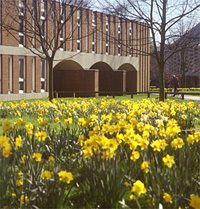
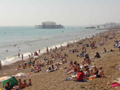

Title: Fámenni í fjölmennu fjársvelti
Slug: famenni-i-fjoelmennu-fjarsvelti
Date: 2006-01-17 08:38:00
UID: 36
Lang: is
Author: Karl Jóhann Garðarsson
Author URL: 
Category: Póstur að utan, Sagnfræði
Tags: framhaldsnám, University of Sussex, Brighton, málstofa, hugmyndasaga

Á suðurströnd Englands er strandborgin Brighton. Í Brighton eru tveir háskólar, báðir nýlegir. Þykir það nokkuð vel í lagt enda íbúar borgarinnar ekki ýkja margir, rétt um þrjúhundruð þúsund, og því nauðsynlegt að fá nemendur víðsvegar að. Ég var einn af aðkomufólkinu sem settist á skólabekk í University of Sussex á síðasta ári. Ég hafði hálft í hvoru álpast í framhaldsnám við þennan skóla vegna þess að sagnfræðiskor Háskóla Íslands hefur skiptinemasamning við Sussex. Þar var boðið uppá það sem mér virtist spennandi nám í hugmyndasögu.

Þegar á hólminn var komið stóðu þrír strákar í sömu sporum og ég: voru að byrja í mastersnámi í hugmyndasögu og kviðu svolítið fyrir. Fleiri voru það nú ekki, sem hófu nám í þessum fræðum þetta árið, og vorum við fjórir því uppistaðan í flestum þeim tímum sem við sóttum. Námskeiðin voru tvö á hvorri önn og hvert námskeið hafði tvo klukkutíma á viku til umráða. Fyrirlestrar og próf þekkjast ekki í framhaldsnámi við Sussex og voru því einungis umræðutímar. Tímarnir voru mjög fámennir, í sumum voru 4-5 skráðir en 10 í öðrum. Fámennið skapaði aðstæður þar sem hver og einn gat lagt sitt af mörkum í hverjum tíma. Raunar er varla hægt að komast upp með að tala ekki eitthvað í tvær klukkustundir þegar svo fáir skipta með sér umræðunni. Það setur svo aftur mikla pressu á nemendur að vera vel lesnir fyrir tíma, þó aldrei nái neinn að lesa allar þær bækur, greinar og kafla sem sett eru fyrir hvern tíma, því koma allir undirbúnir. Viðbrigðin voru því mikil frá BA náminu í Háskóla Íslands, þar sem umræðutímar eru oft með yfir 30 nemendum sem eru illa eða ekki undirbúnir — eða vilja í öllu falli ekki sýna fram á kunnáttu sína.

Á vorönn varð eitt námskeiðið sem ég sótti í Sussex reyndar hálf leiðinlegt og dauft því þar voru of margir. Um það voru bæði nemendur og kennari sammála. Ástæðan hljómaði kunnuglega í mínum eyrum: peningaskortur. Vegna slæmrar fjárhagsstöðu skólans þurfti að skera niður og var meðal annars gripið til þess að fjölga í hópum. Þetta kom verulega niður á náminu í þessum kúrs, þar sem einna mestur lærdómurinn fólst í skoðanaskiptum í tímum. Kennarinn var harður á því að ef svo margir myndu skrá sig í námskeið hjá honum á næsta ári myndi hann skipta hópnum í tvennt til að halda lífi í umræðunum. Það voru fimmtán nemendur í þessum alltof fjölmenna kúrs.

Í Sussex, eins og víðar í háskólum á Bretlandseyjum, er námsmatið fremur einfalt. Í lok hvorrar annar skrifar nemandi eina ritgerð í hvoru námskeiði og gilda þær 100%. Mæting, frammistaða í tímum og annað þvíumlíkt hefur því ekkert vægi nema að því leyti sem það hjálpar nemendum að skrifa betri ritgerðir. Veltur því mikið á ritgerðunum: einkunnir, námslánið og geðheilsa nemenda fyrst um sinn. Það er þess vegna undarlegt að undirbúningur fyrir og vinna í kringum ritgerðir var sá þáttur í náminu sem skólinn stóð sig verst í. Aðgengi að kennurum, leiðbeiningar um að hverju er leitað og viðbrögð við ritsmíðunum hef ég séð betur gerð. Misræmis gætti til dæmis á milli þess sem sagt var í aðdraganda ritgerðaskila og því sem kom fram í umsögn um ritgerðina eftir á.

Eftir tvær annir og fjórar námskeiðsritgerðir var komið að Ritgerðinni. Nú var að duga eða gerast fíkniefnaburðardýr til að eiga fyrir skólagjöldunum. LÍN krefst námsárangurs og skólinn krefst skólagjalda. Skiladagurinn var ellefu mánuðum eftir upphaf námsins og í fjóra mánuði snérist lífið um heimildaöflun og skriftir á mastersritgerð[^1]. Tíminn var því af skornum skammti, sérstaklega þegar ekta strandsæla brast á. Fyrir þá sem ekki sjá fyrir sér enska strandsælu er bent á að fylgjast vel með klæðskiptingnum í _Little Britain_, hann valsar vanalega um í strandbæ sem gæti verið hvar sem er á suðurströnd Englands. Þess utan er Brighton þekkt fyrir einstaklega óheppilega klæðskiptinga, ekki ólíkt hinum bráðskemmtilega karakter úr _Little Britain_.

En það var ekki bara fjölskrúðugt mannlíf, sól og sumarylur sem gerði nemendum erfitt fyrir varðandi Ritgerðina. Skriffinnska og sumarleyfi kennara á sama tíma og nemendur glímdu við stærsta verkefni sitt lögðust á eitt um að gera verkefnið örlítið erfiðara. Verra var hversu takmarkaðan tíma nemendur höfðu til umráða með leiðbeinanda sínum, einungis mátti gera ráð fyrir 3-4 tímum og kennarinn mátti ekki lesa yfir meira en ¼ af ritgerðinni. Fjárskortur kom í veg fyrir frekari yfirferð.

Eins árs mastersnám er krefjandi. Fyrirkomulag námsins, það er að byggja á lestri nemenda og samræðum þeirra, gerir miklar kröfur til nemenda en er um leið gefandi og áhugavert. Námið stendur og fellur að stórum hluta með nemendahópnum — að allir leggi eitthvað af viti í umræðuna í hverju tíma. Geðheilsan byggir svo svolítið á því að láta sér ekki bregða þegar einkunnir koma í hús. Stefnan er ekki sú sama og í hinum heimilislega Háskóla Íslands. Í Sussex er ekki „einkunnaverðbólga“ heldur er gefið eftir ströngum fyrirfram gefnum stöðlum. Er það í raun lofsvert og gott að vita til þess að ekki fái allir 8-9, heldur verði virkilega að leggja eitthvað nýtt til málanna og gera það vel. Umsagnir eru gagnrýnar og óvægnar sem þýðir auðvitað að nemendur læra heilmikið af skrifum sínum.

Miklar kröfur er líklega það sem helst vantar í hugvísindanám við Háskóla Íslands. Kennarar eiga að búast við meiru af nemendum og þeir nemendur sem standa ekki undir væntingum eiga ekki heima í áframhaldandi námi. Nemendur eiga sömuleiðis að krefjast þess að kennarar séu ekki með silkihanska við verkefnamat. Hvers vegna sætta nemendur sig endalaust við að slakir nemendur haldi áfram með ekki ósvipaðar einkunnir og þeir sem hafa lagt metnað í námið? Háskólasamfélagið verður svo auðvitað að gera kröfu um fjárhagsstöðu sem gerir kleift að bjóða upp á alvöru nám sem byggir að stórum hluta á umræðum.

[^1]: Mastersritgerð gerð við breskan skóla er töluvert styttri en íslenskar ritgerðir á því stigi, Sussex miðar við 20.000 orð. Í stað langrar ritgerðar er lögð áhersla á mikla úrvinnslu á og afstöðu til heimilda.
