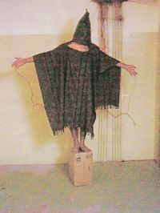
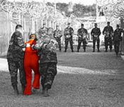

Title: Farþegaflug gegn hryðjuverkum
Subtitle: Fangaflug, „framsal“ og leynilegt varðhald
Slug: farthegaflug-gegn-hrydjuverkum
Date: 2006-03-16 07:36:00
UID: 55
Lang: is
Author: Íris Ellenberger
Author URL: 
Category: Alþjóðasamskipti, Stjórnmálafræði
Tags: 

Síðla árs 2005 varð uppi fótur og fit þegar fréttir bárust af því að flugvél leyniþjónustu Bandaríkjanna CIA væri stödd á Reykjavíkurflugvelli. Heimsókn CIA til landsins þótti ekkert nýmæli. Hins vegar vakti það athygli fjölmiðla að hugsanlega væru fangar meðal farþega vélarinnar og verið væri að flytja þá í varðhald austanhafs. Þeir væru hugsanlega fórnarlömb ólöglegs „framsals“ og að yfirvöld fyrirheitna landsins notuðu pyndingar og illa meðferð við yfirheyrslur. Íslendingum brá sannarlega við þær fréttir að lofthelgi landsins væri ef til vill notuð til að greiða fyrir mannréttindabrotum voldugasta lands heimsins. En hvað er þetta fangaflug; hver er ábyrgð ríkja sem framkvæma það eða greiða fyrir því; og hver eru viðbrögð íslenskra stjórnvalda við hugsanlegum mannréttindabrotum á íslensku yfirráðasvæði?

Fangaflug er ein birtingarmynd „framsals“. Hugtakið vísar til margvíslegra aðgerða bandarískra stjórnvalda við að flytja fólk leynilega frá einu landi til annars. Þessar aðgerðir eru t.d. móttaka einstaklinga til varðhalds frá erlendum ríkjum, flutningar fanga úr „stríðinu gegn hryðjuverkum“ í varðhald annarra ríkja og brottnám grunaðra einstaklinga í erlendri lögsögu. „Framsal“ er haft innan gæsalappa vegna þess að flutningarnir hafa ekki farið í gegnum neina réttar- eða stjórnarfarslega ferla, andstætt hefðbundnu framsali. Það virðist hafa verið stundað af leyniþjónustu Bandaríkjanna frá 1995 undir heitunum „sérstakt“ eða „gagnstætt framsal“.

Bandaríkjastjórn hefur viðurkennt „framsal“ fanga „úr stríðinu gegn hryðjuverkum“ til annarra landa þar sem þeir skulu hljóta réttláta málsmeðferð í samræmi við bandarísk lög og alþjóðasáttmála. Hins vegar hafa mannréttindasamtök lýst yfir áhyggjum vegna „framsalsins“. Komið hefur í ljós að fangar eru fluttir í varðhald ríkja sem grípa gjarnan til pyndinga og illrar meðferðar við yfirheyrslur. Auk þess taka Bandaríkin við föngum frá öðrum ríkjum og halda þeim í leynilegu varðhaldi á svokölluðum „svörtum stöðum“.  Hugtakið er fengið út leyniskjölum og vísar til nets leynilegra fangelsa sem CIA er talin hafa rekið í 8 löndum á mismunandi tímum. Meðal landanna má nefna Írak, Jórdaníu, Pakistan, Tæland og Úsbekistan auk óþekktra ríkja í Evrópu og hins alræmda fangelsis við Guantánamo-flóa á Kúbu. Þar er föngum haldið leynilega án vitneskju fjölskyldu þeirra eða lögfræðinga. Slíkt kallast „mannshvarf“ eða þvingað mannshvarf og er algerlega bannað samkvæmt alþjóðalögum. Stjórnvöldum ber í hvívetna að halda föngum í opinberlega viðurkenndum fangelsum.

Bandaríkjastjórn neitar því staðfastlega að „framsali“ sé ætlað að ná upplýsingum úr fórnarlömbunum með pyndingum og annarra ómannlegri, niðurlægjandi eða illri meðferð. Hins vegar hafa mannréttindasamtökin Amnesty International aflað fjölmargra vitnisburða um mannréttindabrot gegn „framsalsföngum“. Gögn samtakanna benda til þess að pyndingar séu viðhafðar og varðhaldinu sé ætlað að valda hámarks vanlíðan. Fangarnir séu hettuklæddir, einangraðir, hlekkjaðir og áreittir með hljóðum. Þessar aðferðir skaða sjón, heyrn og lyktarskyn, valda hugsanaruglingi og langvinnri sálrænni og líkamlegri þjáningu. 

Evrópuríki eru grunuð um að greiða fyrir slíkri meðferð, viljandi eða óviljandi. Vitað er um átta tilvik fangaflugs í gegnum evrópska lofthelgi en óopinber flugumferðargögn sýna að flugvélar leigðar af CIA hafa farið þúsundir ferða um evrópska flugvelli og lofthelgi frá árslokum 2001. Tiltækar upplýsingar valda þungum áhyggjum um að fangaflug sé stundað í mun ríkari mæli en hin átta þekktu tilvik gefa til kynna. Evrópuríki hafa ávallt neitað að hafa vísvitandi greitt fyrir „framsali“ eða vitað um tilvist þess. Hins vegar staðhæfði Colin Powell, fyrrverandi utanríkisráðherra Bandaríkjanna, í viðtali við BBC að Evrópuríkjum hefði verið fullkunnugt um „viðtekna starfshætti“ Bandaríkjanna í málum fanga sem eru sekir eða grunaðir um hryðjuverkaárásir. Einnig hefur Condoleezza Rice gefið til kynna að Evrópuríki hafi samþykkt eða vitað af fangaflugi í gegnum þeirra lögsögu. Auk þess telur laga- og mannréttindanefnd Evrópuráðsins að Evrópuríki séu viðriðin „framsal“ í kjölfar rannsókn nefndarinnar á fangaflugi og tilvist leynilegra fangelsa í Evrópu.

Ríki sem vitandi vits aðstoða eða greiða fyrir mannréttindabrotum eru sek gagnvart alþjóðlögum. Þetta á m.a. við um „framsalsferlið“ því það felur gjarnan í sér leynilegt varðhald, mannshvörf og pyndingar eða annars konar illa meðferð. Evrópskar stofnanir eru þeirrar skoðunar að Evrópuríkjum beri skylda til að rannsaka allar ásakanir um brot gegn Mannréttindasáttmála Evrópu. Terry Davis kynnti skýrslu laga- og mannréttindanefndar Evrópu 1. mars sem byggir á svörum aðildarlanda við spurningum sem hvernig lög þeirra taki á „framsali“ og fangaflugi. Hann getur þess að lög Evrópuríkja geri ekki ráð fyrir brotum á borð við „framsal“ og því geti ríkin ekki fullvissað sig um að slík mannréttindabrot hafi ekki verið framin í lögsögu þeirra. Ennfremur skrái aðeins Ungverjaland allt flug um lofthelgi sína. Evrópuríki eru því ekki í stakk búin til að taka á vandamálinu og munu halda áfram að greiða, vitandi eða óafvitandi, fyrir mannréttindabrotum verði ekki gripið til aðgerða.

Fréttir af hugsanlegu fangaflugi CIA um íslenska lofthelgi bárust 1. nóvember 2005 og kom þá í ljós að flugvélar flugfélaga, sem leyniþjónustan notar til fangaflugs, hefðu margoft millilent á Íslandi. Vélarnar voru 15 talsins og höfðu notað íslenska flugvelli frá árinu 2000, flestar aðeins einu sinni en aðrar allt að 15 sinnum. Þó var óvíst hvort flugvélarnar væru í leigu CIA í umrædd skipti og hvort fangar væru um borð. Viðbrögð Alþingis voru blendin. Stjórnarandstæðingar mótmæltu harðlega, kröfðust þess að málið yrði rannsakað. Auk þess fordæmdi Amnesty International á Íslandi fangaflug og Mannréttindaskrifstofa Íslands lýsti yfir þungum áhyggjum vegna þess. Utanríkisráðherra var efins um að vélarnar hefðu flutt fanga um íslenska lofthelgi. Hann neitaði að svara spurningu þingmanns stjórnarandstöðunnar, um viðbrögð stjórnvalda við fangaflugi um íslenska lögsögu, öðru en því að hart yrði brugðist við öllum brotum á alþjóðalögum. Forsætisráðherra sagðist ekki hafa vitað um tilvist fangaflugs og dómsmálaráðherra vildi ekki hefja rannsókn sökum þess að um orðróm væri að ræða. Utanríkisráðherra kallaði meint fangaflug sögusagnir þegar deilt var um drög að ofannefndri skýrslu mannréttindanefndarinnar í lok janúar síðastliðnum. Forsætisráðherra greindi jafnframt frá því að svör utanríkisráðherra Bandaríkjanna staðhæfðu að ekkert ólöglegt fangaflug hefði átt sér stað og virtist treysta Bandaríkjastjórn til að segja satt og rétt frá eigin mannréttindabrotum.

Í svari utanríkisráðherra við fyrirspurn laga- og mannréttindanefndar Evrópuráðsins eru greint frá margvíslegum lagaheimildum íslenskra stjórnvalda til að grípa í taumana, krefjast upplýsinga um farþega og fara um borð í flugvélar leiki grunur á að „framsalsfangar“ séu um borð. Fálæti einkennir þó viðbrögð stjórnvalda og virðist sem meint ólöglegt fangaflug verði ekki rannsakað hér á landi. Stjórnvöld telja grunsemdir þess efnis ófullnægjandi og hafna þeim sem orðrómi eða sögusögnum. Flugvélar flugfélaga sem tengjast „framsalsmálum“ hafa millilent um 60 sinnum á Íslandi á síðustu fimm árum. Fjölmargir vitnisburðir, m.a. frásagnir fórnarlamba „framsals“, vekja upp sterkan grun um að alvarleg mannréttindabrot séu framin í skjóli leynilegra fangaflutninga og varðhalds. Auk þess hafa mannréttindasamtök og Evrópuráðið hvatt Evrópuríki til að rannsaka allar ásakanir um fangaflutninga í gegnum þeirra yfirráðasvæði. Þó bendir ekkert til þess að slík rannsókn verði hafin í bráð heldur verði fangaflug gert að viðfangsefni þjóðfræðinga. Flugumferðarskýrslur og grunsamlegar flugvélar á Reykjavíkurflugvelli verða ef til vill rannsakaðar líkt og nútímaþjóðsögur um köngulær í pottaplöntum og álfa sem tefja vegaframkvæmdir.

