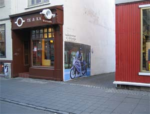
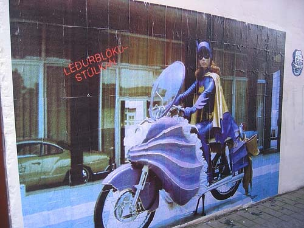

Title: Fegurð götunnar
Slug: fegurd-goetunnar
Date: 2005-12-16 11:40:00
UID: 29
Lang: is
Author: Naive
Author URL: 
Category: Listir, Í umræðunni
Tags: Götulist, Veggjakrot

Það var nokkuð liðið á aðfaranótt þriðjudags þegar við lögðum af stað tveir. Meðferðis höfðum við fötu fulla af lími og einn pensil og 185 blaðsíður af litprentuðum A4 blöðum. Ætlunin var að koma þeim fyrir á vegg einhversstaðar við Laugaveginn. Við erum götulistamenn.

Þetta var ekki í fyrsta sinn sem við fórum út að næturlagi í þeim tilgangi að skilja eftir okkur eitthvað sköpunarverk í göturýminu. Sú spenna sem fylgdi fyrstu skiptunum og má rekja til ólögmætis athæfisins er löngu horfin. Við skreytum ekki borgina vegna þess að það er ólöglegt — við skreytum borgina þrátt fyrir að það sé ólöglegt. Framkvæmdin í þetta sinn tók um það bil tvo tíma. Það fer nokkur tími í að velja verkinu stað, þó að við höfum skoðað það fyrirfram. Reynt að finna veggi þar sem líklegt er að verkið sjáist og að það fái að lifa.

Sjálf framkvæmdin er einföld: líminu er komið á vegginn, blaðið lagt á veggin og loks lím yfir. Rétt eins og verið sé að veggfóðra.  En það er tímafrekt að koma 185 blaðsíðum fyrir og það verður að gera með nokkurri nákvæmni. Samskeyti þurfa að falla vel saman og röðin verður að vera rétt. Fullgert er verkið um 3 metrar á breidd og 2 metrar á hæð.

Það var skítakuldi þessa nótt og fáir á ferli. Þeir sem gengu hjá stoppuðu flestir og lýstu yfir ánægju með framtakið. Enginn spurði hvort við ættum vegginn en sumir forvitnuðust um hvað við værum að meina. Í okkar tilfelli er svarið einfalt. Við viljum bæta það samfélag sem við búum í. Við viljum gera steingráa veggi borgarinnar litríkari. Við viljum færa samborgurum okkar eitthvað fallegt að gjöf. Við viljum lifa í samfélagi þar sem rými götunnar ber þess merki að þar búi fólk en ekki vélmenni. Við viljum fegra borgina og við viljum tjá okkur. Fyrir okkur er hið opinbera rými sjálfssagður vettvangur til þess að tjá sig á. Gatan er mín ekkert síður en þín.

Það er áberandi í umræðunni um hið svokallaða veggjakrot að tilvist þess sé lýti á samfélaginu. Einhverskonar æxli eða ónáttúra sem beri að uppræta. Við teljum að þessu sé einmitt þveröfugt farið. Opinber tjáning er merki um heilbrigt samfélag. Merki um að hinir raddlausu finni sér stað til þess að tjá sig þar sem heyrist til þeirra. Í samfélagi þar sem hinar hefðbundnu listir, hvort sem það er Kjarval eða nútímaleg innsetning eftir Trabant, eru lokaðar inni á söfnum eða í galleríum sem enginn sækir, afmarkað af fjórum veggjum og læst inni á kvöldin. List sem talar til fárra, ef einhverja. Götulistin er list fólksins. Gerð af fólki fyrir fólk. Laus við þann dauða tilgang sem einkennir hið höfundarmerkta verk: að upphefja listamanninn, skapa honum stöðu.

Við teljum að hin hefðbundna list sé löngu slitin úr tengslum við veruleikann. Götulistin ER veruleikinn. Veruleikinn lifir í verkinu, gatan er hluti af verkinu og staðsetningin á götunni mótar verkið og skilgreinir það, jafnvel meira en innihald eða útlit verksins. En götulistin nýtir sér einnig staðsetninguna til þess að túlka og skapa innihald, umhverfið verður hluti af verkinu og skiptir jafn miklu máli og sjálft verkið. Gatan og listaverkið renna saman í eina heild — án götunnar væri ekkert götulistaverk. Götulistin lifir á götunni. Það væri dauði hennar að færa sig inn í galleríið. Galleríið drepur listina en gatan nærir hana.

Þegar við höfðum lokið við verkið héldum við í sitthvora áttina. Verkið stóð eftir, nafnlaus gjöf til meðborgara okkar. Enn eitt götulistaverkið í blómlegri flóru Reykjavíkurborgar. Það heyrist aldrei en það er staðreynd að Reykjavík er talin vera ein af frjóustu og mest lifandi borgum þegar kemur að götulist. Fegurðin hér er algild, á götunni sem og innra með Unni Birnu.

Ef þeim samborgurum okkar líkar ekki verkið er þeim meira en velkomið að tjá sig á veggjunum. Skapa eitthvað sem þeim finnst fallegt. Tjá sig af þeirri ástríðu sem allir búa yfir. Taka þátt í að skapa manneskjulegra samfélag. Lifandi samfélag.

Götulistamaðurinn [Banksy](http://www.banksy.co.uk/) orðaði þetta svona:

> Imagine a city where graffiti wasn't illegal, a city where everybody could draw wherever they liked. Where every street was awash with a million colours and little phrases. Where standing at a bus stop was never boring. A city that felt like a living breathing thing which belonged to everybody, not just estate agents and barons of big business. Imagine a city like that and stop leaning against the wall - its wet.

