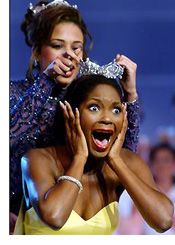

Title: Fegurð og drottningar ... smá pæling
Slug: fegurd-og-drottningar-sma-paeling
Date: 2006-10-13 10:50:00
UID: 102
Lang: is
Author: Eiríkur Sturla Ólafsson
Author URL: 
Category: Í umræðunni, Fjölmiðlar
Tags: 

„Og sigurvegarinn er...!!!“ Mér stendur ami af því, hversu áberandi og algeng þessi upphafsorð mín eru í íslenskum fjölmiðlum. Gripasýningar þær, sem iðulega eru kenndar við fegurð (og víst eru margir gripirnir fagrir) hafa alltof lengi átt góðu gengi að fagna og virðast vera einn vinsælasti plásturinn á marða þjóðarsálina, sem stöðugt þarf að kyngja því að geta svo gott sem ekkert í neinu á alþjóðavettvangi. Það má vera að Björgólfur Thor eigi pening, en hann fær seint kórónu eða verðlaunapening og er auk þess að mestu óþekktur utan viðskiptageirans erlendis. Svo er nú það. Strákarnir „okkar“ blammera sig líka reglulega í boltanum (bæði í hand- og fótbolta) og kraftajötnar hafa aldrei almennilega náð sér eftir fráfall Mr. Sigmarssonar og brotthvarf Magnúsar úr Verinu. Og hver fylgist hvort eð er með kraftasporti? Enginn...

Og þó? Á einu sviði vinnum við nær alltaf. Í fegurðarsamkeppnum. Upp úr þessu hefur spunnist sú goðsögn að hér búi fallegasta fólkið: „ðe móst bjútífúllest end vonderfúllest“. En er það? Hér er hégómi á borð við þennan hafinn upp, það þykir með eindæmum fínt að taka þátt í svona keppnum. Ég átti kunningja sem montaði sig af því að hafa komist á séns með „þessari sem varð nr. 2 í Miss Suðurlandi“. Þegar ég svo gekk á hann, viðurkenndi hann að muna ekkert hvað fljóðið fríða hét. En hverju skipti það? Hún var jú næstum orðin Miss Suðurland. Þetta eru ákveðin skilaboð um forgangsröðun í forpokuðum hugarheimi kotbóndans. Þú ert ekki maður með mönnum nema þú hafir tekið þátt, þekkir einhvern eða hafir einhvern tíma þekkt einhvern sem hefur (hugsanlega) tekið þátt í fegurðarsamkeppnum. Sem sagt, þetta fyrirbæri þykir (eins og áður sagði) fínt hér á landi og maður getur vart talist fallegur yfir höfuð án þess að eiga kórónu og borða í stíl við brosið.

Þessi staðreynd skýrir fyrst og fremst árangur íslenskra keppenda í greininni (sem því miður fyrir hinn áhugasama landa hefur ekki fengist viðurkennd á Ólympíuleikum). Væri ég Breti sem nýlega hefði áskotnast sá heiður að vera valinn Mr. London er hins vegar líklegra að ég hefði verið lúbarinn af kynbræðrum mínum. Hér á landi þykir þessi titill hins vegar karlmannlegur. Jahá, íslensk karlmenni sýna testósterónið með því að raka á sér bringuna, aflita hárið og liggja í ljósum. Ég er greinilega slappt karlmenni, enda hef ég aldrei farið í ljós. Liggur við að ég sé púkó.

Fegurðarsamkeppnir þykja hins vegar yfirleitt púkó í flestum löndum Evrópu, og í raun víðar. Ekki er langt síðan blása varð keppnina um Miss Brazil af, þar sem ekki tókst að manna hana. Þó þykir brasilískt kvenfólk ekki ljótt, og er þá vægt til orða tekið.

Auðvitað vinnum við allar fegurðarkeppnir. Alltaf er verið að tala um hvað árangurinn sé góður miðað við fámennið, höfðatöluna. Árangurinn skýrist hins vegar fyrst og fremst vegna þessa fámennis, vegna hinnar margnefndu höfðatölu. Það er einfaldlega auðveldara að sigta úr þegar hjörðin er svona þunnskipuð. Og ekki spillir fyrir þegar allir vilja vera með. Já, við nennum að standa í þessu. Það er okkar bónus. Hins vegar eiga aðrar þjóðir erfitt með að manna sínar keppnir, og liggur þá ekki í hlutarins eðli að þar vinni einstaklingar sem eiga ekki roð í landsliðið okkar í fegurð? Með þetta að leiðarljósi ættum við að beita öllum okkar kröftum að íþróttagreinum, sem öðrum þjóðum tekst varla að koma saman liði í. Til dæmis í engisprettukasti, saumsprettusundi eða pokahlaupi. Þá myndu strákarnir (og stelpurnar) „okkar“ moka inn titlum, það er á hreinu.

Verri er hins vegar sú staðreynd að fegurð og útlit eru ekki einungis áhugamál hér á landi, heldur lífsstíll, sem getur haft mikið að segja um árangur í framtíðinni. Hversu margar fegurðardrottningar hafa fengið vinnu á fjölmiðlum sökum útlitsins eins? Kóróna leiðir nær undantekingalítið til spjallþáttastjórnunar, ég fæ í það minnsta ekki séð að nokkur árangur á ferilskránni vegi þyngra nú orðið. Já, þá sárnar okkur ljóta fólkinu eilítið. Þær brosa hins vegar fallega, eru sómi landsins, sverð þess og skjöldur. Til þess hefur almenningsálitið á fegurðarbatteríinu hér á landi séð til. Og hvað er ég þá að tuða?

Menn kunna mér eflaust litlar þakkir fyrir þessi skrif. Maður gagnrýnir ekki þjóðarstoltið á jafn óvæginn hátt og ég hef hér leyft mér. Og eflaust eru þessar dömur (og þessir piltar) vænsta fólk. Það þarf heldur ekkert að taka mark á mér. Ég hef ekki einu sinni farið í ljós...

---

<small class="blurb">Höfundur er áhugamaður um pokahlaup.</small>

