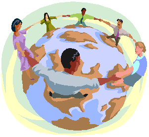

Title: Fjölmenning í fræðunum
Slug: fjolmenning-i-fraedunum
Date: 2008-04-17 17:30:31
UID: 268
Lang: is
Author: Katla Ísaksdóttir
Author URL: 
Category: Menningarfræði
Tags: Rogers Brubaker, fjölmenning, fræði, innflytjendur, fólksfluttningar, menning, þjóðerni, hópar, Gerd Baumann, staðalmyndir, minnihlutahópar, mannréttindi, fjölmenningarhyggja

Fólksflutningar og fjölmenning hafa verið áberandi umræðuefni á Íslandi á undanförnum árum. Þó þessi umræða sé ný hér á landi er hún gamalgróin í Bandaríkjunum og víða í Evrópu. Umræðan um þessi málefni innan félagsvísinda hefur þróast á undanförnum áratugum, og hafa fræðimenn í gegnum rannsóknir sínar öðlast þekkingu á þessum sviðum sem vel mætti njóta meira vægis í hinni almennu umræðu. Hér á eftir er ætlunin að skoða hvað hugmyndin um aðlögun innflytjenda felur í sér í fjölmenningarlegu samfélagi.

Rogers Brubaker[^1] hefur bent á hvernig krafan um aðlögun innflytjenda í Bandaríkjunum að bandarísku samfélagi hafi verið ríkjandi allt þar til á sjöunda áratugnum. Sú krafa fól í sér að innflytjendur tækju upp vestræna siði hinnar „bandarísku menningar“ og sneru baki við upprunalegri menningu sinni. Þegar á leið varð ljóst að slík samþætting var tálsýn og í raun væri ekkert sem réttlætti að fólki bæri skylda til að samþættast ákveðinni menningu. Í stað fyrri hugmynda um samþættingu tók við stefna sem beindist að því að aðlagast fjölmenningunni sem slíkri, það er að viðurkenna fjölbreytileika þjóðarinnar og tilvist mismunandi þjóðernishópa innan hennar. Gerd Baumann[^2] talaði um að fólk hafi snúist frá því að berjast fyrir borgaralegum réttindum (civil rights) að réttindum byggðum á þjóðernishópi (ethnic rights). Þannig hafi áherslan flust frá réttindum einstaklinga í samfélagi til réttinda mismunandi menninga í samfélagi. 

Brubaker benti ennfremur á hvernig þessi áhersla á réttindi hópa fremur en einstaklinga gæti ýtt undir klofningu samfélaga og tvíhyggjuna um _okkur_ gagnvart _hinum._ Því er gjarnan haldið fram að mikilvægi fjölmenningar felist í að varðveita sérkenni óvestrænna menninga í vestrænum heimi. Í þessari orðræðu felst eðlisgerving menningar, að ákveðnir hópar fólks séu álitnir eðlislega bundnir menningu sinni og trú, og þar með aðskildir frá _okkur_ sem höfum dómgreind og rökhugsun til að takast á við nýja og breytta tíma. Þó virðing fyrir öðrum menningarheimum sé vissulega mikilvæg getur verið hættulegt að álíta menningu áskapaða og eðlislæga ákveðnum hópum fólks. Útlendingar eru þá álitnir fulltrúar ákveðinnar menningar fremur en einstaklingar. Þess háttar flokkun í hópa ýtir undir staðalmyndir sem í kjölfarið leiða til fordóma gegn og alhæfinga um fjölbreyttan hóp einstaklinga. 

Floya Anthias[^3] segir fjölmenningu geta flokkast í frjálslynda fjölmenningarhyggju annarsvegar og gagnrýna eða reflexíva fjölmenningarhyggju hinsvegar. Frjálslynd fjölmenningarhyggja felur í sér að ráðandi hópur innan samfélagsins setji reglurnar fyrir samfélagið í heild sinni. Samfélagið er þá álitið samansafn mismunandi menningarhópa, sem hver og einn hefur sín sérkenni. Þá er oftar en ekki litið fram hjá margbreytileika _innan_ hópanna og almenn mannréttindi falla í skuggann af því sem er álitið ákvarðað af menningu. Anthias bendir á mikilvægi þess að skyggnast inn í hópana sjálfa, á minnihlutahópana innan minnihlutahópanna, sem ákvarðast meðal annars af kynjabreytu og stéttskiptingu. Hún bendir á hvernig eðlisgerving menningar geti til dæmis falið í sér að misrétti gagnvart konum og samkynhneigðum sé álitið menningarlegt og þar með réttlætanlegt fyrirbæri. Anthias gagnrýnir frjálslynda fjölmenningarsinna fyrir að falla gjarnan í þá gildru að líta á menningu sem fastmótaða í ákveðið form frekar en sem síbreytilegt ferli. Þannig yfirsést þeim stéttskipting og ójafnrétti sem óhjákvæmilega fyrirfinnst innan hverrar menningar, ekki síst í okkar eigin. Þessi leið til að hugsa um _hina_ sem öðruvísi en _okkur_ lítur fram hjá fjölbreytileikanum og valdatengslunum innan hverrar menningar fyrir sig. 

Menning er í raun og veru pólitík. Hún er hvorki eðlislæg né fastmótuð, heldur síbreytilegt ferli, leið til að lifa í mannlegu samfélagi. Hugmyndin um menningu sem fastmótaða einingu felur í sér að ákveðnir aðilar innan hennar hafi rétt til að viðhalda henni og tala fyrir hönd hennar. Ef menning er túlkunaratriði, hver á þá að hafa rétt til að ákvarða hvaða túlkun er rétt og hver röng?[^4] Með því að berjast fyrir réttindum menninga fremur en einstaklinga gefum við sjálfskipuðum talsmönnum menningarhópa vald til að ákvarða hvernig einstaklingum ber að haga lífum sínum. Ef fjölmenning á að byggjast á því að _við_ berum virðingu fyrir menningu _hinna_, í þeim skilningi að _hinir_ séu bundnir menningu sinni og að hún sé þeim eðlislæg en okkar ekki, hvernig eigum við þá að geta lifað sem jafnréttháir einstaklingar í sama samfélagi?

Brubaker benti á að hugmyndin um aðlögun hafi nú öðlast nýtt vægi í Bandaríkjunum, sem beinist að því að leggja áherslu á fjölbreytileika einstaklinga sem þátttakendur í fjölmenningarlegu samfélagi. Áherslan er á aðlögun sem ómeðvitað ferli sem á sér stað í gegnum félagslega þætti hjá hverjum og einum einstaklingi fyrir sig. Hugtakið sjálft _að aðlagast_ felur í sér ferli. Aðlögun er þannig ekki einhver ákveðinn áfangi eða ástand, það er að einhver sé annað hvort _aðlagaður_ eða ekki, heldur er aðlögun ferli sem tekur tíma, bæði hjá einstaklingum og milli kynslóða. Til þess að fjölmenningin geti gengið upp þarf að undirstrika eiginleika aðlögunarferlisins. Staðhæfingar eins og að „útlendingar vilji ekki aðlagast“ líta fram hjá þeirri staðreynd að fólk er alltaf að aðlagast. Jafnvel einstaklingur sem er við tímabundin störf á Íslandi og leggur þar með ekki upp úr því að verða hluti af samfélaginu, er óhjákvæmilega að aðlagast því. Hann er í nýju landi, á nýjum vinnustað þar sem talað er tungumál sem hann þekkir ekki. Sama hversu einangraður hann er hlýtur hann að aðlagast. Það má jafnvel segja að einangrunin sem slík sé hluti af aðlögunarferlinu, þar sem hún breytir sjálfsmynd einstaklingsins og hefur áhrif á gjörðir hans og hegðun.

Þrátt fyrir að aðlögun sé óhjákvæmilegt og að vissu leyti ómeðvitað ferli, hafa einstaklingar vissulega atbeini hvað varðar aðlögun sína, og geta að eigin frumkvæði haft mikil áhrif á það hvernig og hversu hratt hún gengur fyrir sig. Þess háttar frumkvæði felst í hugarfari og ástundun. Fólk tekur til dæmis sjálft ákvörðun um hversu mikla áherslu það leggur á að læra tungumál nýja landsins og kynnast innfæddum. Fólk hlýtur hins vegar að hafa val um hversu mikla áherslu það leggur á þessa meðvituðu aðlögun. Hlutverk samfélagsins er að auðvelda aðlögunina með ýmsum ráðstöfunum. Að mínu mati er það að koma til móts við aðlögun innflytjenda samfélagsleg skylda okkar, af þeirri einföldu staðreynd að innflytjendur tilheyra minnihlutahópi, og er þar af leiðandi alltaf hætt við að þeir verði undir í samfélaginu. Að sama skapi er mikilvægt að sporna við staðalmyndum og neikvæðum fordómum í þeirra garð, því það sem hlýst af þessum þáttum er hvorki ákjósanlegt fyrir _okkur_ né _þau._ 

Gagnrýnin eða reflexív fjölmenningarhyggja leggur upp úr því að fjarlægja mörk á milli hópa og leggur áherslu á að hverjum og einum einstaklingi sé frjálst að vera eins og hann vill. Í þessari hugmyndafræði felst viðurkenning á þverþjóðleikanum[^5] sem er svo áberandi í nútíma samfélögum. Til þess að gagnrýnin fjölmenningarhyggja gangi upp segir Anthias okkur þurfa að líta fram hjá þeirri hugmynd að völdin séu óhjákvæmilega í höndum ákveðinnar menningar sem búi þar með til rammann utan um aðrar menningar. Anthony Cohen benti á mikilvægi þess að viðurkenna margbreytileika einstaklingsins undir menningargrímunni sem við höfum tileinkað okkur svo ríkulega. Annars föllum við áfram í þá gryfju að neita fólki um réttinn til að vera það sjálft.[^6] „Við erum öll manneskjur, og við ættum ekki að taka þrengri skilgreiningar alvarlega.“[^7] 

---

<small class="blurb">Greinin er byggð á lesefni úr námskeiðinu Fjölmenningu sem kennt er á MA-stigi við mannfræðiskor í Félagsvísindadeild Háskóla Íslands.</small>

[^1]: Brubaker R. (2001) The return of assimilation? Changing perspectives on immigration and its sequels in France, Germany, and the United States. Ethnic and Racial Studies 24(4): 531-548.
[^2]: Baumann G. (1999) The Multicultural Riddle. Rethinking National, Ethnic and Religious Identities. New York: Routledge.
[^3]: Anthias, F. (2002). Beyond feminism and multiculturalism: Locating difference and the politics of location. Women’s Studies International Forum 25:275-286.
[^4]: Rapport, Nigel. (2003). Culture is no excuse. Critiquing Multicultural Essentialism and Identifying the Anthropological Concrete. Social Anthropology, 11(3):373-384.
[^5]: Í stuttu máli felur þverþjóðleiki í sér að vera þátttakandi í tveimur eða fleiri þjóðríkjum samtímis. Steven Vertovec er einn virtasti fræðimaðurinn á sviði þverþjóðleika í dag. Unnur Dís Skaptadóttir hefur skrifað um þverþjóðleg líf innflytjenda á Íslandi.
[^6]: Cohen, A. P. (1994). Self consciousness. London: Routledge. Bls. 180. Tekið úr: Rapport, 2003, bls. 374.
[^7]: Gellner, E. (1993). „The mightier pen? Edward Said and the double standards of inside-out colonialism.“ The Times Literary Supplement, 19. Febrúar 1993m 3-4. Bls.3. Tekið úr: Rapport, 2003, bls.383.
