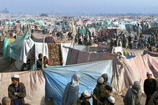

Title: Flóttamenn: Fólkið sem enginn vill fá
Slug: flottamenn-folkid-sem-enginn-vill-fa
Date: 2006-05-23 12:46:00
UID: 74
Lang: is
Author: Helga Tryggvadóttir
Author URL: 
Category: Mannfræði, Samfélag
Tags: 

Samkvæmt flóttamannastofnun Sameinuðu þjóðanna (UNHCR) eru 19,2 milljónir flóttamanna í heiminum. Það á við fólk sem hefur þurft að yfirgefa heimili sín vegna stríðsátaka, þurrka eða hungursneyðar. Meðtaldir eru þeir sem eru flóttamenn innan síns heimalands. Af þessum 19 milljónum eru 9,2 milljónir flóttamanna samkvæmt þrengri skilgreiningu, þ.e fólk sem hefur þurft að flýja ofsóknir í heimalandi sínu og flúið yfir landamæri[^1]. Staða flóttamanna er afar misjöfn eftir stefnu hvers lands varðandi málefni flóttamanna. Oft eru hömlur á ferðafrelsi þeirra og möguleikar þeirra til að sjá um sig sjálfir eru takmarkaðir, t.d. eru réttindi til að stunda verslun, atvinnu og öðlast land takmörkuð. Þetta veldur því að flóttamenn eru oftast á jaðri samfélagsins sem tekur við þeim.[^2]

Fyrstu stóru bylgjur flóttamanna í Afríku má rekja til sjálfstæðisbaráttu margra Afríkuríkja á sjötta og sjöunda áratugnum. Flóttamannastraumurinn hefur þó ekki minnkað með sjálfstæði nýlendanna þar sem í mörgum Afríkuríkjum hafa átt sér stað blóðug borgarastríð eftir sjálfstæði þeirra. Rætur þeirra má oftar en ekki rekja til nýlendutímans og þess ójafnvægis sem skapaðist í álfunni við afskipti nýlenduveldanna.[^3] Sjálfstæði nýlendanna hefur hins vegar ekki valdið afskiptaleysi Vesturlanda af þeim. Þvert á móti hafa þau reynt að hafa áhrif á borgarastríð eða stríð milli landa í öðrum heimsálfum eftir því sem hefur hentað þeirra eigin markmiðum, með afleiðingum sem flestir þekkja. Oft hefur það valdið gríðarlegum efnahagslegum- og félagslegum vandræðum í löndunum sem um ræðir.

Ástæður flóttamannavandans má einnig að hluta til rekja til misheppnaðra þróunarverkefna þar sem þau hafa í sumum tilfellum leitt til aukinnar fátæktar í stað þess að útrýma henni. Sum þróunarverkefni hafa aukið misskiptingu auðs og félagslega misskiptingu þar sem örbirgð hinna fátæku eykst á meðan elítan græðir. Með áherslu þróunarstofnana á frjálsan markað og kapítalisma hefur verið einblínt á það að lönd einbeiti sér að einni ræktunartegund til útflutnings. Það gerir löndin háð henni og bregðist uppskeran veldur það oft stórkostlegum vanda. Þetta ásamt spilltum stjórnvöldum getur aukið líkurnar á borgarastríði og blóðugum uppreisnum sem neyðir fólk til að flýja heimili sín. Ástæður vandans eru því samspil ýmissa þátta, efnahagslegra, pólitískra og félagslegra. 

En hvernig er viðhorf alþjóðasamfélagsins til flóttamanna? Fá lönd virðast tilbúin til þess að taka við flóttamönnum heldur reyna að kasta ábyrgðinni yfir á eitthvert annað land ef þau geta. Oft er litið á flóttamenn sem byrði á þeim löndum sem taka við þeim, hvort sem sú er raunin eða ekki. Flóttamönnum er oft kennt um ýmis vandamál sem eru ekki endilega þeirra sök. Þess vegna er það freistandi fyrir ríkisstjórnir þeirra landa sem tekið hafa við flóttamönnum að hvetja þá til þess að snúa aftur heim, þrátt fyrir að aðstæður til þess séu ekki öruggar.

Það heyrist oft á Vesturlöndum að þangað fljóti straumur af flóttamönnum. Það er hins vegar ekki raunsönn mynd þar sem þau taka aðeins við litlum hluta þeirra flóttamanna sem eru í heiminum sökum strangra innflytjendalaga. Einungis um fimmtungur flóttamanna fær hæli í iðnríkjunum. Meirihlutinn fær hæli í löndum sem fyrir eiga við mikil félagsleg og efnahagsleg vandamál að stríða. Að taka við fjölmörgum flóttamönnum er mikil fjárhagsleg byrði fyrir þessi lönd, ekki síst þegar sú alþjóðlega aðstoð sem þau fá er oft á tíðum ekki nægileg. Í alþjóðlegum lögum er kveðið á um að landið sem tekur við flóttamönnunum eigi að tryggja öryggi þeirra sem getur reynst mörgum löndum erfitt. Þar sem um fjölmennar flóttamannabúðir er að ræða auka flóttamennirnir mjög álag á vatns- og eldiviðarbirgðir sem getur leitt til eyðimerkurmyndunar.

Viðhorf stórveldanna til íbúa þriðja heimsins endurspeglast í virðingarleysi þeirra gagnvart flóttamönnum. Þetta viðhorf má meðal annars sjá í því að flóttamönnum er gert sífellt erfiðara að fá hæli á Vesturlöndum, t.d með því að setja þá reglu að fólk verði að sækja um vegabréfsáritun áður en það yfirgefur heimaland sitt. Þetta getur reynst mörgum ómögulegt eða lífshættulegt. Í Ástralíu eru allir flóttamenn settir í varðhald við komu í landið. Landfræðingurinn Derek Gregory segir mikinn svip vera með „Camp X-Ray“ við Guantánamo flóa á Kúbu þar sem hundruðir ólöglegra bardagamanna frá Afganistan eru geymdar og „Woomera“ varðhaldsbúðunum í óbyggðum Ástralíu þar sem hundruðum flóttamanna er haldið. Gaddavír og málmgirðingar girða af svæðið í kringum flóttamannabúðirnar þar sem flóttamennirnir eru geymdir í einskis manns landi.[^4]

Það er því komið fram við flóttamenn líkt og glæpamenn þar til sekt þeirra er afsönnuð. Þau lönd sem eru með þróuð velferðarkerfi og hafa því betri möguleika á að taka við flóttafólki óttast það oft að það sé komið til að misnota velferðakerfi þeirra. Því neita mörg iðnríkjanna flóttafólki og hælisleitendum aðgangi að velferðarkerfinu og veita þeim einungis allra nauðsynlegasta stuðning. Þar að auki er þeim víða ekki leyft að vinna á meðan verið er að skoða þeirra mál. 

Vaxandi tilhneiging virðist til þess í hinum vestræna heimi að setja samasem merki milli innflytjenda, ekki síst frá múslimaríkjum, og hryðjuverkamanna. Þetta er vitanlega ekki vel til þess fallið að bæta stöðu flóttamanna á Vesturlöndum þar sem stór hluti þeirra kemur frá múslimalöndum og hann fer ekki minnkandi í ljósi átaka þar að undanförnu.[^9] Harðari löggjöf hefur verið sett í ýmsum löndum en mestu öfgarnar í þeim efnum er að finna í hinum bandarísku PATRIOT lögum frá 2001. Þetta viðhorf hefur aukið mjög áreitni gagnvart ferðamönnum öðrum en þeim sem koma frá Vesturlöndum. „_Heimurinn minnkar fyrir þá sem eiga hann en fyrir þá uppflosnuðu og rótlausu, flóttamanninn eða innflytjandann, er engin vegalengd jafn ógnarlöng eins og örfáir metrar yfir landamæri_.“[^5]

Því miður eru þessar áhyggjur ekki alveg úr lausu lofti gripnar því inn á milli saklausra flóttamanna geta leynst hermenn og glæpamenn. Þetta hefur valdið mörgum samtökum sem veita neyðaraðstoð til flóttamanna vandræðum þar sem hjálpargögn hafa lent í höndunum á röngum aðilum sem hafa selt teppi, lyf og mat fyrir vopn[^6]. Stundum hafi þau því þurft að taka ákvörðun um að veita öllum aðstoð, einnig morðingjum, eða engum. Það má hins vegar velta því fyrir sér hvort það sé rétt að láta alla gjalda fyrir syndir fárra.

Þróunaraðstoð verður að horfa á annað en bara efnisleg gæði. Fátækt er meira en bara skortur á peningum, hún er líka skortur á réttindum, frelsi, menningu og virðingu[^7]. Fáir hafa jafn mikinn skort á réttindum og frelsi eins og flóttamenn og það er nauðsynlegt að taka tillit til þeirrar andlegu fátæktar sem það veldur. Hin harða innflytjendalöggjöf á Vesturlöndum tekur ekki tillit til þeirra erfiðleika og áfalla sem hefur neytt þá til að flýja lönd sín[^8] . Það er því ekki nóg með að flóttafólk þurfi að þola ýmsa erfiðleika til að komast út úr heimalandinu, heldur þurfa þeir einnig að þola niðurlægingu, ýmsar hömlur og óvissu um framtíðina eftir að í nýtt land er komið. Flestir flóttamenn vonast líklega til þess að þurfa einungis að dveljast tímabundið í öðru landi og komast aftur heim til sín. Venjulega er litið á stöðu flóttamanna sem tímabundna en það er ekkert tímabundið við það að þurfa að dveljast í flóttamannabúðum í hálfa öld, eins og staðan er hjá sumum þeirra.

[^1]: UNHCR. (2006). _U.N Refugee Agency Launches: „The State of the World’s Refugees._“: http://www.unhcr.org/cgi-bin/texis/vtx/news/opendoc.htm?tbl=NEWS&id=4445f6334. 

[^2]: Kibreab, G. (1994). Refugees in the Sudan: Unresolved Issues. Í: H. Adelman og J. Sorenson (ritstj.), _African Refugees: Development Aid and Repatriation_. Oxford: Westview Press. (Bls. 43-68).

[^3]: Sorenson, J. (1994). An Overview: Refugees and Development. Í: H. Adelman og J. Sorenson (ritstj.), _African Refugees: Development Aid and Repatriation_. Oxford: Westview Press. (Bls. 175-190).

[^4]: Gregory, D. (2004). _The Colonial Present_. Oxford: Blackwell Publishing.

[^5]: Homi Babha í: Gregory, D. (2004). _The Colonial Present_. Oxford: Blackwell Publishing.

[^6]: Kenyon-Lischer, S. (2005). _Dangerous Sanctuarities: Refugee Camps, Civil War and the Dilemmas of Humanitarian Aid_. Itacha og London: Cornell University Press.

[^7]: Slim, H. (1996). What is Development? Í: D. Eade (ritstj.), _Development and Social Diversity_. Dublin og Oxford: Oxfam. (Bls. 63-68).

[^8]: Teichmann, I. (2003). Asylum Seekers, Refugees and Racism. Í: G. McCann og S. McCloskey (ritstj.), _From the Local to the Global_. London: Pluto Press. (Bls.199-214).

