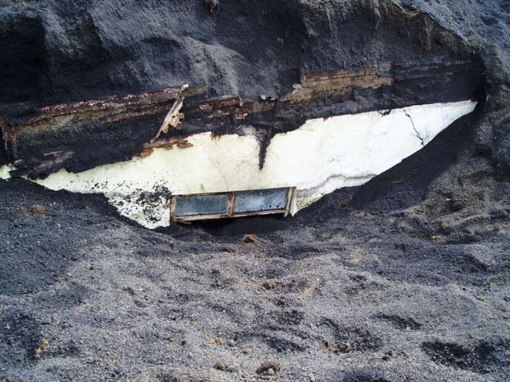

Title: (Forn)leifar – (forn)leifauppgröftur?
Slug: fornleifar-fornleifauppgroftur
Date: 2008-05-15 16:10:50
UID: 302
Lang: is
Author: Þóra Pétursdóttir
Author URL: 
Category: Fornleifafræði
Tags: 

Hvert mannsbarn hér á landi kannast við eldgosið í Heimaey í Vestmannaeyjum 1973. Það er ekkert skrýtið enda telst gosið til stærstu náttúruhamfara Íslandssögunnar. Gosið hófst aðfaranótt hins 23. janúar 1973 og stóð yfir í rúmlega fimm mánuði eða til 3. júlí sama ár. Á tímabili ríkti mikil óvissa um það hvort eyjan yrði yfir höfuð byggð að nýju en fyrir ótrúlega mildi fór allt betur en á horfðist, allir komust lífs af og margir fluttu til baka að gosi loknu. 

Gosið breytti ásjónu eyjarinnar verulega. Hraunið bætti við hana og landslag breyttist mikið. Við gosið voru yfir 1300 hús í bænum og hurfu alls um 400 þeirra undir hraun að meira eða minna leyti og önnur 400 skemmdust. Það var því ekki sama eyjan sem fólk snéri aftur til síðsumars 1973, og ómögulegt að gera sér í hugarlund þær tilfinningar sem bærst hafa innra með fólki er það steig fæti á þetta „óþekkta“ land að nýju. 

Sumarið 2005, þegar rúm 30 ár voru liðin frá gosinu, hófst dálítið ótrúlegt en áhugavert verkefni í Eyjum – nefnilega uppgröftur þess bæjarhluta sem varð undir hrauni og vikri 1973. Verkefnið hefur hið skemmtilega vinnuheiti „Pompei Norðursins“, með augljósri og eðlilegri skírskotun í Pompeii,  hina sögufrægu ítölsku borg sem grófst undir ösku í gosi í Vesúvíusi árið 79 e. Kr. Sumarið 2005 var hafist handa við uppgröft húsa sem stóðu við Suðurveg, en þau grófust undir vikri mjög snemma í gosinu og varðveittust því vel. Í sumarlok hafði fyrsta húsið, Suðurvegur 25, litið dagsins ljós að nýju. Árið eftir komu svo fram tvö önnur hús, númer 16 og 18 við sömu götu. Verkefnið hefur vakið mikla athygli innan lands sem utan, hlotið viðurkenningar, og er meira að segja sögusvið glæpasögunnar Ösku eftir Yrsu Sigurðardóttur.

Á heimasíðu verkefnisins (http://www.pompeinordursins.is) er hægt að fræðast um uppgröftinn og framgang hans, skoða fréttir og myndir honum tengdar og skilja eftir skilaboð eða athugasemdir. Þar segir að verkefnið sé metnaðarfullt og vandasamt og til þess hugsað „...að hlúa að gosminjunum og gera þær sýnilegri.“ Markmiðið er að á næstu árum verði grafin fram 7-10 hús á svæðinu og “[s]tefnt er að því að í fyllingu tímans rísi einskonar þorp minninganna, sem sýni á áhrifamikinn hátt hvernig náttúruöflin fóru með heimili fólks.“ Ennfremur segir á heimasíðunni að um sé að ræða „...einstakt verkefni í nútíma fornleifauppgreftri, sem á sér fáar, ef einhverjar hliðstæður.“

Það er áhugavert að afhjúpun gosminjanna skuli vera kölluð fornleifauppgröftur, eða „nútíma-fornleifauppgröftur“. Ekki vegna þess slík líking eigi ekki rétt á sér – því það á hún svo sannarlega – heldur vegna þess að það vekur upp spurningar um það hvað séu fornminjar og þ.a.l. hvað geti talist fornleifauppgröftur. Samkvæmt skilgreiningu í 9. grein þjóðminjalaga frá 2001 teljast þær minjar sem eru 100 ára eða eldri til fornleifa þótt heimilt sé að friða yngri minjar. Gosminjarnar í Vestmannaeyjum eru því ekki fornleifar í þeim skilningi. Og ekki falla þær innan áhugasviðs Húsafriðunarnefndar heldur. Hins vegar segir einnig í 1. grein þjóðminjalaga að tilgangur laganna sé „að stuðla að verndun menningarsögulegra minja...“ en til slíkra minja „...teljast ummerki um sögu þjóðarinnar, svo sem fornleifar og gömul mannvirki, kirkjugripir og minningarmörk, forngripir, listmunir og nytjahlutir, svo og myndir og aðrar heimildir um menningarsögu þjóðarinnar. Til slíkra minja geta einnig talist staðir sem tengjast menningarsögu.“ En samkvæmt þessari skilgreiningu er menningarsaga þá sú saga sem nær fram til aldamótanna 1900 eða svo, en þá tekur við...ó-menning? Nei, nei, sjálfsagt verða mörkin að liggja einhverstaðar, en það getur samt verið gaman og ganglegt að velta því fyrir sér hvar línur eru dregnar, í þessu sambandi sem öðrum.

Ef horfið er frá lagalegum skilgreiningum og þess í stað skoðaðar ímyndir okkar sjálfra þá ríma gosminjarnar í Vestmannaeyjum ekki síður illa við þær myndir sem við höfum yfirleitt í huga þegar talað er um fornleifar eða menningararf. Menningarminjar eru ávalar og grasi grónar bungur eða mosavaxnar hleðslur útí túni. Þær eru sýnilega fornar og þannig einhvern veginn áþreifanlega fjarlægar okkur. Líkt og steinrunnin nátttröll úr öðrum heimi, komnar yfir þetta ógeðfellda stig niðurbrots og ringulreiðar og orðnar yfirstíganlegar, eða vinnanlegar. Gosminjarnar í Vestmannaeyjum falla því ekki beinlínis að þessari öguðu og rómantísku ímynd. Þá verður einnig dálítið erfitt að gera sér í hugarlund að hið fyrirhugaða „þorp minninganna“ geti orðið að geðfelldum stað til sunnudagsgöngu og lautarferða.

En ef við látum það liggja á milli hluta hvað fornleifar eru þá er fornleifafræði allavega ákveðin grein og ákveðið fræðasvið sem beitir ákveðnum aðferðum við iðkun sinna fræða og þar á meðal við uppgröft fornra minja, hvort sem þær eru 100 ára eða ekki. Þar sem verkefnið Pompei Norðursins skilgreinir sig sem nútíma-fornleifauppgröft, sem á sér fáar hliðstæður (sem er satt og rétt), verður það að teljast mjög einkennilegt að fornleifafræðingar séu ekki viðriðnir verkefnið eða á einhvern hátt hafðir með í ráðum, en svo er ekki mér vitandi. Nútíma fornleifafræði – kannski mætti bara kalla hana leifafræði! – er ung en vaxandi grein, sem líkt og fornleifafræðin, snýst um efnismenningu okkar, en ólíkt henni hefur hún aðgang að því samfélagi sem rannsóknin beinist að, eða það er að minnsta kosti ekki jafn órafjarri og oft er raunin. Frá sjónarhorni nútíma fornleifafræði má beita aðferðum fornleifafræðinnar á hvaða efnivið sem er og leita þannig svara. 
	
Þannig að, samkvæmt þessum ofangreinda hugarstormi eru gosminjarnar í Vestmannaeyjum ekki fornleifar í lagalegum skilningi né heldur í hefðbundnum almennum skilningi, þ.e. þær falla illa að ímynd okkar um fornleifar. Það er hins vegar skoðun greinarhöfundar að gosminjarnar í Vestmannaeyjum séu (forn)leifar – leifar sem vitna um samfélag sem var – og ennfremur að uppgröftur þeirra geti því talist fornleifauppgröftur. Það væri hins vegar æskilegra, og auk þess mikilvægt fyrir verkefnið og framtíð þess sem og íslenska fornleifafræði og vöxt hennar, að fornleifafræðingar kæmu að því. Enda er það mín persónulega skoðun að fornleifarannsóknir séu óháðar aldri minja.

----

#### Heimildir:

* Pompei Norðursins – http://www.pompeinordursins.is
* Þjóðminjalög 2001 – http://www.althingi.is/lagas/131b/2001107.html
