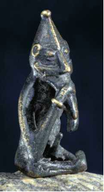

Title: Fortíðin er framandi heimur
Subtitle: Um lífshlaup og kyngervi 
Slug: fortidin-er-framandi-heimur
Date: 2007-11-15 14:36:00
UID: 195
Lang: is
Author: Sandra Sif Einarsdóttir
Author URL: 
Category: Hinsegin fræði, Fornleifafræði
Tags: 

Eftir talsverða lægð innan kennilegrar fornleifafræði á Íslandi hefur loksins orðið nokkur vakning og þ.á.m. á kynjafornleifafræði (e. _Archaeology of Gender_). Meginmarkmið kynjafornleifafræði er að rannsaka kyngervi í efnismenningu fortíðar. Til þess að finna kyngervi í fornleifafræðilegum efnivið þarf ekki endilega ný gögn eða uppgraftaraðferðir, heldur að spyrja nýrra spurninga. 

Rannsóknir á lífshlaupi (e. _lifecycle_) er einn af þeim þáttum innan póst-femínisma sem innleiddir hafa verið í kynjafornleifafræði. Roberta Gilchrist segir að nú sé þó almennt litið svo á að aldur sé einn af þeim fjórum þáttum sem mótar einstaklinginn hvað mest, en hinir þrír eru kyngervi, þjóðerni og stétt.[^1] Yfirfærsla á staðalmyndum nútímans á fortíðina á þess vegna ekki síður við um aldur en um kyn og kyngervi. Joanna S. Derevenski hefur bent á það að kyn og kyngervi helst ekki stöðugt í gegnum ævina, og því skarast það sem hún kallar félagslegan aldur á við hugmyndafræði kyngerva (e. _gender ideology_). Hún segir að þó svo hægt sé að greina ákveðin stig í lífshlaupi þar sem breyting verður á kyngervi, þá er það aldrei á neinum einum tímapunkti sem kyngervi einstaklings er „tilbúið.“[^2]

Einn þeirra efnisflokka sem hvað skýrast varpa ljósi á kyn- og kyngervisbundna efnismenningu fortíðar eru grafsiðir frá tímum heiðni. Á þeim vettvangi tengjast líffræðileg atriði beinagrindarinnar við félagsleg atriði útfararinnar og haugfjársins. Stór hluti af rannsóknum á lífshlaupi beinist því að gröfum þar sem litið hefur verið til haugfjár til þess að kanna hvernig það er notað til þess að marka stig eða þröskulda í ferlinu frá því að vera barn til þess að verða fullorðinn.[^3] Hugtakið lífshlaup er frábrugðið lífsferli (e. _Lifecourse_) að því leyti að hið síðarnefnda hefur mun sterkari tengingu við líffræðileg atriði uppvaxtar og öldrunar. 

Beinagrindin er nauðsynlegur þáttur í lífshlaupsrannsóknum - Derevenski útskýrir það á þá leið að beinin séu eins konar tengill á milli líffræði og menningar. Tekist er á við lífeðlisfræðilegar og samfélagslegar breytingar sem eiga sér stað í líkama samfélagsþegna, en þannig sameinast þessir tveir þættir, líffræði og menning.[^4] Aldur er því mun flóknara fyrirbæri en nokkur tala sem vísar til ára getur greint frá. Gilchrist bendir á hugmyndir innan félagsfræði þar sem viðurkennt er að skipta megi aldri upp í þrjá þætti: aldur með tilvísun í tíma, þá félagslegur aldur sem er skilgreindur af hegðun sem skilyrt er innan ákveðinna aldursflokka og svo lífeðlislegur aldur sem hefur áhrif á virkni einstaklings innan samfélags.[^5]

Eins og áður segir, þá á yfirfærsla staðalímynda ekki síður við um aldur en um kyn. Derevenski bendir á að í dag sé bernska mikið tengd viðkvæmni og tilfinningasemi. Vögguvísur og leikir hafa verið gerðir að táknmynd bernskunnar í Vesturlöndum nútímans og allar vísbendingar um annað er álitið vera á einhvern hátt „rangt.“[^6] Því fer þó fjarri að slíkt eigi við. Sem dæmi má nefna að Lynn Meskell segir frá því að í Deir El Medina í Egyptalandi frá tímum Nýja Konungsdæmisins hafi myndir fundist af börnum í kynferðislegu samhengi.[^7] Annar þáttur sem aldur og kyngervi eiga sameiginlegt er það að horft er á efnismenningu bernskunnar út frá tengslum við heim hins fullorðna, líkt og áður var gert um efnismenningu kvenna í tengslum við heim karlsins.[^8]

Atriði sem aðgreina fólk hvort frá öðru, sem og þau sem tengir það saman, eru mjög mikilvægir þættir í  félagslegu lífi, segir Meskell, á hvaða tíma sem er. Það breytist ekki, segir hún, en birtingarmynd og tjáningarform þessara þátta geta verið mjög frábrugðin þeim sem greina má innan vestrænnar menningar í dag. Sem dæmi nefnir hún að í Forn-Egyptalandi voru börn ekki endilega undanþegin vinnu og rannsóknir benda til að börn hafi orðið hluti af egypsku samfélagi strax við fæðingu.[^9]

Vestrænar hugmyndir um tvö kyn, karlkyns og kvenkyns, hafa oft ráðið túlkunum á kyngervum í gröfum þar sem aðeins hefur verið stuðst við líffræðilegar greiningar á kynferðum. Þó svo að þess konar greining geti hjálpað okkur við túlkun á efninu, þá snertir hún bara yfirborðið og mörg smáatriði fara forgörðum þegar þeirri aðferð er beitt. Gripur í gröf getur táknað að manneskjan sem þar liggur hafi unnið með þetta áhald eða táknað það starf sem kona í ákveðinni stétt skuli framkvæma samkvæmt stöðu sinni innan samfélagsins.[^10]

Það er nokkuð greinilegt að ekki nægir að skipta gripum upp í tvo flokka eða að álykta að samsvörun sé milli haugfjár og þess sem manneskjan stóð fyrir og var í lifanda lífi. Möguleikarnir á því hvað haugfé getur táknað eru nánast óendanlegir og ekki víst að hugmyndir nútímans falli að því sem haugféð táknaði þegar það var lagt í gröfina. Þá geta komið upp aðstæður þar sem litið er fram hjá þeim gripum sem falla utan við þá flokka sem eru „normið“. Hún telur hins vegar að þeir gripir séu mun áhugaverðari en hinir sem algengari eru og búi mögulega yfir meiri upplýsingum en aðrir.[^11]  „Norm“ vestrænna gilda eða það sem fellur utan þeirra - það sem er _hinsegin_ (e. _queer_) - er ekki endilega hægt að uppfæra á fortíðina. Ríkjandi hugmyndir samtímans um það sem telst eðlilegt er álitið fast og óbreytanlegt þrátt fyrir að það eigi í raun aðeins við innan okkar eigin menningar- og samfélagslegu marka. Þessar hugmyndir eru síðan oft yfirfærðar á fortíðina þótt þær eigi líklegast fátt sameiginlegt með raunveruleika hennar.[^12] 

Britt Solli,[^13] sem hefur lagt stund á hinsegin fræði innan kynjafornleifafræðinnar, segir að hinsegin í fornleifafræðilegu samhengi eigi ekki við samkynhneigð eins og hún er skilgreind innan vestrænnar menningar í dag. Slíkt sé ekki hægt þar sem fortíðin sé annar staður, framandi land, þar sem vestrænar skilgreiningar eigi ekki við. Hugmyndir okkar samtíma eru mótaðar af kristindómi í heilt árþúsund þar sem boðuð eru yfirráð andans yfir holdinu, segir Solli, og að það sé engan veginn yfirfæranlegt á t.d. forn norrænar hugmyndir um kynferði.

----

#### Heimildir:

* Derevenski, J. S. (1997). Age and gender at the site of Tiszaplár-Basatanya, Hungary. _Antiquity_, 71, bls. 875-889. 
* Derevenski, J. S. (2000). Material culture chock: Confronting expectations on the material culture of children. Í Joanna Sofaer Derevenski (ritstj.). _Children and Material Culture_. New York: Cambridge University Press.
* Gilchrist, R. (1999) _Gender and Archaeology. Contesting the Past_. London and New York: Routledge.
* Gilchrist, R. (2006). Fornleifafræði og lífshlaup: Tími, aldur og kyngervi. (Steinunn Kristjánsdóttir þýð.). _Ólafía I_, bls. 77-96. (Frumútgáfa 2004).
* jørungdal, T. (1988). Kan man identifisere kvinners arbeid utifra graver? Í Iregren, E., Jennbert, K., og Larsson, L. (ritstj.), _Gravskick och gravdata. Rapport från arkeolgidagarna 13-15 januari 1988_ (bls. 115-120). Report series no. 32. Lundur: University of Lund.
* Meskell, L. (1999). _Archaeologies of Social Life: Age, Sex, Class et cetera in Ancient Egypt_. Massachusetts: Blackwell Publishers. 
* Meskell, L. (2004). _Object Worlds in Ancient Egypt: Material Biographies Past and Present_. London: Berg.
* Solli, Britt (1998). Odin — the queer? Om det skeive i norrøn mytologi._ Universitetets Oldsaksamling Årbok 1997/1998_. Bls. 7-42.

[^1]: Gilchrist, 2006, bls. 79.
[^2]: Derevenski, 1997, bls. 876-877.
[^3]: Gilchrist, 2006, bls. 88.
[^4]: Derevenski, 2000, bls. 9.
[^5]: Gilchrist, 1999, bls. 89.
[^6]: Derevenski, 2000, bls. 5.
[^7]: Meskell, 1999, bls. 101.
[^8]: Derevenski, 2000, bls. 8.
[^9]: Meskell, 1999, bls. 106.
[^10]: Hjørungdal, 1988, bls. 118-119.
[^11]: Hollimon, 2001, bls. 179-180.
[^12]: Meskell, 2004, bls. 199.
[^13]: Solli, 1998, bls. 9.

