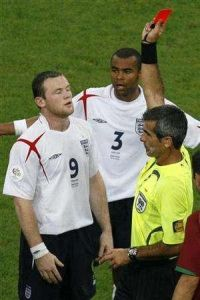
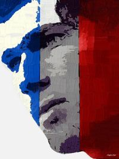
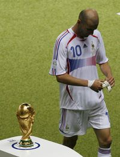

Title: Fótboltinn — Trúarbrögð þessarar aldar?
Slug: fotboltinn-truarbroegd-thessarar-aldar
Date: 2006-07-13 11:11:00
UID: 82
Lang: is
Author: Hrafnkell Lárusson
Author URL: 
Category: Íþróttir, Trúarbrögð
Tags: 

Úrslitaleikurinn á nýliðnu heimsmeistaramóti í fótbolta, sem fram fór í Þýskalandi (eins og allir vita), var kallaður _Stærsti íþróttaviðburður allra tíma_. Rætt hefur verið um að milljarður jarðarbúa hafi séð leikinn í beinni útsendingu. Sú tala er auðvitað ótrúleg einkum þegar tekið er tillit til þess gríðarstóra hluta jarðarbúa sem átti ekki kost á að berja leikinn augum í beinni útsendingu þar sem þeir höfðu ekki aðgang að rafmagni — hvað þá sjónvarpi. Ljóst má líka vera að margir íbúar jarðarinnar voru líka, á meðan á úrslitaleiknum stóð, bundnir yfir mikilvægari hlutum en tuðrusparki, s.s. því hvort þeir næðu að afla sér matar til að lifa daginn af. Hvað sem öllum stærðarfullyrðingum líður er ljóst að umfang heimsmeistaramótsins og sú athygli sem það vakti náði til allra hluta heimsins og skyggði á margt annað á meðan á því stóð. Er í því sambandi táknrænt að því var haldið fram í fullri alvöru að stjórnvöld í Ísrael hafi notað tækifærið til að leggja til atlögu við Palestínumenn á meðan athygli heimspressunnar beindist næsta óskipt að fótfimi sveittra karlmanna á grasflötum í Þýskalandi. 

Þrátt fyrir að vera í hrópandi mótsögn við þá rökhugsun og sköpunarkraft sem grundvallar velferð fólks á þeim svæðum heimsins þar sem mælanleg lífsgæði eru hvað mest virðist sem trúarofstæki vaxi fiskur um hrygg víða. Trúin verður skjól sem skákað er í til að beita órétti og ofbeldi. En í þessum efnum er ekki bara um að ræða eitthvert fólk í fjarlægum og framandi heimsálfum sem veifar skotvopnum og klæðist öðruvísi en „við“ eigum að venjast. Nei. Einstaklingar með afar einstrengingslegan hugsunarhátt og þröng sjónarhorn hafa komist til metorða innan ríkja þar sem meginþorri fólks vill (a.m.k. í orði kveðnu) halda á lofti gildum mannréttinda, einstaklingsfrelsis og lýðræðis. Slíkt er auðvitað í skelfilegu ósamræmi við það sem eðlilegt ætti að teljast.

En hvers vegna er ég að víkja að trúarofstæki í sömu andrá og ég ræði um fótbolta? Jú, því að á sama tíma og trúarofstæki er áberandi (og virðist jafnvel fara vaxandi, a.m.k. fer fyrirferð þess í fjölmiðlaumfjöllunum vaxandi) virðist sem hefðbundin trúarbrögð séu á undanhaldi víða. Í þeim smækkandi hópi sem tyllir sér á kirkjubekkina hér á landi og víðar, einkum á það við um vestur-Evrópu, fer meðalaldurinn hækkandi. Boðskapur hinna hefðbundnu „andlegu leiðtoga“ fer fyrir ofan garð og neðan hjá stærstum hluta fólks. Hann virkar ástríðulítill á marga og skortir tengsl við samtímann. Almenningur safnast fremur saman svo þúsundum skiptir á áhorfendapalla á gríðarstórum leikvöngum eða fyrir utan þá og lætur það sem fyrir augu ber þar stjórna tilfinningum sínum. Kristur og Múhameð hafa verið „settir á bekkinn“ og þeim raunar verið boðið að „leggja skóna á hilluna.“  

Gagnvart hefðbundnum trúarbrögðum hefur fótboltinn mikið forskot. „Fagnaðarerindi“ fótboltans er ungt (hefur breiðst út um heiminn undangengna öld) og hann er sýnilegur allsstaðar í kringum okkur. Sú ástríða sem tengist fótboltanum er öllum ljós og er sannarlega allt um kring. Þó afstaða fólks, byggð á tilfinningum þess, skipti fólki á milli liða, bæði félagsliða og landsliða, er fótboltinn hinn sami. Aðdáendur íþróttarinnar geta sameinast í ást á fótboltanum þó svo að litarháttur, þjóðfélagsstaða eða hin hefðbundnu trúarbrögð greini þá í sundur. Fótboltinn gengur þvert á línur þessara þátta sem svo oft hafa ráðið skiptingu fólks í hópa. Fólk styður þau lið sem hugur þeirra hneigist til og tekur þátt í sigrum liðsins og ósigrum þess. Stuðningsmenn liða, einkum „stærri“ félagsliða og landsliða, eru því sundurleitur hópur með afar litlar ef nokkrar innbyrðist tengingar — aðrar en liðið. Siðir, venjur,  litarháttur, menntunarstig, o.s.frv. geta verið afar mismunandi. En það skiptir litlu. Vonir og væntingar eru bundnar liðinu og því fleiri sem styðja það því fleiri deila áþekkri reynslu og tilfinningum. 

Rétt eins og við hefðbundna trúariðkun er fólk mis ákaft í dýrkun sinni á fótbolta. Á meðan sumir rétt gjóa augum á fótboltaleiki í sjónvarpi og grípa stöku fréttir af íþróttinni, jafnvel þó áhugi sé vissulega til staðar, leggja aðrir stórar hluta tekna sinna, líf sitt og sál í köllun sína gagnvart fótboltanum. Þeir svífa skýjum ofar þegar vel gengur en síga niður í svartnættisdrunga þegar gefur á bátinn hjá _Liðinu_. Eru óvinnufærir sökum depurðar ef illa hefur farið eða komast ekki til vinnu vegna timburmanna hafi sigur unnist og tækifæri gefist til að fagna. Fótboltinn mótar tilfinningalíf margra og stendur sálinni svo nærri næsta hversdagslegar athafnir helstu fótboltagoðanna, s.s. læknisskoðanir vegna meiðsla eða félagaskipta, geta skipt mikinn fjölda fólks miklu máli og það fyllst tilhlökkun eða áhyggna vegna þessa. Í þessu kristallast líka ákveðið forskot fótboltans á hin hefðbundnu trúarbrögð. Það er styrkur fótboltastjarnanna að vera ekki almáttugar. Þær njóta breiskleika sinna og þess að vera mannlegar. Sigrar þeirra eru sigrar „okkar“ sem bindum vonir við þær og mistök þeirra valda okkur sálarkvölum. Fótboltagoðin eru ljóslifandi. Þau sjást og jafnvel er hægt að komast í návígi við þau og sjá með eigin augum. Þannig verða fótboltaguðir nálægari en þeir hefðbundnu guðir sem sögur fara af, flestar fornar. Og þó einhverjir telji sig hafa séð hina fornu guði kemur fæstum saman um hvernig þeir séu útlits og því er langsóttara að finna sameiginleg einkenni sem margir upplifa og geta lifað sig inn í. 

Líkt og í hinum hefðbundnu trúarbrögðum er persónudýrkun fótboltans gríðarlega sterk. Hin stöðuga hreyfing er styrkur fótboltans. Hetjur og hálfguðir koma og fara, rísa og falla. Það má leggja trú sína á einn í dag og ef hann rís ekki undir væntingunum er alltaf annar til að taka sæti hans sem leiðtoginn á eilífum fótboltavelli lífsins. Enginn þarf heldur að halda einn guð eða eina hetju. Séu menn þannig innréttaðir má trúa á marga. Fótboltinn er trú valkostanna. Fótboltinn er líka fjölgyðistrú! 

Fyrir heimsmeistarakeppnina trúðu stuðningsmenn Englendinga á Wayne Rooney og mátt hans til að leiða lið sitt og stuðningsmenn þess til stallsins sem geymdi fyrirheitnu styttuna. Milljónir manna létu sig varða heilsufar þessa unga manns og vonir fólks voru bundar við hvort brotinn fótur hans myndi gróa nægilega hratt. Rooney var hálfguðinn sem öllu gat breytt. Hinum megin Ermasundsins var beðið til annarra goðulíkrar veru. Í Frakklandi og víðar um heim þar sem lið þess lands naut stuðnings var goðið sem augun beindust að „kollótti hrúturinn“ Zinedine Zidane. Líkt og kappi úr gamalli fornsögu var Zidane að leggja í sinn síðasta bardaga þar sem hann lagði allt undir í von um að verða ódauðlegur og flestum guðum meiri fótboltavöllum minninganna. Fyrir honum blasti við hin umtalaða Hilla, sliguð af slitnum fótboltaskóm gamalla hetja. Dramatíkin var viðvarandi þar sem hver leikur goðsins gat verið sá síðasti. 

Vinsældir íþróttarinnar hafa laðað að sér fjármagn úr öllum áttum. Fjármagninu fylgja völd og hagsmunir sem tekist er á um af grimmd enda er á hinum eilífu lendu fótboltans hægt að kaupa sig nær helgidómnum. Hann er nefnilega á hlutabréfamarkaði. Það er löngu orðið peningamönnum fótboltans ljóst að eigi hetjur og hálfguðir að setja mark sitt á heimilislíf um víða veröld þurfa þeir fjármagn og almannatengla. Fagnaðarerindi fótboltans verður að berast sem víðast og sem hraðast; þannig helst athygli fjöldans og þannig má auka sölu á ýmiskonar varningi tengdum fótboltanum. 

Fótboltatrúin er ekki án sinna dökku hliða fremur en önnur trúarbrögð. Þandar taugar fylgismanna leiða til misnotkunar áfengis og annarra vímugjafa. Geðsveiflurnar leiða á tíðum til ofbeldis jafnt innan sem utan heimila. Ósigrar rista djúpt þegar sálarlífið hefur verið lagt undir. Í nafni fótboltans stofna hópar reglulega til einkastyrjalda á götum úti. En styrjaldir í nafni trúar eru svo sem ekkert nýmeti. 

Þó sífellt stækkandi hópur jarðarbúa líti litið eða ekki til „æðri máttarvalda“ er trú margra, nú sem fyrr, bæði blind og ástríðufull. Forðum átti guð sitt lögheimili á síðum bóka og handrita. Hann var óáþreifanlegur og aðeins sýnilegur þeim sem vildu sjá hann. Í dag hlaupa guðirnir um sjónvarpsskjáinn. Þeir eru margir, klæðast einkennisbúningum og bera númer. Allir vita hvernig þeir líta út þó fæstir hafi séð þá. Er munurinn á trú í fortíð og samtíð e.t.v. aðeins fólginn í fullkomnari tækni?

