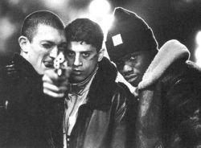
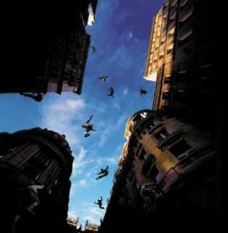
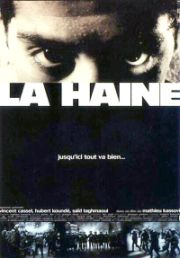

Title: Frönsk gettó í íslenskum kvikmyndahúsum
Slug: froensk-getto-i-islenskum-kvikmyndahusum
Date: 2007-12-06 13:02:00
UID: 201
Lang: is
Author: Íris Ellenberger
Author URL: 
Category: Kvikmyndir, Samfélag
Tags: 

Þrátt fyrir að á Íslandi ríki nú nokkur ótti við „innflytjendavandann“ má ljóst vera að Íslendingar hafa aldrei tekið á móti stórum hópum innflytjenda sem eiga uppruna sinn að rekja utan Evrópu. Þeir sem ættaðir eru frá öðrum heimsálfum lúta ströngum reglum um atvinnu- og dvalarleyfi og virðast stjórnvöld á stundum líta á þennan hóp einungis sem ódýrt vinnuafl. Það er því ekki að undra að fordómar í garð útlendinga og vanþekking á öðrum menningarsvæðum sé algeng á Íslandi. Íslendingar óttast margir að ástandið verði hér eins og í „öðrum löndum“ Evrópu þar sem fjöldi innflytjenda er mikill. Flest könnumst við við framtíðarspár þar sem Breiðholtið er orðið gettói þar sem innflytjendur einangra sig og er þá stutt í óttann við óeirðir eins og þær sem brutust út í úthverfum Parísar nú fyrir skemmstu.

Fyrir ekki svo löngu sýndu kvikmyndahús í Reykjavík tvær myndir sem fjölluðu um  líf afkomenda innflytjenda sem búa í úthverfum Parísar. Kvikmyndirnar hétu _Yamakasi_ og _La Haine_ (_Hatur_) og hefðu varla getað fjallað um málefnið á ólíkari hátt. Mathieu Kassovitz, leikstjóri _La Haine_, notast við svart/hvítan _cinéma vérité_ stíl í kvikmynd sem byggð er á atburðum sem áttu sér stað árið 1993, eða þremur árum fyrir frumsýningu myndarinnar; ungur maður frá Zaïre (nú Kongó) var þá myrtur í varðhaldi lögreglu.[^1] Sögusvið _La Haine_ er gettó í úthverfi Paríar daginn eftir uppþot sem áttu sér stað í kjölfar lögregluofbeldis í garð eins íbúans, hins unga Abdels, sem liggur þungt haldinn á sjúkrahúsi. Myndin fylgir þremur vinum hans eftir og snýst aðallega um það hvort einn þeirra, Vinz, láti rætast úr hótunum sínum um að myrða lögregluþjón með byssu sem hann fann meðan á uppþotunum stóð. Skilaboð myndarinnar eru þau að verði ekkert gert til að bæta samfélagsaðstæður þessara ungu manna muni samfélagið eyða sjálfu sér að lokum. Það er ekki fallið sem skiptir máli heldur lendingin, eins og segir í myndinni. Kassovitz reynir að undirstrika boðskapinn með því að leita á náðir raunsæis enda eyddi hann sex vikum í einu af úthverfum Parísar við undirbúning myndarinnar.[^2]

_Yamakasi_ er aftur á móti dæmigerð hasarmynd með einfaldan söguþráð sem reiðir sig að miklu leyti á líkamlega burði sjö ungra manna sem gerðu leikstjórunum, Ariel Zeitoun og Julien Seri, kleift að taka upp gríðarlega loftfimleika án þess að grípa til tæknibrella. Sjömenningarnir leika úthverfastráka af erlendum uppruna sem klifra utan á háhýsum sér til skemmtunar. Þegar ungur drengur slasast við að líkja eftir þeim ákveða ungmennin að ræna frá hinum ríku til að hægt sé að fjárfesta í nýju hjarta fyrir drenginn. Hér hafa unglingarnir í gettóinu tekið á sig aðra mynd. Þeir vernda samfélagið, axla ábyrgð og bæta fyrir mistök sín. Þeir leika sér ekki með byssur og í úthverfinu ríkja fjölskyldugildin. Íbúarnir standa saman þegar illa árar andstætt raunveruleika ungu mannanna í _La Haine_. Söguhetjur _Yamakasi_ eru Schwartzenegger og van Damme úthverfanna.

Íslenskir kvikmyndagagnrýnendur tóku þessum myndum afar misjafnlega. Gagnrýni birtist í _Morgunblaðinu_ og _DV_ um _La Haine_ þegar hún var sýnd hérlendis árið 1996. Gagnrýnendurnir, þeir Arnaldur Indriðason og Guðlaugur Bergmundsson, höfðu flest jákvætt um myndina að segja og gáfu henni báðir þrjár stjörnur af fimm. Helsta þema er raunsæi Kassowitz. Arnaldur segir myndina líkjast heimildarmynd og telur það hæfa viðfangsefninu.[^3] Báðir dást þeir að því hvernig myndin lýsi réttilega, að þeirra mati, ástandinu í úthverfum Parísar þar sem átök og óeirðir séu algeng, næstum daglegt brauð að mati Guðlaugs.[^4]

_Yamakasi_ hlaut slæma dóma hjá Snæbirni Valdimarssyni á _Morgunblaðinu_ og Ara Eldjárn á _DV_.  Það þarf ekki að koma á óvart en það undarlega við dómana er að gagnrýnendur eru báðir þeirrar skoðunar að myndin ýti undir kynþáttahatur, ekki gegn etnískum minnihlutahópum heldur gegn hinum hvíta kynstofni. Snæbjörn heldur því fram að myndin hafi verið gerð með minnihlutahópa í huga, þeirra sem séu fullir andúðar í garð þeirra sem betur eru settir og haturs í garð hvítra.[^5] Sú staðhæfing hlýtur að teljast undarleg þar sem myndin er framleidd af Luc Besson en stórlaxar kvikmyndaheimsins laga sjaldnast myndir sínar að smekk lítils hóps áhorfenda.

Ari Eldjárn er jafnvel enn róttækari í dómi sínum sem ber titilinn „Afsakið mig á meðan ég æli“. Hann telur _Yamakasi_ fulla af fordómum og þröngsýni. Hann heldur því jafnframt fram að myndin ali á þeim skoðunum að allir lögregluþjónar séu kynþáttahatarar, nema þeir sem séu ekki hvítir, og að allir stjórnmálamenn séu spilltir. Þannig ali myndin á fordómum.[^6] Hann virðist þannig gleyma því að hasarmyndir notast gjarnan við andstæður í persónusköpun. Þannig verða hetjurnar dýrlingum líkastar en illmennin rotin inn að beini. Því ætti ekki að koma á óvart að þegar hetjurnar eru afkomendur innflytjenda í úthverfi Parísar, að andstæðingar þeirra séu spillt lögregla og ríkir, innfæddir, franskir stórefnamenn.

Hér verður ekki tekin afstaða til gæða myndanna, hvort önnur sé betri en hin. Viðhorfin sem koma fram í gagnrýninni er varðar samband minnihlutahópa og meirihlutans eru þó athyglisverð að mörgu leyti. Það virðist t.a.m. ekki falla inn í heimsmynd gagnrýnendanna að fátækir afkomendur innflytjenda séu í hlutverkum hasarhetjunnar, sem oftast er fulltrúi meirihlutans, hins hvíta karlmanns. Með því að ráða meðlimi etnískra minnihlutahópa í þessi hlutverk og fá meðlimum hins hvíta meirihluta hlutverk illmennanna gerast aðstandendur myndarinnar sekir um kynþáttahatur að mati gagnrýnenda. Hins vegar þykir La Haine svo raunsæ að það jaðrar við að hún geti keppt í heimildarmyndaflokkum. Það samfélag innflytjenda og afkomenda þeirra sem þar er sýnt þykir eðlilegt. Í meðförum gagnrýnendanna verða tilfallandi óeirðir daglegar enda virðist þeim þykja eðlilegt að sjá slík samfélög tortíma sjálfum sér.

Kvikmyndir og sjónvarpsefni eru gjarnan talin hafa það hlutverk að veita áhorfendum útrás fyrir ótta og áhyggjur. Sú útrás sem kvikmyndir um afkomendur innflytjenda í erlendum gettóum veita íslenskum kvikmyndagagnrýnendum virðist nokkuð frábrugðin því sem gerist í öðrum löndum. Ef marka má stuttlega könnun á dómum á _Yamakasi_ þá virðist hið meinta kynþáttahatursþema bundið við Ísland. Aðrir gagnrýnendur virðast ganga út frá því að persónur myndarinnar séu andstæðir pólar sökum hasarmyndaformsins. Þegar meint raunsæi _La Haine_ bætist við þá fæst vísbending um viðhorfið til innflytjendasamfélaga á meginlandi Evrópu. Gagnrýni íslenskra fjölmiðla á myndirnar eru því kannski fyrst og fremst vitnisburður um það sem Íslendingar halda að sé sannleikurinn um innflytjendasamfélög í Evrópu. Gagnrýnin er þó e.t.v. fyrst og fremst vísbending um ótta hins íslenska meirihluta við ímyndaða holskeflu innflytjenda sem ráðist hér inn, taki frá “okkur” landið og skapi síðan gettó í Breiðholtinu. 

[^1]: Winters, Laura, „Boyz in the banlieu“, _The Village Voice_ 41:6, 6. feb. 1996, bls. 54-55.

[^2]: Winters, „Boyz in the banlieu“, bls. 54-55.

[^3]: Arnaldur Indriðason, „Fjölþjóðlegt Frakkland“, _Morgunblaðið_ 30. apríl 1996, bls. 50.

[^4]: Guðlaugur Bergmundsson, „Á jaðri samfélagsins“, _DV_ 2. maí 1996 bls. 29.

[^5]: Snæbjörn Valdimarsson, „Hróar með lambhúshettur“, _Morgunblaðið_ 18. nóv. 2001. Tekið af mbl.is: http://www.mbl.is/mm/gagnasafn/grein.html?grein_id=637696.

[^6]: Ari Eldjárn, „Afsakið mig á meðan ég æli“,_DV_ 16. nóv. 2001, bls. 31.
