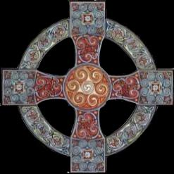

Title: Galdrar, trúarbrögð og vísindi, þróun hins andlega manns
Slug: galdrar-truarbroegd-og-visindi-throun-hins-andlega-manns
Date: 2007-04-12 12:03:00
UID: 149
Lang: is
Author: Erna María Jensdóttir
Author URL: 
Category: Mannfræði, Trúarbrögð
Tags: 

Er hægt að segja að maðurinn hegði sér allstaðar eins? Gæti verið að birtingamynd hegðunar mannsins sé það sem greinir á milli ólíkra samfélaga? Eitt er það sem virðist ríkja í flest öllum samfélögum, það er trú á tilvist þess óefnislega. Í því samhengi langar mig að athuga hvort galdrar, trúarbrögð og vísindi séu ef til vill sprottinn af sama meiði þó svo að birtingamynd þess sé ólík. Þetta þrennt virðist þó meðal annars þjóna þeim sameiginlega tilgangi að skýra fyrirbæri og atburði sem við skiljum ekki eða sjáum. Maðurinn finnur fyrir kvíða þegar hann er í aðstæðum sem hann hefur engar skýringar á og það er því ef til vill byggt í okkar félagslega eðli að leita skýringar til að ná tilfinningalegu jafnvægi. Við skiljum ekki endilega alltaf hvernig þessi fyrirbæri ganga fyrir sig, en við fáum einhverjar skýringar sem eru samþykktar af samfélaginu og verðum því rólegri. Sem dæmi um þetta þá skilja fæstir hvernig við erum komin frá öpum en við vitum að það eru skýringar á bak við það sem eru samþykktar af samfélaginu, rétt eins og með skýringar sem trúarbrögð og galdrar gáfu um uppruna mannsins á sínum tíma.

Gæti verið að tilvist þessara þriggja fyrirbæra sé merki um þróun? Trúabrögð leysi galdra af hólmi og vísindin trúarbrögð? Margir vilja fella galdra undir hatt trúarbragða, ég ætla mér ekki að rekja það í þessari grein heldur athuga hvort fella megi galdra, trúarbrögð og vísindi undir einn hatt. Hatt þróunar um þörf mannsins fyrir útskýringum. 

Til að reyna að finna svör við því hvort galdrar, trúarbrögð og vísindi séu af sama meiði þá hef ég leitað í bókum og greinum eftir Stanley J. Tambiah, Emil Durkheim, Frazer, Melford Spiro, Claude Lévi-Strauss, og fleiri fræðimanna til að finna hugsanlegt svar. 

Í bókinni _Magic, Witchcraft, and Religion: An Anthropoplogical Study of the Supernatural_, fjalla ritstjórar hennar, Arthur C. Lehmann og James E. Myers, um nokkra þá helstu kennismiði sem hafa stúderað trúarbrögð. Meðal annars kemur fram að hugmyndir fræðimanna og skóla um hvernig eigi að skilgreina trúarbrögð séu afar ólík, en algengast er að þau séu skoðuð með sálfræðilegum, félagslegum og mannfræðilegum áherslum. Melford Spiro telur til dæmis sálfræðilegar skýringar vega mikið, þá meðal annars ótti. Ótti sem getur átt sér stað þegar hræðsla eða kvíði kemur upp þegar hættuástand eða einhvers konar tilfinningarleg krísa skapast í umhverfi eða tilvist mannsins. Á svipuðum nótum segir Sigmund Freud að trúarbrögð og athafnir eða rituöl virkuðu sem losun eða til að draga úr kvíðanum sem skapast í ástandi. Emil Durkheim taldi að trúarleg fyrirbæri, rituöl, trú, og tákn hefðu þann tilgang að samlaga menningu. Flestir menn gengu í gegnum einhverskonar krísur og fékk það fólk til að hópa sig saman til að leita hjálpar. Það er að segja að þátttaka í trúarathöfnum myndi ýta undir samlifum samfélagsþegna. Trúarbrögð eru einnig notuð til að skýra óútskýranlega atburði og fyrirbæri, en þá er notast við samband orsaka og afleiðinga á milli þess yfirnáttúrulega og mannlega. Þessi skýring á upphaf og tilgang trúarbragða skýrir ef til vill þá þætti er viðkoma sálfræði og félagsfræði en það skýrir þó ekki tilkomu eða uppruna trúarbragða. 

Clifford Geertz fjallar um upphaf trúabragða í grein sinni Religion, þar nefnir hann fræðimanninn Frazer sem setur fram þá kenningu að andlegar framfarir mannsins hafi þróast í þessari röð: galdrar, trúarbrögð og vísindi. En hann skilgreinir galdra sem upphaflegt form mannlegrar hugsunar. Fólust þá galdrar annars vegar í að samlagast eða ná ákveðnum tengingum, eins og að blóð úr Uxa færir þeim sem drekkur það aukin styrk, og svo hins vegar þá galdra sem stefna að því að ná, eða kalla fram, náttúruleg fyrirbæri, eins og að slá á trommu svo hægt sé að framkalla þrumuveður. Það síðara mætti kannski líkja við atferli vísinda, eins og með að virkja náttúruöflin. Greerz minnist einnig á kenningar Tylor sem segir að trúarbrögð séu trú á andlegar verur og það sé frumstæðasta greiningin á trúarbrögðum sem hafa síðan þróast út frá þessu, en ákveðin atriði og menningarmynstur leiða síðan af sér ferli menningalegarar sundurgreiningar, eins og guð, tákn og dulmátt. Smá saman verða galdrar að trúarbrögðum þar sem ákveðnir einstaklingar telja sig vera nærri þessum fyrirbærum.

Það má líklega fullyrða að einhverjar leifar um tilvist galdra sé að finna í sögum flestra þjóða, sem rennur eflaust stoðum undir þær hugmyndir að galdrar hafi verið á undan öðrum trúarbrögðum í þróuninni. Í frumstæðum samfélögum er algengt að galdrar séu enn við lýði. Samkvæmt Claude Lévi-Strauss má greina frumstæð trúarbrögð sem kerfi hugmynda um gerð efnislegrar tilveru. En mannfræðingar hafa lengi leitað í frumstæðari samfélög til að fá vísbendingar um fyrri lifnaðarhætti hins vestræna manns.

Ákveðin stöðnun varð svo í göldrum og vísindum sem tengja má við áhrif kirkjunnar, en kirkjan bannaði þá trú sem gerði tilraun til að ná jöfn kröftum Guðs, þar sem að Guð einn væri almáttugur og galdrar væru því fölsk trú fyrir að reyna að ná kröftum Guðs. 

Skilgreining milli galdra og trúarbragða hefur alls ekki alltaf verið skýr og þá sérstaklega í frumstæðari samfélögum. Tambiah tekur Rituöl í kaþólskri trú sem dæmi, en þær eiga margt sameiginlegt með rituölum í göldrum. Til dæmis má nefna bænir. Þær eru keimlíkar galdraþulum. Í kaþolskri trú biður presturinn fyrir þeim veiku og óskar um hjálp Guðs, í göldrum er það presturinn sem fer með þulu sem á að reka illa anda úr líkama hins sjúka. Einnig þjóna verndargripir svipuðu hlutverki, eins og kross og líkneski. 

Wayland D. Hand fjallar um í grein sinni _Folk Medical Magic and Symbolism in the West_ hvernig hægt er að finna leifar af göldrum í vestrænu samfélagi. Nefnir hann þar helst þau ráð sem gefin eru til lækninga. Til dæmi hvernig börn trúa því að ef móðir þeirra kyssi á meiðsli þeirra muni þeim batni fljótt, og að fólk eigi að vera með rauða borða um hálsin til að stoppa blóðnasir. Svo eru ýmsar kenningar sem ganga manna á milli. Eins og að það sé mjög hollt fyrir heilastarfið að borða valhnetur, þar sem að þær eru í laginu eins og heili. Það gæti jafnvel verið að þessi svokölluðu húsráð séu leifar af gömlum galdra áhrifum. Valhnetu dæmið er til að mynda góð vísun í þær fornar hefðir sem tíðkuðust í göldrum eins og kom fram með Uxablóðið sem Greetz vísaði í.

Tambiah segir að samkvæmt Keith Tomas þá var helsta ástæða þess að göldrum og skýringum tengdum þeim var hafnað var sú tæknibylting sem átti sér stað á 16. öldinni. En þessi tæknibylting hefur sumstaðar ekki enn náð fótfestu, og þá aðallega í fátækum og frumstæðum ríkjum. Sem dæmi, þá er í neðri Shahara hluta Afríku er hæsta tíðni galdradýrkunnar í heimi, en það búa um 70-90% Afríkubúa utan almennrar heilsugæslu.  Í samfélögum þar sem mikið er um ófarir og engar skýringar á atburðum og fyrirbærum eru að fá, er leitað til einstaklinga sem oft á tíðum kenna sig við galdra og nornirdýrkun til að fá skýringar og jafn vel lækningar eða aðstoð við óförunum.  Eru galdrar því ef til vill viðleitni mannsins til að hafa áhrif á umhverfið sitt og aðstæður eftir þeim leiðum sem hann telur færar hverju sinni.

Hvað er það sem veldur því að galdrar hafa breiðst svona út og viðhaldist? Þessari spurningu velti Claude Lévi-Strauss fyrir sér þegar hann skrifaði greinina _The Sorcerer and His Magic_. Þar kemur meðal annars fram að galdrar séu athöfn sem oft hafa líffræðileg áhrif. Hvort sem tekin eru lyf eða fallið í trans. Þau áhrif sem fylgja þessum athöfn auka trúverðugleika galdramáttsins.

Tambiah fjallar um að Grikkir hafi verið upphafsmenn akademískrafræða og vísinda, þó svo að vísindin þá hafi alls ekki verið í því formi sem þekkist í dag. En þær greinar sem Grikkir helguðu sig aðallega voru heimspeki, þekkingarfræði, kenningafræði, náttúru-/jarðfræði og galdrar. Sem dæmi þá viðurkenndi skóli Hippókrates lyfjafræði út frá aðferðum og lögmálum galdra. Meðferðir einkenndust oft af lyfjum, töfraþulum, verndargripum, bænum og þess háttar. Tambiah tekur það einnig fram að Grikkir útilokuðu heldur ekki trúarbrögð frá vísindum, þó svo að trúin væri ekki notuð við kenningarsmíð. En hún birtist aðallega í því að flest fyrirbæri væru talin guðdómleg, sér í lagi náttúran. Samkvæmt því má kannski líta svo á að galdrar hafi markað upphaf af lyfjafræði nútímans.

Er jafnvel hægt að segja að vísindi séu flókin útgáfa af göldrum. Í göldrum er verið að fast við lyf, og þá oftast með þeim efnum sem hægt var að finna í náttúrunni. Unnið var úr þeim og gerðar lyfjablöndur. Lyf nútímans sem gefin eru í töfluformi eru ef til vill staðgengill seiða og annarra náttúrulyfja sem galdrar notuðust við.  En í þessu samhengi má ekki gleyma þeim tengslum sem galdra höfðu á hið yfirnáttúrulega. Sem vísindin hafa ekki í dag. En hið yfirnáttúrlega var stór hluti af félagslegri virkni galdra.

Það virðist vera mikil þörf hjá manninum að leita skýringa þess sem hann skilur ekki og sé litið til sögunnar má segja að galdurinn sé á vissan hátt þekkingarleit og sjálfsbjargarviðleitni mannsins á öllum tímum. Kannski má í því samhengi segja að kirkjan og ýmiss trúarbrögð hafi verið tímabundin hömlun eða stöðnun á þróun galdurs. Mikilvægt er samt að taka fram að ekki eru alltaf skýr mörk trúarbragða og galdraiðkunar, né vísinda og galdra. Ef litið er til þeirrar skilgreiningar sem galdrar hafa sem lyfjafræði.

Tilgangur trúarbragða er eflaust margþættur og frekar flókinn. En sagan sýnir að trúarbrögð leystu að vissu leiti galdra af hólmi við að útskýra ófyrirséða og flókna hluti í tilveru mannsins. Í dag er það þannig að við leitum ekki lengur til trúarinnar til að biðja um bata við veikindum heldur leitum við til vísindanna eins og lækna og lyfjafræðinga.

----

#### Heimildir:

* Lehmann, A. C. og J. E. Myers (ritstj.) (2001). _Magic, Witchcraft and Religion: An Anthropological Study of the Supernatural_
* Tambiah, S. J. (1990). _Magic, Science, Religion, and the Scope of Rationality_.

