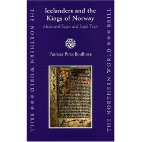

Title: Gamli sáttmáli alls ekki jafn gamall og við héldum?
Slug: gamli-sattmali-alls-ekki-jafn-gamall-og-vid-heldum
Date: 2005-11-01 02:09:00
UID: 10
Lang: is
Author: Ármann Jakobsson
Author URL: 
Category: Sagnfræði, Í umræðunni
Tags: Jón Sigurðsson, Sagnfræðistofnun, Patrica Pires Boulhosa, Gamli sáttmáli, Gissurarsáttmáli, Þórður kakali, Gissur Þorvaldsson, Kalmarsamband, Noregur

Á hverju ári er fyrirlestur tileinkaður Jóni Sigurðssyni á vegum Sagnfræðistofnunar. Jóni Sigurðssyni, hvá kannski einhverjir. Meinarðu forsetann? Já, það er einmitt sá Jón Sigurðsson sem allir þekkja sem manninn á fimmhundruðkallinum, þessi sem sagði ekki Vér mótmælum allir, sem er mjög valdsmannsleg stytta á Austurvelli og nýlega guðjónaður í tveimur bindum en hafði áður verið pálleggertaður í fimm. Jón var nefnilega ekki aðeins sómi Íslands sverð og skjöldur, heldur líka sagnfræðingur, norrænufræðingur og öflugur útgefandi og það er sá Jón sem  sagnfræðistofnun sýnir verðugan sóma. Finnst örugglega ekki verra að geta tryggt að ungir sagnfræðingar eigi svar við spurningunni: Nefndu fimm fræga sagnfræðinga?

Í ár var erindið flutt af tiltölulega ungum fræðimanni og er það mikill heiður því að flestallir sem hafa fengið þetta hlutverk hafa verið um sextugt. En Patricia Pires Boulhosa er rétt liðlega fertug og nýútskrifaður doktor, á eftir mér meiraðsegja. Ástæðan er semsé ekki að hún sé fræg heldur hefur hún náð að vekja athygli með því að gera svolítinn skandal og segja að Gamli sáttmáli og Gissurarsáttmáli séu ekki til. Ekki sem slíkir.

Þetta er þó aðeins hluti af verkefni þessarar brasilísku Cambridge-menntuðu fræðikonu. Það sem hún rannsakar eru skipti Íslendinga og Norðmanna á 13. öld og síðar og er þar gagnrýnin á fyrri kreddur, raunar á svipaðri línu og sá er þetta ritar. Hún hafnar því alveg að í Íslendingum hafi reynst mikil uppreisnargirni og þeir verið tortryggnir í garð "erlends valds" eins og það hét þegar ég var að alast upp. Meiraðsegja Egils sögu telur hún ekki deila á norsku konungana og gengur þar skrefi lengra en ég sem lét nægja að Egils saga væri ekki gagnrýni á konungsvald almennt og þóttist róttækur. Almennt er ég fremur hlynntur þessu og tel að sjálfstæðisbaráttan hafi skapað ákveðna skekkju sem nú þurfi að leiðrétta. Sé ekki að Íslendingar hafi verið neitt sérstaklega sjálfstæðir í hugsun, aðeins erfiðir og í stöðugum óskiljanlegum erjum sín á milli, eins og þeir Þórður kakali og Gissur Þorvaldsson komu Hákoni konungi fyrir sjónir á sjötta tug 13. aldar.

Hvað varðar Gamla sáttmála og Gissurarsáttmála varðar telur  Patricia Pires Boulhosa að þeir markist af viðhorfum annarrar aldar, þeirrar 15. þegar upp var risið Kalmarsamband og stöðu jaðarríkja í því var ógnað, Ísland skyndilega orðið viðhengi  Noregs og færðist með honum undir Danakonung eins og menn vita. Þá hafi Íslendingar vaknað upp við vondan draum og farið að hafa áhyggjur af eigin stöðu og þess vegna hafi þeir fært  konungtökuna um 1260 í nýtt form, skjalfest hana og gert úr  samning. Patricia bendir á að öll handrit Gamla sáttmála séu mun yngri og enn yngri séu handrit Gissurarsáttmála. Og af hverju  spretta upp handrit af sáttmálanum á 15. öld þegar engin eldri eru til? Þetta hljómar sannfærandi en á hinn bóginn eru mörg dæmi þess að handrit hafi týnst. Hún nær ekki að sannfæra nema helminginn af salnum, aðrir benda á fornlegt orðalag og eru fullir efasemda.

Enda er það ekki aðalatriðið. Aðalatriðið eru þessi ágætu rakhnífsvinnubrögð sem Patricia Pires Boulhosa stundar. Hún spyr sig: Nákvæmlega hvaða sönnunargögn höfum við fyrir háum aldri Gissurarsáttmála og Gamla sáttmála? Og hvort sem við föllust á hennar greiningu á Kalmarsambandsvandanum eða ekki leiðir hún í ljós að þetta er ekki jafn óyggjandi og almennt hefur verð talið, það er full ástæða til að draga aldur þessara texta í efa og nú þurfa þeir sem telja þá eftir sem áður gamla að fara að leita að rökum. Það er ævinlega gott fyrir fræðin að snúa sönnunarbyrðinni við og leiðir alltaf eitthvað frjótt af sér. Þó að fyrirspurnir og svör á nánast óskiljanlegri ensku (af hverju þurfa allir alltaf að tala ensku, hvort sem þeir kunna hana eða ekki?) reyni heldur meira á þolinmæðina en rösklega flutt erindið förum við endurnærð af þessum fundi.
