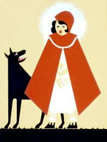

Title: Gerðu eins og ég segi - ekki eins og ég geri
Slug: gerdu-eins-og-eg-segi-ekki-eins-og-eg-geri
Date: 2005-12-13 12:32:00
UID: 27
Lang: is
Author: Óli Gneisti Sóleyjarson
Author URL: 
Category: Þjóðfræði
Tags: Jacob Grimm, Bolte, Polívka, Grimmsbræður, Wilhelm Grimm, Ólína Þorvarðardóttir, aðferðafræði

Jacob Grimm lagði línurnar varðandi söfnun þjóðfræðiefnis í ávarpi sem hann skrifaði árið 1811.  Munnlegar heimildir skyldu skráðar orðrétt, engu átti að breyta né sleppa.  Í ávarpinu leggur Jacob áherslu á að komast sem næst rótunum með því að safna efni í þorpum og sveitum.[^1] Í formála fyrsta bindis Kinder- und Hausmärchen (Grimmsævintýra) sem kom út árið 1812 er lögð áhersla á að sögunum hafi einmitt verið safnað á þennan hátt.[^2] En því miður var Jacob betri í að leggja línurnar en að fara eftir þeim.  Þegar Bolte og Polívka tóku saman skýringarrit um safn Grimmsbræðra þá kom í ljós að mikið vantaði upp á að farið hefði verið að þeim grundvallarreglum sem Jacob sjálfur hafði talið nauðsynlegar við söfnun þjóðfræðiefnis.[^3]

Grimmsbræður breyttu sögunum sem þeir höfðu safnað, fegruðu þær og umskrifuðu.  Þeir skeyttu saman ólíkum útgáfum af sömu ævintýrunum og bjuggu þannig til lengri útgáfur.  Bræðurnir „skálduðu jafnvel upp heimildarmenn.“[^4] Ljóst er að Grimmsbræður reyndu að dylja raunverulegar aðferðir sínar þar sem þeir eyðilögðu handrit sín.  Í endurútgáfum Kinder- und Hausmärchen voru ævintýrin löguð til, væntanlega til þess að gera þau meira aðlaðandi fyrir borgarbúa.  Þetta gekk allt gegn þeim sjónarmiðum sem Jacob viðraði í ávarpi sínu.[^5]

Lengst af hefur Jacob Grimm verið talinn nokkuð saklaus af þessum „brotum“.  Wilhelm Grimm hefur jafnan sagður sökudólgurinn í þessu máli, skáldlegt eðli hans á að hafa spilað stóran þátt í því.  Það virðist stundum eins og menn sjái fyrir sér Wilhelm laumast í handritin til að breyta þeim á meðan Jacob sá ekki til.  Ólína Þorvarðardóttir hefur gert þetta að umfjöllunarefni og bendir á að annað en skáldhneigð hafi ráðið þarna för.  Hún bendir á að „Kinder- und Hausmärchen [sé] afsprengi rómantískrar þjóðernisstefnu“.  Jacob Grimm taldi að þjóðsögurnar bæru í sér leifar frá fornum indó-evrópskum trúarbrögðum.  Því „má gera sér í hugarlund að Jacob hafi [...] verið í mun að fegra heimildir sínar.“[^6]

Þegar við skoðum aðferðir Grimmsbræðra hljótum við að spyrja okkur hvernig við eigum að meta safn þeirra.  Árið 1950 kom bandaríski þjóðfræðingurinn Richard M. Dorson fram með hugtakið „fakelore“ eða gerviþjóðfræðiefni.  Þetta á við efni sem er kynnt á þann hátt að um sé að ræða upprunalega munnlega hefð, en hefur þó verið breytt eða „bætt“ á einhvern hátt. Dorson notaði hugtakið aðallega yfir efni frá heimalandi sínu (til dæmis um sögur af skógarhöggsmanninum Paul Bunyan).[^7] Alan Dundes taldi að ævintýri Grimmsbræðra væri án efa hægt að flokka sem gerviþjóðfræðiefni.

Sömu sögu má segja um finnska kvæðabálkinn Kalevala þar sem Elias Lönnrot spyrti saman mörgum kvæðum til að mynda eina heild.[^8] Grimmsbræður breyttu sögunum sem þeir söfnuðu, að öllum líkindum til að búa til ákveðna ímynd af Þjóðverjum sem samræmdist rómantískri sýn þeirra.  Það er því að minnsta kosti ljóst að við getum ekki talið Kinder- und Hausmärchen sem fyrirmyndarsafn munnlegra heimilda.  En flestir sem hafa fjallað um Grimmsbræðurna og söfnun þeirra hafa látið sína eigin rómantísku sýn blinda sig fyrir vafasamri aðferðafræði þeirra.

Kannski er tímabært að bæta smá eftirmála við ávarpið sem Jacob Grimm skrifaði fyrir nær tveimur öldum.  Hann gæti verið eitthvað á þessa leið:

_„p.s. gerðu eins og ég segi - ekki eins og ég geri.“[^9]_

Jacob hefði skilið það, hann vissi að stundum er hentugra að breyta og bæta heimildirnar.

---

<small class="blurb">Skemmtilegar heimasíður helgaðar Rauðhettuævintýrinu er er að finna [hér](http://mld.ursinus.edu/Maerchen/redridinghood.html) og [hér](http://www.surlalunefairytales.com/ridinghood/notes.html) og [þessi síða](http://www.surlalunefairytales.com/index.html) inniheldur áhugaverða umfjöllun um hin ýmsu ævintýri og þjóðsögur.</small>

[^1]: Jacob Grimm. „Circular Concerning the Collecting of Folk Poetry." <cite>Interatinal Folkloristics</cite>. Ritstjóri Alan Dundes. Rowman & Littlefield, New York 1999, 1.

[^2]: Alan Dundes. „The Fabrication of Fakelore." <cite>Folklore Matters</cite>. University of Tennessee, Knoxville 1989, 236.

[^3]: Ólína Þorvarðardóttir. „Þjóðsögur Jóns Árnasonar?." <cite>Þjóðlíf og þjóðtrú</cite>. Ritstjóri. Þjóðsaga 1998, Reykjavík 1998, 245.

[^4]: Idem.

[^5]: Alan Dundes. „The Fabrication of Fakelore." <cite>Folklore Matters</cite>. University of Tennessee, Knoxville 1989, 236.

[^6]: Ólína Þorvarðardóttir. „Þjóðsögur Jóns Árnasonar?." <cite>Þjóðlíf og þjóðtrú</cite>. Ritstjóri. Þjóðsaga 1998, Reykjavík 1998, 245.

[^7]: Alan Dundes. „The Fabrication of Fakelore." <cite>Folklore Matters</cite>. University of Tennessee, Knoxville 1989, 236.

[^8]: Alan Dundes. „The Fabrication of Fakelore." <cite>Folklore Matters</cite>. University of Tennessee, Knoxville 1989, 236.

[^9]: Reyndar þyrfti þetta að vera p.p.s. þar sem upprunalega ávarpið innihélt aðra eftirskrift en ég tek mér skáldaleyfi.

