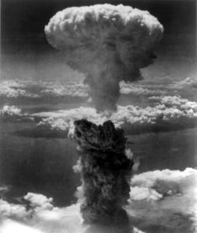
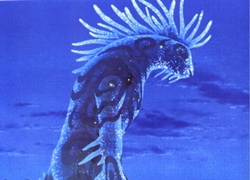
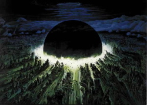
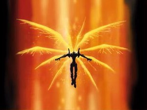

Title: Gereyðing, guðlegur máttur og endurfæðing í anime og manga
Slug: gereyding-gudlegur-mattur-og-endurfaeding-i-anime-og-manga
Date: 2007-05-31 12:00:00
UID: 162
Lang: is
Author: Íris Ellenberger
Author URL: 
Category: Teiknimyndir, Sagnfræði
Tags: 

Kjarnorkuárásirnar á Hiroshima og Nagasaki eru gjarnan nefndar sem einn þeirra þátta sem marka skil nútíðar og eftirnútíðar. John W. Dower, sagnfræðiprófessor við MIT-háskóla, hélt því fram í grein frá árinu 1995 að í Japan hafi þessi þáttaskil verið einstök því Japanir voru eina þjóðin sem fékk að kenna á mætti kjarnorkuvopna en einnig var þeim einum bannað að fjalla um atburðina á fyrstu árunum eftir stríð. Í kjölfar árásanna á Hiroshima og Nagasaki árið 1945 tóku Bandaríkjamenn völdin í landinu og ritskoðuðu flest ummæli um kjarnorkuárásirnar.[^1]

Þegar hernáminu lauk árið 1952 voru meðlimir japanska kommúnistaflokksins duglegastir við að festa umfjöllun sína á filmu. Stjórnvöld tóku í taumana og hvöttu dreifingarfyrirtæki til að hafna kvikmyndunum. Þeir einstaklingar sem hurfu frá viðtekum skoðunum voru stimplaðir kommúnistar sem þýddi að fáir leikstjórar utan kommúnistaflokksins fjölluðu um kjarnorkuárásirnar.[^2] Þögnin um kjarnorkuárásirnar var margþætt og því ekki að furða að þegar Donald Richie kvikmyndafræðingur skrifaði greinina „„Mono no aware“: Hiroshima in Film“ árið 1961 hafi algengasta tegund umfjöllunarinnar verið táknsöguleg. Má þar nefna myndina _Godzilla_ sem fjallar um risaeðlu sem ræðst á Tokyo-borg eftir að hafa verið vakin af löngum svefni við kjarnorkutilraunirnar á Bikini-eyju í Kyrrahafi sem hófust árið 1946.[^3]

Japanskar teiknimyndir (_anime_) og teiknimyndasögur (_manga_) eiga sér ríka hefð að baki sem miðill pólitískra skoðana.[^4] Manga- og anime-höfundar hafa þó sjaldan fjallað á beinan hátt um kjarnorkuárásirnar á Hiroshima og Nagasaki sem er eflaust afleiðing hinnar margföldu þöggunar.[^5] Upp úr 1980, þegar höfundar sem fæddir voru eftir seinni heimsstyrjöld komu fram á sjónarsviðið, varð gereyðing vinsælt viðfangsefni teiknaðra vísindaskáldsagna og voru fyrirmyndirnar greinilega sóttar til kjarnorkuárásanna á Hiroshima og Nagasaki.

Þegar fjallað er um eðli og tilgang gereyðingarinnar í _manga_ og _anime_ er hægt að greina ýmsar samsvaranir við þá þýðingu sem endalok síðari heimsstyrjaldarinnar hefur í hugum Japana. Árið 1961 benti Donald Richie á að fyrstu viðbrögð almennings við kjarnorkuárásunum á Hiroshima og Nagasaki hafi verið að líta á þær sem guðlegt afl: „The bomb … was something over which no one had any control; something which could not be helped; what we mean by an „act of God.“[^6] Richie telur að kjarnorkuárásirnar séu fyrst og fremst tákn í augum Japana og þar af leiðandi sé merking þeirra síbreytileg.[^7] Þegar anime á borð við kvikmyndina _Akira_ og sjónvarpsþættina _Neon Genesis Evangelion_ eru skoðaðar má sjá að hugmyndir um guðlegan gereyðingarmátt tilheyra síður en svo fortíðinni en hann hefur einnig öðlast nýja táknmerkingu, endurfæðingu.
### Guðlegt gereyðingarafl

Gereyðingarmáttur í anime er gjarnan persónubundinn á þann hátt að aðeins einn einstaklingur er á sögusviðinu hverju sinni sem býr yfir þessu afli, einkum til að undirstrika guðlegt eðli hans. Sem dæmi má taka _Princess Mononoké_ því þótt sú kvikmynd vísi aðeins í kjarnorkuárásirnar á óbeinan hátt með því að nota ímynd verunnar sem trónir yfir landslaginu líkt og sveppaský, þá er veran sem ógnar sögusviðinu með gereyðingarmætti sínum einmitt reiður skógarguð.[^8] _Akira_ bæði sem _manga_ og _anime_ gefur í skyn að gereyðingarmáttur tveggja sögupersóna, Akira og Tetsuo, sé guðlegt. Í kvikmyndinni _Akira_ ræða ofurstinn og prófessorinn, sem höfðu yfirumsjón með tilraununum á Akira, um afl Akira og Tetsuo: 

> __Ofurstinn:__ „Maybe we shouldn't touch that power.“  
> __Prófessorinn:__ „You mean it's divine?“   
> __Ofurstinn:__ „But we must touch it and control it for our benefit.“[^9]

Sjónvarpsþættirnir _Neon Genesis Evangelion_ gæla einnig við hugmyndina um guðlegt eðli gereyðingar. Þættirnir eru fullir af kristnu myndmáli og tilvísunum, þær verur sem búa yfir aflinu eru kallaðar „englar“ og sprengingin skilur eftir sig stórt krossmerki í stað sveppaskýs.[^10] Þó er gereyðingarmátturinn einnig manngerður. Afl Akira var dregið fram í dagsljósið með tilraunum vísindamanna og undir lok _Neon Genesis Evangelion_ kemur í ljós að „englarnir“ eru einungis einn möguleiki á þróun mannsins. En þrátt fyrir það er guðlegt eðli gereyðingarmáttarins undirstrikað í sífellu. Til að mynda segir Fuyutsuki, ein persóna _Neon Genesis Evangelion_, þegar maður og „engill“ sameinast til að eyða jörðinni: „The Angel's fruits of life and human's fruits of wisdom. Having both in it´s hands, Eva is playing the role of God“.[^11] Leikur mannsins að gereyðingarmætti endar iðulega með tortímingu og því getur hann ekki ráðið við þetta afl. Mennirnir eru að færa sig inn á verksvið guðs og öðlast mátt sem þeim er ekki ætlað að búa yfir.

### Gereyðingarmáttur og endurfæðing

Þótt gereyðing sé bakgrunnsþema margra teiknimynda og teiknimyndasagna þá er þar fyrst og fremst verið að takast á við samfélag samtímans og þau mein sem í því felast. Freda Freiberg og Susan Napier telja t.d. að _Akira_ takist á við japanskt samfélag þar sem samkeppni í skólum og á vinnumarkaði er gífurleg og fólk sé steypt í sama mót.[^12] Flestir eru sammála um að ótrúlega skjót þróun Japans í hátæknisamfélag á vestrænan mælikvarða megi líkja við endurfæðingu. Ennfremur bendir John W. Dower á í grein sinni „The Bombed“, með því að vitna í Alan Wolfe, að eitt af einkennum samtímans í Japan sé fæðing og endurfæðing: 

> …Japanese modernity has been marked by a cycle of death and rebirth. Hence, the syndrome of Japan as Number One testifies… to the ability to stay, survive, be reborn: the ultimate symbol of that truth is the historical experience of the atomic bomb and the devastating destruction of Japan…[^13]

Kumiko Sato heldur því fram á sannfærandi hátt að söguþráður kvikmyndarinnar Akira endurspegli skilin milli fortíðar og nútíðar sem urðu í kjölfar kjarnorkuárásanna á Hiroshima og Nagasaki: „It is important to note the repeated image of nuclear explosion in the film, because it is the historical break that sets the boundary between Japan as „error“ … and as politically correct member of the first world.“[^14] _Akira_ og _Neon Genesis Evangelion_, með því að varpa samtímanum til framtíðar, gefa neikvæða mynd af samfélagi þar sem einstaklingurinn er leiksoppur stórfyrirtækja, fjölskyldan er í upplausn, og vísinda- og tækniþróun er stjórnlaus. Gereyðing er lausnin. Hún leiðir til endurfæðingar, eða eins og Freiberg segir um Tetsuo í _Akira_: „the unleashing of his ultimate power (nuclear energy) is frightening but carthartic… It allows him to die and be reborn; to destroy the oppressive society he inhabits and enable its rebirth.“[^15] Tortíming jarðarinnar í _The End of Evangelion_, sem er framhald af _Neon Genesis Evangelion_, virðist einnig leiða til endurfæðingar: „The end is a new beginning… Everything is allright.“[^16]

Vinsældir _Akira_ og _Neon Genesis Evangelion_ benda til þess að slíkar hugmyndir hljóti góðan hljómgrunn meðal ungs fólks sem hefur líkt og leikstjórarnir Anno og Otomo engar persónulegar minningar frá Hiroshima og Nagasaki. Kynslóðirnar fæddust eftir síðari heimsstyrjöld fá útrás fyrir tilfinningar sínar í garð samfélagsins í gereyðingunni og þannig hefur hún skipað sér sess í ímyndunarafli ungra Japana sem guðlegt tæki til að binda enda á þær ógöngur sem Otomo, Anno og fleiri telja að þjóðin hafi ratað í. Gereyðing er því enn tákn í huga þjóðarinnar eins og Richie benti á en hefur nú öðlast nýja merkingu; hún er ekki aðeins guðlegt afl heldur einnig tákn fyrir endurfæðingu sem er einmitt einn af þeim þáttum sem Dower telur gera Japönum kleift að halda forystustöðu sinni.

[^1]: Dower, John W.: „The Bombed: Hiroshimas and Nagasakis in Japanese Memory“, _Diplomatic History_, 19. árg. 2. hefti. Blackwell Publishers, Cambridge, Mass. 1995, 275.

[^2]: Richie, Donald: „„Mono no aware“: Hiroshima in Film“, _Hibakusha Cinema. Hiroshima Nagasaki and the Nuclear Image in Japanese Film_, Mick Broderick ritstjóri. Kegan Paul International, London og New York 1996, 27-28.

[^3]: „Bikini“, _Encyclopædia Britannica_ <http://search.eb.com/eb/article?eu=1558>.

[^4]: Schodt, Frederik L.: _Manga! Manga! the world of Japanese comics_. Kodansha International Ltd., Tokyo 1986, 51 og 55-59.

[^5]: Í lesefninu sem er lagt þessari grein til grundvallar var aðeins einn manga-höfundur, Keiji Nakazawa, nefndur sem fjallað hefur beint um afleiðingar kjarnorkuárásanna á Hiroshima og Nagasaki. Frægustu verk hans eru _Ore Wa Mita_ (_I Saw It_ í enskri þýðingu) frá 1972 og _Hadashi no Gen_ (_Barefoot Gen_ í enskri þýðingu) frá 1973.

[^6]: Richie, Donald: „„Mono no aware“: Hiroshima in Film“, 20-21.

[^7]: Sama heimild, 20-21.

[^8]: _Princess Mononoké_ (kvikmynd) Hayao Miyazaki leikstjóri. Studio Ghibli 1997: 01:52:27.

[^9]: _Akira_ (kvikmynd) Katsuhiro Otomo leikstjóri. Toho 1988: 00:20:24.

[^10]: _Neon Genesis Evangelion_ (sjónvarpsþættir) 1 Hideaki Anno leikstjóri. Gainax 1995: 00:44:04; 10: 00:15:06; _The End of Evangelion_ (sjónvarpsþættir) Hideaki Anno og Kazuya Tsurumaki leikstjórar. Gainax 1997: 01:10:24.

[^11]: The End of Evangelion (sjónvarpsþættir): 00:56:29.

[^12]: Freiberg, Freda: „Akira and the Postnuclear Sublime“, _Hibakusha Cinema. Hiroshima, Nagasaki and the Nuclear Image in Japanese Film_, Mick Broderick ritstjóri. Kegan Paul International, London og New York 1996, 92; Napier, Susan J.: „Panic Sites. The Japanese Imagination of Disaster from _Godzilla_ to _Akira_“, _Contemporary Japanand Popular Culture_, John Whittier Treat ritstjóri. Í ritröðinni _ConsumAsiaN Book Series_, Brian Moeran og Lise Skov ritstjórar. Curzon, Richmond 1996, 246.

[^13]: Dower, John W.: „The Bombed: Hiroshimas and Nagasakis in Japanese Memory“, _Diplomatic History_, 19. árg. 2. hefti. Blackwell Publishers, Cambridge, Mass. 1995, 101.

[^14]: Sato, Kumiko: „The Orient Orientalizing Itself: Japanese Animation and Split Identity“, <http://www.personal.psu.edu/staff/k/x/kxs334/academic/manga&anime/ orientalism.html>. Greinin hefur nú verið fjarlægð.

[^15]: Freiberg: „_Akira_ and the Postnuclear Sublime“, 100-101.

[^16]: _The End of Evangelion_ (sjónvarpsþættir): 01:08:51.
