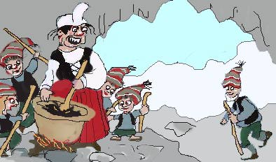

Title: Getur maður tekið jólasveina alvarlega?
Slug: getur-madur-tekid-jolasveina-alvarlega
Date: 2005-12-20 11:15:00
UID: 30
Lang: is
Author: Hjörleifur Jónsson
Author URL: 
Category: Þjóðfræði
Tags: jólasveinn, leikir, Grýla, jólaköttur

Það er ekki hægt að taka jólasveina neitt sérlega alvarlega, hvort sem um er að ræða bragðarefi bændasamfélags fortíðarinnar eða glaðbeitta of gjafmilda söngsveina litlujóla barna nútímans. Bragðarefir eða söngsveinar, þessir fýrar eru að leika. En, sagði evrópski sagnfræðingurinn Johan Huizinga rétt um það bil sem seinni heimsstyrjöldin skall á og ekkert fjör var í mörg ár, leikir eru alvara á hærra plani. Leikir lúta eigin lögmálum, búa sér eigin ramma tíma og rúms, og standa í misjöfnu sambandi við það sem flokkast undir raunveruleikann. Alrauðir jólasveinar hins vestræna heims síðust aldar voru aldrei skyldir neinni byltingu, en hún átti rauða litinn að jólunum slepptum.

Sem mannfræðingur þá hef ég auðvitað áhuga á mynstri og mörkum veruleika fólks og á því hvað gerist þegar fólk vill með í leikinn þramma. Einn mannfræðingurinn[^1] hélt því fram um hanaat á eynni Balí í Indónesíu að með leiknum væri fólk að velta sér uppúr ýmsu því sem var en sem stangaðist algjörlega á við sjálfsmynd eyjarskeggja. Það liggur ekkert endilega á hreinu hvað telst til raunveruleikans þegar fólk sinnir andstæðu hans af kappi og segir svo að það sé ekkert að marka hvað gerist reglulega.

Ég var eitthvað að grufla í jólasveinum og sögu þeirra fyrir um 20 árum, og hef svosem ekkert nýtt um þá að segja. Allt bendir til þess að jólasveinarnir sem við þekkjum með hjálp Árna Björnssonar og annarra fræðinga eigi sér rætur í smábændasamfélagi 16du til 19du aldar. Þeir tilheyra tíma lútersku, einokunarverslunar og erindreka dansks yfirvalds. Má svosem velta því fyrir sér afhverju Grýla og jólasveinar koma af fjöllum, andstæðu samfélagsins, í vetrarkulda og myrkri. Víst er að um jól og áramót losnaði um viðjar tíma, rúms og veruleika og var þá ýmislegt á ferli sem annars var ekkert að bendla sig við mannfólkið.

Heimildum um jólasveina fortíðarinnar er kannski ekki treystandi. Mest voru þetta kvæði skráð af prestum, en jólasveinar og foreldrar þeirra voru að mörgu leiti andstæða kristnihalds lútersks tíma. Aðallega stóð börnum hætta af Grýlu, í ýmsum kvæðum er því lýst að hún situr um bæi einhvers héraðsins og bændur sverja kristni á ungdóminn þeim til verndar. Er auðvitað hugsanlegt að almenningur (aðrir en prestarnir) hafi sett þennan skelfi í annað samhengi. Á þessum tímum stóð börnum hætta af Grýlu, og þeim og vinnufólki stóð líka hætta af jólakettinum. Ýmislegt í sambandi við þessi fyrirbæri tengist óöryggi ungdóms og vinnufólks til sveita. Það er semsagt margt sameiginlegt með hugmyndum um þessar tímabundnu undraverur og því samskiftamynstri sem einkenndi hversdagslíf ósjálfstæðs fólks.

> ...
>
> Börnin vill hún bíta  
> og berja þau í strá  
> skollamóðir skakkmynnt  
> skreppu heldur á  
> út um sveitir æðir  
> því öllu vill hún ná
>
> ...
>
> Stefnir hún á Steinmóð  
> með Starkaðarhljóð  
> eltir hann að Ormatjörn  
> með eldskíða glóð  
> bjargar honum bæn heit  
> og blessunin góð  
> Hann keppist við að komast heim  
> á kirkjunnar lóð[^2]
>
> ...

Þeir prestar sem skráðu Grýlukvæði hafa kannski ætlað sér að lofa þá vernd sem þeir buðu gegn vondum heimi. Þar með voru siðskiftin orðin að lísfbjörg gegn hættum myrkurs, kulda og kúgunar, á kostnað fyrri kaþólsku. Þó hvorttveggja hafi verið íslenskað var í báðum tilvikum um hnattrænan hugarheim að ræða. Því er ekki svo einfalt mál að telja þetta alltsaman séríslenskt þó það finnist ekki annarsstaðar. Jólasveinar herjuðu á bæi, einn á nóttu, gerðu skurk og stálu mat. Svo ummynduðust þeir við upphaf þéttbýlissamfélags tuttugustu aldar. Skólar, bæjarfélög og ríkisútvarpið virkuðu einsog segull á þá eftir því sem þjóðríkið fór að búa til nýjar sannar sögur og að taka á sig mynd hér og þar um landið. Um 1930 fóru þeir að mæta á jólahátíðir útvarpsins og voru þá komnir á almannafæri í gegnum einn aðal miðil nútímans, glænýir en hefðbundnir samt. Hefðinni var semsagt miðlað með tækni andstæðu sinnar. Þá þegar hafði orðið einhver samruni milli ímynda amerísks kapítalisma (í láni fyrir starfsemi og auglýsingar íslenskra kaupmanna, ekki svo löngu eftir að Hannes Hafstein lét sig dreyma um stjórnfrjálsa þjóð með verslun eigin búða), íslenskrar þjóðernishyggju, þjóðmenningar og nýrrar fjarskiftatækni. Samruni og togstreita milli ólíkra heima hafa lengi loðað við jólasveina.

Mér skilst að um eða uppúr 1990 hafi börnum staðið til boða að hitta alíslenska jólasveina í þjóðminjasafninu. Söfn eru auðvitað helgireitir þjóðerniskenndar og þjóðararfs á íslandi sem annarsstaðar. En kannski þarf ekki að taka jólasveina of alvarlega heldur að veita þeim smá svigrúm til að sleppa sér á mörkum ljóss og myrkurs, tíma og rúms, leiks og alvöru, íslands og umheims og ímyndunaraflsins. Á þessum margföldu mörkum hafa þeir veitt börnum innsýn í afstæði tíma, rúms, hagkerfis, og trausts á eigin augum, alveg laust við fyrilestrastíl. Varðandi jólasveina og svoleiðis lið er ekkert á hreinu um það hvort maður sé að bjóða hættunni heim eða hver það sé sem færi manni eitthvað gott í skóinn í skjóli nætur. Við sem heima sitjum höfum erft bæði jólasveina og skáldskap prestanna, og auðvitað er það alltsaman jafn rígbundið landi, þjóð og sögu og eplin og jólatrén.

[^1]: Clifford Geertz, Deep Play, í The Interpretation of Cultures.

[^2]: Þessi kveðskapur um Grýlu er skv. Árna Björnssyni (sjá: _Í Jólaskapi_) eftir Bjarna Gissurarson, 1648-1712.)

Myndin sem prýðir þessa grein er teiknuð af Salvöru Gissurardóttur. Salvör heldur úti [jólavef](http://jol.ismennt.is/) með fróðleik og tengingum og þangað er hægt að sækja bæði skemmtun og jólaskap.

