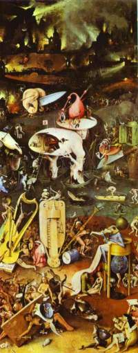
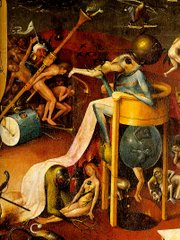
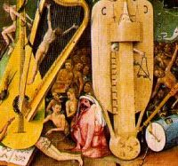

Title: Góð börn fara til himnaríkis, tónlistarunnendur fara til hljóðfærahelvítis
Slug: god-boern-fara-til-himnarikis-tonlistarunnendur-fara-til-hljodfaerahelvitis
Date: 2007-06-28 12:00:00
UID: 167
Lang: is
Author: Íris Ellenberger
Author URL: 
Category: Listir
Tags: 

Ein af goðsagnapersónum listasögunnar er hollenski listamaðurinn Hieronymus Bosch. Um líf hans eru fáar heimildir sem hefur valdið því að margar sögur hafa spunnist um hann á grundvelli listaverka hans sem hafa óræða merkingu og teljast í hæsta máta kynleg. Bosch var af listamannafjölskyldu frá Hertogenbosch í Hollandi þaðan sem nafn hans er dregið. Hans er fyrst getið í skjölum árið 1474 en tíu árum seinna er hann orðinn fullgildur listamaður og hefur af því verið dregin sú ályktun að hann hafi fæðst um miðja 15. öld. Hann var eini listamaðurinn sem fékk inngöngu í _Bræðrafélag vorrar frúar_ í heimbæ sínum sem hefur veitt honum ýmis sambönd enda gerði hann verk fyrir félagið og auðuga borgara. Eini varðveitti verksamningur Bosch kveður á um gerð stórrar altaristöflu fyrir Filippus fagra Spánarkonung árið 1504. Samkvæmt skattaskýrslum frá byrjun 16. aldar var hann einn af auðugustu íbúum Hertogenbosch og bendir allt til þess að hann hafi verið í hópi borgara eða umgengist þá alla jafnan. Verk hans bera borgaralegum viðhorfum vitni meðal annars þar sem fátæklingar virðast sérlega móttækilegir fyrir löstum og syndum í verkum hans.[^1]

Lestir og syndir eru einmitt helstu viðfangsefni Bosch. Verk hans eru gjarnan mórölsk ádeiluverk en mörg trúarlegra viðfangsefna hafa einnig siðferðilegan undirtón. Myndir hans sýna viðkvæma siðferðiskennd og ádeilu á lostafullt líferni mannsins. Fólkið beitir öllum brögðum til að komast upp á heyvagninn, tákn hins léttúðuga og synduga lífs, en lætur sig litlu varða dyggðir, hóf eða afneitun líkamlegra nautna. Refsing mannsins í helvíti er einnig eitt af viðfangsefnum Bosch og getur þar að líta logandi bál, hræðileg skrímsli og sársaukafullar en jafnframt mjög nýstárlegar pyntingar. 

Sýn Bosch á hinn jarðneska og yfirnáttúrlega heim hefur kynt undir margar þeirra sögusagna sem gengið hafa um listamannin. Hann hefur iðulega verið orðaður við ofstækisfulla bræðrareglu, _Bræður hins frjálsa anda_, hóp trúvillinga sem sagðir voru aðhyllast lauslæti í kynferðismálum við trúariðkanir í þeim tilgangi að upplifa sakleysi Adams fyrir syndafallið. Af þeim sökum voru meðlimir hreyfingarinnar kallaðir Adamítar. Þó eru ekki til nein gögn sem sýna fram á að Bosch hafi verið í þeirra hópi.[^2] Verk Bosch endurspegla greinilega þá trúarlegu óvissu og bölsýni sem ríkti um aldamótin 1500. Siðaskiptin voru í uppsiglingu og fyrirrennarar hennar, húmanistar á borð við Erasmus frá Rotterdam, settu fram kenningar sem komu róti á hugmyndaheim kaþólikka og nægir þar að nefna höfnun erfðasyndarinnar. Tímabilið einkenndist einnig af vaxandi ofstæki og bölsýni. Kirkjan hafði verið spillt um langan aldur sem varð ein af forsendum þess að Lúther vildi koma á siðbótum. Fyrstu opinberu pyntingarnar í Hollandi fóru fram árið 1468 og sextán árum síðar var Sýn Tundale gefin út í Hertogenbosch sem lýsir pyntingum mannfólksins í hreinsunareldinum og helvíti á ógnvekjandi hátt.[^3] Mörg rit í svipuðum dúr litu dagsins ljós og til að bæta gráu ofan á svart var því slegið föstu síðasta árið fyrir aldamót að heimsendir yrði þann 25. febrúar 1524.[^4]

Helvíti Bosch endurspeglar bölsýni samtímans og trúna á þau hroðalegu örlög sem syndugt mannkynið átti yfir höfði sér. Tákn leika þar stórt hlutverk meðal annars til að sýna áhorfandanum fyrir hvaða löst er refsað hverju sinni. Táknin eiga gjarnan rætur sínar að rekja til hollenskrar þjóðtrúar en einnig eru sum þeirra persónuleg sem veldur því að verk Bosch eru að hluta illskiljanleg í dag. Eitt slíkra verka er hægri vængur þrímyndar sem er gjarnan kölluð _Garður veraldlegra lystisemda_ (um 1504) eftir aðalviðfangsefni myndarinnar. Vængurinn sýnir refsingar syndugra manna og kvenna í helvíti en líkt og í öðrum verka hans eru tákn lykillinn að merkingu myndarinnar í heild sem og smærri eininga.

Þegar litið er á helvíti þrímyndarinnar _Garður veraldlegra lystisemda_ sést glögglega að hljóðfæri skipa þar veigamikinn sess. Helst ber þar að nefna svokallað hljóðfærahelvíti sem sýnir syndugt fólk pyntað á, í og með hljóðfærum af ýmsum stærðum og gerðum. Mesta athygli vekja fjögur hljóðfæri í yfirstærð; lúta, harpa, lítukassi og _pommer_, öðru nafni _shawm_. Meðal hljóðfæranna ber einnig að lýta ýmir önnur pyntingartól svo sem trommu, flautur og lúðra ásamt því sem djöflar pína kór syndugra manna til að gefa frá sér ógnarhljóð. Útkoman er ægilegur hávaði sem leggur sitt af mörkum til þjáningar hinna dæmdu sem bera hendur fyrir eyra í sér í von um að útiloka hið ægilega hljóð. Samkvæmt hefðinni er engin tónlist í helvíti heldur aðeins hvæs djöfla, óp hinna þjáðu og hljóðfæraleikur sem líkist meir hávaðalátum en tónlist.

Hljóðfærin eiga það flest sameiginlegt að vera annað hvort strengja- eða blásturshljóðfæri og öðlast þannig skírskotun til þeirrar syndar sem verið er að refsa fyrir í þessum hluta helvítis. Strengjahljóðfæri tákna iðulega sköp kvenna en blásturshljóðfæri eru fallusartákn og bera því með sér að þar sé verið að refsa fyrir kynferðisbrot. Hér er því líkt látið gjalda líku þar sem syndgarar hljóta refsingu sína á táknmyndum holdlegra lystisemda sem þeir eru sekir um að hafa stundað. Trúarheimur kaþólskra fól í sér trú á að í helvíti væri fólki refsað í gegn um þann líkamspart sem það hafði framið syndir sínar með. Einn hinna þjáðu í verki Bosch með flautu upp í endaþarminum, e.t.v. hefur sá gerst „sekur“ um samkynhneigð.

Notkun hljóðfæra er ekki einskorðuð við hljóðfærahelvítið sjálft. Á höfði _trémannsins_ sem er miðpunktur verksins er sekkjapípa sem einnig er fallusartákn ásamt því sem hún hefur skírskotun til djöfulsins sökum þess að belgur hennar var gjarnan úr geitaskinni. Einnig sést leikið á klukkur en merking þeirra er óræð. Hins vegar sé litið til þess að píningarstaðurinn er umsetinn munkum í bláum kuflum má geta sér til um að það sé verið að refsa fyrir framhjáhald í ljósi hollenska málsháttarins „zij heeft hem eene blaauwe huik omgehangen [hún hefur hengt bláan frakka á hann]“ sem merkir að eiginkonan hefur haldið fram hjá manni sínum.[^5]

Hljóðfærin virðast því tákna að mestu kynlíf og leikur þeirra refsingu fyrir að stunda það hömlulaust eða á óviðeigandi hátt. Saman mynda þau einn alsherjar hávaða sem eykur á þjáningar hinna dæmdu. Sé litið til þess hvaða hljóðfæri Bosch notar til að sýna refsingar fyrir kynferðisbrot í víti sínu kemur í ljós að flest eru þau ómissandi hluti af alþýðutónlist. Myndir Bosch af skemmtun alþýðunna sýna að leikið var á lútu, hörpu, og _pommern_, sekkjapípan var einkum notuð af bændum og eitt helsta framlaga lírukassans til tónlistarsögunnar er einmitt á sviði þjóðlagatónlistar. Þessi staðreynd gæti gefið vísbendingar um viðhorf Bosch til alþýðunnar. Allt bendir til þess að hann hafi mikið umgengist borgara Hertogenbosch og var hann meðal annars meðlimur bræðrareglu sem var nær eingöngu setin af mönnum æðri stétta. Enda sýnir Bosch fátæklinga og bændur oftast nær í slæmu ljósi þar sem þeir vanrækja skyldur sínar, neyta allra bragða til að taka upp léttúðuga lífshætti eða eru í hlutverki freistarans. Það er því væntanlega engin tilviljun að þau hljómrænu píningartól sem finnast í helvíti hans eiga flest rætur sínar að rekja til alþýðutónlistar og gæti hljómur þeirra því verið tæki til að refsa fyrir áhyggjulausar skemmtanir og léttúð á kostnað skyldna.

Þótt eflaust sé að mörgu fleira að huga við umfjöllun um djöfullega tónlist Bosch er ljóst að hljóðfæri eru venjulega tákn fyrir kynfæri en hafa einnig skírskotun til alþýðlegrar tónlistar. Við þetta bætast tákn sem vísa til illsku, djöfulsins, heiðni og svo mætti lengi telja. Í stuttu máli sagt virðast hljóðfæri í helvíti _Garðs veraldlegra lystisemda_ þjóna sem mórölsk ádeila á hömlulaust kynlíf og léttúð tengda alþýðutónlist.

[^1]: Vandenbroeck, „Bosch, Hieronymus“, 445. 
[^2]: Bosing, _Hieronymus Bosch_, 7-8.
[^3]: The Bosch Universe, http://www.boschuniverse.org; Murray, Linda og Peter: _The Oxford Companion to Christian Art and Architecture_, 62.
[^4]: Murray, Linda og Peter: _The Oxford Companion to Christian Art and Architecture_, 62.
[^5]: Vogt: _Symbolernes verden_ I, 95-96.
