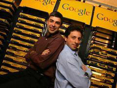
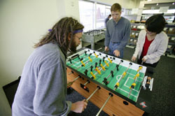
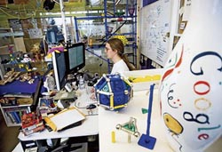
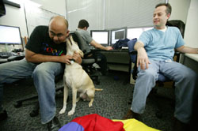

Title: Google sagan: stutta útgáfan
Slug: google-sagan-stutta-utgafan
Date: 2006-06-01 11:26:00
UID: 77
Lang: is
Author: Karl Jóhann Jóhannsson
Author URL: 
Category: Samfélag, Vefurinn
Tags: 

Árið 1996 var voru flestir nýkomnir með veraldarvefinn.  Fáir höfðu not fyrir þennan munað og færri gerðu sér grein fyrir notagildi hans.  Í þá daga var ekki auðvelt að finna efni á netinu, allt var í óreiðu, vefsíður voru óskipulagðar og sama hvað maður sló inn þá var þriðja hver niðurstaða hjá öllum leitarvélum klámsíða.  Tveir doktorsnemendur í tölvunarfræði við Stanford háskóla í Kaliforníu, þeir Sergey Brin og Larry Page, voru sannfærðir um að þeir gætu skapað betri leitarvél, svo þeir gerðu það.  

Til að byrja með þá var Google leitarvélin hýst í skrifstofu félaganna í byggingu á háskólasvæðinu; nokkrar ódýrar tölvur tengdar saman.  Leitarvélin varð strax mjög vinsæl innan háskólans og þurfti að bæta við tölvum til að vinna úr auknum fjölda leita.  Til þess þurfti pening.  Sergey og Larry reyndu að selja stóru leitarfyrirtækjunum algóriþmana sem knúðu leitina en án árangurs.  Helsta ástæðan sem stórfyrirtækin gáfu var að þeir vildu að fólk myndi eyða einhverjum tíma inn á vefsíðu þeirra þannig að þeir gætu skoðað auglýsingarnar og svoleiðis, en hugmynd Larry og Sergey var að fólk myndi finna það sem þau leituðu að fljótt og fara beint á þá síðu.

Þar sem engin vildi kaupa leitarvélina þá sáu þeir sér þann kost einan að taka sér frí frá námi til þess að stofna eigið fyrirtæki í kring um hana og eftir að hafa fengið stuðning frá fjölskyldu, vinum og fjárfestum þá gátu þeir byrjað að vinna allan sólarhringinn að Google.  Eftir því sem tíminn leið og leitarvélin varð vinsælli þá sáu þeir að þeir þyrftu mikið fjármagn til þess að geta haldað sömu gæðum og hraða í leit eftir því sem fjöldinn sem notaði leitarsíðuna jókst.  Á endanum náðu þeir að sannfæra tvö stór áhættufjárfestifélög um að fjárfesta 25 milljónum dollara í Google, ekki lítill árangur í ljósi þess hve mörg lítil tölvufyrirtæki voru að keppast um peninga á þessu svæði í Kaliforníu.

Með slíkar fjárhæðir milli handanna gátu þeir einnig flutt í almennilegar skrifstofur.  Skrifstofurnar fengu nafnið Googleplex og eru með áhugaverðari vinnuaðstöðum sem hægt er að finna.  Þar er hægt að stunda allar þær íþróttir sem manni dettur í hug, sem er víst nauðsynlegt þar sem maturinn þar, hollur matur af ýmsum tegundum, er ókeypis fyrir starfsmenn og víst afar góður.  Svæðinu hefur verið lýst frekar sem háskólasvæði frekar en vinnustaður.  Þar vinnur einnig tannlæknir sem starfsmennirnir hafa aðgang að og er að sjálfsögðu leikskóli fyrir börnin. 

Til að byrja með gekk allt vel en eins og hjá öllum fyrirtækjum þá þurfti Google að sýna gróða.  Upprunalega hugmyndin, sem þeim tókst að selja til fjárfestanna, var að selja öðrum fyrirtækjum afnot af leitarvélinni en það kom í ljós að það myndi ekki standa undir auknum kostnaði af tækjabúnaði sem þurfti til að anna öllum milljónum leitanna á hverjum degi.  Eitthvað þurfti að gera, 25 miljón dollurum hafði nú þegar verið fjárfest í fyrirtækinu og enn var ekkert að skila sér til baka. 

Larry og Page voru báðir afar mótfallnir því að auglýsa á síðunni sinni þar sem þeim fannst það skemma upplifun notandans og sömuleiðis vera ljótt.  Eftir nokkra umhugsun var þó brugðið á það ráð að koma fyrir „kostuðum tenglum“ á síðuna sem voru afmarkaðir tenglar keyptir af hæstbjóðanda og birtust á niðurstöðusíðunum eftir því hvaða orð var leitað eftir.  Þannig væru auglýsingarnar á sömuleiðis gagnlegar fyrir notendur.

Auglýsingarnar urðu mjög vinsælar og Google fór smám saman að fá inn miklar fjárhæðir í auglýsingartekjur.  Google hóf síðan að þróa eigið hagkerfi og tekjurnar af auglýsingunum fóru fljótlega úr miklar í fáránlega miklar.  En sem komið er vissi þó enginn af því _hversu_ miklar fjárhæðir þetta voru þar sem Google var á þessum tíma í einkaeign, eitthvað sem eigendurnir höfðu lítinn áhuga á að breyta ef það þýddi að þeir myndu missa einhverja stjórn á fyrirtækinu.

En það var ekki þeirra val, fjárfestarnir vildu að sjálfsögðu fá tækifæri til að græða á fjárfestingu sinni og sömuleiðis var fyrirtækið orðið það stórt og með það marga hluthafa að lögum samkvæmt þyrftu þeir að gera það að hlutafélagi.  Það var svo loks gert á afar óhefðbundin hátt í ágúst 2004 með því að leyfa öllum að bjóða í fyrirtækið í gegnum netið án þess að þurfa að vita neitt um hlutabréf eða þurfa að kaupa í gegnum þar til gerð fyrirtæki.  Þessi sérviska fór mjög í taugarnar á Wall Street, en um leið og fyrirtækið varð opinbert sáu allir hversu ótrúlega stórt fyrirtækið var orðið og sömuleiðis eigendur þess, en báðir voru þá komnir á lista yfir topp 50 ríkustu menn í heimi, rétt rúmlega þrítugir að aldri.

### Meira en bara leitarvél

Sem eitt stærsta fyrirtæki í heiminum í dag hefur Google reynt að gera marga gagnlega hluti í þágu almennings, með slagorð sitt “Don't be evil“ að stafni.  Meðal þess sem Google er að vinna í núna er að skanna inn gott hlutfall allra bóka í háskólabókasöfnunum í Harvard, Stanford, Oxford og Michigan, auk almenningsbókasafnsins í New York.  Markmiðið er að hægt sé að leita í öllum bókunum (og á endanum öllum bókum sem skrifaðar hafa verið) eftir orðum og jafnframt skoðað allar þær bækur sem ekki hafa höfundarétt.  Það er auðséð að þetta mun að minnsta kosti auðvelda til muna efnisleit fyrir fræðimenn og gefa fleirum aðgang að bókum sem ekki er hægt að nálgast auðveldlega.

Eina ástæðan þess að Larry og Sergey (eða Google gaurarnir eins og þeir eru oft kallaðir) gera hluti af þessu tagi þetta er einfaldlega sú að þeir geta það.  Tölvukerfi Google, sem er sérútbúið af fyrirtækinu, er með margfalda reiknigetu nokkurs annars tölvukerfis í heiminum og það heldur áfram að stækka.  Það er til dæmis ástæða þess að þeir geta boðið upp á hluti eins og Gmail, sem býður upp á  tæplega 3GB af geymsluplássi fyrir eins marga og vilja og það án nokkurra auglýsinga á síðunni.  

Ein af ástæðum þess að Google ákvað að búa til Gmail er sú að öll önnur ókeypis vefpóstþjónusta var á þeim tíma frekar slök, lítið sem ekkert geymslupláss var í boði og engir valmöguleikar.  Google ákvað að slá öðrum nokkuð rækilega við og bauð til að byrja með upp á 1GB, auk þess að bjóða fljótlega upp á að geta lesið póstinn í vefpóstsforriti, áframsendingu tölvupósts og sleppa notendum alfarið við auglýsingar (eitthvað sem engin önnur þjónusta hefur svi mikið sem ætlað sér ennþá).  

Margir telja að Gmail hafi verið enn eitt skotið á fyrirtækin Microsoft og Yahoo! sem bæði eru keppinautar Google.  Bæði hafa þau fengið að kenna mikið á tilveru Google, Yahoo! hefur misst mikil viðskipti yfir til Google, bæði í leitum og í samstarfi við önnur fyrirtæki, og Microsoft hefur þurft að sætta sig við yfirburði Google í leit í fleiri en einni tilraun Microsoft til að ná þeim.  

Til dæmis ákvað Microsoft að búa til sína eigin leit, sem þeir kölluðu MSN search, til þess eins að sýna að þeir væru ennþá stærstir á markaðnum og gætu gert það sem þeim langaði til.  MSN search átti að vera ítarlegasta leitarvélin á vefnum og gat, þegar hún fór á netið, leitað á 5 milljörðum síðum, á meðan Google var þá með 4 milljarða.  Nokkrum klukkustundum áður en MSN search átti að fara á netið gaf Google út þá tilkynningu að þeir hefðu tvöfalda leitargetu sínu og væru komnir upp í 8 milljarða.  Eitthvað sem Bill Gates og félögum þótti ekki sniðugt.

Þetta var þó ekki það sem kom Microsoft hvað verst við. Í lok árs 2004 gáfu Google út forritið Google Desktop, sem hefur aðallega þann eiginleika að geta leitað á tölvunni þinni, líkt og innbyggða leitin í Windows stýrikerfinu frá Microsoft gerir, nema að þessi leit virkar.  Microsoft var búin að lofa almennilegri leit í nokkur ár og aldrei staðið við það, en svo kemur Google og gerir það eins og ekkert sé.  Microsoft til mikillar mæðu.

Eins og þetta hafi ekki verið nógu slæmt þá tóku þeir félagar sig til og opnuðu Google skrifstofu skammt frá höfuðstöðvum Microsoft í Washington fylki til þess að lokka til sín starfsmenn, en þá voru margir nú þegar komnir yfir til Google.  Microsoft fór að finna mikið fyrir þessu og á endanum kærðu þeir með þeim rökum að starfsmennirnir byggju yfir þekkingu á innviðum hugbúnaðar Microsoft og mættu því ekki vinna fyrir Google.

Google heldur þó áfram að vera afar eftirsóttur vinnustaður, sem er mjög skiljanlegt í ljósi þess að Google sér vel um starfsmenn sína og möguleikarnir til uppgötvunar og sköpunar hjá þeim virðast ótakmarkaðir.  Til að mynda þá eiga starfsmenn alltaf að eyða einum dag vikunnar í eitthvað sem þeim finnst spennandi, sama hversu langsótt eða fáránlegt það er.  Þetta gefur starfsmönnum tækifæri til að þróa eigin hugmyndir og ef til vill skapa ný verkefni fyrir Google, en þessi verkefni, sem þá er unnið að, verða stundum að stærri verkefnum sem miklu fjármagni er eytt í að klára. 

Speki Google er að gera hlutina fyrst og athuga svo hvort það sé hægt að græða eitthvað á þeim. Ef það reynist ekki svo skiptir það ekki miklu máli. Þeir þurfa ekki að hafa áhyggjur af hlutafjáreigendum, fyrirtækið skilar svo miklum hagnaði að engum dettur í hug að kvarta og svo lengi sem Larry og Sergey fá að gera það sem þeim sýnist þá eru allir ánægðir.

### Mikill metnaður

Google leitarvélin er nú til í tugum tungumála og er unnið að því að þýða alla hluta leitarvélarinnar yfir á sem flest tungumál heims.  Auk þeirra leita hjá Google sem allir þekkja, eins og myndaleit, þá eru fleiri sérhæfðar leitir komnar á netið. Meðal þessara nýju sérhæfða leita eru leit að [tónlist](http://www.google.is/intl/en/help/features.html#music) (ekki sjálfum lögunum þó), [fréttum](http://news.google.com,) ódýrum vörum á [Froogle](http://www.froogle.com,) fræðigreinum á [Google scholar](http://scholar.google.com) og svo mætti lengi telja.  

Ótalmargar áhugaverðar nýjungar eru þar að auki í vinnslu hjá Googl, til dæmis myndaforritið frábæra Picasa, Blogger vefurinn og spjallforritið Google Talk.  Hægt er að leita að hverfinu sínu í Google Earth og Maps (reyndar eru niðurstöðurnar takmarkaðar ef þú býrð á Íslandi) og sömuleiðis að bíói, veðri og leigubílum ef þú býrð í Bandaríkjunum.  Það gæti verið full vinna að fylgjast með öllu sem Google er að gera, en með því að fikra sig aðeins áfram frá aðalleitarsíðunni Google.com (eða Google.is) má finna ógrynni af tækjum og tólum sem manni datt ekki í hug að væru til.  Til dæmis vita ekki allir að með því að slá inn reiknijöfnu í leitargluggann verður efsta niðurstaðan í leitinni útkoma hennar, sömuleiðis ef skrifað er „define“ fyrir framan orð þá er efsta niðurstaðan skilgreining á því orði.  Loks er vert að nefna Google.org, sem er stofnun sem sér um að styrkja málefni sem strákarnir telja verðug.  

Það er erfitt að segja hvenær eða hvort slík sköpunargleði komi til með að þrjóta, þó gera megi ráð fyrir að svo hljóti að verða einhvern tíman.  En þangað til þá mun heimurinn eflaust njóta góðs af Google og kannski einn daginn sem eitthvað meira og stærra en bara góð leitarvél.  Google gaurarnir gera sér grein fyrir því að staða fyrirtækisins veltur algjörlega á því að þeir geti boðið upp á bestu leitarvél sem kostur er á og er það að sjálfssögðu enn aðaláhersla fyrirtækisins, en Google sem fyrirtæki er orðið svo miklu meira og metnaðurinn er mikill, mjög mikill.

<small class="blurb">Greinin er byggð á: The Google Story e. David Vise (2005) Inside the Google Empire (birtist í _Time_, mars 2006)</small>
