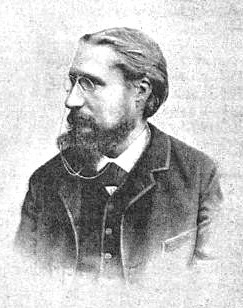

Title: Gramsci, Gide, neyslubyltingin og menningarbylting verkalýðsins
Slug: gramsci-gide-neyslubyltingin-og-menningarbylting-verkalydsins
Date: 2007-09-20 11:45:00
UID: 180
Lang: is
Author: Magnús Sveinn Helgason
Author URL: 
Category: Sagnfræði, Neyslusamfélagið
Tags: Gramsci, Gide, marxismi, Fangelsisdagbækur, Mussolini, fasismi, Frankfúrtskóli, kapítalismi, verkalýður, samvinnuhreyfing, Peter Gurney, menningarbylting, kaupfélag, Co-op, Furlough, Strikwerda, Consumers against Capitalism?, neytendasamvinnufélag, samvinnufélag, verkalýðsstétt, neyslumenning, neysla, Victoria Kelley, verslun, sósíalistar, fjöldahreyfing, viðskipti, neyslusamfélag, sósíalismi

Hugmynd Gramsci um hegemóníu (e: _hegemony_) er ein af áhrifamestu hugmyndum Marxískrar hugsunar. Gramsci setti hugmynd sína um hegemóníu fram í _Fangelsisdagbókunum_ sem skrifaðar voru eftir að fasistastjórn Mussolini dæmdi hann í fangelsi fyrir byltingaráróður. Markmiðið var að að skýra af hverju spádómur Marx um byltingu öreiganna hafði ekki ræst á millistríðsárunum, og að fjöldi þjóða hafi orðið fasismanum að bráð. Likt og hugsuðir Frankfúrtskólans taldi Gamsci að alþýðan hefði verið hneppt í fjötra menningarlegs ægivalds kapítalismans. Verkalýðurinn hefði óafvitandi gengist inn á gildismat og hugmyndakerfi kapítalískrar fjöldamenningar, sem aftur greiddi götu fasismans, ef hún var þá ekki sjálf fasísk.[^1]

Gramsi taldi að bylting öreiganna gæti aðeins átt sér eftir að þetta menningarlega ægivald kapítalistanna hefði verið brotið á bak aftur, en til þess þyrftu leiðtogar verkalýðsstéttarinnar að kenna alþýðunni grundvallarhugmyndir sósíalismans og vekja stéttarvitund verkalýðsins. Reisa yrði and-hegemónískan valkost við hegemóníu kapítalismans.

Í viðleitni sinni til að endurmeta hlutverk samvinnuhreyfingarinnar í sögu bresku verkalýðsstéttarinnar færir Peter Gurney rök fyrir því að skilja megi starf ensku samvinnuhreyfingarinnar á nítjándu öld og fyrri hluta tuttugustu aldar sem hægfara „menningarbyltingu“. Verkamenn hafi lært sósíalískar hugmyndir af þátttöku í lýðræðislegum rekstri kaupfélaga og að hreyfingin hafi þannig eflt stéttarvitund verkalýðsins. Fyrri verkalýðssögufræðingar höfðu tekið mjög neikvæða afstöðu til samvinnuhreyfingarinnar, sem var sökuð um að hafa grafið undan byltingarvilja breska verkalýðsins og kennt almenningi efnishyggju. Gurney heldur því hins vegar fram að jafnvel innkaup lífsnauðsynja í kaupfélaginu hafi sýnt fyrir verkamönnum óréttmæti gróðasjónarmiða kapítalismans.

Þessi skilningur er einkennandi fyrir höfunda efnis í _Consumers against Capitalism?_ Samvinnuhreyfingin bauð upp á valkost við neyslumenningu kapítalismans, and-kapítalíska menningu sem var mikilvæg stoð fyrir menningarlíf verkalýðsstéttarinnar í mörgum löndum Evrópu. Í inngangi bókarinnar staðhæfa Furlough og Strickwerda:

> [Consumer cooperation] has been one of the most important attempts to create an alternative vision of modern economic organization, to form, in Gramsci’s terms, a basis for a counter-hegemony to the hegemony of capitalism.[^2]

Sögulegt hlutverkt neytendasamvinnufélaga er því að hafa leikið lykilhlutverk við myndun sósíalískrar verkalýðsstéttar og verið skref í baráttu hennar fyrir sósíalískri byltingu. En samvinnuhreyfingin brást þessu sögulega hlutverki, því Furlough, Strickwerda og Gurney telja öll að á millistríðsárunum hafi samvinnuhreyfingin hætt að bjóða upp á róttækan valkost við neyslumenningu kapítalismans. Furlough heldur því fram í niðurstöðum bókar sinnar um frönsku samvinnuhreyfinguna að

> [i]n France during the nineteenth and early twentieth centuries, there was an opening for an expanded radical version of consumer cooperation only at a moment when French socialism and trade unionism were relatively strong and when an emergent capitalist consumerism had not yet assumed its final form.[^3]

Þessi skilningur á sögu neytendasamvinnufélaga gengur út frá frekar línulegri og einfaldri mynd af þróun neyslusamfélagsins. Saga neyslusamfélagsins samkvæmt þessu er saga þess hvernig kapítalísk neyslumenning, sem á að hafa komið fram á nítjándu öld, festi sig í sessi og kæfði hugsanlega valkosti áður en hún náði sínni „endanlegu mynd“.

Í inngangi _Consumers against Capitalism_ skilgreina Furlough og Strickwerda nútíma neyslumenningu sem yfirborðskennda „falsmenningu“ sem einkennist af einstaklingshyggju, áhuga á varningi og neysluvörum, þrá neytenda en ekki þarfir og svölun óþarfra langana. Birtingarmyndir nútíma neyslumenningar eru verslunarkeðjur, stórverslanir og verslunarhillur þéttskipaðar innpökkuðum merkjavörum. Auglýsingar sem leggja áherslu á persónulegt samband fólks við vörur og upphefja hlutverk fólks sem neytendur en ekki verkamenn, en horfa framhjá uppruna vörunnar í framleiðslu eru einnig nefndar sem einkenni „nútíma“ neyslusamfélags. Samkvæmt þessu hefur almenningur í nútíma neyslusamfélögum glatað tengslum við raunverulegar þarfir sínar. Neyslumenning samvinnuhreyfingarinnar á hins vegar að hafa verið lýðræðisleg og byggð á „sönnum“ þörfum:

> From its origins until well into the twentieth century, cooperators situated goods within both a language and a set of practices that spoke to dualistic notions of „true“ and „false“ needs. ... The kinds of goods sold in cooperative stores were meant to meet what cooperators considered „authentic“ consumer needs.[^4]

Furlough heldur því fram að samvinnuhreyfingin hafi yfirgefið þessa hugsjón á millistríðsárunum, og bendir því til sönnunar á aukna notkun auglýsinga, endurnýjun verslunarhúsnæðis og samræmt útlit kaupfélaga. Aukið vöruúrval kaupfélaga er jafnvel talið vísbending um vaxandi efnishyggju hreyfingarinnar.

Þó það sé algengt í eldri verkum um sögu neyslu að skilgreina neyslusamfélagið sem „draumaveröld“ og gera greinarmun á neysluhyggju sem einkennist af löngunum og þrám annarsvegar og eldri efnismenningu sem byggist á þörfum hafa mannfræðingar, sagnfræðingar og aðrir sem fjalla um neyslumenningu og vestræn neyslusamfélög hafnað þessari tvíhyggju. Ekki sé hægt að gera skýran greinarmun á „þörfum“ og „löngunum“ eða „rökrænni“ og „órökréttri“ neyslu.[^5]  Það er sömu leiðis vafasamt að samvinnumenn hafi gengist við því að  hægt væri að skilgreina „raunverulegar“ og „falskar“ þarfir. Þó púrítanískar hugmyndir um neyslu hafi verið algengar meðal margra samvinnumanna höfðu leiðtogar og hugsuðir hreyfingarinnar mun víðari og sveigjanlegri hugmyndir um hlutverk neyslu fyrir fólk.

Charles Gide sem hefur verið nefndur „Nestor“ samvinnuhreyfingarinnar og einn áhrifamesti leiðtogi samvinnumanna á fyrstu áratugum 20. aldar, lagði áherslu á að tilgangur neyslu væri ekki aðeins að fullnægja líkamlegum frumþörfum, heldur líka að njóta lífsins. Fólk mataðist til dæmis ekki í þeim tilgangi einum að næra sig, heldur til þess að njóta matarins. Máltíðir væu menningarlegar og félagslegar athafnir, og hið sama gilti um aðra neyslu. Gide hafði hins vegar áhyggjur af því að neytendur kynnu ekki að ungangast vöruveröldina. Fólk eyddi um efni fram og freistaðist til að kaupa hluti sem það hefði ekki efni á, vegna þess að kaupmenn buðu upp á reikningsviðskifti. Þá kynni fólk ekki að velja fallega og endingargóðar vörur heldur gleptist af glysi misvísandi auglýsingum. Auglýsingar kaupfélaga áttu samkvæmt þessu að uppfræða neytendur um verð, gæði og notagildi þeirrar vöru sem var auglýst. Þá ættu kaupfélög að fullnægja öllum neysluþörfum meðlimanna með heiðarlegum og ósviknum vörum á viðráðanlegu verði.[^6]

Mikilvægasti munurinn á kapítalískri neyslumenningu og hugmyndum samvinnumanna um neyslu var að í huga samvinnumanna átti tilgangur framleiðslunnar ekki að vera hagnaður verslunareigenda eða framleiðenda, heldur fullnæging líkamlegra, félagslegra eða menningarlegra þarfa og langana fjöldans. Þessar hugsjónir lifðu góðu lífi þó evrópsk kaupfélög hefðu farið að auglýsa, aukið vöruúrval og staðlað útlit verslana. Reyndar má færa að því rök að aukið vöruúrval og notkun auglýsinga hafi ekki verið svik við fyrri markmið, heldur tilraun til að mæta þeim betur.

Í rannsókn sinni á efnismenningu enskra samvinnumanna um aldamótin 1900 hafnar Victoria Kelley því einnig að í þessari þróun hafi falist svik við samvinnuhugsjónina:

> Co-operative consumers … were using a language of consumption which was more developed than that of early co-operators, but no less or more inspired by principle, no more or less „tainted“ by materialism.

Notkun á nútímalegri verslunarháttum táknaði samkvæmt Kelley ekki að samvinnumenn væru „selling out to mammon, but rather using a more complex material code to express ideologies which were just as strong as those of previous generations.“[^7]

Þó samvinnuhreyfingin hafi sprottið úr sama jarðvegi og útópískur sósíalismi 19. aldar, og þó bæði samvinnumenn og sósíalistar hafi barist fyrir bættum kjörum alþýðunnar greindi þá á um mikilvæg atriði. Samvinnumenn höfnuðu hugmyndum um stéttabaráttu og lögðu áherslu á pólítískt hlutleysi samvinnuhreyfingarinnar. Að þeirra mati stóðu allir neytendur, óháð stéttastöðu, jafn halloka í samskiptum sínum við verslunarauðvaldið. Þá börðust flestir samvinnumenn gegn þjóðnýtingu og auknum umsvifum ríkisins í efnahagslífinu sem þeir töldu að myndu skaða hagsmuni neytenda.

Samvinnuhreyfingin er erfitt sagnfræðilegt viðfangsefni, meðal annars vegna þess að eðli hennar var tvöfalt. Annars vegar var hún ídealísk fjöldahreyfing, sem stefndi að umbyltingu samfélagsgerðarinnar, afnámi verslunargróða, réttlátari skiptingu auðæfa og stofnun hins útópíska „samvinnuríkis“. Hins vegar voru samvinnumenn uppteknir af „praktískum“ vandamálum, þ.e. að útrýma óheiðarlegum viðskiftaháttum, okri og vörusvikum, en aðallega að selja meðlimum hreyfingarinnar ódýr og góð matvæli og aðrar nauðsynjar og kenna þeim að taka skynsamlegar neysluákvarðanir.

Enginn vafi leikur á að samvinnuhreyfingunni hafi lengi vel tekist að ná þessum praktísku markmiðum. Þá er óvéfengjanlegt að hún hafi haft áhrif á þróun neyslusamfélagsins. Ef við skrifum sögu neytendasamvinnufélaga hins vegar einvörðungu sem sögu misheppnaðrar and-hegemóníu, eða ef við dæmum árangurinn alfarið út frá útópískum lokamarkmiðum samvinnuhugsjónarinnar, er niðurstaðan sú að samvinnuhreyfingin hafi „mistekist“. Hún hafi vísað veginn eftir einu af mörgum öngstrætum sögu 20. aldarinnar.

Þessi skilningur, sem hefur verið ríkjandi í nýlegum rannsóknum á sögu samvinnuhreyfingarinnar, horfir framhjá tvöföldu eðli hreyfingarinnar og dæmir hana þar að auki út frá röngum forsendum, þ.e. að hún hafi verið einhverskonar afbrigði af sósíalisma. Það er þó einnig hægt að skoða samvinnuhreyfinguna sem vel heppnaða tilraun af hálfu skipulagðra neytendasamtaka til að hafa áhrif á þróun neyslusamfélagsins. Slík nálgun á sögu samvinnuhreyfingarinnar gefur okkur einnig tækifæri til að endurmeta sögu neyslusamfélagsins, og gefur um leið jákvæðari mynd af möguleikum neytenda, ekki bara til að veita „mótspyrnu“ gegn kapítalískri neysluhyggju, heldur líka til að hafa bein áhrif á þróun neyslumenningarinnar. Það er því spurning hvort það veiti okkur ekki meiri innsýn í þróun bæði samvinnuhreyfingarinnar og neyslusamfélagsins að skrifa sögu neytendasamvinnufélaga út frá neyslubyltingunni frekar en stéttabaráttu verkalýðsins eða menningarbyltingu öreiganna.

[^1]: Antonio Gramsci, _Prison Notebooks_. Ritstj. og þýð. Joseph A. Buttigieg (New York 1992-2007). Stuttur og aðgengilegur inngangur að hugmyndinni um „hegemóníu“ er að finna Raymond Williams, _Marxism and Literature_ (Oxford 1978), bls. 108-114. Hugmyndir Gramsci hafa haft gríðarmikil áhrif í evrópsku háskólasamfélagi. Sjá Chantal Mouffe og Anne Showstack Sassoon, „Gramsci in France and Italy-a review of the literature“, _Economy and Society_ 6:1 (feb. 1977), bls. 31-68. Bandarískir verkalýðssögufræðingar uppgötvuðu Gramsci á níunda áratugnum. Sjá T. J. Jackson Lears, „The Concept of Cultural Hegemony: Problems and Possibilities“, _The American Historical Review_ 90:3 (júní 1985), bls. 567-593. — George Lipsitz, „The Struggle for Hegemony“, _The Journal of American History_, 75:1 (júní 1988), bls. 146-150. — Leon Fink, „The New Labor History and the Powers of Historical Pessimism: Consensus, Hegemony, and the Case of the Knights of Labor“, _The Journal of American History_, 75:1 (júní 1988), bls. 115-136.

[^2]:  Carl Strikwerda, “Alternative Visions” and Working-Class Culture: The Political Economy of Consumer Cooperation in Belgium, 1860-1980” _Consumers against Capitalism? Consumer Co-Operation in Europe, North America, and Japan_, 1840-1990 edited by Ellen Furlough; Carl Strikwerda (Lanham, UK, 1999), pp. 67-92. Tilvitnun á bls. 68.

[^3]:  Ellen Furlough, _Consumer Cooperation in France. The Politics of Consumption, 1834-1930._ (Ithaca, NY, 1991). bls. 295.

[^4]:  Ellen Furlough og Carl Strickwerda, „Economics, Consumer Culture, and Gender“, bls 38.

[^5]:  Hér nægir að nefna Daniel Miller, „Consumption as the vanguard of history: a polemic by way of an introduction“, _Acknowledging Consumption: A Review of New Studies_. Ritstj. Daniel Miller (London 1995), bls. 1—57. Sjá einnig umfjöllun í Magnús Sveinn Helgason, „Neyslusaga og neysluþekking. Nýtt fræðasvið verður til“, _Saga_ 44:2 (haust 2006), bls. 129-148.

[^6]:  Aðgengilegur inngangur að hugmyndum Charles Gide um neyslu og vandamál neyslusamfélagsins er að finna hjá Rosalind H. Williams, _Dream worlds. Mass Consumption in Late Nineteenth-Century France_ (Berkeley 1982). bls 276-321. Sjá einnig Mats Ahnlund, Charles Gide 1847-1932._ Kooperatör och nationalekonom_ (Stockholm 1983).

[^7]:  Victoria Kelley, „The Equitable Consumer: Shopping at the Co-Op in Manchester“, _Journal of Design History_ 11:4 (1998), bls. 295-310. Tilvitnanir á blaðsíðum 306 og 305.

<small class="blurb">
**15. desember 2007:** Höfundur óskar að tekið sé fram: Þessi grein er fyrstu drög að stærra verki sem er í vinnslu.
</small>
