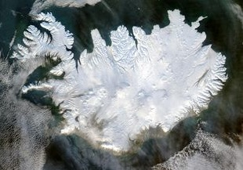
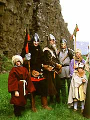
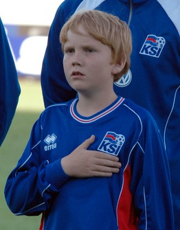

Title: Hagsælda hrímhvíta móðir
Slug: hagsaelda-hrimhvita-modir
Date: 2007-12-13 11:50:00
Part: 1/2
UID: 203
Lang: is
Author: Íris Ellenberger
Author URL: 
Category: Sagnfræði, Íslendingar
Tags: 

Þótt Íslendingar teljist í hópi smáþjóða verður seint sagt að hógværð einkenni landann þegar hann ber sig saman við fólk af öðru þjóðerni. Þá er sjaldnast langt að bíða eftir staðhæfingum um að Íslendingar séu einhvern veginn sérstakir, að tungumálið sé hreint og þjóðin einnig. Slíkar hugmyndir eru arfleifð frá sjálfstæðisbaráttunni og enduróma í samtímanum án mikilla mótmæla. Hreinleikinn er samofinn sjálfsmynd okkar. Ennfremur má varla fjalla um innflytjendur í fjölmiðlum án þess að einnig sé fjallað um íslenskukunnáttu þeirra. Ennfremur draga fáir þau rök í efa að takmarka skuli innflutning erlendra ríkisborgara, sér í lagi frá löndum utan Evrópu, til að vernda örsmáa, íslenska og umfram allt hrein þjóð. Slíkar hugmyndir eru furðu lítið gagnrýndar þótt Ísland eigi að teljast til fjölmenningarsamfélags.

Eins og margoft hefur komið fram eiga þessar lífseigu hugmyndir um hreinleikann rætur að rekja aftur til sjálfstæðisbaráttu þjóðarinnar. Séríslensk tunga reyndist hentugt vopn því hún samræmdist kenningum nokkurra hugmyndasmiða þjóðernisstefnunnar í Evrópu um eðli þjóða. Má nefna kenningar Johann Gottfried von Herder um tungumál sem helsta einkenni og undirstöðu þjóða og hugmyndir Johann Gottlieb Fichte um mikilvægi „upprunalegra“ tungumála. Á grundvelli slíkra kenninga gátu forkólfar sjálfstæðisbaráttunnar rökstutt að Íslendingar væru ein þjóð með eina „upprunalega“ tungu og ættu því rétt á að lúta eigin stjórn.[^1]

Tungumálið varð jafnframt samnefnari fyrir menningu, aðallega fornbókmenntir Íslendinga sem nutu nokkurrar hylli meðal norrænna menntamanna. Þegar á leið varð þjóðveldisöld að Gullöld þar sem lýðræði ríkti og framlag Íslendinga til heimsbókmennta var fest á blað. Þannig hlaut sjálfstæðiskrafan betri hljómgrunn meðal danskra stjórnvalda því Danir véfengdu ekki glæsta fortíð Íslendinga og töldu að hjálendan varðveitti þeirra eigin menningararf.[^2] Til að réttlæta sjálfstæði lögðu „ímyndasmiðir íslenska þjóðríkisins“, eins og Guðmundur Hálfdanarson kallar þá, sífellt ríkari áherslu á tilkomumikla fornöld Íslendinga og einnig órofið samhengi sögunnar frá Gullöld til samtíma. Þar gegndi íslensk tunga, öðru nafni menningin, lykilhlutverki. Hún tengdi Íslendinga samtímans við kappa Gullaldarinnar og renndi stoðum undir rétt þeirra til lifa og starfa í sjálfstæðu þjóðríki. Samkvæmt kenningunni töluðu Íslendingar mál forfeðranna og gátu lesið fornbókmenntirnar hjálparlaust. Íslenskan hafði varðveist í óspillt í þúsund ár.[^3] Einangrun landsins átti að hafa varðveitt hana í upprunalegri mynd og hún var því laus við erlend áhrif og umfram allt hrein. Ennfremur hafði meint samskiptaleysi við útlönd varðveitt hið einstaka íslenska kyn. Íslendingar voru hreinir afkomendur víkinga og Kelta.[^4]

Eins og Unnur Birna Karlsdóttir hefur rakið þá voru hugmyndir um sérstakan íslenskan kynstofn ekki sjálfsprottnar frekar en þjóðernishyggjan. Þær sóttu fyrirmynd sína til ríkjandi hugmyndafræði Vesturlanda um að einstaklingar erfðu alla sína eiginleika, kosti og galla frá forfeðrum sínum. Þessir eiginleikar voru jafnframt grundvöllurinn að því samfélagi sem einstaklingurinn skapaði sér. [^5] Hér á Íslandi hófst málflutningur um sérstakan íslenskan kynstofn snemma á 20. öld með bók Jóns Aðils Íslenskt þjóðerni frá 1903. Kynstofninn sameinaði bestu eiginleika tveggja merkra arískra stofna, vitsmuni Kelta og framsækni Germana.[^6] Íslendingar áttu þannig ekki langt að sækja einstaka hæfileika. Mikilvægt þótti að hlúa að meintum erfðafræðilegum eiginleikum þjóðarinnar. Íslendingar byggðu framtíð sína á sömu eðlislægu þáttum og lagt höfðu grunninn að glæstri fortíðinni. Þannig tengdu bæði blóð og tunga Íslendinga samtímans við Gullöld þjóðarinnar og lögðu sitt á vogarskálarnar til að rökstyðja tilvist sjálfstæðs íslensks þjóðríkis. 

Hugmyndir þjóðernishyggjunnar um hreinleika íslenskrar tungu og kynstofn settu sitt mark á íslenskt samfélag og stjórnmál og kölluðu á viðbrögð til að varðveita þessa dýrmætu arfleifð. Málhreinsun hófst þegar á 18. öld en náði vissu hámarki öld síðar. Tungumálið varð að „hreinsa“ af öllum erlendum áhrifum og úr varð nokkurs konar nýsmíði sett saman út máli bændafólks og fornnorrænu.[^7] Eins og Gísli Pálsson benti á öðlaðist þetta tungumáli næstum eigið líf á 20. öld. Það var ekki samskiptatæki heldur stóð utan sjálfsmyndar Íslendinga sem sjálfstæð eining sem ekki mátti brjóta gegn. Eftir því sem leið á öldina fór orðræðan um tungumálið að snúast um hreinleika hennar. Hinu ákjósanlega máli var lýst sem „hreinu“ á meðan óæskilegur talsmáti þótti óhreinn eða sýktur.[^8]

Á sama tíma og málhreinsunarmenn börðust gegn sýktu máli stóðu íslensk stjórnvöld í stappi við að vernda meintan hreinan kynstofn. Þótt Íslendingar hefðu síst verið hlynntir ofsóknum Þjóðverja á gyðingum þá hefði Íslendingum þótt sem þeim bæri skylda til að vernda hreinan kynstofninn. Voru það helstu ástæður þess að íslensk stjórnvöld neituðu að taka við flóttamönnum úr röðum gyðinga þótt þeir hafi opinberlega notað efnahagsleg rök til að réttlæta ákvörðunina. Ennfremur settu íslensk stjórnvöld þau skilyrði við veru bandarísks setuliðs á Íslandi árið 1941 að „íslenska kynstofninum stafaði engin hætta af hernum ... að aðeins yrðu hvítir menn í ameríska setuliðinu...“ til að fyrirbyggja barneignir blökkumanna með íslenskum konum. Að sama skapi lýstu ýmsir greinahöfundar yfir áhyggjum sínum af barneignum íslenskra kvenna með erlendum sjómönnum og farandverkamönnum. Var þá kynlíf utan hjónabands ekki eina áhyggjuefnið heldur einnig að „íslenskur kynstofn“ gæti „óhreinkast“.[^9] Svipuð viðhorf lágu að baki kröfum íslenskra stjórnvalda um að blökkumenn yrðu ekki meðal starfsmanna varnarliðsins á Keflavíkurflugvelli. Verndun hins meinta íslenska kynstofns var því opinber stefna stjórnvalda a.m.k. fram á 7. áratuginn.[^10]

Kynbótastefnan hafði einnig áhrif á veitingu ríkisborgararéttar og mætti eflaust einnig sjá merki hennar í fyrstu lögum um atvinnuréttindi útlendinga árið 1927. Lögin vernduðu atvinnumöguleika Íslendinga á kostnað útlendinga með því að skylda vinnuveitendur til að láta Íslendinga ganga fyrir um alla vinnu. Þó er ekki að sjá að hugmyndir kynbótastefnunnar hafi haft mikil áhrif á setningu þeirra. Andstætt ríkisborgararéttarlögum giltu þau um alla erlenda ríkisborgara.[^11] Hins vegar var gerður skýr greinarmunur á umsækjendum um ríkisborgararétt eftir þjóðerni. Ríkisfang var veitt með lögum til ársins 1998 og voru ávallt gerðar minni kröfur til þeirra sem tengdust Íslandi blóðböndum eða komu frá hinum Norðurlöndunum. Þegar Alþingi kom sér saman um ákveðnar reglur um veitingu ríkisborgararéttar árið 1955 var það einmitt raunin að skilyrði um lengd búsetu var mismunandi, þrjú ár ætti umsækjandi íslensk skyldmenni, fimm væri hann frá Norðurlöndunum og tíu ár fyrir aðra umsækjendur.[^12]

Í síðari hluta greinarinnar verður fjallað um lög sett til höfuðs erlendum mannanöfnum og hvaða áhrif hugmynda um hreinleika íslensku þjóðarinnar á fjölmenningarsamfélag samtímans.

[^1]: Guðmundur Hálfdanarson, _Íslenska þjóðríkið , uppruni og endimörk_. Hið íslenska bókmenntafélag, ReykjavíkurAkademían, Reykjavík 2001, 197-98.

[^2]: Guðmundur Hálfdanarson, _Íslenska þjóðríkið_, 197.

[^3]: Guðmundur Hálfdanarson, „Sameiginlegar minningar og tilvist íslenskrar þjóðar", _2. íslenska söguþingið 30 maí - 1. júní 2002. Rástefnurit_ II. Erla Hulda Halldórsdóttir ritstjóri. Sagnfræðistofnun Háskóla Íslands, Sagnfræðingafélag Íslands, Sögufélag. Reykjavík 2002, 313-14.

[^4]: Unnur Birna Karlsdóttir, _Mannkynbætur. Hugmyndir um bætta kynstofna hérlendis og erlendis á 19. og 20. öld. Sagnfræðirannsóknir_ 14, Gunnar Karlsson ritstjóri. Sagnfræðistofnun Háskóla Íslands og Háskólaútgáfan, Reykjavík 1998, 75-79.

[^5]: Unnur Birna Karlsdóttir, _Mannkynbætur_, 21.

[^6]: Unnur Birna Karlsdóttir, „Maður íslenskur. Hugmyndir á fyrri hluta 20. aldar um samband íslensks þjóðernis og kynþáttar“, _Þjóðerni í þúsund ár?_ Jón Yngvi Jóhannsson, Kolbeinn Óttarsson Proppé og Sverrir Jakobsson ritstjórar. Háskólaútgáfan, Reykjavík 2003, 189.

[^7]: Svavar Sigmundsson, „Hreinsun íslenskunnar“, _Íslenskt mál og almenn málfræði_ 12-13 1990-1991, 139.

[^8]: Gísli Pálsson, „Language and Society: The Ethnolinguistics of Icelanders“, _The Anthropology of Iceland_. E. Paul Durrenberger og Gísli Pálsson ritstjórar. University of Iowa Press, Iowa City 1989, 122, 132.

[^9]: Unnur Birna Karlsdóttir, _Mannkynbætur_, 103-11.

[^10]: Valur Ingimundarson, „Sögulegt minni og pólitískt vald. Herinn og (kven)þjóðin á kaldastríðstímanum“, _2. íslenska söguþingið 30. maí — 1. júní 2002. Ráðstefnurit_ II. Erla Hulda Halldórsdóttir ritstjóri. Sagnfræðistofnun Háskóla Íslands, Sagnfræðingafélag Íslands, Sögufélag, Reykjavík 2002, 359-61.

[^11]: Íris Ellenberger, „Varaskeifur, stuðpúðar eða brú milli framboðs og eftirspurnar? Stefna íslenskra stjórnvalda í málefnum innflytjenda 1927-2000“, _Sagnir. Tímarit um söguleg efni_ 27 2007, 52-54; Guðmundur Jónsson, „Þjóðernisstefna, hagþróun og sjálfstæðisbarátta“, _Skírnir_ 169. árg., vor 1995, 90-91.

[^12]: Íris Ellenberger, Stefna stjórnvalda í málefnum innflytjenda. B.A. ritgerð við hugvísindadeild Háskóla Íslands, sagnfræðiskor, 2003, 32-38.
