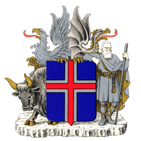
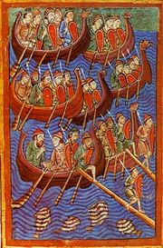
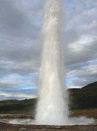

Title: Hagsælda hrímhvíta móðir
Slug: hagsaelda-hrimhvita-modir
Date: 2007-12-18 12:00:00
Part: 2/2
UID: 204
Lang: is
Author: Íris Ellenberger
Author URL: 
Category: Sagnfræði, Íslendingar
Tags: 

Í fyrri hluta greinarinnar var fjallað um uppruna þeirra hreinleikahugmynda sem ríkja um íslensku þjóðina og áhrif hennar á lög um íslenskan ríkisborgararétt þar sem skýr greinarmunur var gerður á umsækjendum eftir því hversu blóðtengdir þeir þóttu þjóðinni. Þar að auki samþykkti Alþingi við endurskoðun ríkisborgararéttarlaga árið 1951 að bætt yrði inn klausu sem hljóðaði svo: „Þeir, sem heita erlendum nöfnum, skulu þá ekki öðlast íslenzkan ríkisborgararétt með lögum þessum fyr en þeir hafa fengið íslenzk nöfn samkvæmt lögum nr. 54 27. júní 1925, um mannanöfn.“ Þetta ákvæði var umdeilt sér í lagi vegna þess að íslenskir ríkisborgarar tóku gjarnan upp ættarnöfn í trássi við mannanafnalögin.[^1] Þó náðist ekki nægur stuðningur til slaka á kröfunum fyrr en á 9. áratugnum og árið 1996 voru loks allar skyldur til nafnabreytinga máðar úr lögum.[^2] Um það leyti var aðlögunarstefnan að ryðja sér til rúms þar sem lögð var áhersla á að einstaklingar af erlendum uppruna héldu sérkennum sínum en öðluðust jafnframt menningarlega færni í nýja samfélaginu. Hins vegar er ekki að sjá að nefndarmönnum sem mæltu með breytingunum hafi verið það létt. Í greinargerð með frumvarpinu sem varð að lögum árið 1996 er að finna ítarlegan kafla þar sem íslensk nafnahefð er mærð, hún talin hluti af sjálfsmynd Íslendinga og lýst yfir áhyggjum af fjölgun ættarnafna sem hefðu óæskileg áhrif varðveislu íslenskrar hefðar. Greina má það viðhorf að erlend ættarnöfn myndu spilla sérkennum þjóðarinnar en nefndarmenn voru knúnir til að breyta lögunum því krafa um nafnbreytingu þótti jaðra við mannréttindabrot.[^3]

Rannsóknir á orðræðunni sem fylgdi ofangreindum lagabreytingum hefur leitt í ljós að ríkisborgararéttur þótti veita aðgang á þjóðerninu og reynt var að tryggja að það „mengaðist“ ekki af erlendum áhrifum. Ríkisborgararétturinn þótti ennfremur verðmæti sem ekki skyldi sóa. Hann var tilfinningalegs eðlis og krafðist þess að handhafar hans hefðu náin blóð- eða tilfinningatengsl við land og þjóð. Innflytjendur gátu því orðið hluti af íslensku þjóðinni þrátt fyrir lífseigar hugmyndir um hreinan íslenskan kynstofn. Hins vegar voru nýir íslenskir ríkisborgarar krafðir um nær fullkomna samlögun með hefðum og gildum þjóðarinnar og skyldu þeir því afmá öll ytri, og jafnvel innri, merki um erlendan uppruna.[^4] Ríkisborgararéttarlögin gegndu mikilvægu hlutverki í því ferli að gera fólk af erlendum uppruna ósýnilegt á „hreinu“ yfirborði þjóðarinnar. Hins vegar þótti það misauðvelt og ríkisborgararéttarlög endurspegla það var álitið fara eftir kynstofni hversu auðveldlega innflytjendur voru taldir samlagast íslensku þjóðerni. Þeir sem tengdust Íslandi blóðböndum voru taldir eiga auðveldast með að „verða Íslendingar“, síðan Norðurlandabúar og loks aðrir ríkisborgarar. Enginn vafi leikur á að hugmyndir um meintan hreinan, íslenskan kynstofn hafi haft áhrif á goggunarröðina. 

Nú er sagt að öldin sé önnur og Ísland orðið fjölmenningarsamfélag. En raunin er sú að hugmyndir þjóðernishyggjunnar móta en afstöðu Íslendinga til útlendinga í samtímanum  á grundvelli óorðaðra og ómeðvitaðra forsendna um þjóðernið. Þorgerður Þorvaldsdóttir bendir á að sjálfsmyndarpólitík var eitt aðalhreyfiafl 20. aldarinnar og á Íslandi hafi hún umfram allt snúist um þjóðernið. Sjálfið sífellt að bera sig saman við „hina“ og tilvist „hinna“ styður hugmyndir um að „við“ séum einstök. „Í gagnkynhneigðri orðræðuhefð eru samkynhneigðir í stöðu "hinna" ... en gagnvart sjálfsmynd sem hverfist um þjóðerni eru það útlendingar, helst þeir sem eru ólíkir okkur í útliti háttum [sem] skipa sæti hinna framandi.“[^5] Þótt því sé haldið fram að hnattvæðing með auknum samskiptum og fólksflutningum milli landa grafi undan slíkum hugmyndum þá benda aðrir á að áhrif hnattvæðingarinnar séu einmitt þveröfug; að í heimi sem ýtir undir einsleitni með útbreiðslu sömu hugmynda, hátta og menningar leitist samfélög við að undirstrika sérstöðu sína.

Á Íslandi virðist sem hugmyndir um hreina tungu og kynstofn móti almenna umræðu um innflytjendur á Íslandi. Sé tekið viðtal við útlending er það undantekningarlaust tekið fram ef sá talar „góða“ íslensku, eins og það þyki einhvers konar gæðastimpill.[^6] Eflaust könnumst við öll við hugmyndir um verndun þjóðarinnar gegn hugsanlegum straumi innflytjenda, að íslenskt þjóðerni glatist flytji „of mikið“ af erlendu fólki til landsins. Við séum svo fá að við þolum ekki að blanda blóði við útlendinga í of miklum mæli. Þá yrðu afkomendurnir smám saman útlendingar og Íslendingar dæju út vegna þess að hið sérstaka íslenska kyn hefði blandast erlendu kyni um of. Byggjast slíkar hugmyndir augljóslega á forsendum þjóðernishyggjunnar um að það sé hið sérstaka kyn sem geri Íslendinga svo einstaka.

Það eru þó ekki aðeins innflytjendur sem eru í stöðu „hinna“ í sjálfsmyndarpólitík og -sköpun Íslendinga. Túristar gegna þar engu síðra hlutverki því bent hefur verið á að augnaráð ferðamanna mótar sjálfsmynd „okkar“ sem Íslendinga. Tinna Grétarsdóttir og Þorgerður Þorvaldsdóttir hafa báðar fjallað um hvernig Ísland er kynnt erlendum ferðamönnum og Tinna bendir á hreinleikahugmyndir séu í fyrirrúmi í landkynningunni: „Hugmyndin um hið hreina má kalla hornstein ímyndasmíðarinnar og sameinar margvíslega hagsmuni í markaðssetningu á íslenskum útflutningi og Íslandi sem ferðamannastað.“[^7]

Þótt hugmyndir arfbótafræðinnar þyki um margt varhugaverðar í dag þá ómar enn af henni í landkynningunni. Tinna og Þorgerður benda á að í landkynningarefni sé vísað til hugmynda um „hreinan“ kynstofn. Ennfremur sé vísað til hins „hreina“ þegar leitað sé útskýringa á meintri fegurð íslenskra kvenna. Samkvæmt landkynningarefninu byggist fegurðin á genunum, náttúrunni og hreinum afurðum en ekki samfélagslega mótuðum fegurðarhugmyndum.[^8] Hugmyndir um áhrif náttúrunnar á gjörvileika Íslendinga benda þó til vissra áherslubreytinga á hugmyndum um hið hreina. Náttúran var aldrei áhersluatriði í sjálfstæðisbaráttunni sem ofan greinir. Hins vegar bendir Tinna Grétarsdóttir á að augnaráð ferðamanna hafi að öllum líkindum valdið því að náttúran skipaði sífellt stærri sess í þjóðernisvitund Íslendinga á 20. öld og er nú helsta vopnið til að undirstrika sérstöðu Íslendinga.[^9] Þótt íslensk náttúra hafi ávallt verið talin hrein þá þótti nýting hennar forsenda aukinnar velmegunar. Hugmyndir um að náttúruna skuli virkja í þágu hagvaxtar eru enn ríkjandi, jafnvel virkjun aurugra jökuláa gefur „hreina“ orku. Því virðist sem náttúran hafi tekið við tungu og menningu sem helsta þjóðerniseinkenni Íslendinga en hreinleikahugmyndirnar hafa ekki látið undan síga heldur sé þeim viðhaldið með hugmyndum um hreina náttúru Íslands. Þrátt fyrir breytingar á þjóðernissjálfsmyndinni heldur hreinleikinn velli sem helsta þjóðareinkenni Íslendinga.

Sannarlega er erfitt að meta hversu mikil áhrif augnaráð ferðamanna og ímyndarsmíð stjórnvalda hafa á sjálfsmynd heillar þjóðar þá er ýmislegt sem bendir til þess að hin allsráðandi hreinleikaorðræða sem við speglum okkur í hafi haft talsverð áhrif á hvernig við sjáum okkur sem þjóð. Þótt við könnumst ekki alltaf við okkur í þeim staðhæfingum sem beint er að túristum þá finnum við óneitanlega til stolts þegar erlendum ferðamönnum finnst ástæða til að sækja okkur heim. Íslendingar hafa löngum fylgst vandlega með því hvernig fjallað er um Ísland erlendis og hefur jafnvel þótt ástæða til að grípa í taumana hafi þeim ekki líkað umfjöllunin.[^10] Margt bendir til þess að Íslendingar séu farnir að trúa á þá ímynd sem beint er út á við. En hvaða stöðu hafa þeir sem skildir eru útundan þegar fjallað er um hreint tungumál, hreinan kynstofn og hreina náttúru sem er talin hafa svo mikil áhrif á gott útlit og innræti hreinnar þjóðar? Er ef til vill ástæða til að endurtaka spurningu Þorgerðar Þorvaldsdóttur: „Getur verið að sú neikvæða afstaða til innflytjenda sem ítrekað hefur komið fram í skoðanakönnunum, sé að hluta til komin til vegna þess að við óttumst að þeir spilli þeirri hreinleikaímynd lands og þjóðar sem við höfum verið í óða önn að byggja upp og trúum orðið á sjálf.“[^11] Því ef Ísland og íslensk þjóð er ávallt talin „hrein“ hvað eru þá „hinir“ sem við erum sífellt að bera okkur saman við?

[^1]: Íris Ellenberger, Stefna stjórnvalda í málefnum innflytjenda, 39.
[^2]: Íris Ellenberger, Stefna stjórnvalda í málefnum innflytjenda, 42-45.
[^3]: Íris Ellenberger, Stefna stjórnvalda í málefnum innflytjenda, 45.
[^4]: Íris Ellenberger, Stefna stjórnvalda í málefnum innflytjenda, 32-34, 40, 47-49.
[^5]: Þorgerður Þorvaldsdóttir, „Hreinlegur uppruni/upprunalegur hreinleiki“, _2. íslenska söguþingið 30 maí - 1. júní 2002. Rástefnurit_ II. Erla Hulda Halldórsdóttir ritstjóri. Sagnfræðistofnun Háskóla Íslands, Sagnfræðingafélag Íslands, Sögufélag. Reykjavík 2002, 418.

[^6]: Sjá til dæmis: „Ég er bara það sem ég er“, Morgunblaðið 20. október 2002. Af mbl.is: http://www.mbl.is/mm/gagnasafn/grein.html?grein_id=664722; „Hér var allt dökkt - svart, brúnt og grátt“, Morgunblaðið 28. apríl 2002. Af mbl.is: http://www.mbl.is/mm/gagnasafn/grein.html?grein_id=664722; „Hér get ég andað“, _Morgunblaðið_ 19. október 2001. Af mbl.is: http://www.mbl.is/mm/gagnasafn/grein.html?grein_id=632303. Skoðað 11. mars 2006.
[^7]: Tinna Grétarsdóttir, „Sýndarsýningin Ísland“, _2. íslenska söguþingið 30 maí - 1. júní 2002. Rástefnurit_ II. Erla Hulda Halldórsdóttir ritstjóri. Sagnfræðistofnun Háskóla Íslands, Sagnfræðingafélag Íslands, Sögufélag. Reykjavík 2002, 382.
[^8]: Tinna Grétarsdóttir, „Sýndarsýningin Ísland“, 386.
[^9]: Tinna Grétarsdóttir, „Sýndarsýningin Ísland“, 392-94.
[^10]: Sjá t.d. viðbrögð við Íslandsmyndum James A. Fitzpatrick og Mai Zetterling: Morgunblaðið 29. júní 1935, 5-6; 30. júní 1935, 5; _Alþýðublaðið_ 26. júní 1935, 3-4; „Sendiráð Íslands, London til Untanríkisráðuneytisins“ 21. maí 1963, Þ.Í., Utanríkisráðuneytið 1998-B/482.6.
[^11]: Þorgerður Þorvaldsdóttir, „Hreinlegur uppruni/upprunalegur hreinleiki“, 421.
