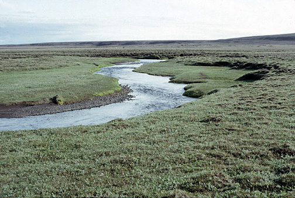

Title: Handklæði eða handalögmál? Hugleiðing um landnotkun
Slug: handklaedi-eda-handaloegmal-hugleiding-um-landnotkun
Date: 2007-11-27 10:27:00
UID: 198
Lang: is
Author: Baldur Garðarsson
Author URL: 
Category: Umhverfismál, Siðfræði
Tags: 

Hart er nú tekist á um nýtingu náttúruauðlinda og sýnist sitt hverjum. Það er ekki nýtt. Á hinn bóginn virðist óljóst hver eigi að taka ákvarðanir um landnotkun. Ríkisstjórnin stofnaði Landsvirkjun á sínum tíma í því skyni að afla orku til stóriðju. Landsvirkjun starfar eftir lögum, sem um hana gilda, en nú er svo komið að flestallar ákvarðanir er varða orkuþörf  eru teknar á sveitarstjórnarstigi, sem þýðir að viðkomandi stóriðjufyrirtæki þurfa að semja við Landsvirkjun eða önnur orkufyrirtæki um orkukaup. Orkufyrirtækjunum hefur verið legið á hálsi fyrir að fara offari í orkuöflun, á kostnað bænda og landeigenda, enda er megnið af landi á Íslandi í einkaeign, a.m.k. á láglendi. Landsvirkjun hefur t.d. haft þann hátt á að velja sér bújarðir til að  reisa á þeim virkjunarmannvirki, án þess að semja fyrst við eigendur jarðanna. Hún hefur mætt snemma morguns og valið sér besta sólbekkinn og sett á hann handklæði, ef tekin er samlíking úr ferðamannageiranum. Bekkurinn er þar með frátekinn. Nánar verður fjallað um þetta handklæðaherbragð í síðari hluta greinarinnarí samhengi við umræðu um skyldur við komandi kynslóðir.

Hér á eftir mun ég reifa þau sjónarmið sem helst einkenna umræður og deilur um landnotkun, greina þá hugmyndafræði sem að baki þeim liggur og spyrja hvort hægt sé að sætta þau.

Helstu sjónarhorn þeirra sem um málið deila eru eftirfarandi:

* **A**: Lagaleg hlið. Þróun mála hefur verið á þann veg að sveitarfélög ákveða nýtingu. M.a. stafar það af innleiðingu alþjóðasamninga og reglugerða frá ESB. Stuðst er við svonefnda nálægðarreglu, sem felst í því að íbúar á landnýtingarsvæði hafi ákvörðunarvald. Horfið hefur verið frá því að ríkisstofnanir eða ráðherrar hafi ákvörðunarvald, sem torveldar að mínu mati heildarskipulagningu og stuðlar að handahófskenndum ákvörðunum, en þannig virkar lýðræðið.

* **B**: Pólitísk hlið. Hægri flokkar eru gjarnari á að fórna landi fyrir hagnað, vinstri flokkar gjarnari á að vernda land ósnortið, miðflokkar vega kosti og meta.

* **C**: Siðferðileg hlið. Þrjár meginstefnur eru uppi hvað siðferðileg spursmál varðar: mannhverf sjónarmið, þar sem maðurinn og þarfir hans ráða, lífhverf sjónarmið, þar sem dýr og plöntur hafa vægi umfram fjárhagslegan gróða, og að lokum visthverf sjónarmið, þar sem hagur heilu vistkerfanna er settur í öndvegi.

* **D**: Fagurfræðileg hlið. Sumir vilja vernda landsvæði óbreytt eða friða (náttúruvernd) aðrir vilja breyta náttúru og gera hana fegurri (umhverfisvernd), t.d. með uppgræðslu, trjárækt eða öðrum breytingum.  Þeir fyrrnefndu hafa verið kallaðir “svartir” náttúruverndarsinnar en hinir síðarnefndu “grænir”. 

* **E**: Félagsleg- og hagfræðileg hlið. Sumir vilja fjölga ferðamönnum (aðallega í hagnaðarskyni), aðrir vilja leggja landið undir miðlunarlón (einnig í hagnaðarskyni), enn aðrir vilja auka búskap og minnka ágang ferðamanna og/eða orkusölumanna. 

* **F**: Sagnfræði- og fornleifafræðileg hlið. Samkvæmt lögum er bannað að hrófla við fornminjum og miklar hömlur á nýtingu lands, án þess að gengið sé úr skugga um að fornminjar tapist ekki.

* **G**: Veðurfræðileg hlið. Vanmetið atriði. Breyting á landslagi og stór mannvirki geta breytt staðbundnu veðurfari.

Nú má spyrja hvort landvernd og landnotkun séu ekki í raun ósættanleg sjónarmið. Í raun er svar við því já, enda verða menn ætíð að fórna einhverjum landgæðum fyrir nýtingu lands, svo sem vegna orkuöflunar, byggðar, vegagerðar o.s.frv.  Greina má umræðuna í þessi aðalatriði:

* Sem rök fyrir því að við íslendingar virkjum vatnsafl og jarðvarma umfram eigin þarfir eru oft talað um að við höfum skyldur við aðrar þjóðir vegna þess að við getum framleitt hreinni orku en flestir aðrir. Global ethics nefnist sú fræðigrein, sem fjallar m.a. um slíkar skyldur. Þessu sjónarmiði eru ekki allir sammála. Bent hefur verið á að þó að öll virkanleg orka á íslandi væri virkjuð, væri það svo lítið prósenta af orkuþörf heimsins, að það væri vart mælanlegt. Spyrja má hvort okkur væri ekki nær að huga að eigin þörfum og hlúa að lítilmögnum hérlendis, áður en við förum að bjarga heiminum. 

* Sjálfbær þróun er einskonar slagorð, sem heyrist oft, og í því felst  að okkar kynslóð beri að skila landinu í sama ástandi eða helst betra,  en að hún tók við því. Rætt er um skyldur við afkomendur okkar. Um þetta er deilt, m.a. vegna þess að til þess að hafa skyldur við einhvern, þarf viðkomandi aðili helst að hafa gert við okkur tvíhliða samning. Í þessu sambandi má benda á hugmyndir John Rawls um réttlæti og kenningar Thomas Hobbes um þjóðfélagssáttmála, en samkvæmt þeim virðist vera skilyrði fyrir skyldum að viðsemjandinn sé a.m.k til! Bent hefur verið á að kynslóðin, sem fædd verður haustið 2008 og síðar er eingöngu hugtak, því getnaður hefur enn ekki farið fram og ekki er einu sinni víst af hvaða foreldrum hún muni fæðast. Fræðilega séð geti viðkoma brugðist eins og t.d. hjá loðnunni, eða að mannkynið  verði hreinlega  liðið undir lok fyrr, þó að það sé reyndar afskaplega ólíklegt.

  Jón Steinar Gunnlaugsson lögmaður hefur m.a. varpað fram þeirri spurningu hvort huglægir samningar milli manna, sem aldrei hittast né hafi önnur samskipti séu nokkrir samningar. Nefnir hann sem dæmi að hótelgestir á Spáni setji handklæði á sólbekki til að eigna sér þá, og telji að aðrir gestir samþykki það oftast sem einskonar samning um yfirráðarétt, jafnvel þó að þeir hittist aldrei. Þetta er þá einskonar þegjandi samkomulag, sem flestir eða allir virði, án þess að hafa nokkurntímann svo mikið sem leitt hugann að því af hverju þeir gera það.  Hann telur mikinn vafa leika á að slíkur “samningur” haldi ef á reynir, væntanlega bæði vegna þess að hann er ekki skriflegur (og ekki einu sinni munnlegur) og einnig vegna þess að hann hyglar sumum, en útilokar aðra. M.ö.o. þetta fyrirkomulag eykur misrétti í þjóðfélaginu og grefur undan jafnræði. Sá sem setur handklæðið á bekkinn er að ráðskast með annað fólk, sem hann þekkir ekkert, auk þess að skapa fordæmi, sem aðrir apa hugsunarlaust eftir. Erum við á sama hátt að ráðskast með kynslóðir framtíðarinnar með því að breiða handklæði á ár og dali landsins okkar?

* Hafa menn skyldur við þau dýr, sem á viðkomandi svæði búa? Hér má nefna dæmi um fugla, sem hrekjast af hreiðrum, villt spendýr (t.d. mýs) og margt fleira. Siðspekingar á borð við Peter Singer og Tom Regan telja svo vera. Þá má spyrja sömu spurninga varðandi plöntur á viðkomandi svæði. Sumar tegundir þeirra eru í útrýmingarhættu, aðrar e.t.v. óuppgötvaðar. Eiga þær t.d. einhvern “rétt” á að fá að verða uppgötvaðar af mönnum, í stað þess að verða útrýmt?

* Er verið að fórna leyndum verðmætum? Víða eru t.d. möguleikar til vatnstöku rýrðir, annað hvort með mengun, breytingu á grunnvatnsstöðu eða breytingu á vatnsrennsli.

* Er verið að auka hættu á almannavá? Þekkt fyrirbæri er t.d. að þungi miðlunarlóna getur þrýst jarðskorpu niður með þeim afleiðingum að vatn eða hraunkvika brjóti sér leið upp annarsstaðar. Þetta virðist t.d. ætla að verða reyndin við Kárahnjúka.

Varðandi þá spurningu, hver eigi að ákveða landlýtingu, er rétt að nefna hugmyndir Ragnars Árnasonar prófessors. Á ráðstefnu um landnýtingu fyrir nokkrum árum birti hann hugleiðingar sínar, sem voru í stuttu máli á þann veg að hvorki ríkisvaldi né heimamönnum væri í raun reystandi til þessa. Ríkisvald væri of svifaseint, fjarlægt og ópersónulegt til þess arna, heimamenn væru hins vegar of tækifærissinnaðir, þröngsýnir og yfirsýnarlausir. Ég minnist þess ekki að hann hafi tiltekið neina aðra aðila til þess bæra, en samkvæmt hans niðurstöðu virðist málið vera í slæmum farvegi nú um stundir. 

Þá er ógetið þáttar náttúruverndarsamtaka og frjálsra félagasamtaka varðandi þessi mál. Þau eru máttlaus, enda óvíst hvort  þau eru  “aðilar máls” eins og það heitir á lögfræðimáli. Úrskurðarnefd í skipulags- og byggingarmálum virðist a.m.k. ekki telja að svo sé varðandi efnistöku úr Ingólfsfjalli, þar sem leyfi var veitt til 15 ára til að breyta ásýnd fjallsins óafturkræft, þrátt fyrir mótmæli Landverndar. Virðist augljóst að grundvellinum er þar með kippt að mestu undan tilvist slíkra samtaka, ef þeim koma landnýting og einstakar framkvæmdir ekki við.  

Ég sé annars ekkert sem bendir til þess að sættir séu í sjónmáli í stórum málum á þessu sviði. Virkjanir á Hellisheiði, stíflur í Þjórsá, malarnám í Faxaflóa og fleiri framkvæmdir eru afar umdeildar. Hver á að eiga lokaorðið? Væri ekki ráð að skipa sérstakan sáttasemjara til að setja niður deilur í þessum málaflokki áður en til harðari átaka kemur?

