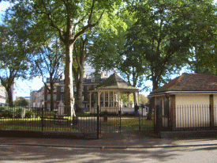

Title: Heilsusálfræði í City University í London
Subtitle: Tilviljanakennd ákvörðun um mastersnám
Slug: heilsusalfraedi-i-city-university-i-london
Date: 2006-02-16 00:07:00
UID: 45
Lang: is
Author: Þórdís Jónsdóttir
Author URL: 
Category: Póstur að utan, Sálfræði
Tags: 

Ef einhverjir kannast við að langa í mastersnám en vera ekki viss um hverskonar nám, hvert, hvenær og hvernig — þá geta þeir sömu ímyndað sér hvernig mér leið þau fjögur ár sem ég vann eftir að hafa lokið BA-prófi í sálfræði frá Háskóla Íslands. Í sálfræði, sem öðrum námsgreinum, eru endalausir sérhæfingarmöguleikar og margt opið. Auðvelt er að týna sér í valkvíða og almennri vitleysu við ákvarðanatökuna. Frumskógur umsókna er á netinu. Óskiljanlegar heimasíður bjóða uppá alla valmöguleika nema þann sem þú leitar að og fólk er tilbúið að kynna þér allar hliðar málsins — stefnur kennara, ritsigrar þeirra í fræðiritum, o.s.frv.

Svo kemur að því að maður þarf að láta slag standa. Þannig var vel ígrunduðum og vandlega athuguðum plönum kastað til hliðar og stefnan tekin á mastersnám í Heilsusálfræði í City University í London. Ég gæti rökstutt val mitt nokkuð gáfulega svona eftirá, en í hreinskilni var bara komið nóg af vangaveltum og eitthvað varð að gera. Heilsusálfræði og London skildi það vera. Ef einhver er að huga að námi og langar að fá frí frá vinum og ættingum af Íslandinu góða er London engan veginn rétti staðurinn, þar sem varla líður sú helgi sem einhverjum dettur ekki í hug að koma í heimsókn. En það getur sem betur fer líka verið kostur og hér er afskaplega erfitt að láta sér leiðast. Fyrir utan troðnar neðanjarðarlestir, pöbbalokanir klukkan ellefu og vöntun á sjó. 

Í City University eru um 12.000 nemendur og yfir 1.200 kennarar. Skólinn er í City, fjármálahverfi Lundúnarborgar, og nokkuð nálægt miðbænum. Maður verður ekki mjög var við alla þessa nemendur eða kennara en öll félagsvísindi eru í sérstakri byggingu sem er glæný og búin öllum nýjustu tækjum. Verandi smárómantíker í hjarta var ég nú helst að vonast eftir gamalli skólabyggingu sem hefði endalausa visku í hverjum vegg. Þegar ég minntist á þetta sögðu kennarnarnir mér að kvarta ekki því fyrir tveimur árum hefði sálfræðin verið í byggingu sem var að hruni komin þar sem mýs spókuðu sig á meðal nemenda. Öll aðstaða er því mjög góð, þótt bókasafnið mætti vera huggulegra, en bóka- og greinakostur þó góður — sem skiptir nú meiru. 

Heilsusálfræði er undirgrein í sálfræði. Hún snýst um að beita sálfræðikenningum, -aðferðum og -rannsóknum við forvarnir, til að viðhalda góðri heilsu, við greiningu sálrænna þátta líkamlegra sjúkdóma og fatlana, við þróun umbóta í heilbrigðiskerfinu og við mótun heilbrigðisstefnu. Heilsusálfræði í City viðhefur svokallaða “krítíska“ áherslu sem felst í endurskoðaðri stöðu greinarinnar. Spurt er spurninga á borð við: hvort rétt sé að líta á heilsusálfræðina sem undirgrein; og hvort nota eigi sömu kenningar og í almennri sálfræði? Ennfremur: hvað er heilsa; og hvernig er best að skilgreina hana? Er rétt aðskilja sál og líkama og er rétt að læknar meðhöndli eitt en sálfræðingar og geðlæknar annað? Námið er því heimspekilegra og pólitískara en ég bjóst við en það kom mér skemmtilega á óvart. Það er heimspekilegra að því leyti að mikið er staldrað við grunnhugmyndir hluta. Af hverju lítum við á hlutina eins og við gerum; hvaðan koma þessar hugmyndir; og eru þær réttar? Námið er pólitískara á þann hátt að ábyrgðin er talin vera fræðimannanna. Þeir eiga að skila rannsóknum sem sýna óviðunandi ástand mála í samfélaginu og reyna þannig að hafa áhrif á mótun heilbrigðisstefnu stjórnvalda. Áherslan fer auðvitað eftir kennurum en reynt er að sjá til þess að við nemendur kynnumst öllum hliðum og getum þá sjálf dæmt um hvað okkur finnst gáfulegast. 

Kennararnir eru mjög góðir og það sem er einna skemmtilegast er hversu góðan aðgang maður hefur að þeim. Allir fá sinn “leiðbeinanda“ sem þeir geta leitað til með hvað sem er. Maður hefur meira að segja laumað inn einni og einni “tilvistarkreppu-spurningu“, bara svona af því að maður veit að sumir kennararnir eru háttvirtir sálfræðingar sem rukka jafnvel 20.000 kr. á tímann!  Mér hefur reiknast til að ef ég mæti reglulega í viðtalstíma er ég í raun aðeins að vinna uppá móti því hversu há skólagjöldin eru hér. Því verður nefnilega ekki neitað að það er dýrt að fara í nám í Bretlandi. Það er því eðlilegt að flestir velji Norðurlöndin, en einhverra hluta vegna vildi ég frekar fara þessa leið. Kennsluformið hér er mjög skemmtilegt. Kennarar eru meðvitaðir um að dagslangir fyrirlestrar skila ekki endilega miklu og því eru tímarnir brotnir upp með ýmsum hætti og allir verða að taka þátt. Á föstudögum eru tímar jafnvel kláraðir á pöbbnum og skemmtilegar umræður geta myndast. 

Ég var ánægð með námið í Háskóla Íslands og finnst ég koma vel undirbúin frá því. Ég get ekki borið það nám sem ég stunda hér saman við Cand.psyc námið heima, en mér skilst að fólk sé almennt ánægt í því. Námið hér er eins árs mastersnám og því svolítið stíft prógramm. En þar sem kennararnir veita gott aðhald og byrjað er að vinna að lokaritgerðinni mjög snemma er þetta bara skemmtileg upplifun. Ég var búin að heyra nokkuð svartar lýsingar á mastersnámi í Englandi, andvökunætur og stanslausan lærdóm með ullarvettlinga vegna kulda o.s.frv. Enn sem komið er (nú á minni seinni önn) hefur þetta verið stórskemmtileg upplifun. Nemendaflóran er einstök. Hér er fólk frá Grikklandi, Bosníu-Hersegóvínu, Kanada, Póllandi, Egyptalandi og Kína svo dæmi sé tekið. Maður lærir ekkert minna af þeim en kennurunum og þeir eru líka duglegir að nota hópverkefni og láta okkur rökræða um hin ýmsu mál. Stundum situr allt fast vegna mismunandi hugmyndafræði, en einmitt það getur verið svo gaman.  

Ég verð að viðurkenna að ég er enn að átta mig á hvað heilsusálfræði er, enda síbreytileg fræði og kannski einna best að vera alltaf leitandi að sannleikanum hvað það varðar. Námið hefur fyllilega staðið undir væntingum. En er það peninganna virði; og mun það veita mér einhver réttindi heima? Maður verður sennilega að vinna í því öllu saman en stundum er bara nauðsynlegt að drífa sig af stað. Ég held að maður sjái sjaldnast eftir því.

