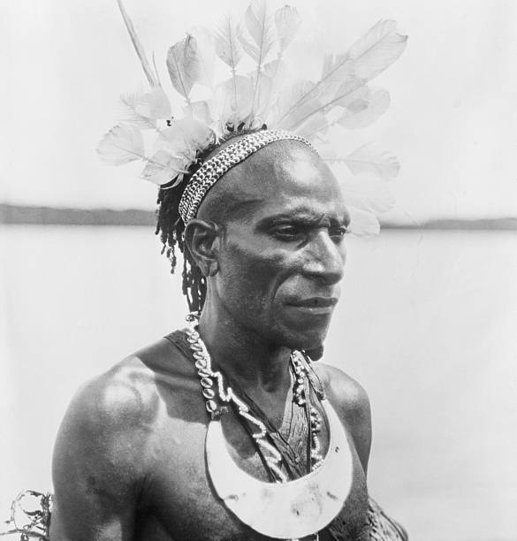

Title: Hið siðmenntaða mannát
Slug: hid-sidmenntada-mannat
Date: 2005-11-10 01:55:00
UID: 14
Lang: is
Author: Katla Ísaksdóttir
Author URL: 
Category: Mannfræði
Tags: Mannát, Papúa Nýja Gínea, Paul Sillitoe, Wamiri, Daribi, Bronislaw Malinowski, Tróbrínadeyja, dauði, Annette B. Weiner, Hafdís Ingadóttir, Bimin Kuskusmin, Fitz J. Porter Poole, Marshall Sahlin

Eftir að ég byrjaði að fræðast um mannát í mannfræðilegum skilningi opnuðust mér dyr inn í  dularfullan heim. Svo virtist sem ekkert gæti maður vitað fyrir víst um eðli þessa fyrirbæris. Var það einungis byggt á þjóðsögum og ummælum evrópskra landkönnuða um „villimennina“ í hinum nýfundnu heimsálfum eða átti það við einhver rök að styðjast í raunveruleikanum? Er ég byrjaði að grennslast fyrir kom í ljós að mannát tengist í langflestum tilvikum hinum ýmsu ritúölum og hefðum samfélaga. Hér ætla ég að einblína á sögusagnir af mannáti í Eyjaálfu og þá helst á Papúa Nýju Gíneu þar sem sögur um mannát lifa enn í minni innfæddra.

Sumir fræðimenn hafa haldið því fram að ástæða mannáts geti verið einhverskonar næringarfræðileg nauðsyn. Það er að mannakjöt færi fólkinu nauðsynleg prótein (gastronomic cannibalism). Breski mannfræðingurinn Paul Sillitoe hrakti hins vegar þessa tilgátu með því að benda á tilvist ættbálka sem nærast almennt á próteinríku kjöti, en stunda jafnframt mannát. Aðrir ættbálkar nærast nánast eingöngu á grænmeti, en leggja þó ekki mannakjöt sér til munns.[^1]  Á þennan hátt má færa rök fyrir því að mannát innan ættbálka Papúa Nýju Gíneu eigi sér almennt trúarlegar eða andlegar skýringar.

Wamira fólk á Papúa Nýju Gíneu heldur því fram að fyrir komu Evrópubúa hafi mannakjöt verið ein aðaluppistaða kjötneyslu þeirra, auk villisvína, kengúra, ýmissa lítilla pokadýra og fugla.[^2] Nú á dögum gerir Wamiri fólk góðlátlegt grín af þessum fornu siðum sínum. Þó að ekki sé mögulegt að sanna að mannát hafi nokkurn tíma verið stundað, er það engu að síður mikilvægur hluti af sjálfs- og heimsmynd Wamiri fólks í gegnum þjóðsögur og mýtur um forfeðurna.

Daribi ættflokkurinn í hálendi Papúa Nýju Gíneu er talinn hafa stundað mannát innan ættflokksins (endocannibalism), í tengslum við greftrunarsiði. Það giltu þó strangar reglur um hver mátti borða hvern. Börn, ungt fólk og ógiftir máttu venjulega ekki neyta mannakjötsins. Einungis fullorðnir voru étnir og máttu éta aðra. Venjulega átu meðlimir kjarnafjölskyldu ekki hvern annan. Leyfilegt var að éta föðurbræður sína og fjölskyldur þeirra, auk sinna eigin bræðra og barna þeirra. Hins vegar máttu karlar hvorki éta konu sínar né konur bræðra sinna. Reglurnar um hver mætti borða hvern virðast hafa byggst á því hverjir deildu kjöti með hverjum og hverjir gáfu hverjum kjöt.[^3]

Í mannfræðilegri rannsókn Bronislaw Malinowskis á íbúum Tróbríandeyja í Papúa Nýju Gíneu, minnist hann á mannát í tengslum við jarðarfararsiði.[^4] Þegar dauðinn nálgaðist fylltist kofi hins dauðvona af fjölskyldu og ættmennum. Konurnar byrjuðu að æpa á melódískan hátt. Næstu daga og vikur hljómuðu óp fólksins í þorpinu líkt og mótmæli við dauðanum. Þegar líkið hafði verið þvegið og fótleggir þess bundnir saman, var það lagt á hné kvenna sem sátu í röð. Eiginkona hins látna sat undir höfði hans. Konurnar struku hinum látna blíðlega, og hreyfðu hann í takt við ópin. Fyrir utan kofann dönsuðu aðrar konur taktfastan dans á meðan synir hins látna grófu gröf hans. Líkið var því næst lagt í gröfina og ofan á það lag af greinum og plöntum. Þar lagðist ekkjan til að vaka yfir þeim látna um nóttina. Þorpsbúar stóðu í kringum gröfina og ýmist æptu eða sungu.

Daginn eftir var líkið grafið upp og grennslast fyrir um hvort galdrar höfðu átt sér stað. Því næst fjarlægðu synir hins látna eitthvað af beinum hans úr líkamanum. Þeir sugu síðan beinin til að fjarlægja af þeim kjötið. Þessi athöfn þótti viðbjóðsleg af þeim sem framkvæmdu hana, en þeir urðu að varast að sýna nokkur viðbrögð. Blendnar tilfinningar fylgdu þessum sið. Margir litu svo á að þetta væri leið til að halda eftir hluta af þeim látna á meðal fólksins. Öðrum þótti þetta vera skinhelg borgun sona þess látna við föður sinn eftir allt sem hann gerði fyrir þá í lifanda lífi. Tróbríandar færðu ýmis rök fyrir Malinowski um þessa hefð sína: „Við erum sorgmæddir vegna mannsins sem fæddi okkur. Við sjúgum bein hans líkt og matinn sem hann færði okkur“[^5]. Beinin voru meðal annars notuð sem minjagripir og héngu oft um háls skyldmenna þess látna. Malinowski segist oft hafa orðið vitni að þessum jarðarförum. Það er erfitt að átta sig á hvort það sama hafi átt við þegar konur eða börn dóu.

Annette B. Weiner gerði rannsókn á Tróbríandeyjum árin 1971 og 1972.[^6]  Lýsing hennar á jarðarfararritúölum Tróbríanda er nánast sú sama og sú sem Malinowski skrifaði um 40 árum fyrr. Þó minnst Weiner ekki einu orði á að lík hafi verið grafin upp og beinin sogin. Svo virðist sem sá siður hafi horfið í gegnum árin, en þó þykir mér undarlegt að ættbálkurinn skuli ekki hafa minnst á þennan forna sið sinn, né Weiner lagt fram spurningar um hann í tengslum við rannsókn Malinowskis.

Í BA-ritgerð sinni, „„Við“ og „hinir“: um mannfræði og mannætur“, vitnar Hafdís Ingadóttir í umfjöllun Fitz J. Porter Poole um Bimin Kuskusmin-fólk á Papúa Nýju Gíneu, en sá ættbálkur stundaði mannát í tengslum við greftrunarsiði. Táknræn merking var lögð í mismunandi hliðar mannáts. Talið var að ef karl neytti „kvenlegra efna“ væri það til að auka frjósemi dætra hans. Neytti hann hins vegar líkamsefna úr látnum karli var það í „virðingarskyni … [og] til að tryggja honum greiða leið inn í heim forfeðranna og til þess að tryggja viðhald ættarinnar.“[^7]  Ef kona neytti efna úr látinni kynsystur sinni var það til þess að viðhalda frjósemi sinni, en karllegra efna til þess að auka frjósemi sína. Líkt og í tilviki Tróbríanda, þótti Bimin Kuskusmin-fólki þessi athöfn fremur ógeðfelld, en stunduðu hana af trúarlegri skyldu í því skyni að viðhalda frjósemi og fjölgun innan hópsins.

Það virðist nær öruggt að halda því fram að mannát hafi í raun verið stundað. Bæði Poole og Malinowski segjast hafa orðið vitni að því og engin sjáanleg ástæða er til að draga orð þeirra í efa. Það er hins vegar spurning hvað það sé í samfélögum líkt og okkar, sem geri það að verkum að mannát sé álitið siðlaust fyrirbæri. „Mannætur“ eru almennt álitnar blóðþyrstir og illgjarnir „villimenn“. Ég vil þó helst forðast að nota hugtakið „mannæta“, þar sem mér þykir það hljóma líkt og megin tilgangur lífs þeirra sem fallið gætu undir þá skilgreiningu sé að éta menn. Í þeim tilfellum sem ég hef gert grein fyrir hér að ofan er mannátið alltaf byggt á öðrum fyrirbærum. Þannig vil ég taka undir orð bandaríska mannfræðingsins Marshall Sahlins um að „mannát [sé] ávallt hluti af öðrum hugmyndum eða í tengslum við þær og er því hugmyndin um mannát sjaldnast ástæða fyrir hinu raunverulega mannáti.“[^8]

---

<small class="blurb">Þess má geta að nýstofnað er á Íslandi félag mannætna: [MaÍs.](http://www.andskotinn.com/)</small>

[^1]: Sillitoe, Paul. (1998). An Introduction of the Anthropology of Melanesia: Culture and Tradition. Cambridge University Press. Cambridge.
[^2]: Kahn, Miriam. (1986). Always hungry, never greedy: food and the expression of gender in a Melanesian society. Cambridge University Press. Cambridge.
[^3]: Wagner, Roy. (1967). The Curse of Souw: Priciples of Daribi Clan Definition and Alliance. The University of Chicago  Press, Chicago & London.
[^4]: Malinowski, Bronislaw. (1929). The Sexual Life of Savages in North-Western Melanesia. Eugenics Publishing Company. New York.
[^5]: Malinowski, Bronislaw. (1929). The Sexual Life of Savages in North-Western Melanesia. Eugenics Publishing Company. New York, bls. 156.
[^6]: Weiner, Annette B. (1988). The Trobrianders of Papua New Guinea. Holt, Rinehart and Winston, Inc. Orlando, Florida.
[^7]: Hafdís Ingadóttir. (1994). „„Við“ og „hinir“: um mannfræði og mannætur“ B.A. ritgerð mannfræði nr. 851 við Háskóla Íslands. Leiðbeinandi: Jóhanna K. Eyjólfsdóttir, bls. 20.
[^8]:  Tilvitnað í Hafdís Ingadóttir. (1994). „„Við“ og „hinir“: um mannfræði og mannætur“, bls. 20.
