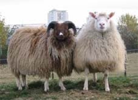
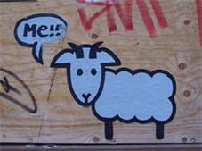

Title: Hin íslenska Þjóðerniskind
Slug: hin-islenska-thjoderniskind
Date: 2005-10-20 08:11:00
UID: 7
Lang: is
Author: Helga Tryggvadóttir
Author URL: 
Category: Menningarfræði
Tags: þjóðernishyggja, þjóðerni, náttúra, tákn, kind

Einn mikilvægur þáttur þjóðernishyggju, hvort sem er á Íslandi eða annars staðar, eru táknin sem eru fundin fyrir þjóðina. Þessi tákn eru þó ósjálfrátt í sífelldri endurskoðun í takt við það sem breytist í samfélaginu. Eitt af táknum íslenskrar þjóðernishyggju er hin hreina og óspillta náttúra Íslands sem Íslendingar eru mjög stoltir af. Hún er gjarnan sögð hafa mótað þjóðarsálina og menninguna í gegn um aldirnar. En eins og náttúran hafa hin „upprunalegu“ íslensku dýr líka orðið að þjóðartákni, þá sérstaklega hesturinn og sauðkindin, en einnig verður landnámshænan sífellt vinsælli. Hér ætla ég að tala um íslensku kindina sem þjóðernistákn.

Af hinum margrómuðu íslensku húsdýrum sem Íslendingar virðast telja öllum dýrum fremri hvað varðar hæfileika, bragðgæði og mjólkurgæði, þá er íslenska sauðkindin það dýr sem flestir hafa skoðun á. Bragðgæði lambaketsins íslenska eru talin bera af sambærilegu keti af erlendum skjátum. Margir álíta ástæðu þess vera það frjálsræði sem sauðkindin hefur sumarlangt upp til fjalla í stað þess að vera geymd í beitarhólfum á láglendi. Þarna er náttúran talin skapa alveg einstakt ket, rétt eins og hún skapaði einstaka menningu og þjóð. Íslendingar eru einnig álitnir hafa sömu einkenni og sauðkindin, vera sjálfstæðir og harðgerir. Þessi einkenni eru Íslendingar taldir öðlast af sömu ástæðum og sauðkindin, þ.e vegna hins frjálslega uppeldis og af því að íslensk börn geti leikið sér óáreitt úti við, ólíkt erlendum börnum sem þurfa að leika sér inni við eða undir eftirliti foreldra sinna. Kannski ekki ólíkt þarlendu sauðfé sem er lokað inni í beitarhólfum? Íslenskt lambakjöt er markaðsett erlendis sem hreint og ómengað og erlendir framámenn í veitingahúsarekstri eru dregnir hingað til lands í þeim tilgangi að láta þá fylgjast með smölun og réttum, til þess að þeir geti séð með eigin augum leið lambsins frá fjalli og ofan í maga.

Sauðkindin sem þjóðernistákn hefur verið að sækja í sig veðrið á undanförnum árum, ef til vill í jöfnu hlutfalli við fækkun fjár, því á meðan meira var til af henni var hún mun umdeildari skepna. Fyrir um það bil fimmtán árum var hún ýmist talin hinn mesti skaðvaldur sem á endanum myndi éta undan okkur skerið, eða hafin upp til skýjanna sem bjargvætturinn í grasinu, hvurrar ket og ull hafði haldið á okkur hita og fitu í harðræði fyrri alda. En þessi erfiðu lífsskilyrði, hungur og vosbúð eru einmitt oft talin hafa skapað íslensku þjóðina eins og hún er í dag.  Á síðustu árum heyrist mér að báðar þessar raddir hafi hljóðnað og að kindin sé komin á traustari stall. Ímynd kindarinnar hefur gengið í endurnýjun lífdaga og nú er hún orðin tískufyrirbæri -  tákni fyrir hinn eilítið lúðalega en þó mjög svo töff stíl sem Íslendingar hafa reynt að skapa sér á alþjóðavettvangi. Þetta má telja hina nýju íslensku þjóðernisvitund sem að birtist í erlendum blöðum og listalífi landans. Önnur tákn þessa nýja stíls eru til dæmis tónlistarmenn sem hafa náð að skapa sér nafn erlendis, ekki síst Sigur Rós og Björk, en einnig fleiri. Lopapeysur eru líka ágætis dæmi um upprisu kindarinnar þar sem að þær eru orðnar ein heitasta og dýrasta tískuflíkin í dag. Fyrir tíu árum var fátt jafn ótrúlega hallærislegt og að ganga í lopapeysum (lopapeysulúðar heyrðist þá um einhverjar furðulegar listaspírur sem datt það í hug). Nokkrum árum síðar var það komið í tísku meðal ákveðins hóps fólks, ef til vill í kjölfar vinsælda Sigur Rósar sem gjarnan sáust íklæddir kollhúfum úr lopa. Þá voru það helst þeir aðilar sem töldust vinstrisinnaðir, listamenn, eða fólk sem kynnti sér félagsvísindi eður sambærileg fög, sem voru álitnir skrýðast slíkum flíkum. Nú í ár er lopapeysan, eins og áður sagði, orðin ein allra vinsælasta tískuflík landans, og þá gjarnan aðsniðin og með rennilás, til þess að fylgja tískustraumnum.

En sauðkindin, sem hið nýja íslenska þjóðartákn, birtist ekki einungis í lambakjöti og lopapeysum, heldur hefur hún líka orðið að tákni í eigin persónu þar sem hún hefur verið „poppuð“ upp á gamansaman hátt. Þannig birtist hún til að mynda í lógói búðarinnar Ósóma, þar sem spilað er með málið í slagorðum á borð við: „be kind“ og „me!“, sem að sjálfsögðu útlegst mismunandi á ensku og íslensku. Annað dæmi er mynd sem sést víða af „the icelandic killer sheep“,  og í grein sem birtist um hana í 3.tbl Grapevine árið 2003, þar er hinni íslensku drápskind lýst á gamansaman hátt og birtist sauðkindin þá í enn nýjum búningi.

Ein umdeildasta skepna landsins er því orðin tískufyrirbæri, fyndin, nýtískuleg og talandi á enska tungu. Tákn hinnar nýju ímyndar Íslands. Hún hefur breyst frá því að vera sveitó og lúðaleg í það að vera „töff“, rétt eins og þjóðin. Þessi þróun sauðkindarinnar sem þjóðernistákns er í rökréttu samhengi við önnur þjóðernistákn sem gjarnan eru fundin upp til sveita, í „rótgróinni“ menningu, og svo staðfærð og breytt samkvæmt kröfum nútímans.

---

<small class="blurb">Fyrir þá sem hafa áhuga á að lesa meira efni af þessu tagi er bent á grein Unnar Birnu Karlsdóttur <cite>Maður íslenskur: Hugmyndir á fyrri hluta 20. aldar um samband íslensks þjóðernis og kynþáttar.</cite> er birtist í ritinu _Þjóðerni í þúsund ár?_ sem út kom hjá Háskólaútgáfunni árið 2003.</small>
