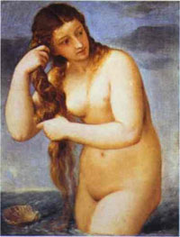

Title: Hin kynlausa kona
Slug: hin-kynlausa-kona
Date: 2006-01-31 11:56:00
UID: 39
Lang: is
Author: Katla Ísaksdóttir
Author URL: 
Category: Kynjafræði, Menningarfræði
Tags: 

Í gegnum aldirnar hefur verið litið á kynhvatir kvenna (female sexuality) sem dularfullt og jafnvel óútskýranlegt fyrirbæri. Í bók sinni; _Promiscuities: A Secret History of Female Desire_, greinir Naomi Wolf,[^1] frá sögu viðhorfa til kynferðislegra nautna kvenna allt frá því að snípurinn var fyrst „fundinn“ árið 1559.[^2] Wolf greinir frá hvernig réttur kvenna til að njóta kynlífs var viðurkenndur í hinum vestræna heimi næstu þrjár aldirnar, eða fram að lokum 18. aldar. Þá byrjaði einhverra hluta vegna að þykja ósæmilegt fyrir konur að hafa kynferðislegar langanir. Góðar konur voru einungis settar í samhengi við blíðu og ástúð. Ýmsar kenningar gengu svo langt að neita alfarið tilvist kynhvatar í líffræði kvenna. Hin fullkomna kona var kynlaus. Hún átti eingöngu að stunda kynlíf til þess að eignast börn og gera maka sínum til geðs. Kynleysi kvenna á 19. öld var meira en bara mýta. Það samsamaðist fullkomlega lífsháttum kvenna, þar sem glæsileiki átti að fela í sér sársauka. Kvenleiki fólst í því að vera veikburða og viðkvæm. Konur áttu að halda sig innandyra reyrðar í lífsstykki og láta líða yfir sig á nokkurra daga fresti. Hvað varðaði fátækar konur, höfðu slæm lífsskilyrði aukin áhrif á heilsu þeirra og þar með kynhvöt. Slæm heilsa kvenna á þessum tíma var í tísku og raunverulegur áhugi kvenna fyrir kynlífi hefur því eflaust verið lítill. Barnsburður var í kjölfarið sársaukafyllri en nokkru sinni fyrr, sem hefur vafalaust minnkað kynhvöt þeirra enn frekar. 

Wolf greinir frá því að það hafi ekki verið fyrr en árið 1896 að hugarfarsbylting varð í tengslum við kynhvatir kvenna. Þá var viðurkennt að hver kona væri einstök hvað varðaði kynhvatir sínar og að elskhugi hennar ætti að hjálpa henni að uppgötva hvernig best væri að fullnægja þeim. Þrátt fyrir að viðhorf væru byrjuð að mýkjast var ekki þar með sagt að konur væru öruggar í sambandi við kynlíf. Margar vissu ekki einu sinni hvað eða hvar snípurinn væri. Árið 1930 gaf breski kvensjúkdómalæknirinn Helena Wright út bókina _The Sex Factor in Marriage_. Þar komu fram leiðbeiningar fyrir konur um hvernig þær gætu kynnst líkama sínum og öðlast kynferðislega fullnægingu. Feministahreyfingar sjöundu og áttundu áratuganna boðuðu kvenfrelsi sem fólst í því að þekkja og hafa vald yfir eigin líkama. Konur voru hvattar til að taka sér spegil í hönd og grandskoða kynfæri sín. Á þann hátt áttu þær að komast að því hvernig þær gætu fullnægt eigin þörfum og löngunum. Þannig öðluðust þær bæði persónulegt og pólitískt sjálfsforræði. 

Það verður ekki hjá því komist að taka eftir hversu mikið kynferðislegt frelsi róttæka feministahreyfingin hafði í för með sér fyrir konur. Þær fengu „leyfi“ til þess að njóta kynlífs, og krefjast þess að fá að njóta þess. Konur voru orðnar kynferðislega frjálsar. Það virðist þó ekki sem sagan um baráttuna til frelsis endi eftir að frelsinu hafi verið komið á. Nú fara hlutirnir að snúast um hvernig frelsið sé nýtt. Hvað gerist þegar  konur fá skyndilega leyfi til að vera opinberlega kynferðislega virkar í kynferðislega karllægri menningu? 

Í bók Ariel Levy,[^3] _Chauvinist Pigs: Women and the Rise of Raunch Culture_[^4] er greint frá því hvernig klám og lauslæti er farið að þykja eftirsóknarvert og virðingarvert í nútíma samfélagi. Levy segir hina menningarlegu klámvæðingu sem hefur verið svo áberandi undanfarin ár vissulega eiga rætur að rekja til kynfrelsisbyltingar kvenna. Frelsið sem feministar boðuðu virðist þó hafa verið endurskilgreint allverulega í tengslum við poppmenningu og peninga. Markmið kvennabyltingar hippatímabilsins var að breyta samfélaginu í grundvallaratriðum, að kollvarpa feðraveldinu. Byltingin átti að eiga sér stað í hugum og svefnherbergjum fólks. Hvað varðaði kynlíf snerist byltingin um að auka unað og fullnægingu kvenna. Markaðsetning kynlífs snýst ekki um raunverulegan unað og fullnægingu kvenna. Hún snýst um peninga og völd. Levy greinir frá því hvernig það virðist sem konum sem vilja vera álitnar valdamiklar hafi fundist það árangursríkara að samsama sig karlmönnum[^5]  en að hækka allar kynsystur sínar til jafns við þá. Kvenfrelsisbaráttan á eflaust þátt í að konur vilji heldur líkjast karlmönnum en hinum veimiltítulegu, kynlausu formæðrum sínum.[^6] Upphaflega þótti klámið og opinskáa kynlífið móðgandi fyrir konur. Það þótti særa blygðunarkennd þeirra. Í dag er ekki óalgengt að talað sé um konur með blygðunarkennd sem þvingaðar þurrpíkur. Konur gangast þó ekki til liðs við klámvæðinguna með eigin unað og lífsfyllingu að markmiði. Í bók Levy tala þær um það sem leið til þess að finnast þær vera valdameiri. Þeim finnst þær öðlast vald með því að geta litið á kynlíf með „augum karlmanna“. Sem eitthvað sem þær „fara út og fá sér“. Þannig eru þær í senn eins og „karlmenn“ (eftir skilgreiningu kerfisins á karlmönnum), og eins og „karlmenn“ vilja að þær séu. Þar með leggjast þær í svaðið og sleikja tærnar á valdadjöflinum. 

Wolf veltir því fyrir sér að hvaða leyti það sé mikilvægt fyrir konur að kynna sér sögu viðhorfa til kynhvata þeirra. Hún bendir á að menning okkar kenni okkur að réttlæting á eigin unaði sé eitthvað „byltingarkennt“ og þar með ekki fæðingarréttur okkar, heldur eitthvað sem stendur í andstöðu við viðurkennd norm samfélags okkar. Hún vitnar í _Shere Hite_ (_The Hite Report_, 1976) sem talar um hvernig konur hafi aldrei verið spurðar hvað þeim fyndist um kynlíf. Vísindamenn hafi í gegn um aldirnar miklu frekar sagt konum hvernig þeim ætti að líða. Það hafi verið talið sjálfsagt að kynhvatir kvenna ættu að koma til móts við kynhvatir karla. Þrátt fyrir að mikið hafi verið skrifað um unaðsemdir kvenna höfðu fáar raunverulega heyrt um þær. Wolf gagnrýnir þá staðreynd að menning okkar skuli líta á kynferðislega nautn kvenna sem nýjung. Sem fyrirbæri fremur en sjálfsagðan hluta af eðli okkar sem lífvera.     

Hér að ofan hef ég fjallað um hvernig kvennabaráttan sem snerist upphaflega um að öðlast frelsi hefur með aðstoð kapítalismans byrjað að snúast um vald. Þá er ég ekki að tala um vald einstaklings eða einstaklinga yfir öðrum einstaklingum. Ég er ekki að tala um beina kúgun af höndum allra karlmanna á allar konur. Ég er að tala um alltumlykjandi félagslegt vald. Ég er að tala um hvernig menningarvefurinn[^7] sem við erum spunnin föst í er gegnumsýrður af óáþreifanlegu óréttlæti. Væri valdið ekki óáþreifanlegt væri það ekki lengur vald, því það hefði ekki sömu áhrif.[^8] Kerfið er ekki síður í heilum okkar en valdhafanna. Þannig leggjumst við öll á eitt við að viðhalda ríkjandi ástandi. Vald kerfisins yfir okkur felst í því að við reynum að komast hjá uppreisn þar sem hún krefðist of mikillar orku[9]. Við leitum annarra leiða til að lifa með því, og einfaldasta leiðin til þess að öðlast vald í heimi þar sem við fáum ekki hendur snertar á óréttlætinu er að ganga til liðs við það, því fljótt á litið virðast valkostirnir aðeins tveir. Að vera þátttakandi eða fórnarlamb. 

Þriðji kosturinn er að standa upp og berjast á móti, að vera frjáls á eigin forsendum og gefa skít í allt sem heitir vald, en það er kannski meira en að segja það eins gegnumsýrður og maður er af sjúkum viðmiðum. Ég vona þó að ég geti haldið því fram að við getum enn öðlast frelsi. Sama hvort við gerum það með því að rífa okkur upp á hnakkadrambinu og berjast við kerfið með húð og hári eða sitja heima daglangt við skammarlausa sjálfsfróun í öllum okkar fullnægjandi kvenleika.

[^1]: Naomi Wolf (1962) er fædd og uppalin í San Francisco. Hún lærði í Yale og New College, Oxford. Önnur verk eftir hana eru _The Beauty Myth_ (1990) og _Fire With Fire_. Bækur hennar fjalla allar um félagslegan veruleika kvenna. 

[^2]: Wolf, N. 1998. _Promiscuities: A Secret History of Female Desire_. London: Vintage. Bls. 151-161

[^3]: Ariel Levy er aðstoðarritstjóri  New York magazine. _Female Chauvinist Pigs_ er fyrsta bók hennar. 

[^4]: Levy, A. 2005. _Female Chauvinist Pigs: Women and the Rise of Raunch Culture_. New York: Free Press.

[^5]: Þegar ég tala um karlmenn í þessari grein á ég ekki við raunverulega karlmenn, heldur hugmyndina um  karlmenn, eða karlmennsku. Ég held að Levy sé á sama máli, þó að hún geti þess ekki sérstaklega í bók sinni. 

[^6]: Með því á ég vissulega ekki við að allar konur á þessum tíma hafi verið veimiltítur, heldur vísa ég í hugmyndina um konur frá þessum tíma. 

[^7]: Sjá hugmyndir Webers.

[^8]: Fyrir frekari umræðu um mikilvægi leyndar til að viðhalda valdi má skoða hugmyndir Foucault, t.d í _Alsæi, vald og þekking_, ritstjóri Garðar Baldvinsson, sem er úrval úr verkum Foucaults. Einnig: Bourdieu: _Outline of a Theory of Practice_. Þar er einnig umræða um vald innan habitusar einstaklinga.

[^9]: Sjá Ostrow, J.M. 2000. _Culture as a Fundamental Dimension of Experience: A Discussion of Pierre Bourdieu’s Theory of Human Habitus_.

[^10]: Hugmyndin að greininni kviknaði í kjölfar umræðu (m.a í Fréttablaðinu) eftir viðtal í Sirkus, þann 28.október 2005 við Brynju Björk.

