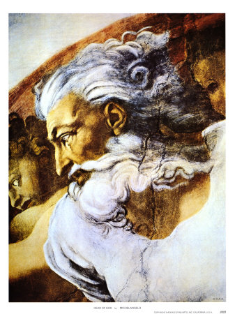

Title: Hin nýja heimsmynd kallar á nýjan Guð
Slug: hin-nyja-heimsmynd-kallar-a-nyjan-gud
Date: 2008-03-18 08:00:00
UID: 230
Lang: is
Author: Tinna Ásgeirsdóttir
Author URL: 
Category: 
Tags: 

William James (1842-1910) var bandarískur heimspekingur og sálfræðingur, frumkvöðull innan sálfræðinnar og einn af höfundum gagnsemishyggjunnar (pragmatism) innan heimspeki. Í greinum sínum _Is Life Worth Living?_ og _The Sentiment of Rationality_ lýsir James hugmyndum sínum um Guð og útskýrir hvaða hlutverki hann telji menn gegna í tilgangi lífsins.[^1] Hér er fjallað um hvernig James vill meina að hægt sé að laga trúarbrögðin að nýrri heimsmynd vísindanna, hvernig menn geta haft áhrif á örlög heimsins og það hvernig heimurinn getur öðlast tilgang.

Í greininni _Is Life Worth Living?_ lýsir James átroðningi vísindanna á trúna og trúarbrögðin og því hvernig og hvers vegna trúin lætur smátt og smátt undan trúnni á vísindin:

> Yet, on more intimate acquantaince, the visible surfaces of heaven and earth refuse to be brought by us into any intelligible unity at all. Every phenomenon that we would praise there exist cheek by jowl with some contrary phenomenon that cancels all its religious effect upon the mind. Beauty and hideousness, love and cruelty, life and death keep house together in an indissoluble partnership; and there gradually steals over us, instead of the old notion of a man-loving Deity, that of an awful power that neither hates nor loves, but rolls all things together meaninglessly to a common doom (1956:41).

James heldur því fram að þessar hugmyndir leiði af sér martraðarkennda sýn á lífið og valdi alvarlegu þunglyndi og eru þetta afleiðingarnar af því þegar reynt er að halda í tvær grundvallarskoðanir sem stangast á. Annars vegar hafa menn þá hugmynd að til sé lifandi Guð alheimsins og hins vegar að slíkur Guð birtist okkur í náttúrunni. James telur að þessi átök hafi þau áhrif að trúaður maður sem tekur vísindin alvarlega verði dapur og kvíðinn. Maðurinn hefur að mati James rótgróna trúarþörf sem segir honum að til sé Guð sem hann eigi að sýna hollustu.

Lausnin á þessum vanda segir James felast í því að menn hafni annarri hvorri hugmyndinni. Fyrsta skrefið til að komast í eðlileg tengsl við umheiminn felst í því að hafna hugmyndinn um Guð sem birtist mönnum í náttúrunni. Slíkan Guð er ekki hægt að tilbiðja og þegar hann hefur verið sviptur stöðu sinni getur hinn þunglyndi maður hætt að hafa áhyggjur af því að gott og illt eigi uppruna sinn í hinu eina og sanna valdi. Eftir það getur maðurinn einbeitt sér að einstökum tilvikum illskunnar án þess að illskan vofi yfir. Átökin milli vísinda og trúarbragða urðu hinum þunglynda manni að byrði sem hefur nú verið létt af honum í því að hann hafnar trúarskoðunum sínum. Og fyrir þá sem hafna í kjölfarið allri guðstrú nægir þessi niðurstaða.

En fyrir manninn sem enn hefur trúarþörf er ekki nóg að hafna hinum gamla Guði því hann þráir ennþá hinn alltumlykjandi Guð og James vill meina að trúarbrögðin geti enn veitt honum eitthvað:

> A man's religious faith (whatever more special items of doctrine it may involve) means for me essentially his faith in the existence of an unseen order of some kind in which the riddles of the natural order may be found explained (1956:51).

James vill meina að menn hafi rétt til að trúa því að til sé annar heimur fyrir utan efnisheiminn. Fallið var fall trúarbragðanna sem segja okkur að hinn andlegi heimur birtist okkur í gegnum náttúruna. Enn er möguleiki á öðrum heimi fyrir utan okkar heim og við höfum rétt á að bæta efnisheiminn upp með andlegum heimi:

>..., if only thereby life may seem to us better worth living again (1956:52).

James virðist hér vera að lýsa því hvernig menn hafi rétt til trúar sem byggir á tilfinningum þeirra og löngunum. Hinn trúaði maður sem getur ekki lifað án trúar sinnar á rétt á henni. Ef það gefur lífi hans tilgang þá má hann bæta trú sinni á enn óuppgötvaðan andlegan heim við trú sína á almennar og útbreiddar staðreyndir.

James spyr hvort, ef menn ímynda sér að þeir finni gleði í trú sinni á hina stærri heild, þeir hafi þá ekki með því veitt lífinu tilgang. Hann heldur því þannig fram að spurningin um hvort lífið hafi tilgang velti á sjálfum okkur. Ef við látum undan hinni martraðakenndu sýn á lífið þá verður bölsýnin sönn og hefur svipt heiminn þeim tilgangi sem tilvera okkar hefði getað veitt honum. Tortryggnin uppfyllir spádóm sinn:

> This life is worth living, we can say, since it is what we make it, from the moral point of view; and we are determined to make it from that point of view, so far as we have anything to do with it, a success (1956:61).

James lýsir því yfir að ef lífið er ekki raunveruleg barátta þar sem alheimurinn tekur einhverjum framförum þá er það engu skárra en leikrit og hann bætir því við að okkur líði eins og baráttan sé raunveruleg, eins og það sé okkar hlutskipti að leysa alheiminn úr böndum hins frumstæða.

> For such a half-wild, half-saved universe our nature is adapted (1956:61).

Fyrsta skrefið, segir James, er að frelsa sjálf okkur frá guðleysi og ótta:

> For again and again success depends on energy of act; energy again depends on faith that we shall not fail; and that faith in turn on the faith that we are right, - which faith thus verifies itself (1956:100).

Tilgang lífsins virðist því að finna í trúnni á tilgangin en samt sem áður er sá tilgangur sem James á við ekki einungis huglægur þar sem trúin ein raungerir tilganginn. Hann virðist öllu heldur eiga við að tilgangurinn komi í kjölfar trúar og að með því að menn trúi á tilganginn verði tilgangurinn raunverulegur. Trúin er því alls ekki trygging fyrir því að líf okkar öðlist tilgang.

Hugmyndir James eru vitnisburður um hvernig vísindatrúin tekur yfir hugmyndaheim manna og lýsa því hvaða áhrif hin nýja heimssýn hefur jafnframt því sem James leggur mönnum til leiðir til að aðlaga sig að hinni nýju heimssýn án þess að þeir þurfi að hafna alfarið hugmyndinni um Guð. James er að verja ákveðna lífssýn, en ekki út frá sjónarhorni sannleikans, heldur út frá sálfræðilegu sjónarhorni. Þar sem menn hafa trúarþörf þá er nauðsynlegt fyrir þá að fá að trúa og þótt hann komi síðar að því að trúarþörf okkar eigi sér kannski skírskotun í raunveruleikanum, að hún sé ekki til að ástæðulausu, þá eru rökin hér fyrst og fremst sálfræðileg og auðvelt er að finna til samúðar með hinum trúaða manni sem hefur verið sviptur von sinni. 

Þegar James leggur til þessa nýju trúarsýn þá er hann búin að skapa allt annan grundvöll fyrir trú manna en þann sem hin gamla trú hvíldi á. Maðurinn má trúa á Guð, en ekki vegna þess að hann hafi sannanir fyrir tilvist hans heldur vegna þess að hann hefur þörf fyrir það og þar af leiðandi rétt á því að þeirri þörf sé fullnægt. Hann veitir mönnum einnig von um sáluhjálp og gefur þeim hlutverk og er hvort tveggja mjög frábrugðið því sem áður var. Hin gamla trú hafði siðaboðskap sem menn áttu að fara eftir, og hlutverk þeirra fólst í að fara eftir þeim boðskap, en í trúnni sem James boðar er sáluhjálpin fólgin í því að mönnum takist að veita heiminum tilgang og hlutverk þeirra felst í því að gera þann tilgang að veruleika með því að trúa á Guð.

[^1]: James, William. 1956. The Will to Believe: and other essays in popular philosophy. Human Immortality: both books bound as one. New York.

