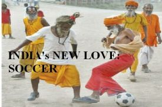

Title: Hin nýja trú?
Slug: hin-nyja-tru
Date: 2007-03-22 12:41:00
UID: 144
Lang: is
Author: Ólöf Sæunn Valgarðsdóttir
Author URL: 
Category: Samfélag, Trúarbrögð
Tags: 

Þegar rætt er um fótbolta heyrast oft brandarar um „hið nýja trúarbragð“ eða sótthita. Kannski er þetta fráleitt eða einungis ætlað að vera fyndið, en samt virðist vera eitthvert sannleikskorn í þessu. Tökum dæmi: Frændi minn er Manchester United aðdáandi upp að því marki að nánast öll hans hversdagsföt eru merkt félaginu og „Gvöð“ hjálpi mér ef ég einhver tímann kalla liðið „Manúnæted“ eða „ManÚ“ það skal sko vera fjallað um United eða um Manchester United. Gamall yfirmaður minn fer tvisvar á ári til Liverpool á leiki og grætur þegar liðið hans tapar, fyrrverandi samleigjandi minn hoppar hæð sína af gleði og öskrar á sjónvarpið þegar Man. United skorar. Fyrir þessa einstaklinga og marga aðra er uppáhaldsliðið mikilvægt og nauðsynlegt. Eitthvað sem kryddar tilveruna en er óviðráðanlegt, fyrir utan þeirra áhrifavald. Þeir ráða ekkert við leik eða árangur liðanna, gera samt það sem þeir mögulega geta gert til hjálpar. Verið í happasokkunum þegar það er úrslitaleikur, farið á leik og hvatt þá áfram eða hreinlega sent þeim góða strauma í gegnum sjónvarpið. 

Emile Durkheim talaði um hvernig heimur okkar sem einstaklinga skiptist upp í hversdagsleikann og heim þar sem venjuleg lögmál og hegðun gilda ekki, hinn heilaga heim (Haraldur Ólafsson 1998, Morrison 1998). Allar okkar trúarathafnir snúast um það að tengja þessa tvo heima þannig að úr verði heild sem okkur sjálfum þykir trúanleg. Það er samfélagið sjálft sem skapar trúarbrögðin og uppiheldur trúarathöfnum sem við tökum þátt í (Haraldur Ólafsson 1998, Morrison 1998). Raunverulega erum við þá ekki að dýrka trúna eða Guðinn heldur ákveðna birtingarmynd samfélagsins.

Fótbolti sem íþrótt og samfélagslegt fyrirbæri fær, hjá hinum venjulega borgara, meiri athygli dagsdaglega en kirkjan og hennar starfsemi. Þeir sem á annað borð hafa áhuga á fótbolta sameinast um að halda með ákveðnum félögum og styðja þau á allan þann hátt sem þeim er mögulegt. Þarna erum við með skipulagða athöfn þar sem áhangendur fótboltaliðs hópast saman á einn stað og taka þátt í athöfn. 

> It's extraordinary, knowing you have a role to play in all this, that this evening wouldn't have been the same without you and thousands like you.  
> <cite>Nick Hornby: _Fever Pitch,_ bls 191.</cite>

Hlutverk trúarhópa eða skipulagra trúarbragða er að mynda tengsl, ímynduð, á milli fólks sem tengist ekki á annan hátt (Das 1994). Fólki sem tilheyrir ekki sömu fjölskyldu, ekki endilega sama þjóðarbroti eða sömu stétt. Trúin og trúarstarfið gefur þeim sem taka þátt tilfinningu um tengsl og að tilheyra hópi eða samfélagi. Í fljótu bragði er vel hægt að sjá samsvörun á milli myndunar trúarhópa og myndunar aðdáendahópa. Munurinn er sá að aðdáendahópurinn er ekki að biðja til æðri máttarvalda þegar hann mætir á völlinn. Ákafir aðdáendur fótboltaliða eiga það aftur á móti til að fallast á hné og biðja til æðri máttar þegar þeirra liði gengur illa. Í því liggur munurinn að mestu leyti.

> For my part, I am an Arsenal fan first and a football fan second.  
> <cite>Nick Hronby: _Fever Pitch,_ bls 127.</cite>

Það að halda með einhverju fótboltaliði er víst ekki það sama og halda með einhverjum keppanda í X-factor. Sumir áðdáendur fótboltaliða, hvort sem er félagsliða eða landsliða merkja sjálfa sig félaginu með klæðnaði, húðflúrum, hárgreiðslu eða öðru sem sést. Áður nefndur félagi minn gengur alltaf í bolum merktum Man.United, hann er með músamottu merkta félaginu, bolla og þegar hann var yngri svaf hann við rúmföt merkt félaginu. Hann hefur ferðast þó nokkru sinnum á leiki í Manchester. Úr þeirri fyrstu kom hann til baka með steinvölu, tekna til handagagns á heimavellinum. Því er ekki að neita að þetta minnir vissulega nokkuð á pílagrím sem tekur með sér eitthvað smálegt frá helgum stað, e.t.v. í von um að eignast hlutdeild í helgidómnum.

Fyrir einstaklinga eins og hann eru það ekki persónur liðsins, leikmennirnir, sem eru aðdráttaraflið. Tryggðinn við klúbbinn viðhelst þó svo að skipt sé um leikmenn. Aðdáendurnir fylgjast með sínu liði, mæta á völlinn, lesa slúðrið og gera allt sem þeir geta til að finnast þeir vera með. Jafnvel þó það sé bara með því að horfa á leikinn í sjónvarpinu.

> [...] and though admittedly wearing a shirt in front of a television set would not, on the face of it, apper to offer the team an awful lot of encouragement, i knew it would make me feel better.  
> <cite>Nick Hornby: _Fever Pitch,_ bls 220.</cite>

Þannig líður fótboltaáhugamanninum eins og hans innlegg í athöfnina skipti máli, hafi eitthvað að segja. Kunningi minn hefur tekið sér frí í vinnunni til að geta horft á útsendingu leiks sem skipti máli fyrir hans lið. Þó að hans vera eða stuðningur hafi ekki bein áhrif á úrslit leiksins þá finnst honum hann vera með og að hans stuðningur gefi eitthvað til liðsins á sama máta að hann fær einhverja lífsfyllingu út úr því að fylgjast með.

Stuðningamenn fótboltaliða reyna að sýna stuðning með því að mynda ímynd og þannig hafa áhrif á andstæðingana. Ímyndin samanstendur af klæðnaði og hvatningarópunum. Tilgangurinn er að mynda heild og samstöðu. Hvattningarópin eru mikilvægur þáttur í stuðningnum og hafa mörg þeirra langa sögu og hafa orðið til í fyrri keppnum á milli liðanna. Önnur nýtast bara við þennan eina leik. Sum ópin snúast um leikmennina, önnur um aðdáendur hinna liðanna. En þetta er allt partur af leiknum, fötin, hrópin, fólkið og söluvaran. 

Líta má á fótbolta sem eitt af fyrstu fyrirbærunum sem hnattvæddust (Armstrong og Giulianotti 1999). Aftur á móti breiðist fótboltinn út á eigin forsendum. Ekki endilega tekið með sér menningartengslin sem lágu að baki leiknum í upphafi heldur myndað ný þar sem hann er stundaður. Hvað fótbolti er og fyrir hvað hann stendur er mismunandi á milli staða. En þrátt fyrir allt þá er þetta fótbolti, leikur sem snýst um að koma leðurtuðrunni í mark án þess að nota hendurnar.

---

#### Heimildir:

* Armstrong, Gary og Giulianotti, Richard. (1999). Football in the Making. Í _Football Cultures and Identities._ (Ritstj. Gary Armstrong and Richard Giulianotti) New York: Palgrave (3-14).
* Bourdieu, Pierre. (1988). Program for a Sociology of sport. _Sociology of sport Journal_ 1988 (5):153-161.
* Giulianotti, Richard. (1999). Hooligans and Carnival Fans: Scottish Football Supporter Cultures. Í _Football Cultures and Identities._ (Ritstj. Gary Armstrong and Richard Giulianotti) New York: Palgrave (29 -40).
* Haraldur Ólafsson. (1998). _Maður og menning._ Reykjavík: Félagsvísindastofnun Háskóla Íslands.
* Hornby, Nick. (2000). _Fever Pitch_ (1.útg. 1992) London: Penguin books.
* Morrison, Kenneth. (1998). _Marx, Durkheim, Weber — Formations of Modern Social Thought._ (1.útg. 1995). London: Sage Publications.

