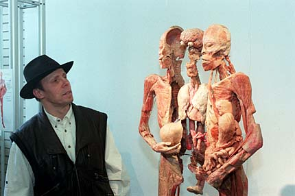
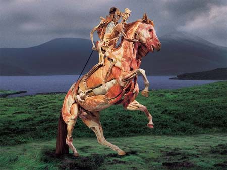
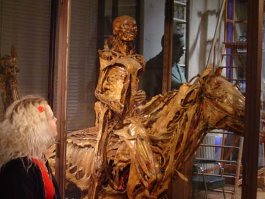

Title: Hinn eilífi lík-ami
Slug: hinn-eilifi-lik-ami
Date: 2006-04-17 23:56:00
UID: 64
Lang: is
Author: Unnur María Bergsveinsdóttir
Author URL: http://unnur.klaki.net
Category: Menningarfræði
Tags: 

Fyrir nokkrum vikum var ég stödd í New York þar sem ég heimsótti fræga sýningu - [Bodies: The Exhibiton](http://www.bodiestheexhibition.com/). Þessi sýning er hugarfósturs austur-þýska vísindamannsins [Gunther von Hagen](http://en.wikipedia.org/wiki/Gunther_von_Hagen) og hefur verið á ferð um heiminn allt frá því hún opnaði fyrst í Japan árið 1995.  Skemmtunin, en von Hagen kýs hvað sýninguna varðar að tala um _edutainment_,  gengur út á læknisfræðilega kynningu á mannslíkamanum en doktorinn hefur sérhæft sig í því að frostþurrka lík og meðhöndla þau með plastefnum af ýmsu tagi. Þannig hefur hann ekki aðeins sigrað rotnunarferlið í þeim tilgangi að leikir jafnt sem lærðir megi með eigin augum fræðast um innvols mannslíkamans heldur þykir hann einnig einkar frumlegur í uppstillingum herlegheitanna. Þannig má á sýningum hans rýna inn að beini á einbeittum skákmanni, grindahlaupara sem hefur staðnæmst í miðju stökki, sjá má beinagrind dansa við veru búna til úr eigin skinni og vöðum og feita konu sem söguð hefur verið í sex þynnur svo betur megi greina hvernig velmegunin dreifist á líkamann. 

Sýningin hefur frá upphafi þótt afar umdeild og spanna deilurnar allt frá siðferðislegum spurningum um það hvort sýningin sem slík feli í sér vanvirðungu gagnvart þeim látnu sem eru til sýnis til grunsemda um það hvort líkin hafi verið fengin með löglegum hætti. Von Hagen er sjálfur umdeildur persónuleiki sem fyrir utan tiktúrur á borð við þær að klæða sig upp eins og [Joseph Beuys](http://www.walkerart.org/archive/4/9C43FDAD069C47F36167.htm) hikar ekki við að tala um sjálfan sig sem listamann. Árið 2003 krufði hann lík í beinni útsendingu á breskri sjónvarpsstöð og var það mál manna að lengra gæti raunveruleikasjónvarpið varla gengið. 

Hún er ekki ný af nálinni, togstreitan á milli þess að það sé réttlætanlegt að sýna berskjaldaða líkama í þágu vísindanna og þeirrar skoðunar að aðeins útvaldir, þ.e. þeir sem vinna í  þágu vísindanna en láta ekki stjórnast af gægjuþörf, eigi að hafa aðgang að slíkum sýningum. Á 19. öld var það til siðs í París að í líkhúsi borgarinnar voru til sýnis lík sem enn hafði ekki tekist að bera kennsl á. Þessar sýningar voru geysivinsælar meðal fólks af öllum stigum þjóðfélagsins, jafnvel breskir ferðamenn töldu líkhúsið, ásamt Eiffel turninum og Notre Dame kirkjunni, nauðsynlegt stopp.  Þessar sýningar voru harðlega gagnrýndar af samtímamönnum en allt þar til líkhúsið lokaði árið 1907 var ekkert lát á aðsókninni. Bent hefur verið á það að sýningarnar í líkhúsinu eigi sér stað á sama tíma og nútímaleg verslunarmenning, kennd við gláp, er að þróast aðeins nokkur hundrað metrum norðar við líkhúsið í yfirbyggðum verslanagötum[^1]. Gláp- og flandursmenningin einkennist af sjónrænni nautn sem stórir búðargluggar og gaslýsing auðvelduðu. Líkt og varningur kaupmannanna voru misjafnlega á sig komin óskilalík lögð til sýnis á upplýsta steinsteypta bekki, bak við rúður. Áhorfendur hölluðu sér upp að fægðu glerinu, supu hveljur og báru sýnisgripi dagsins saman. 

Í Palermo á Sikiley heimsótti ég katakombur Benediktarmunkareglunnar. Þar hanga þurrkuð lík á veggjum neðanjarðarganga, sum eru vel varðveitt en önnur varla meira en rykug bein. Ættingjar hinna látnu komu lengi vel á hátíðisdögum og klæddu hina látnu í ný föt en í dag eru líklega margir áratugir frá því nokkur kom þangað niður í þeim tilgangi. Gestagangurinn er þó í dag meiri en nokkurn tíman fyrr og ljóst að það sem höfðaði til franskrar alþýðu seint á 19. öld er enn í dag uppskrift að blússandi bissness. Svipuð fyrirbæri eru enda enn til víða um heim, í ferðamannahandbókum sem Tjékkóslóvakíu er fjallað um frægar katakombur sem eru byggðar upp úr beinum ungabarna. Sömuleiðis hafa smurðir stjórnmálaleiðtogar lengi þótt áhugaverðir og það að flétta réttarmeinatækni eða spennandi innyflauppskurði inn í sjónvarpsþætti er ein pottþéttasta aðferðin til að auka áhorf. 

Þrátt fyrir að það sé ljóst að áhugi á hinu óhugnanlega sé rótgróinn í vestræna menningu og flestir séu þannig tilbúnir til að borga fyrir að sjá líflausa líkama með eigin augum er jafnan miklu púðri eytt í að réttlæta sýningar van Hagen sem einskonar alþýðufræðslu, fyrstar sinnar tegundar. Í því ljósi er athyglisvert að rifa upp sögu Honoré Fragonard, fransks vísindamanns sem var uppi á 18. öld og hafði það að markmiði að samþætta læknisfræði og list. 

Fragonard var af ríkum ættum og eftir að fjölskylda hans hafði dælt dágóðri summu af peningum í Alfort dýralæknaskólann þar sem hann var í námi sá Fragonard í hendi sér að hann ætti án efa einn daginn greiða leið að skólastjóratitlinum. Hann ákvað því að byrja strax að undirbúa það sem átti að verða glæsileg arfleifð og hellti sér af krafti út í það sem hann gerði best. Sem var að sprauta áfengi, vaxi og öðrum efnum inn í líffæri og útlimi dýra. Markmiðið með þessari tækni var að útbúa þannig sýnishorn sem hægt væri að nota til kennslu ár eftir ár í stað þess að það þyrfti að redda fersku kjöti fyrir hverja kennslustund.

Eins og fyrr sagði þá var þetta það sem Fragonard gerði best. Og það sem maður gerir best er líka yfirleitt það sem maður hefur yndi af. Og Fragonard hafði afskaplega mikið yndi af því að búa líkamsleifar til varðveislu. Á næstu árum útbjó hann þúsundir sýna, enda átti hann von á því að þegar hann yrði skólastjóri myndi skólinn að sjálfsögðu finna verkum hans stað í sérstöku anatómíusafni sem byggt yrði honum til heiðurs. Þannig söfnuðust upp bæði dýr og menn sem í margvíslegum stellingum störðu stjörfum augum á þá meðlimi skólanefndarinnar sem dirfðust að heimsækja Fragonard á vinnustofur hans.  Endirinn á metnaðarfullu verkefni Fragonard varð hinsvegar sá að í stað þess að gera hann að skólastjóra komst stjórn skólans að þeirri niðurstöðu að Fragonard væri klikk og ráku hann. Til þess að sjá fyrir sér seldi hann smátt og smátt öll verk sín. 

Þegar franska byltingin átti sér stað skipaði Fragonard sér í flokk byltingarmanna. 1793 sat hann í Opinberu listanefndinni ásamt mætum mönnum á borð við stórmálarann [David](http://en.wikipedia.org/wiki/Jacques-Louis_David), en sá síðarnefni var einskonar hirðljósmyndari Napóleons. Fragonard hafði ekki gefið drauminn um eigið anatómíusafn upp á bátinn og tók því að sér að búa til skrá yfir líkamsleyfaeign Alfort dýralæknaskólans. Fragonard tókst svo vel að vekja athygli á því hversu merkilegt safnið var að allt árið 1795 mátti safnið þola stórfelldan þjófnað og af 3033 stykkjum í skrá Fragonards eru í dag aðeins 600 eftir. Þess má geta að í þá daga þótti aðalsmönnum og betri borgurum kúl að safna undarlegum gripum til að sýna hvað þeir væru vísindalega sinnaðir. Gengu slík einkanáttúrugripasöfn undir samheitinu [Cabinets des Curiosités](http://pages.infinit.net/cabinet/representation.html) og er talið að lunginn af verkum Fragonards hafi þannig endað í einkaeign. Þjófnaðurinn fékk mjög á Fragonard sem í stað þess að takast ætlunarverk sitt, að endurreisa heiður skólans, þurfti að horfa upp á gerðir sínar stuðla að tortýmingu safnsins. Eftir þetta dró hann sig í hlé frá ábyrgðarstörfum, gerðist anatómíukennari við l’École de Santé de Paris og dó 5. apríl 1799[^2]. 

Safnið sem Fragonard dreymdi um að yrði helgað sér varð að endanum að [raunveruleika](http://musee.vet-alfort.fr/), þó svo það sé mun minna í sniðum en Fragonard dreymdi um.  Þegar gengið er um ganga þess er samanburðurinn við verk von Hagen óhjákvæmilegur. Sér í lagi þar sem eitt frægasta verk Fragonard, dómsdagsriddarann á hestinum, er einnig að finna á efnisskrá van Hugen. Er heimurinn í dag ef til vill tilbúinn fyrir það sem Fragonard vildi færa honum? Van Hagen dreymir jú um að finna verkum sínum samastað á varanlegu safni sem hann nefnir _The Museum of Man_[^3]. 

Það er ef til vill ósanngjarnt að tala um hreina gægjuþörfn í sambandi við áhuga okkar á líflausum líkömum. Öldin sem er nýliðin er öld vísinda og framfara og einkennist af ofurtrú okkar á að það að sjá sé það sama og að skilja. Það virkilega undarlega við sýningu van Hagen er því ekki það að almenningur skuli flykkjast á hana né heldur það að svo stór hluti samfélagsins sé tilbúinn til að samþykkja hana, þrátt fyrir þrálátan orðróm þess efnis að uppistaðan í henni séu nafnlaus lík úr kínverskum fangelsum og geðsjúkrahúsum[^4]. Nei, það sem virkilega er athyglisvert er það að ef eitthvað er þá hefur hin tæknilega meðhöndlun haft þau áhrif, ef svo má að orði komast, að fjarlægja sálina úr líkinu. 

Þrátt fyrir að vera orðin rúmlega tvö hundruð ára gömul, eru þau fáu verk Fragonard sem enn eru til sýnis í Alfort dýralæknaskólanum enn þekkjanlegt hold. Áferðin og liturinn er að vísu annarleg en hin þrjú dansandi fóstur eru greinilega búin til úr beinum og leðri, eða, úr alvöru börnum. Í Alfort er hold  ennþá mold. Líkamar von Hagen hafa hinsvegar í augum hins almenna leikmanns enga augljósa skírskotun til efniviðsins aðra en innihaldslýsinguna. Mjúkir vefir hafa verið frostþurrkaðir, fita og vökvar fjarlægð og það sem eftir stendur er álíka raunverulegt og gervinautasteikin sem ég sá einu sinni prýða skreyta steypujárnspönnu í búðarglugga. Hversu nálægt sem maður rekur nefið sitt fína er engin nálykt af kínversku óskilamönnunum.  Ég hef svo sem heyrt því fleygt áður og þá í öðru samhengi að nútíminn sé ekkert fyrir raunverulega loðna líkama sem bylgjast, hrukkast og hrörna en sjaldan hefur Barbie™ væðingin með sitt plastgerða hold verið jafn raunveruleg í huga mér.

Sú spurning sem leitaði á mig eftir að hafa rölt í gegnum _Bodies: The Exhibition_ var því ekki hvort sýningin sem slík væri siðleg eða fræðandi heldur einfaldlega hvort hið æsilega væri hér ekki einmitt fjarvera dauðans, sigur tækninnar yfir náttúru og hrörnun, sigur plastsins yfir holdinu.

[^1]:  Frank Gonzalez-Crussi, „Vision - Confronting the Margin“ í _Seeing the Difference. A Project on Viewing Death and Dying in Interdisciplinary Perspective._ Verkefni á vegum Hugvísindastofnunar Berkeley, sjá [á seeingthedifference.berkeley.edu](http://seeingthedifference.berkeley.edu/gonz-crussi.html).
[^2]: Laetitia Lallier, „Honoré Fragonard. La fascination de la chair“, _Elegy_ mars/avril 2000. 
[^3]: „The Naked and the Dead“, _The Guardian_ 19. mars 2002. Sjá [á guardian.co.uk](http://www.guardian.co.uk/g2/story/0,3604,669775,00.html)
[^4]: Sjá t.d. Yasmine Mohseni, „Body Snatchers“, _Discover_ apríl 2006. 

