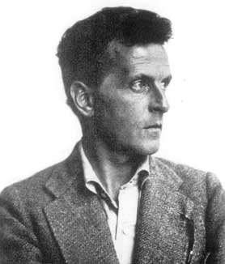

Title: Hinn nýi Wittgenstein
Slug: hinn-nyi-wittgenstein
Date: 2008-02-07 10:00:00
UID: 216
Lang: is
Author: Flóki Ásgeirsson
Author URL: 
Category: Heimspeki
Tags: 

> My propositions serve as elucidations in the following way:
> anyone who understands me eventually recognizes them as nonsensical,
> when he has used them - as steps - to climb up beyond them.
> (He must, so to speak, throw away the ladder after he has climbed up it.)
> He must transcend these propositions, and then he will see the world aright.
> (_Tractatus_ 6.54)

Cora Diamond er prófessor (emeritus) í heimspeki við háskólann í Virginíu. Hún er sérfræðingur í Wittgenstein, og hefur skrifað tugi greina um og í anda heimspeki hans, bæði hina fyrri og hina síðari (sjá ritaskrá hér að neðan). Þekktust er hún þó fyrir að vera upphafsmaður nýrrar stefnu í Wittgenstein-túlkun sem hlotið hefur nafnið Hinn nýi Wittgenstein (e. The New Wittgenstein), en einn helsti hvatinn að þessari nýju stefnu hefur verið ný og róttæk kenning Diamond um það hvernig beri að túlka hið fyrra verk Wittgensteins, _Tractatus Logico-Philosophicus_.

Til að geta gefið einhverja mynd – í svo stuttu máli sem þessu – af því hvað það er sem gerir túlkun Diamonds á _Tractatus_ nýja og róttæka verðum við að gera tvennt: takmarka okkur við eitthvað eitt túlkunaratriði úr bókinni, og bera saman túlkun Diamonds á því atriði við aðra sambærilega túlkun. Í samræmi við túlkun Diamonds hef ég valið grein 6.54 úr  _Tractatus_, sem vitnað er í hér að ofan. Ein af þeim nýjungum sem felst í túlkun Diamonds er áherslan sem lögð er á þessa grein, enda lítur Diamond svo á að þessi grein geymi lykilinn að allri túlkun bókarinnar. Til samanburðar við túlkun Diamonds er eðlilegast að taka túlkun Oxford-heimspekingsins P.M.S. Hacker, enda er hann einn áhrifamesti sérfræðingurinn í heimspeki Wittgensteins í dag, auk þess sem Diamond ber sjálf túlkun sína saman við túlkun Hackers.

Túlkun Hackers á _Tractatus_ 6.54, sem er í anda þeirra túlkana sem eldri sérfræðingar á borð við Elizabeth Anscombe hafa aðhyllst, er í mjög grófum dráttum eftirfarandi. Það sem Wittgenstein á við, þegar hann segir í grein 6.54 að setningar hans muni sá sem skilur hann afhjúpa sem vitleysu, er að sá sem skilji hann (Wittgenstein) skilji að setningar bókarinnar séu, strangt til tekið, vitleysa, þó það sem þessar setningar gefi til kynna sé satt og rétt. Ástæða þess, telur Hacker, að Wittgenstein segir setningar sínar vera vitleysu er sú að þær leitast við að segja það sem er í raun ekki hægt að segja, heldur einungis sýna. Setningarnar eru því vitleysa, en það sem þær reyna að segja er gott og gilt; þó það verði að gefa það til kynna á annan hátt en að segja það, þ.e. með því að sýna það.

Eins og Hacker túlkar _Tractatus_ eru í bókinni dregin mörk þess sem hægt er að segja, og gerður greinarmunur á því sem setningar geta sagt annars vegar og því sem setningar geta sýnt hins vegar. Setningar _Tractatus_ fara yfir þessi mörk, og reyna að segja það sem ekki er hægt að segja. Þess vegna, telur Hacker, segir Wittgenstein að þær séu vitleysa. Sá sem skilur Wittgenstein skilur í lok bókarinnar að setningar bókarinnar hafa farið yfir mörk hins segjanlega, og teljast því vitleysa, strangt til tekið. Þetta var það sem Wittgenstein átti við í grein 6.54.

Diamond er mjög gagnrýnin á þessa túlkun Hackers, og sakar þá sem aðhyllast slíkar túlkanir m.a. um heigulshátt. Mistök Hackers, telur Diamond, eru að taka því sem Wittgenstein segir um vitleysu í grein 6.54 ekki nógu alvarlega. Eins og sjá má felur túlkun Hackers ekki í sér annað en það að setningar _Tractatus_ teljist, strangt til tekið , samkvæmt skilyrðum um segjanleika sem Wittgenstein setur sjálfur fram í bókinni , vitleysa. Boðskapur þeirra er hins vegar engin vitleysa, telur Hacker, enda má koma honum til skila á annan hátt, með því að sýna hann. Þessari hugmynd hafnar Diamond hins vegar alfarið. Vitleysa er vitleysa, telur Diamond, og hún getur ekki haft neinn boðskap.

Diamond leggur til að fullyrðing Wittgensteins í grein 6.54 um að setningar hans séu vitleysa sé tekin af fyllstu alvöru. Setningar _Tractatus_, telur Diamond, ber að líta á sem tóma vitleysu, sem hafi engan boðskap. Þetta gildi líka, telur Diamond, um þau mörk segjanleika og þann greinarmun á því sem hægt er að segja og sýna sem Hacker les út úr texta _Tractatus_. Allt er þetta tóm vitleysa sem hefur enga merkingu.

Nú má auðvitað spyrja hvort þetta sé nokkur túlkun á bók, að kalla bókina tóma vitleysu og uppnefna þá sem þykjast skilja eitthvað í henni. En túlkun Diamond ristir dýpra en svo. Hugmynd Diamond, sú sem gerir túlkun hennar spennandi, er sú að Wittgenstein hinn fyrri hafi í raun ekki verið eins ólíkur hinum síðari og hingað til hefur verið talið. Í stað þess að telja Wittgenstein hinn fyrri hafa stundað heimspeki í hefðbundnum anda telur Diamond að hann hafi, líkt og hinn síðari Wittgenstein, hafnað hefðbundinni heimspeki, og einsett sér að sýna að hún væri á villigötum. Í því augnamiði skrifaði hann bók, _Tractatus_, sem lítur út eins og allhefðbundið heimspekiverk, en aðeins á yfirborðinu. Þegar kafað er dýpra í verkið, telur Diamond, kemur í ljós að setningar bókarinnar eru í raun merkingarlausar. Þegar við reynum að átta okkur á því hvað þær segja rennur loks upp fyrir okkur að þær segja ekkert. Það sem lítur út fyrir að vera djúpt og þrungið hulinni merkingu er í raun og veru bara bull.

Ætlun Wittgenstein með _Tractatus_, telur Diamond, var sú að venja okkur af heimspekilegu bulli. Wittgenstein taldi, að mati Diamond, að við höfum tilhneigingu til að láta glepjast af setningum sem líta út fyrir að segja eitthvað djúpt og merkilegt, en eru í raun ekkert nema yfirborðið. Þegar við reynum að komast til botns í því hvað þessar setningar merkja leysast þær upp og verða að engu. Tilgangur Wittgensteins með setningum  _Tractatus_ var að láta okkur í té setningar sem myndu í fyrstu laða okkur að sér með yfirborði sínu, en leiða okkur síðan í ljós merkingarleysi sitt þegar við kæmum nær. Það var einmitt þetta, segir Diamond, sem Wittgenstein átti við þegar hann sagði í grein 6.54 að sá sem skildi sig afhjúpaði loks setningar sínar sem vitleysu.

---

#### Heimildir

* Conant, J., & Diamond, C. (2004). On reading the Tractatus resolutely: Reply to Meredith Williams and Peter Sullivan. In M. Kölbel & B. Weiss (Ritstj.), Wittgenstein's lasting significance (pp. 46-99). London: Routledge.
* Crary, A., & Read, R. (Ritstj.). (2000). The New Wittgenstein. London: Routledge.
* Diamond, C. (1988). Throwing away the ladder. Philosophy, 63, 5-27.
* Diamond, C. (1991). The realistic spirit. Cambridge: MIT Press. 
* Hacker, P. M. S. (1972). Insight and il lusion. Oxford: Clarendon Press. 
* Hacker, P. M. S. (2000). Was he trying to whistle it? In A. Crary & R. Read (Ritstj.), The New Wittgenstein. London: Routledge.

