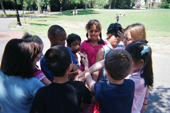

Title: Hópaþróun: gagnlegt tæki
Slug: hopathroun-gagnlegt-taeki
Date: 2007-05-22 11:39:00
UID: 161
Lang: is
Author: Þórhallur Guðmundsson
Author URL: 
Category: Félagsfræði
Tags: 

Hópaþróun er hugtak sem bæði er notað í stjórnunar- og uppeldisfræðum.  Þetta hugtak er alls ekki nýtt af nálinni en hefur þó ekki verið mjög áberandi í dægurmála umræðu eða umræðu um bættan aðbúnað á vinnustöðum. Þó má fullyrða að þeir sem ná að öðlast skilning á hugtakinu og þeim úrræðum sem út frá því hafa verið þróuð, séu vel í stakk búnir til þess að leysa flókin samskiptavandamál á vinnustöðum, í skólastofu og í raum alls staðar þar sem fólk kemur saman.  Hópaþróunarkenningin var fyrst sett fram af dr. Bruce Tuckman árið 1965 og gengur oftast undir nafninu _Tuckmankenningin um þróun hópa_.  Kenningin byggir á því að til þess að hópur nái að þróast og þroskast fari hann í gegum fjögur þróunarstig. 10 árum síðar bætti Tuckman reyndar fimmta stiginu við kenningu sína.  

Í stuttu máli fjallar kenningin um það að þegar settur er saman hópur af fólki sem á að starfa saman eða læra saman, með öðrum orðum; vinna og dvelja saman í afmarkaðan tíma, í afmörkuðu rými, þá megi yfirleitt greina inna hópsins ákveðna þróun. Fyrsta skrefið markar upphaf samvinnunar og það síðasta endalok hennar.  Það er þó ekki sjálfgefið að hópurinn fari í gegnum öll stigin fjögur á því tímabili sem hann starfar.  Margir hópar komast aldrei lengra en á annað stigið, festast þar og stökkva svo beint yfir á fimmta stigið, eða skilnaðarstig hópsins.  Það er vegna þessarar stigskiptingar hjá hópum sem margir eiga ekki góðar minningar frá tilteknum skólum, bekkjum, vinnustöðum, sumarbúðum, leikjanámskeiðum, utanlandsferðum og svo framvegis.  Þeir hópar aftur á móti sem ná að fara í gegnum mismunandi stig og komast á fjórða og hið síðasta virka stig verða oft mjög farsælar og öflugar liðsheildir. 

### 1. stig: Mótunarstig (Forming)

Á mótunarstigi er hópurinn óöruggur og hópmeðlimir reyna að finna stöðu sína innan hópsins. Hér eru einstaklingarnir að kynnast og prófa vinnureglur. Hópmeðlimir velta fyrir sér hvers er vænst af þeim, hvaða áhrif þeir muni hafa, hvernig fólki muni líka við þá, hvernig þeir komi til með að vinna saman og hvernig hinir hópmeðlimirnir séu. Hópurinn á eftir að byggja upp traust. Það er margt sem grípur athygli hópmeðlima á þessu stigi og því nær hópurinn litlum árangri með tilliti til settra markmiða. Þetta er fullkomlega eðlilegt.

Á mótunarstigi má sjá eftirfarandi tilfinningar og hegðun:

* Spenningur, eftirvænting og bjartsýni.
* Stolt yfir því að vera valinn í hópinn.
* Hikandi tryggð við hópinn.
* Kurteisi, allt er ópersónulegt og rólegt.
* Kvíði gagnvart verkefnum.
* Skilgreining á verkefnum og hvernig eigi að framkvæma þau.
* Viðeigandi hóphegðun ákveðin.
* Miklar og flóknar umræður um heildarhugmyndir og málefnin, sem sumir hópmeðlimir hafa ekki þolinmæði í.

### 2. stig: Ágreiningsstig (Storming)

Á ágreiningsstigi kemur oft upp ágreiningur og sundrung þar sem hópmeðlimir byrja að veita áhrifum hópsins viðnám og fyllast mótþróa við að klára verkefni. Menn eru ósammála, keppast um stöður innan hópsins og gagnrýna hugmyndir. Hópmeðlimir komast að því að verkefnin eru frábrugðin því sem áætlað var og mun erfiðari í framkvæmd. Þeir fyllast óþolinmæði vegna skorts á árangri og deila um hvað eigi að gera. Ágreiningsstigið er mjög mikilvægt fyrir hópinn til að hópmeðlimir geti byggt upp sjálfstæði sem einstaklingar og sjálfstæðir meðlimir hópsins. Traust verður aðeins til með því að tjá hugsanir, hugmyndir og tilfinningar. Á þessu stigi hafa hópmeðlimir litla orku til að vinna að settum markmiðum. Þeir eru þó að öðlast aukinn skilning hver á  öðrum. 

Á ágreiningsstigi má sjá eftirfarandi tilfinningar og hegðun:

* Andstaða við verkefni.
* Andstaða við hugmyndir annarra um leiðir til endurbóta.
* Snarpar sveiflur í viðhorfi gagnvart hópnum og tækifærum hans til að ná árangri.
* Hópmeðlimir rífast jafnvel þó að þeir séu sammála um stóru málin.
* Valdabarátta, sumir "detta út".
* Ákveðni, samkeppni og tekin afstaða með fólki.
* Óraunhæf markmið.
* Óeining, aukin spenna og afbrýðissemi.

### 3. stigið: Umræðustig (Norming)

Á umræðustigi verður hópurinn samheldinn og tryggur. Menn finna nýjar leiðir til að vinna saman og setja viðmiðunarreglur fyrir viðeigandi hegðun. Skoðanaskipti eru virkari, menn eru ákafir og andstaðan minnkar. Hópmeðlimir láta sér annt um líðan hvers annars og veita hver öðrum stuðning og aðstoð. Menn eigna sér markmið hópsins og sýna persónulega tryggð við samstarfið. Hópurinn fer að tala um "við" í stað "þeir" og viðurkennir hóphlutverkin. Hópmeðlimir eru tryggir sameiginlegum vinnureglum og taka ábyrgð á því að hámarka árangurinn.

Á umræðustigi má sjá eftirfarandi tilfinningar og hegðun:

* Hæfni til að tjá gagnrýni á uppbyggilegan hátt.
* Viðurkenning á þátttöku í hópnum.
* Tilraunir til að ná sátt og samlyndi með því að forðast ágreining.
* Meiri vinskapur, hópmeðlimir treysta hver öðrum og deila persónulegum vandamálum.
* Sameiginleg markmið.

### 4. stig: Árangursstig (Performing)

Með aukinni tryggð og samvinnu að sameiginlegum markmiðum kemst hópurinn á árangursstigið. Um er að ræða meiri samheldni, settum markmiðum er náð og hópurinn verður sveigjanlegri í samvinnu. Hópmeðlimir taka þátt í að finna lausnir á vandamálum, framkvæma breytingar og umgangast deilur og ágreiningsmál á uppbyggilegan hátt. Þeir leysa hver annan af og verkefnum er dreift. Hópmeðlimir þekkja styrk- og veikleika hvers annars og þekkja sitt hlutverk. Árangursstigið er síðasta og erfiðasta stigið og margir hópar ná aldrei þessu stigi. 

Á árangursstigi má sjá eftirfarandi tilfinningar og hegðun:

* Hópmeðlimir hafa innsýn í hópferli og einstaklingsverkefni og skilja betur styrk- og veikleika hvers annars.
* Uppbyggilegar breytingar í hópnum, sem koma af sjálfu sér.
* Hæfni til að koma í veg fyrir eða vinna úr vandamálum sem koma upp í hópnum.
* Hópmeðlimir láta sér annt um líðan hvers annars.
* Traust, sveigjanleiki og gagnkvæmur stuðningur.
* Mikil tryggð við hópinn.

### 5. stigið: Skilnaðarstigið (Mourning)

Eins og áður kom fram bætti Tuckman síðar við 5. stiginu skilnaðarstigið.  Þá skilur hópurinn og getur þá myndast mikil eftirsjá eftir samvinnunni og félagsskapnum.  Mælt er með því að þegar verið er að slíta hópum sem inni halda börn eða unglinga að skilnaðarstigið sé ekki ofskjótt.  Að þau fái til dæmis kveðjuveislu (starfslokasamkvæmi) og jafnvel að hittast reglulega með nokkura vikna millibili.  Hjá fullorðnum tíðkast ,,endurfundir” hjá grunnskólum, framahaldsskólum, deildum í háskólum mneð vissu millibili og eiga að þjóna sama tilgangi.

Þeir sem öðlast smá innsýn í hópaþróunarkenningu Tuckmans geta nýtt sér hana til þess að eiga auðveldara með að greina vanda hópa, hvort sem þeir vinna með börnum eða unglingum í skólastofu, starfsmannahópum eða sjálfboðaliðum.  Kenningin auðveldar allt ferlið frá því að hópur kemur saman í fyrsta skipti og þanngað til hann verður eins og smurð vél á loka stiginu, með mjög stuttu stoppi á ágreiningsstiginu.  

---

<small class="blurb">
Þeim sem áhuga hafa á að lesa sér frekar til um hópaþróun er beint á að slá einfaldlega nafni Bruce Wayne Tuckman upp á [ProQuest](http://proquest.com/). Koma þá upp bæði greinar um og eftir Tuckman. Einnig má benda á hina athyglisverðu bók _Art of Scool Leadership_ eftir Thomas R. Hoerr.
</small>

