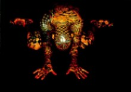

Title: Húðflúr og viðhorf til þeirra
Slug: hudflur-og-vidhorf-til-theirra
Date: 2006-09-29 00:12:00
UID: 97
Lang: is
Author: Margrét Stefánsdóttir
Author URL: 
Category: Mannfræði, Samfélag
Tags: 

Á síðustu árum hafa viðhorf gagnvart líkamanum breyst. Útlit og líðan er ekki lengur endilega tengt lífaldri, heldur getum við mótað líkama okkar eftir eigin vilja eftir því sem efni og aðstæður leyfa. Michael Featherstone hefur bent á hvernig allar þær ímyndir sem við sjáum í nútíma neyslusamfélagi, veki upp þarfi og þrár sem aftur hafi áhrif á efnismenninguna. Í vestrænum samfélögum í dag leggja einstaklingar oft mikið upp úr útlitinu og reyna að stjórna því. Þessi stjórn, eins og megrun, fegrunaraðgerðir, vaxtarækt eða húðflúr, mótar ímyndir annara um einstaklinginn.[^1] 

Líkamsskreytingar er skilgreindar sem allar skreytingar eða breytingar á mannslíkamanum. Þær hafa fylgt manninum frá upphafi og fyrirfinnast í öllum samfélögum þessa heims. Það að breyta sér og skreyta gerir okkur kleift að miðla til annarra upplýsingum um það hver við erum, allt frá samfélagsstöðu, uppruna, draumum, trú og afrekum til uppreisnarhugmynda. Líkamsskreytingar eru ýmist tímabundnar eða varanlegar. Húðflúr er sú aðferð til varanlegra líkamsskreytinga sem hefur verið hvað vinsælust og útbreiddust í heiminum. Mikill munur er á merkingu og tilgangi húðflúra milli menningarheima, landa og einstaklinga.[^2]

Húðflúr hefur almennt ekki verið vel liðið í vestrænum menningarheimi. Þær félagsvísindarannsóknir sem gerðar hafa verið á húðflúrum hafa oft skoðað það oft í neikvæðu samhengi. Það hefur verið skoðað sem leið minnihlutahópa, til dæmis fanga, geðsjúkra, glæpaklíka eða vandræðaunglinga til þess að mótmæla viðteknum gildum í samfélaginu um útlit. Fræðimenn hafa oft ekki samþykkt húðflúrun sem hluta af fagurfræði og sumir telja það vera afskræmingu. Í Norður-Ameríku hefur húðflúr hinsvegar hlotið uppreisn æru á undanförnum árum og breiðst út. Það sem áður þótti séreinkenni fólks af lægri stéttum er nú viðurkennt af mörgum hópum, af nær öllum stigum samfélagsins, sem menningartákn sem hlaðið er merkingu og skilaboðum um einstaklinga sem velja að húðflúra á sér líkamann.[^3] 

Atkinson telur húðflúr frekar vera leið til að falla inn í samfélagið, heldur en leið til uppreisnar og aðskilnaðar frá því. Með því að fá sér húðflúr skilgreinir einstaklingurinn sjálfan sig bæði gagnvart öðrum í félagslegum netum (til dæmis fjölskyldumeðlimum, vinum og kunningjum) og einnig gagnvart félagskerfum sem hann tilheyrir (til dæmis trúarhóp eða stétt).

Það er mjög einstaklingsbundið hvaða mynd, litur, staðsetning eða stærð af húðflúri einstaklingur velur sér. Sumir láta sér nægja eina mynd á meðan aðrir velja að þekja nær allan líkamann. Ástæður fyrir húðflúrinu geta jafnframt verið mjög mismunandi milli einstaklinga. Í rannsókn sem Clinton R. Sanders gerði 1988 á húðflúrstofu í New England í Bandaríkjunum, skráði hann fimm aðalástæður fyrir því að viðskiptavinir fengu sér húðflúr og hvaða mynd varð fyrir valinu:

* Táknræn yfirlýsing um persónulegt samband (til dæmis fá húðflúrað á sig orðið „mamma“ inn í hjarta, nafn maka eða nafn barns).

* Samsvörun með hópi (til dæmis meðlimir í vélhjólaklúbb eða íþóttaliði sem fá sér allir eins húðflúr, þetta er mjög hefðbundin tegund af húðflúri og táknar hollustu við tiltekin hóp).

* Yfirlýsing um áhugamál eða atvinnu (til dæmis ef kanínuræktandi myndi fá húðflúrað á sig mynd af kanínu).

* Yfirlýsing um persónuleika (velja sér húðflúr sem lýsir viðkomandi myndrænt, til dæmis að fá húðflúrað á sig stjörnumerki sitt, nafn eða jafnvel ofnæmisvaka. Sem dæmi nefnir Sanders ungan mann sem lét húðflúra á sig býflugu, þar sem hann hafði heiftarlegt ofnæmi fyrir þeim.).

* Skreytigildi (mynd valin myndarinnar vegna eða vegna fegrandi áhrifa sem hún er talin hafa á líkama viðkomandi. Snyrtihúðflúr falla einnig í þennan flokk en þau eru til dæmis línur meðfram vörum, augnlínur eða dulbúningur á fæðingarblettum).

Líkamar kvenna og karla eru frá náttúrunnar hendi ólíkir en frá samfélagsins hendi eru þeir enn ólíkari. Við lesum ólíka hluti út frá húðflúrum karla og kvenna og leggjum dóm á líkama þeirra úr frá ólíkum forsendum. Þegar kemur að vali á staðsetningu húðflúra má sjá kynbundinn mun. Karlar velja frekar áberandi staði til dæmis upphandlegg eða bringu á meðan konur velja oftar staði sem minna ber á. Algengast er að þær velji brjóst, öxl eða mjöðm fyrir húðflúr. Fyrir þessu er tvíþætt ástæða, annars vegar er um mismikinn sársauka að ræða og hins vegar er misjöfn merking með húðflúrum milli kynja. Það er sársaukafyllra að húðflúra suma staði en aðra, auðveldast er að húðflúra handlegg eða fótlegg en sárt að húðflúra þá hluta líkamans þar sem grunnt er á bein. 

Á meðal karla eru húðflúr oftar tengd karlmennsku og fyrrnefndum aðalástæðum þess að fólk fái sér húðflúr, þau lýsa þannig samböndum þeirra við annað fólk eða félagsskap sem þeir tilheyra og svo framvegis.[^4] Hjá konum eru húðflúr aftur á móti oftar tengd við kynferðislegar þrár og litið er á þau sem örvandi í vissu samhengi, til dæmis á stefnumótum, á skemmtistöðum eða í kynferðislegum athöfnum. Þau eru oft lesin sem merki um kynferðislegt sjálfstæði, sjálfsöryggi, frelsi og kraft konunnar sem þau ber.[^5] Það hve oft húðflúr hjá konum eru tengd hugmyndum um kynlíf gerir það að verkum að þær velja frekar að fá sér húðflúr á staði sem þær eiga auðvelt með að hylja, þannig halda þær húðflúrunum fyrir sig (og sína).[^6]

Í vestrænum samfélögum hefur oft verið litið niður á húðflúraðar konur, þær taldar lauslátar og lítils virði. Öfgafullt dæmi um þetta er nauðgunarmál í Boston, á seinni hluta þriðja áratugarins. Þar lét saksóknari málið falla niður þegar kom í ljós að fórnarlambið var með fiðrildi húðflúrað á ökklann. Litið var svo á að með því að bera húðflúr hafi konan afvegaleitt mennina tvo sem nauðguðu henni.[^7]

Húðflúr eru mjög afgerandi leið til að miðla til annarra persónuleika okkar. Klæðaburður, líkamsmótun (líkamsrækt og fegrunaraðgerðir) eða hárgreiðsla eru samþykktar leiðir til að fylgja ákveðnum viðmiðum þegar kemur að kynhlutverki, þjóðerni, stétt og kyni. Frekar er litið á húðflúr sem beina yfirlýsingu um persónuleika, yfirlýsing sem um leið fylgir oft gildandi viðmiðunum um útlit.[^8] 

[^1]: Csordas, T. (1999). The Body's Career in Anthropology. Í Moore, H.L. (Ritstj.),  Anthropological theory today, (bls. 171-205). Cambridge: Polity Press (ATT)

[^2]: Schildkrout, E. (2003). Body Art as Visual Language. Í J. Spradley og D. W. McCurdy (Ritstj.), Confirmity and conflict: Readings in Cultural Anthropology (bls. 70-77) (11. útgáfa). 

[^3]: Atkinson, M. (2004). Tattooing and Civilizing Processes: Body Modification as Self Control. The Canadian Review of Sociology and Anthropology, 41(2)

[^4]: Braunberger, C. (2000). Revolting Bodies: The Monster Beauty of Tattooed Women. NWSA Journal, 12(2), 1-24.

[^5]: Atkinson, M. (2004). Tattooing and Civilizing Processes: Body Modification as Self Control. The Canadian Review of Sociology and Anthropology, 41(2) 125-146. 

[^6]: Sanders, C. R. (1988). Drill and Frill: Client Choice, Client Typologies, and Interactional Control in Commercial Tattooing Settings. Í A. Rubin (Ritstj.), Marks of Civilization: Artistic Transformations of the Human Body (bls. 219- 	231). Los Angeles: Museum of Cultural History University of  California.

[^7]: Braunberger, C. (2000). Revolting Bodies: The Monster Beauty of Tattooed Women. NWSA Journal, 12(2), 1-24.

[^8]: Atkinson, M. (2004). Tattooing and Civilizing Processes: Body Modification as Self Control. The Canadian Review of Sociology and Anthropology, 41(2) 125-146. 

Myndirnar eru fengnar af: [http//:www.needled.com](http//:www.needled.com)

