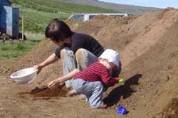

Title: Hugleiðing um ljósmyndun og fornleifafræði
Slug: hugleiding-um-ljosmyndun-og-fornleifafraedi
Date: 2005-11-08 00:22:00
UID: 9
Lang: is
Author: Þóra Pétursdóttir
Author URL: 
Category: Fornleifafræði
Tags: 

Myndir, og þá sérstaklega ljósmyndir, búa yfir miklum og endingargóðum upplýsingarmætti, ‘retorískum krafti’.  Hið nána samband á milli mynda annarsvegar og þekkingar hinsvegar má rekja til ofurvalds sjónarinnar. Sjónin er það skilningarvit sem talið er veita okkur milliliðalausa mynd af raunveruleikanum, það sem við getum séð er þannig bæði raunverulegt og satt. Því er gjarnan litið á ljósmyndina sem ígildi sjónarvottar og hún í sjálfri sér talin fela í sér bæði upplýsinga- og heimildagildi.[^1]

Ljósmyndun er eitt mikilvægasta verkfæri fornleifafræðinga á vettvangi uppgraftar. Ljósmyndir eru aðallega notaðar til þess að skrásetja framvindu uppgraftarins og til að styrkja ritaðar lýsingar í þeim skýrslum sem gerðar eru að uppgreftri loknum. Sem slík er ljósmyndun því í huga fornleifafræðinga aðeins tækni, leið að hlutleysi og nákvæmni hvað skráningu upplýsinga varðar. Engu að síður er sú athöfn að taka ljósmynd ýmsum vandkvæðum háð og skyldu fornleifafræðingar forðast að nálgast hana sem sjálfgefna.

Að segja að ljósmynd sé ekki hlutlaus gagnvart myndefni sínu þýðir ekki endilega að ljósmyndarinn hafi ætlað sér að blekkja áorfandann eða leiða hann á villigötur. Þeirri staðhæfingu er frekar ætlað að undirstrika að ljósmyndin hefur þau áhrif á viðfangsefnið að það verður brotakennt. Ljósmyndun er aðferð til þess að einfalda eða einangra viðfangsefnið, áhersla er lögð á eitthvað ákveðið en um leið verður annað undan að víkja. Fókusinn er settur á valið viðfangsefni frá völdu sjónarhorni, sem með því móti er dregið fram en um leið rifið úr því samhengi sem það tilheyrir. Þetta er að sjálfsögðu einn af kostum ljósmyndunar en einnig nokkuð sem menn ættu að hafa hugfast þegar fengist er við ljósmyndun og ljósmyndir. Auk þess má ekki gleyma því að smellur myndavélarinnar markar ekki endi hinnar huglægu tilveru ljósmyndarinnar. Því þrátt fyrir allt hafa myndir enga sjálfstæða rödd, hvorki hvað þær sjálfar varðar né það umhverfi sem þær spretta úr. Þær eru í raun merkingarlausar vegna þess að augnablikið sem þær fanga skortir samhengi. Til að öðlast merkingu þarfnast ljósmyndir bæði fortíðar og nútíðar en slíkar tengingar verða aðeins til fyrir tilstilli túlkunar áhorfandans. Ljósmyndin þarfnast þannig þess samhengis sem mannshugurinn setur hana í eigi hún að vera merkingarbær því merking byggir á sköpun tenginga og könnun samhengis.[^2]  Það er því ljóst að jafnvel þótt markmið ljósmynda kunni að vera hlutleysi, þá eru þær í sjálfu sér ekki hlutlausar. 

Innan fornleifafræðinnar er tilhneiging til að líta á ljósmyndir sem svo að þær tilheyri lokastigi ferlis. Það er að segja, þær gegna yfirleitt því hlutverki að skrásetja ‘sannleikann’ þegar aðskildum áföngum í endurheimt hans er náð. Vitanlega er tilgangur þeirra vísindalegur svo það er með réttu sem markmið þeirra er hlutleysi.  En þessar vísindalegu, kyrrstæðu eða statísku ljósmyndir, sneyddar öllu mannlegu, segja þó ekki nema lítinn hluta sögunnar. Jafnvel þótt þær sýni uppgröft á mismunandi tímapunktum og frá mismunandi sjónarhornum þá er hið flókna túlkunarferli sem á sér stað milli þessara augnablika glatað, eða í það minnsta hulið. 

Eitt af því sem mikilvægt er að hafa í huga er hinn mikli munur á ljósmyndinni sjálfri og athöfninni að ljósmynda. Þetta er umræðuefni Jonathan Bateman í greininni „Wearing Juninho’s Shirt: Record and Negotiation in Excavation Photographs“. Þar leggur Bateman áherslu á mismun afurðar og athafnar og heldur því fram að „munurinn á þessum tveimur sjónarhornum sé það sem geri ljósmyndina svo verðmæta fornleifafræðinni, það að fjarlægja höfund fornleifafræðinnar úr myndrænni framsetningu hennar eykur á hlutleysi hennar.“[^3] Ég tel Bateman hér vera heldur harðorðan í garð fornleifafræðinga, en hann lýsir því svo til yfir að gildi ljósmyndarinnar byggist í þeirra huga á því að með henni geti þeir blekkt og látið huglægt ferli virðast hlutlaust í augum áhorfandans. Slíkt er ekki ætlun fornleifafræðinga almennt þar sem flestir þeirra (þó ekki allir) líta einmitt á vinnu sína sem ferli háð túlkun en ekki sem hlutlaus vísindi. Aftur á móti tel ég Bateman benda á tvö mjög mikilvæg atriði. Annars vegar undirstrikar hann muninn á ljósmyndinni sjálfri og ljósmynduninni sem athöfn og hinsvegar bendir hann á þá staðreynd að ‘höfundur’ þess sem myndin sýnir er fjarstaddur á myndinni. 

Í fyrrnefndri grein ræðir Bateman það vandamál sem stafar af hinu týnda túlkunarferli og lýsir því hvernig hann hefur reynt að takast á við það með því að notast við annað form ljósmynda. Hann greinir á milli tveggja mismunandi tegunda ljósmyndunar. Annarsvegar er hefðbundin eða formleg ljósmyndun, þ.e. sá háttur sem fornleifafræðingar eru vanir að beita við ljósmyndun. Hinsvegar er svo óformleg ljósmyndun, sem e.t.v. er betur þekkt sem tækifærisljósmyndun. Bateman gerði tilraun til að samtvinna þessar tvær aðferðir í verki í Gardoms Edge uppgreftinum þar sem hann gengdi starfi vettvangsljósmyndara. Hann vildi með því móti reyna að framhefja uppgröftinn sem vettvang túlkunar og sköpunar fornleifafræði en ekki einungis sem hlutlausa uppsprettu uppslýsinga.  Með því að taka ekki aðeins ‘statískar’ formlegar ljósmyndir vildi Bateman auka skilning á ferli fornleifarannsóknarinnar, ekki síst meðal sjálfra þáttakendanna í uppgreftinum. Með því að samtvinna þessar tvær gerðir ljósmynda á kerfisbundinn hátt, þ.e. þar sem báðar verða órofa hluti af uppgraftarferlinu, er þannig einnig hægt að framhefja hinn túlkandi og huglæga hluta ferlisins. Niðurstaðan yrði e.t.v. „sannari“ eða betri sjónræn frásögn af hinu fornleifafræðilega ferli, þar sem mismunandi form ljósmynda styrkja hvort annað og ljá hvert öðru ákveðið samhengi. 

Margir vilja e.t.v. meina að þessar tvær tegundir ljósmyndunar gegni mismunandi tilgangi, annar er fræðilegur og hinn til opinberrar birtingar. Hin formlega ljósmynd skuli notuð innan fagsins en hin óformlega til kynningar fyrir almenningi. Ég tel þessa aðgreiningu milli okkar og hinna, innvígðra og óinnvígðra, óþarfa í þessu samhengi. Það er raunar rétt að óformlegar ljósmyndir eru vissulega heppilegri þegar höfða skal til almennings.  Hinsvegar, séu þær notaðar samhliða formlegri ljósmyndum myndu þær einnig gagnast sem aðferð til skrásetningar. Saman segja þessar tvær nálganir heildstæðari sögu sem fjallar um ferli frekar en niðurstöður. Slík samþætting getur verið gagnleg fornleifafræðingum því að jafnvel þótt túlkunin sé óaðskiljanlegur hluti starfs þeirra flestra getur það auðveldlega gleymst tali myndirnar ekki sama máli. Fornleifafræðingar eru órofa hluti þess ferlis sem uppgröftur er og slík ‘eþnógrafía uppgraftar’ sem hér er fjallað um „yrði byggð á viðurkenningu þess að fornleifafræði snýst ekki eingöngu um fortíðina heldur að jafn miklum hluta um það fólk, hugmyndir og ferli sem gera uppgötvun fortíðarinnar mögulega.“[^4] 

[^1]: Shanks, M., 1997: “Photography and Archaeology“ í Brian Leigh Molyneaux (ed.) <cite>The Cultural Life of Images. Visual Representation in Archaeology</cite>, bls. 73-107.

[^2]: Sjá sömu heimild.

[^3]: bls. 194 í Bateman, J., 2005: “Wearing Juninho’s Shirt: Record and Negotiation in Excavation Photographs“ í Sam Smiles and Stephanie Moser (ed.) <cite>Envisioning the Past. Archaeology and the Image</cite>, bls. 192-203.

[^4]: Sjá Shanks, bls. 100. 

