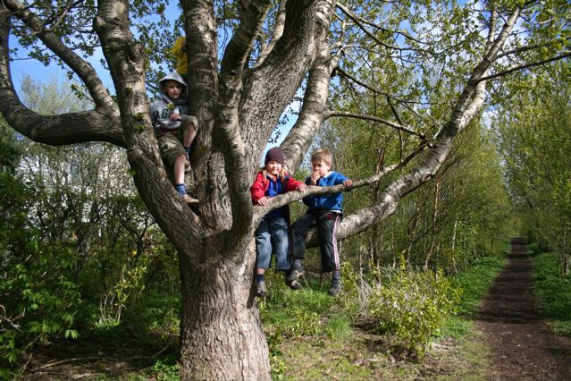

Title: Hugleiðing um þarfir barna fyrir náttúrutengingu 
Slug: hugleiding-um-tharfir-barna-fyrir-natturutengingu
Date: 2008-12-16 15:50:09
UID: 887
Lang: is
Author: Kristín Þorleifsdóttir
Author URL: 
Category: Borgarfræði, Samfélag, Umhverfismál
Tags: Norður-Karólína, Kristín Þorleifsdóttir, hverfahönnun, útivist, borgarskipulag, barnaleikir, garðar

Fyrir nokkrum árum þegar ég var við doktorsnám í umhverfishönnun í Norður-Karólínu vann ég að rannsókn á áhrifum hverfahönnunar á útiveru og hreyfingu bandarískra barna. Hin 10 ára gamla Sara var ein af fjölda barna sem valin voru til þess að til að veita leiðsögn um uppáhaldsstaðina í hverfinu sínu. Ég fylgdi henni og hundinum hennar, Pepper, eftir í mikla ævintýraför um hennar nánasta umhverfi.

Fyrsti áfangastaðurinn var bakgarðurinn heima hjá henni. Garðurinn var stór og grasi gróinn og hallaði frá húsinu niður að skóglendi. Sara var stolt af garðinum sínum en vildi ekki eyða miklum tíma þar. Við gengum í gegnum garðinn að þéttum skógarjaðri. Sara gekk alveg að jaðrinum, beygði sig niður og skreið í gengum lítið op á þykkninu, niður bakka og kom þar að litlum læk. Hún fór þetta lipurlega og af öryggi og ég á eftir, ekki alveg jafn mjúklega en áfallalaust þó.

Við lækinn tók Sara af sér skóna og sagði að ég yrði að gera slíkt hið sama. Leiðin lá eftir læknum inn í þykkan skóginn. Svitinn rann af mér því það var mjög heitt í veðri. Sara var forsjál og hafði tekið vatn með fyrir okkur. Við gengum eftir volgum læknum í nokkrar mínútur þar til við komum að stóru föllnu tré sem lá þvert yfir lækinn. Sara snéri sér að mér og tilkynnti rólega að við værum komnar að tréhúsinu hennar.

Í fyrstu var ekkert sem gaf til kynna að um hús væri að ræða, einungis nokkrar spýtur og trjábútar. Sara beygði sig niður og reisti heimatilbúinn stiga upp við fallna tréð. Hún klifraði upp stigann og sagði mér að fylgja sér. Hún sagði jafnframt að ég þyrfti að fara sérstaklega varlega þar sem ég væri kannski svolítið þung. Ég var á ókunnum slóðum inni í miðjum skóginum og varð að treysta henni fullkomlega. Sara þekkti þarna hvern einasta krók og kima og stýrði mér hvert fótmál.

Á leiðinni upp í tréhúsið snéri hún sér að mér mjög alvörugefin og bað mig að fara varlega svo ég skemmdi ekki köngulóarvefina. Hún benti á vefina sem ég hafði ekki tekið sérstaklega eftir en voru allt um kring! Sara benti á eina köngulóna og sýndi mér hreykin fallega spunnin vef hennar. Ég verð að viðurkenna að það fór svolítið um mig enda mikið af eitruðum köngulóm á þessum slóðum. Þegar Sara sá viðbrögð mín upplýsti hún mig um að sér þætti vænt um öll dýrin í skóginum og að þessar köngulær gætu bitið en væru ekki eitraðar.

Tréhúsið var hennar einkafelustaður og hún sagðist eyða miklum tíma þar. Þegar við vorum komnar inn í húsið sagði Sara við mig í einlægni að hún óskaði þess að ég væri tíu ára vegna þess að hana vantaði leikfélaga til að leika sér með í skóginum. „Mömmur vina minna leyfa þeim ekki að vera í skóginum af því að þær eru hræddar við skordýr, snáka og glæpamenn.“

Er við héldum ferðinni áfram komum við að „eyju“ í læknum. Sara benti mér á að fara vinstra megin við eyjuna. „Það er svo lítið vatn eftir í læknum því það er búið að vera svo þurrt og allir litlu fiskarnir eru þar sem er dýpst,“ útskýrði hún og sagðist ekki vilja raska ró þeirra. Fljótlega komum við að öðrum leynistað sem Sara kallaði „flekann“ – sem útbúinn var úr nokkrum spýtum sem hún hafði neglt saman. Hún snéri sér að mér og lýsti því hve fallegur þessi staður væri á vorin. „Þá eru bakkarnir þaktir fallegum mosa - eins og engi undir vatni - og þegar það rignir þá verða til fullt af litlum fossum. Þá sjást litlu fiskarnir líka mjög vel,“ bætti Sara við og ljómaði. „Einu sinni fann ég dauðan silfraðan fisk. Hann dó vegna þess að það var svo lítið vatn í læknum. Það var þá sem ég ákvað að grafa djúpar holur í lækinn og búa til eyjur“. Aldrei hefði mér dottið í hug að djúpa svæðið í læknum og eyjan sem við höfðum þrætt framhjá hefðu verið manngerð!

Brosandi leit Sara á mig og benti á frekar óaðlaðandi runna fyrir aftan flekann. Hún sagði mér stolt að þetta væru brómberjarunnar. Við týndum handfylli af berjum og settumst niður á flekann. Þar sem við sátum og borðuðum berin sagðist hún oft sjá dádýr í skóginum og að einu sinni hafi hún meira að segja fundið beinagrind af dádýri. Sara sagði mér líka að eldri bróðir hennar ætti nokkur virki í skóginum sem hann væri hættur að nota. „Það eru svona fjögur eða fimm virki í skóginum“, sagði hún og bætti við að krakkar noti ekki annarra krakka hús eða virki heldur byggi sitt eigið.

Við héldum áfram þar til við komum að föllnu tré sem Sara kallaði „brú“. Hún hoppaði á  „brúnni“ eins og tréð væri trampólín og út í lækinn. Pepper, hundurinn hennar, fór líka í lækinn og velti sér upp úr drullunni. Sara sagði mér að á þessu svæði hafi hún byggt sér virki sem tré féll á í síðasta fellibyl og hún ætli að flytja dótið sitt þaðan og yfir í tréhúsið.

Nú vorum við komnar að jaðri skógarins hinum megin. Þar voru boltavellir með grasi, tennisvellir og sundlaug. Aðspurð sagðist Sara hafa gaman af því að leika sér við Pepper á grasinu en að krakkarnir notuðu boltavellina lítið því grasinu væri svo illa við haldið. Sara sagðist oft fara í sundlaugina en hún væri bara opin á sumrin. Hún sagðist stundum eiga það til að gleyma sér þegar hún væri úti að leika en þegar mamma hennar vildi fá hana heim þá hringdi hún stórri bjöllu.

Frá sundlauginni gengum við yfir að tjörn þar sem Sara leyfði Pepper að baða sig. Við tjörnina, sem var söfnunartjörn fyrir yfirborðsvatn, voru nokkuð brattir bakkar og töluvert rof. Sara sagði mér þá frá skólaverkefni um jarðvegseyðingu sem hún vann þarna. Henni fannst það mjög skemmtilegt verkefni og hún skildi núna mikilvægi þess að binda jarðveg.

Við hliðina á tjörninni var vegur sem lá yfir lækinn sem rann í gegnum skóginn og framhjá tjörninni. Hún sagðist oft hafa leikið sér þarna í læknum og sérstaklega undir brúnni. „Foreldrum er hinsvegar ekki vel við þennan stað,“ sagði hún og bætti við, „af því að göngin undir brúnni eru löng og dimm og það sést ekki þangað frá götunni.“ Sara sagðist mega fara hvert sem er innan hverfisins svo framarlega sem hún segði móður sinni frá því hvert hún ætlaði að fara.

Við gengum eftir götunni upp nokkuð bratta hæð til staðar sem hún kallaði „langt í burtu garðinn“ – rétt hjá kaffihúsi þar sem maður getur keypt heimalagaðan ís. Í „langt í burtu garðinum“ tók Sara af sér skóna og gróf tærnar í hvítan sandinn. Ég gerði það sama. Hún gekk að leiktæki og sagði að sér fyndist gaman að þykjustuleikjum. Ég spurði hana um heitt og þurrt leiksvæðið og hún sagði að sér fyndist vanta blóm. „Og það væri ekki verra að hafa eitthvað vatn hérna og kannski skurð og úðara,“ bætti hún við.

Á móti kaffihúsinu var einn af uppáhaldsstöðunum hennar – grafreiturinn. „Ég kem oft hingað,“ sagði hún. „Það er svo gaman að lesa á legsteinana.“ Hún sagði mér að þessi grafreitur sé frá því löngu áður en hverfið var byggt og að einu sinni hafi legsteinn fallið á fót vinkonu hennar. Grafreiturinn var hluti af nokkuð stórum garði. Þessi garður var ekki skipulagður en þó lágu mjög skemmtilegir skógarstígar um allt. Við gengum eftir einum slíkum uns við komum að nokkuð stóru bjargi sem Sara uppgötvaði fyrir tilviljun. Hún þekkir svæðið greinilega vel og við gengum yfir á bjargið. Hún stóð á brúninni og lýsti því hve fallegt útsýnið sé þaðan yfir hverfið hennar. Þetta er einn þeim stöðum sem henni finnst hún eiga út af fyrir sig. Á leið okkar út úr garðinum settumst við niður á gömul þrep. Þar benti Sara mér á fallegt fíkjutré með stórum klösum af fíkjum. Hún sagðist hafa  gaman af að safna hlutum og að einu sinni hafi hún fundið gamla kókflösku í læknum og að hún hafi verið frá því 1918.

Síðasti staðurinn sem við heimsóttum var í skóginum á bak við skólalóðina í hverfinu. „Þarna er skúr sem bruggarar notuðu í gamla daga,“ segir Sara. „Hann gengur undir nafninu „Moonshiners Cabin“ vegna þess að þeir brugguðu í skjóli nætur.“ Þar hefur hún einmitt fundið aragrúa af spennandi hlutum; flöskur, koparstykki, túpur, gorma…  „Þetta er ótrúlega dularfullur staður sem á bráðum að gera að almenningsgarði,“ sagði Sara, frekar súr á svipinn.

Áður en ég lagði upp í þennan ógleymanlegu leiðangur um hverfið hennar Söru var mynd mín af umhverfinu allt önnur. Myndin sem ég hafði var af fallegu en „of“ snyrtilegu hverfi með almenningsstöðum sem fáir nota. Eftir leiðangurinn með sérfræðingi hverfisins leit ég á það sem ævintýraheim sem uppgötvast ekki nema að skyggnst sé dýpra inn í umhverfið og sjálfið. Sara er, eins og flest börn, ótrúlega næm á umhverfi sitt, með sterka náttúrutengingu og greinilega mikla þörf fyrir hana.

Aukning ýmissa lífstílssjúkdóma hefur verið mikið í umræðunni undanfarin ár og taka sum meðferðarúrræðin mið af lækningamætti náttúrunnar. Sara þjáist af ofvirkni og er með athyglisbrest en það var hvorki að sjá né finna í þessum leiðangri. Öll börn hafa mikla þörf fyrir tengingu við umhverfi sitt og því er mikilvægt að taka tillit til þeirra þarfa í hverfaskipulagi.
