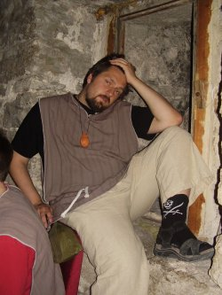
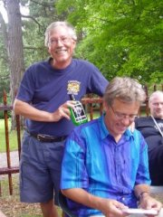
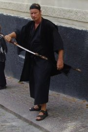
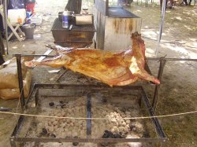
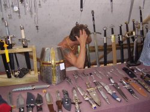
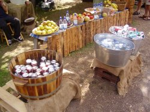
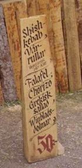

Title: Hugleiðingar um tímaskekkjur og fjölmenningu Miðaldavikunnar á Gotlandi
Slug: hugleidingar-um-timaskekkjur-og-fjoelmenningu-midaldavikunnar-a-gotlandi
Date: 2007-03-08 15:12:00
UID: 140
Lang: is
Author: Óli Gneisti Sóleyjarson
Author URL: 
Category: Þjóðfræði
Tags: 

Frá árinu 1984 hefur verið haldin Miðaldavika í bænum Visby á Gotlandi. Hátíðin fer fram í elsta hluta bæjarins sem er að mestu umlukin gömlum borgarmúr. Bærinn komst á heimsminjaskrá Sameinuðu Þjóðanna árið 1995. Þjóðfræðinemar heimsóttu Visby og Miðaldavikuna í fyrrasumar.

Í einum Simpsonsþætti þá eru íbúar Springfield að endurskapa orrustu úr Þrælastríðinu. Frá fylli&shy;byttunni Barney koma efasemdir um að indverski kaupmaðurinn Apu Nahasa&shy;peema&shy;petilon sé rétti maðurinn til að leika Suður&shy;ríkja&shy;her&shy;foringjann Stonewall Jackson. Þegar endurvakning fer fram og virkja á menningararfinn þarf að taka ýmsar ákvarðanir. Sú fyrsta er hvort endur&shy;vakningin sé opin eða lokuð fyrir áhrifum. Hvort menningararfinn megi nýta af utanaðkomandi aðilum og hvort megi breyta honum. Hvaða afstaða er tekin á Miðaldavikunni í Visby?

Greining þjóðfræðingana Owe Ronström og Ulf Palmenfelt úr Gotlandsháskóla á hátíðinni var sú að hún væri í raun ekki endurhvarf til miðalda heldur væri hún tilraun til að endurskapa miðaldir eins og nútímamönnum fyndist að þær ættu að hafa verið. Búningar hátíðargesta sýndu þetta vel. Margir voru þeir meira í ætt við endurreisnartímabilið heldur en miðaldir. Tónlist hátíðarinnar var að einhverju leyti tilraun til endurvakningar á miðaldatónlist en þó voru áhrif frá ýmsum öðrum tímum. 

Endurreisnarstraumar voru áberandi en einnig var þar að finna ýmislegt nær okkur í tíma. Á stundum leið manni eins og leikarar úr Pirates of the Caribean væru að umkringja mann. Það er reyndar ekki úr lausu lofti gripið þar sem Visby var á tímabili sjónræningjamiðstöð en væntanlega hafa búningarnir þá ekki verið svona líkir þeim sem Johnny Depp hefur klæðst.

Það sem kom meira á óvart en endurreisnaráhrif voru straumar frá Austurlöndum, bæði nær og fjær. Okkur var sagt frá að Ninjar frá Japan hefðu sést á ferli. Á götum Visby sást líka Samuræji í fullum skrúða (eða eins miklum skrúða og heita veðrið leyfði). Á tónleikum tileinkuðum enskri miðaldatónlist sást arabískur sjeik fylgjast spenntur með. Áhrif miðausturlanda voru hins vegar mest á matsölustöðum miðaldamarkaðarins. Það er erfitt að ímynda sér Hansakaupmenn rölta um miðbæ Visby á þrettándu öld og panta sér Shish Kebab eða Falafel en þetta voru algengustu réttir á matseðlum markaðarins. Reyndar mátti líka finna hamborgara á matseðlunum. Miðaldamenn númtímans gátu einnig pantað sér mexíkanska og kínverska rétti á þessum markaði tíma- og landfræðiskekkju. Vorrúllur, chorizo og wok.

Ýmislegt var gert til þess að láta skyndibita nútímans fá á sig fortíðarbrag. Það var þó mörgum gestum hulin ráðgáta hvers vegna kebab pinnar urðu miðaldalegri við að vera settir í baggette brauð. Sumt var þó með meiri evrópskum miðaldabrag. Meðal annars voru sykurepli og brenndar möndlur á boðstólnum. Einnig var boðið upp á heilsteikt svín á teini fyrir þá sem vildu taka meiri áhættu.

Það var ekki bara á matarsviðinu þar sem fjölmenning var á boðstólnum. Vopnamarkaðurinn var líflegur. Hann innihélt sverð, rýtinga, boga, hjálma og skildi. Vopnin voru ekki öll miðaldaleg. Tíma- og landfræðiskekkjan náði ákveðnum hápunkti þegar höfundur rakst á vopn sem virtust komin úr Star Trek heiminum á söluborði. Einnig var hægt að kaupa sér ókarínu sem er eitt elsta hljóðfæri sem þekkt er. Ókarínan er hins vegar væntanlega með öllu ótengd evrópskri miðaldamenningu.

Þó fólk sé á miðaldahátíð þá þýðir það ekki að það þurfi að sleppa nútímatækni. Búningaklætt fólk rölti um með farsíma í hönd veifandi stafrænu myndavélunum sínum til að eiga minningar frá hátíðinni til að sýna vinum sínum þegar heim væri komið. Annars voru nútímaþægindin að vissu leyti eitthvað sem fólk reyndi að fela, eitthvað til að skammast sín fyrir. Hægt var að kaupa sér vatnsflöskur í pappírspoka sem yfirleitt eru notaðir utan um vínflöskur. Tveir ungir drengir seldu líka mjög ómiðaldalegar gosdósir. Reyndar var kæliaðferin ótæknivædd, dósirnar flutu í einskonar trogi sem var fyllt vatni.

Utan hátíðarinnar sjálfrar mátti sjá skemmtileg undarlegheit. Í endursköpun á miðaldamessu predikaði sænskur prestur að lútherskum sið á sænsku í þýskri miðaldakirkju umkringdur kuflklæddum munkum. Það eitt og sér að hafa víkingapizzastað verður að teljast undarlegt. Reyndar var ekkert víkingalegt við staðinn. Matseðillinn var augljóslega ekkert tengdur víkingum. Á staðnum var spiluð tónlist frá mið-austurlöndum og afgreiðslufólkið virtist flest vera frá því svæði líka. En þegar ég fór inn til að ná í tómatssósu fyrir franskarnar mínar rakst á ég á víking í fullum klæðum sem var væntanlega að kaupa sér víkingamat. Kannski var þetta þá einfaldlega staður sem seldi víkingum pizzur?

Búningaklæddir hátíðargestir voru líklega fjölbreyttari hópur en í Visby miðalda. Heilu fjölskyldurnar uppdressaður í miðaldastíl (eða endurreisnar). Það skipti engu hvort fólk virtist vera líklegt að geta talið upp sænska forfeður sína aftur til miðalda eða bara nýflutt til landsins. Miðaldafólk í nútíma hjólastólum sást líka víðs vegar á hátíðarsvæðinu.

Niðurstaðan er sú að Miðaldavikan á Gotlandi er greinilega fyrir alla. Enginn er skilinn útundan. Vertu þú sjálfur eða hver sem þú vilt vera. Opin en ekki lokuð. Er fjölmenning ekki líka það sænskasta sem maður getur hugsað sér?

