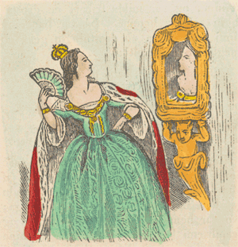

Title: Hugmyndin um mig, þig og alla hina
Slug: hugmyndin-um-mig
Date: 2008-05-08 14:50:07
UID: 292
Lang: is
Author: Íris Ellenberger
Author URL: 
Category: Fræðasamfélagið, Menningarfræði
Tags: sjálfsmynd, sjálfskennd, sjálfsvitund, Menningarfræði, sjálfsmyndarpólitík, við og hinir, Lawrence Grossberg, Stuart Hall, Joan Scott, Craig Calhoun, Frederick Cooper, Rogers Brubaker, Lázló Vörös, módernismi, hugmyndafræði, þjóðernissjálfsmynd, hópar

Í hinu svokallaða fjölmenningarsamfélagi er „mismunurinn“ kóngur í ríki sínu. Þó mætti segja að þetta fyrirbæri hafi fyrst á 7. áratug 20. aldar fengið ákveðna stöðuhækkun og öðlast gildi, m.a. sem grundvöllur að þeirri sjálfsmyndarpólitík sem hefur tröllriðið Vesturlöndum á síðustu áratugum. Minnihlutahópar gera kröfu til jafnréttis á við aðra samfélagsþegna og vilja fá að vera öðruvísi, þ.e. lausir undan kröfum meirihlutasamfélagsins um að samlagast því svo það geti látið sem menningarmunur sé ekki til. Menningarfræðin (_cultural studies_) hefur gengið til liðs við þennan málstað og þaðan sækja pólitískar hreyfingar gjarnan rökstuðning sinn. Þar er sjálfsmynd (_identity_) eðlilega lykilhugtak og rannsóknir á því fyrirbæri hafa margfaldast á síðustu áratugum. Sjálfsmyndarrannsóknir eru því ekki einfaldlega tískufyrirbrigði heldur gegna þær mikilvægu hlutverki sem vopn í sjálfsmyndarpólitík.

En hvers konar fyrirbæri er þessi sjálfsmynd?

Sú sjálfsmynd sem hér er talað um felur í sér ákveðinn þýðingarvanda. Sjálfsmynd er aðeins ein af mörgum þýðingum á enska hugtakinu _identity_. Ekkert eitt íslenskt heiti hefur náð að fanga merkingu þessa erlenda hugtaks og því hafa aðrir kosið að nota hugtök eins og sjálfsvitund, sjálfskennd eða samsömun. Þessi vandi er að mörgu leyti til kominn vegna ákveðins ósamræmis í merkingu hugtaksins _identity_ og er þetta ósamræmi jafnframt uppspretta mikillar gagnrýni sem hér verður rakin nánar.

Stanely Aronowitz, félags- og menningarfræðingur, hefur rekið uppruna hugmyndarinnar um sjálfsmynd allt aftur til John Locke sem taldi meðvitund og nánasta umhverfi einstaklingsins móta sjálfsmynd hans.[^1]  Merking hugtaksins hefur síðan tekið stakkaskiptum. Það átti lengi aðeins við um einstaklinga en á síðari hluta 7. áratugarins var því varpað yfir á hópastigið. Í kjölfarið gerðu ýmsir hópar tilkall til sjálfsmyndar, eða hópsjálfsmyndar réttara sagt. Sjálfsmyndarpólitík og ýmsir aðrir þættir urðu til þess að hugtakið varð að hálfgerðri klisju strax á 8. áratugnum.[^2] Mætti segja að vinsældir hugtaksins hafi kippt stoðunum undan því sem greiningartæki.

Það þarf ekki að lesa mikið í þessum fræðum til að verða var við að sjálfsmynd (eða réttara sagt hið erlenda hugtak, _identity_) hefur margar mismunandi merkingar og virðist fræðimanninum nokkurn veginn í sjálfs vald sett hvernig hann mótar sína eigin skilgreiningu og það án þess að fara um hana mörgum orðum. Þrátt fyrir það hefur fræðimönnum, t.d. sagnfræðingnum Frederick Cooper og félagsfræðingnum Rogers Brubaker, tekist að greina ákveðnar stefnur í merkingu þess.

Cooper og Brubaker telja að í flestum tilvikum skírskoti sjálfsmyndir til þess hvernig gjörðir stjórnist, eða geti stjórnast, af sjálfsvitund eða sjálfskennd einstaklingsins frekar en eiginhagsmunum. Sjálfsvitund einstaklingsins geti borið hagsmuni hans ofurliði. Þeir benda þó á að sjálfsmynd, eða öllu heldur enska hugtakið _identity_, vísi einnig til þeirrar sjálfsvitundar sem hópur deili með sér, nokkurs konar hópsjálfsmynd. Séu þetta tvær algengustu merkingar hugtaksins jafnvel þótt það hafi einnig verið notað í margvíslegum öðrum skilningi.[^3] Hér á Íslandi hafa sjálfsmyndir verið vinsælt viðfangsefni rannsókna á þjóðerni og þjóðernisstefnu á grundvelli kenninga um að sjálfsmynd sé engin án andhverfu sinnar, þ.e. myndar af öðrum. Sjálfsmyndin sem hér um ræðir er hópsjálfsmynd þar eð „við“ erum ekki til án „hinna“. Virðist ekkert lát á þessum vinsældum.

Sjálfsmyndarannsóknir hafa þó átt mjög undir högg að sækja erlendis, einmitt vegna þeirrar miklu grósku sem nú ríkir í fræðunum, sér í lagi í menningarfræðum. Margir þeirra fræðimanna sem teljast upphafsmenn menningarfræðanna og áttu þátt í að móta sjálfsmynd sem fræðilegt hugtak hafa nú snúið baki við því og telja það alls kostar ónýtt. Stuart Hall, einn upphafsmanna menningarfræðinnar, hefur einmitt bent á þá þverstæðu að sífellt fleiri dragi í efa notagildi hugtaksins til greiningar.[^4] Margir halda því fram að það sé einfaldlega ofnotað og notað of ómarkvisst. Það þýði allt og ekki neitt og sé því ónothæft sem greiningartæki.

Gagnrýni fræðimanna á notkun hugtaksins felst að mörgu leyti í að benda á þessa ofnotkun og alls ónákvæma notkun hugtaksins. Cooper og Brubaker bætir við að slík notkun breiði yfir frekar en upplýsi þau vandamál sem fylgi samskiptum milli menningarheima og landamæra á milli.[^5] Richard Handler mannfræðingur hefur jafnframt gagnrýnt að „sjálfsmynd“ sé notuð þvert á menningarheima og tíma.[^6] Lázló Vörös sagnfræðingur tekur í sama streng og bendir á að það sé mjög umdeilanlegt að yfirfæra sjálfsmyndir, hvað þá hópsjálfsmyndir, yfir á samfélög fyrir tíma nývæðingarinnar enda virðist almennt samþykkt að hugtakið sé afleiðing hennar.[^7] Jafnframt telur Joan Scott sagnfræðingur að sjálfsmynd þjóða sé yfirleitt sjálfsmynd afmarkaðs hóps, þ.e. karlmanna úr millistétt, sem sé yfirfærð á þjóðina í heild sinni og treysti þannig völd karla á kostnað kvenna.[^8] Craig Calhoun félagsfræðingur bendir á að það eigi einnig við um alla þá sem ekki tilheyri valdahópunum sem sjálfsmyndin er metin út frá.[^9]

Þótt undarlegt megi virðast þá telur Stuart Hall að þrátt fyrir alla þessa gagnrýni og meira til, þá sé ekki hægt að varpa hugtakinu fyrir róða. Ástæða þessarar þversagnar er einföld, að mati Hall. Við höfum ekkert annað tæki til að „hugsa með“. Hugtakið hefur að hans mati verið afbyggt án þess að annað sambærilegt hafi komið þess í stað og því neyðumst við enn til að nota hina gölluðu „sjálfsmynd“. Við getum ekki verið án þess ef við ætlum að fjalla um ákveðnar lykilspurningar. Leiðin sem hann sér úr þessum vanda er orðræðunálgun sem felist í að endurskilgreina sambandið milli viðfangsins og orðræðu, þ.e. ferli (_identification_) sem byggir á viðurkenningu á sameiginlegum uppruna eða einkennum með öðrum einstaklingum eða hópum auk þeirrar samheldni sem ríkir innan hópsins. Ferli er hér lykilorð því Hall leggur áherslu á eilíft ferli hinnar nýju hugmyndar leysi hina föstu og ósveigjanlegu sjálfsmynd af hólmi.[^10]

Aðrir fræðimenn taka í sama streng og telja að það þurfi að endurskilgreina hugtakið, eða jafnvel skapa ný sem séu sértækari og þannig nákvæmari greiningartæki fyrir fræðimenn. Cooper og Brubaker sem eru meðal þeirra sem vilja skipta gömlu „sjálfsmyndinni“ út og leggja fram önnur hugtök sem gætu komið í hennar stað án þess þó að nokkurt þeirra geti leyst hana fullkomlega af hólmi. En til þess er leikurinn einmitt gerður. Þeir vilja jafnframt greina skýrt á milli sjálfsmyndar einstaklinga og hópa og nota mismunandi hugtök yfir þessi tvö fyrirbæri. Þeir stinga t.d. upp á hugtökunum _commonality_, _connectedness_ og _groupness_ þegar rætt er um hópa, allt eftir því hvort hópurinn deili ákveðnum einkennum, hvort meðlimirnir séu bundnir samfélagslegum böndum eða hafi mjög sterka tilfinningu fyrir því að tilheyra sama hópi. Þeir leggja einnig áherslu á þann sem skapar sjálfsmynd einstaklinga (_the identifier_) og leggja til hugtök sem geta gefið hugmynd um hvort sjálfsmynd einstaklingsins sé mótuð af honum sjálfum eða hvort utanaðkomandi aðilar móti hana.[^11] Á grundvelli hugtaka Coopers og Brubakers finnur Lázló Vörös not fyrir sjálfsmyndarhugtakið en hann telur að það megi virkja sem regnhlífarhugtak yfir mismunandi leiðir til sjálfsvitundar, kennsla eða tengsla við hóp.[^12]

Lawrence Grossberg vill ganga enn lengra. Hann hefur mikinn áhuga á eðli og takmörkunum módernískra hugmynda og raka sem móta hugmyndafræðilegan grundvöll sjálfsmyndarinnar. Því setur hann fram þá spurningu hvort e.t.v. þurfi að grípa til allt öðruvísi kenningarlegrar nálgunar. Ef til vill þurfi að nálgast vandamálið út frá öðrum kenningagrunni og kannski út frá annarri hugmyndafræði en þeirri módernísku. Hann sækir innblástur til heimspekingsins Giorgio Agamben, sem telur að hægt sé að „tilheyra“ stærri heild (_belong_), án sjálfsmyndar (_identity_). Slíkt ástand myndi byggjast á hinu einstaka (_singularity_), tilveru sem sé hvorki hugmyndafræðileg eða almenn né persónubundin eða sértæk. Til að útskýra mál sitt notar hann hugmyndina um dæmið sem „always already belongs in the place of the other“, það vísar alltaf út fyrir sig, er alltaf í stöðu „hins“. Tengsl dæmisins við heildina byggist á nafnhvörfum þannig að hver stakur hluti getur orðið dæmi fyrir heildina og skiptir engu hversu ólíkir mismunandi hlutar eru.[^13] Þannig öðlast ólíkustu hlutar heildarinnar sama sess.

Uppgjörið við sjálfsmyndina er því ekki aðeins spurning um skilgreiningarvanda eða nákvæmari hugtakanotkun. Það gæti, ef Grossberg fær einhverju ráðið, kallað á uppgjör við hefðbundnar hugmyndir um „mig“ og „okkur“ og hvað það þýðir að tilheyra hópi eða þjóð.

[^1]: Aronowitz, Stanley, “Reflections on Identity”, _The Identity in Question_. John Rajchman ritstjóri. Routledge, New York 1995, bls. 111-127.

[^2]: Cooper, Frederick og Brubaker, Rogers, „Identity“, _Colonialism in Question. Theory, Knowledge, History_. University of California Press, Berkeley 2005, bls. 61.

[^3]: Cooper, Brubaker, „Identity“, bls. 65.

[^4]: Hall, Stuart, „Introduction: Who Needs „Identity“?“, _Questions of Cultural Identity_. Stuart Hall og Paul du Gay ritstjórar. Sage Publications, London 1996, bls. 1

[^5]: Cooper, Brubaker, „Identity“, bls. 65.

[^6]: Vörös, László, „Methodological and Theoretical Aspects of „Social Identities“ Reasearch in Historiography“, _Frontiers and Identities. Exploring the Rearch Area_. Lud’a Klusáková og Steven G. Ellis ritstjórar. Edizioni Plus, Pisa 2006, bls. 30.

[^7]: Vörös, „Methodological and Theoretical Aspects of „Social Identities““, bls. 33.

[^8]: Scott, Joan W., _Only Paradoxes to Offer. French Feminists and the Rights of Man_. Harvard University Press, Cambridge 1996, bls. 1-11.

[^9]: Calhoun, Craig, „Nationalism and Civil Society: Democracy, Diversity and Self-Determination“, _Social Theory and the Politics of Identity_. Blackwell, Oxford 1994, bls. 311.

[^10]: Hall, „Introduction“, bls. 1-2.

[^11]: Cooper, Brubaker, „Identity“, bls. 71-75.

[^12]: Vörös, „Methodological and Theoretical Aspects of „Social Identities““, bls. 32.

[^13]: Grossberg, Lawrence, „Identity and Cultural Studies: Is That All There Is?“, _Questions of Cultural Identity_. Stuart Hall og Paul du Gay ritstjórar. Sage Publications, London 1996, bls. 103-04.
