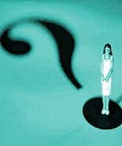

Title: Hugsandi — og tilvist skyldra vefrita
Slug: hugsandi-og-tilvist-skyldra-vefrita
Date: 2006-10-05 15:06:00
UID: 99
Lang: is
Author: Hrafnkell Lárusson
Author URL: 
Category: Vefurinn, Fjölmiðlar
Tags: 

Fyrir tæpu ári síðan, nánar tiltekið 18. október 2005, hóf vefritið Hugsandi göngu sína. Vefritið hafði veltst um á hugmynda- og umræðustigi sumarið 2005 en þegar tók að hausta fóru aðstandendur þess að vinna markvisst að því að byggja fjárhagslegan, tæknilegan og hugmyndalegan grunn undir það. Til að koma Hugsandi á laggirnar þurfti ákveðið lágmarksfjármagn. Styrkja var því leitað, en undirtektir við styrkbeiðnum voru misjafnar. Sem betur fer voru til aðilar sem höfðu skilning og trú á framtakinu og veittu okkur fjárhagsstuðning. Þar skiptu mestu styrkir frá Sagnfræðistofnun Háskóla Íslands og Mannfræðistofnun HÍ. Síðar bættist Stúdentasjóður í hóp stuðningsaðila Hugsandi. 

Ljóst var frá upphafi að enginn aðstandenda vefritsins myndi fá fyrirhöfn sína greidda í peningum enda var ekki til þess stofnað með það huga. Hugsandi var, og er, framtak ungs háskólafólks sem vill auka umræðu um fræði og menningu á netinu og efla þátttöku ungs fólks með því að fá það til að koma sjónarmiðum sínum og hugðarefnum á framfæri. Hugsandi er þó opinn öllum (óháð aldri) sem vilja tjá sig um þessi efni. Við höfum frá upphafi lagt áherslu á að fá inn framandi sjónarhorn. Í því samhengi höfum við m.a. lagt sérstaka áherslu á að fá íslenska námsmenn við erlenda háskóla til að veita lesendum Hugsandi innsýn í það samfélag sem þeir lifa og hrærast í. Spanna slíkar umfjallanir frá því að vera almennar lýsingar á skólalífi og umhverfi yfir í að greina frá skipulagi náms eða kennsluháttum í einstökum námskeiðum. Í heildina tekið hefur það efni sem birst hefur á Hugsandi verið afar fjölbreytt, en það er í góðu samræmi við tilgang vefritsins.  

Þegar leitarorðinu „vefrit“ er slegið upp í leitarvél á netinu koma fyrst upp færslur með vefritum sem varða stjórnmál. Ýmist er þar um að ræða vefrit sem stjórnsýslustofnanir standa að eða (og það sem algengara er) vefrit sem haldið er úti af stjórnmálaflokkum, ungliðahreyfingum stjórnmálaflokka eða öðrum einstaklingum sem merkja sig einhverjum ákveðnum pólitískum viðhorfum. Margt fólk er afar ástríðufullt þegar kemur að stjórnmálum og er tilbúið til að hafa skoðanir á flestu sem kemur til umræðu í þeim efnum. Þessi sterka ástríða til að tjá skoðanir sínar og reyna að hafa áhrif á skoðanir annarra er eitt meginhreyfiafl pólitísku vefritanna sem eðlislægt eru mjög miðuðu að þjóðfélagsumræðu hvers tíma. Það er enginn flokkur íslenskra vefrita gróskumeiri en pólitísku vefritin og umræða um íslensk stjórnmál hefur fyrir löngu skotið styrkum rótum á netinu.

En hvernig reiðir annarskonar vefritum af, t.d. þeim sem líkt og Hugsandi róa á mið fræða- og menningar? Hér verða reifuð nokkur dæmi en rétt er að taka fram að þessari úttekt er alls ekki ætlað að vera tæmandi. Hér er fjallað um vefrit, þ.e. vefmiðla sem birta reglulega efni sem jafnan er í formi stuttra greina eða pistla, en ekki veftímarit, sem jafnan eru með strjálli birtingar og umfangsmeiri greinar en vefritin. Dæmi um veftímarit má nefna veftímaritin [Vefni](http://bok.hi.is/vefnir) og [Microhistory](http://www.microhistory.org ).

Bókmenntavefritið [Skýjaborgir](http://skyjaborgir.blogspot.com/) hóf göngu sína haustið 2004. Efni þess var innbyrðis ólíkt bæði að efni en einnig að frágangi og umfangi og það birtist með óreglulegu millibili. Að dómi þess sem þetta skrifar voru það mistök hjá aðstandendum Skýjaborga að tileinka vefritið skáldinu Einari Benediktssyni. Það gaf þá ímynd að vefritið væri minningarreitur um rómantíseraða fortíð fremur en lifandi vettvangur í samtímanum. Þrátt fyrir að á annan tug manna væru skráðir aðstandendur Skýjaborga lifði vefritið aðeins í rétt rúmlega hálft ár eða þar til aðstandendur þess ákváðu í apríl 2005 að taka sér frí — sem þeir eru enn í.

Í desember 2005 lifnaði á netinu vefrit sem nefndist [Draumur um straum](http://www.draumurumstraum.net/). Tveir af þremur aðstandendum þess höfðu áður verið áberandi í hópi þeirra sem stóðu að Skýjaborgum. Tilgangur Draumsins skyldi vera þátttaka í umræðu um menningu og samfélagsmál. En einnig átti hann að birta greinar, þýðingar, gagnrýni, fréttir, o.fl. Draumurinn fór af stað af miklum krafti og var með daglegar birtingar fyrstu vikurnar. Á þeim sama tíma minnti vefritið þó raunar meir bloggsíðu eins aðstandandans en á hefðbundið vefrit, með fjölbreyttu efni eftir marga höfunda. En þrátt fyrir ágæta byrjun var draumurinn brátt úti. Strax á öðrum mánuði fór að líða lengra milli þess að efni birtist. Eftir það strjáluðust birtingar enn frekar þar til Draumurinn lagðist af fjórum mánuðum eftir að hann var settur á laggirnar. Efni Draumsins var allt eftir aðstandendur síðunnar, en samt sem áður var það mjög sundurleitt og umfang greina var afar misjafnt.  

Vefritið [Kviksaga](http://www.kistan.is/efni.asp?f=15) var formlega opnað með tilheyrandi glasalyftingum í febrúar 2005. Það spratt sem „útnári“ út úr hinu rótgróna vefriti Kistunni, en á meðan Kviksaga lifði mátti jafnvel finna sama efnið á báðum síðunum. Kviksaga fór bratt af stað og lifði hröðu og hávaðasömu lífi. Aðstandendur vefritsins vildu hvetja til umræðu, einkum vildu þeir ögra lesendum til skoðanaskipta um afmarkað fræðilegt efni sem þeim var mjög hugleikið. En þrátt fyrir hressilegt upphaf var líftími Kviksögu stuttur og raunar var mestur vindurinn úr henni eftir tæpa þrjá mánuði. Frá þeim tíma og þar til vefritið var formlega lagt niður (rúmu hálfu ári eftir að það opnaði) lognaðist það útaf hægt og rólega. Kviksaga leið frá upphafi fyrir að vera markað of þröngt sjónarhorn. Vefritinu var beint í ákveðið far og í því fór það fram og til baka og missti þannig athygli lesenda. Líkt og hjá Skýjaborgum og Draumi um straum voru greinarbirtingar á Kviksögu óreglulegar. Kviksaga sker sig þó á margan hátt frá hinum vefritunum tveimur, t.d. með þeirri sérkennilegu ráðstöfun að fjölga birtingum með því að endurbirta reglulega nýlegar birtar greinar um eftirlætis hugðarefni ritstjórnarinnar. 

Það vefrit í fræða- og menningargeiranum sem hefur lifað lengst er vitanlega [Kistan](http://www.kistan.is/) Stofnsetning hennar var merkilegt brautryðjendaverk Matthíasar Viðars Sæmundssonar sem byggði þann grunn undir Kistuna sem hún hefur staðið á síðan. Kistan hefur þjónað mikilvægu hlutverki í íslenskri menningarumræðu og efnisfærslur á henni hlaupa á þúsundum. Kistan nýtur þess að hafa sterka bakhjarla og hefur að því leyti aðra stöðu en önnur álíka vefrit sem síðar hafa komið fram. En Kistan hefur fyrir nokkru tekið að líða fyrir það form sem henni er búið. Á hana er kominn ákveðinn stofnanabragur og hún ber merki stöðnunar. Sjálf vefsíðan er gamaldags. Hún er dimm og þung í vöfum og er raunar í flestu tilliti úr takti við vefsíðgerð samtímans. Efnislega hefur Kistan líka látið á sjá. Langstærsti hluti efnisins eru „hriflugreinarnar“ svokölluðu sem jafnan innihalda bóka- eða kvikmyndarýni. Þessar greinar eru ágætar fyrir sinn hatt en ekki efni til að vera uppistaða birtinga á riti eins og Kistunni. Meðal efnisins eru einnig áberandi ýmsar tilkynningar og inn á milli slæðast svo einstaka greinar og bloggkenndir vangaveltupistlar. Kistan er sannarlega í þörf fyrir andlitslyftingu og endurhæfingu því að nú, sem fyrr, er þörf fyrir hana í menningar- og fræðaumræðunni.

Ástæða þess að vefrit eru stofnsett eða leggjast af eru vafalaust jafnmargar vefritunum sjálfum. Það veit sá sem þetta skrifar að það kostar verulega fyrirhöfn að koma vefriti á fót og elju að halda því úti. En það eitt og sér er ekki nóg. Til að vefrit lifi þarf það að höfða til væntanlegra lesenda. Til að ná því markmiði verða aðstandendurnir að nálgast viðfangsefnið með hugarfari lesandans en mega ekki gleyma sér í eigin hugarheimi eða boðun ákveðinna viðhorfa. Vefritið þarf að marka sér ákveðinn sess. Það þarf að kynna hlutverk sitt, búa sér til ímynd og haga sér í samræmi við upplagið. Ekki síður er mikilvægt að aðstandendurnir vinni skipulega. Það þarf að vera taktur í útgáfunni þannig að lesendur viti að hverju þeir ganga. Það er leiðigjarnt fyrir lesendur að vafra um vefrit þar sem lítið eða ekkert gerist löngum stundum en síðan hellist inn mikið efni á stuttum tíma. Slíkt taktleysi er til þess fallið að fólk missi áhugann á vefritinu. 

Það má spyrja sig hvers vegna vefrit á sviði fræða og menningar eru svo fá og virðast eiga fremur erfitt uppdráttar. Á þetta útgáfuform ekki erindi sem erfiði í baráttunni við prent og útvarp eða er skortur á skipulagi og úthaldsleysi það sem verður vefritunum að falli? Þessari spurningu verður ekki svarað hér. En sé litið til þeirrar grósku sem hefur verið í fyrirlestrahaldi undangengin ár skýtur nokkuð skökku við að vefrit á sviði fræða og menningar skuli ekki vera fleiri og öflugri en raun ber vitni. Til að mynda eru margir ágætir fyrirlestrar sem fluttir eru hvergi birtir — og er það miður. Það leiðir til þess að þeir sem ekki hafa tök á að sækja einstaka fyrirlestra eða málþing eiga á hættu að fara alveg á mis við efni þeirra. Úr því mætti bæta með aukinni birtingu slíks efnis á vefritum. Það væri að mínum dómi afar jákvætt.

