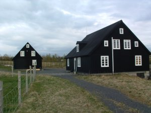
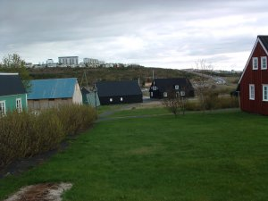
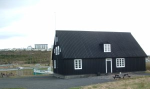

Title: Húsin heim?
Slug: husin-heim
Date: 2006-05-16 10:24:00
UID: 72
Lang: is
Author: Óli Gneisti Sóleyjarson
Author URL: 
Category: Menningarfræði, Safnafræði
Tags: 

Elgin-lág&shy;myndirnar eru eitt frægasta deiluefni safna&shy;fræðinnar. Lág&shy;myndirnar skreyttu Parþenonhofið í Aþenu allt þar til ársins 1799 að þeim var stolið af Elgin lávarði sem síðan seldi þær til British Museum. Grikkir hafa lengi vel reynt að fá töflurnar til baka en Bretar hafa ávallt neitað að skila þeim.[^1]   En leið okkar liggur ekki til Grikklands eða Englands heldur til Vopna&shy;fjarðar og Árbæjar (hugsanlega með stuttum stans í Viðey).

Árið 1973[^2]  voru tvö verslunarhús tekin niður á Vopnafirði og í kjölfarið endurreist á safnsvæðinu í Árbæ.  Það hafði staðið til að rífa húsin en Þjóðminjasafnið keypti þau til að nota sem geymslu í Reykjavík.  Það barst í tal að varðveita húsin á Vopnafirði en ekkert varð úr því.  Ekki er ljóst hvort það var peninga- eða áhugaleysi sem réð því.  En það voru til peningar til að flytja húsin og endurreisa í Reykjavík.

Nú á síðustu árum hefur á Vopnafirði verið unnið þrekvirki í að gera upp sögufræg hús á staðnum.  Í kjölfarið hafa heimamenn gert kröfu um að fá verslunar&shy;húsin sín aftur til að reyna að endurskapa miðbæinn.  Í millitíðinni hafði Þjóðminjasafnið afhent Árbæjarsafni húsin til varðveislu.[^3]

Minna húsið kallast Ullarhúsið eða Kjöt&shy;húsið (tvöfalda nafnið er komið til vegna þess að húsið þjónaði ekki sama hlutverki að vori og að hausti). Stærra húsið kallast Kornhúsið eða Beykisbúð (hafði fleiri en eitt hlutverk).  Kornhúsið er helst frægt fyrir að Kristján Fjallaskáld lést þar árið 1869.  Húsin eru nú notuð undir sýningar og safnastarf.[^4] 

Undanfarið hefur mikið verið rætt um Árbæjar&shy;safnið og mögulegan flutning þess út í Viðey.  Ekki er sátt um þessar hugmyndir. Guðný Gerður Gunnarsdóttir borgarminjavörður sagði í Fréttablaðinu þann 8. maí árið 2006:

> Árbæjar&shy;safn er útisafn, þar eru varðveitt gömul hús, sem hafa mikið gildi sem vitnisburður um byggingarlist, sögu og menningu borgarinnar. Með sýningum í safnhúsum er fólki gefin sýn inn í líf íbúa Reykjavíkur á fyrri tímum.[^5]

Í raun er þetta bara enduróm af markmiðum Minjasafns Reykjavíkur:

> Minjasafn Reykjavíkur safnar, varðveitir og rannsakar menningarminjar í Reykjavík og miðlar þekkingu um sögu og lífskjör íbúa í Reykjavík frá upphafi byggðar til nútímans. Starf safnsins miðar að því að glæða áhuga, skilning og virðingu fyrir sögu Reykjavíkur og að tryggja að allir hafi aðgang að menningararfi höfuðborgarinnar.[^6]

Allt er þetta gott og gilt sem markmið fyrir reykvískt safn en við hljótum að spyrja okkur hvaða gildi vopn&shy;firsku verslunar&shy;húsin hafa í þessu sambandi.  Það er ljóst að húsin segja okkur ekkert um sögu Reykja&shy;víkur, þau falla utan markmiða Árbæjar&shy;safns og Minja&shy;safns Reykja&shy;víkur.  Markmið Vopn&shy;firðinga er hins vegar að setja þau í samhengi við uppruna þeirra.  Þegar Guðný Gerður segir um mögulegt húsasafn í Viðey að „það ætti þá að gera það á forsendum þeirrar sögu sem gerst hefur í Viðey“[^7]  þá má líka skilja hana á þann hátt að vopn&shy;firsku húsin hafi ekkert hlutverk sem hluti af Árbæjarsafni.  Hrafn Gunnlaugsson, sem lengi hefur haldið á lofti hugmyndum um að flytja Árbæjarsafnið í Hljómskálagarðinn, segir að hús safnsins hafi „á sínum tíma [verið] byggð á Marbakka en [séu] nú úti á túni upp í Árbæ.“   Honum er greinilega ókunnugt um vopn&shy;firsku húsin en hugsunin er skýr, samhengið[^8] skiptir öllu.

Í teiknimyndaþættinum Futurama sem gerist um árið 3000 fara aðalpersónurnar á „Minnis&shy;merkja&shy;strönd“ þar sem ofurglæpon hefur komið fyrir minnis&shy;merkjum sem hann hafði stolið víðs vegar að.  Það sem var kannski verra en að glæpurinn sjálfur var að enginn í framtíðinni áttaði sig á hve ósmekklegt þetta safn var.  Reynsla mín af British Museum var reyndar svipuð og að horfa á Minnis&shy;merkja&shy;ströndina, þýfi breska heims&shy;veldisins.[^9] 

Vopn&shy;firðingar og Grikkir eru ekki einir um að vilja sögulegar minjar sínar heim, má þar nefna Egypta sem þekkt dæmi.  En fáir hafa fengið dýrgripi sína aftur með frægri undantekningu sem við Íslendingar þekkjum vel.  Þrátt fyrir að Danir hefðu eignast handritin með löglegum hætti á sínum tíma og þó að þau hafi legið undir skemmdum á Íslandi þegar þau voru flutt til Danmerkur þá var þeim skilað.[^10]   Þegar krafa Vopn&shy;firðinga verður hærri, sem allar líkur eru á, þurfa ráðamenn að spyrja sig hvort þeir vilji feta í fótspor Dana eða Breta.  Danir sendu heilt herskip með handritin til Íslands, geta Reykvíkingar verið minni menn?

[^1]: Stefán Pálsson, [„Hvenær hættir stuldur að vera stuldur?“](http://www.murinn.is/eldra_b.asp?nr=80&gerd=Hledsla&arg=2),  _Múrinn_ 10. ágúst 2001.
[^2]: Reyndar er ártalið ekki alveg á hreinu, í heimildaleit rakst ég á þrenn ártöl ; 1973, 1974 og 1975.
[^3]: Þór Magnússon, [„Verzlunarhúsin frá Vopnafirði“](http://mbl.is/mm/gagnasafn/grein.html?grein_id=592164), _Morgunblaðið_ 2. mars 2001.
[^4]: Helgi M. Sigurðsson (1998),  _Árbæjarsafn: Leiðsögubók_, s. 19-20.
[^5]: „Missir að Árbæjarsafni“, _Fréttablaðið_ s. 16, 8 maí 2006.
[^6]: [Heimasíða Árbæjarsafns](http://www.arbaejarsafn.is/).
[^7]: „Missir að Árbæjarsafni“, _Fréttablaðið_ s. 16, 8 maí 2006.
[^8]: „Árbæjarsafn verði flutt í Viðey og þar rísi íbúðahverfi“, _Blaðið_ s. 2, 8. maí 2006
[^9]: _Futurama_ - „When Aliens Attack“.
[^10]: Stefán Pálsson,  [„Hvenær hættir stuldur að vera stuldur?“](http://www.murinn.is/eldra_b.asp?nr=80&gerd=Hledsla&arg=2),  _Múrinn_ 10. ágúst 2001.

