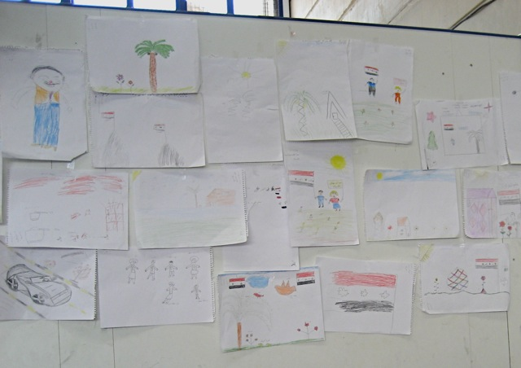
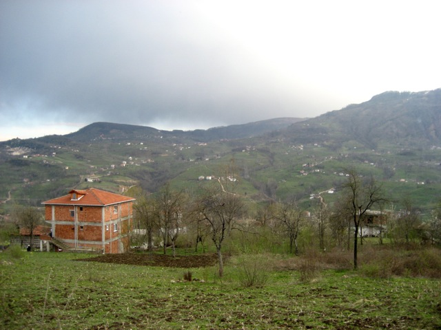

Title: Hvað er að gerast? Um nám í hnattvæðingu og aðlögun innflytjenda
Slug: hvad-er-ad-gerast
Date: 2008-03-27 14:22:52
UID: 235
Lang: is
Author: Jóhanna Helgadóttir
Author URL: 
Category: Póstur að utan
Tags: 

Eftir nokkurra ára námshlé var mig farið að þyrsta í að bæta við mig ofan á BA-prófið mitt og fannst líka að það gæti verið góð hugmynd að prófa að búa annarsstaðar en á Íslandi. Okkur heimilisfólkinu kom saman um að það væri fínt að taka hænuskref og stefna að því að finna nám á einhverju Norðurlandanna. Fyrir valinu varð mastersnám í hnattvæðingu og aðlögun innflytjenda (Master i globalisering og integration) sem kennt er við Háskóla Suður-Danmerkur (Syddansk Universitet) í Odense. Námið er eitt ársverk kennt á tveimur árum (fjórum önnum) þar sem nemendur og kennarar hittast eina stífa fyrirlestrahelgi í mánuði, s.s. svipað og fjarkennsla á Íslandi. Hér í Danmörku er ekki lagður sami skilningur í „master“ og á Íslandi, en hér samsvarar það líklega diplómanámi. Um MA-nám nota þeir „kandidat uddannelse“. 

Eins og heiti námsins ber með sér er það hnattvæðing og aðlögun innflytjenda sem er rammi námsins. Með því er í raun átt við að viðfangsefnin eru bæði innlend og alþjóðleg. Innan hnattvæðingarinnar er það sérstaklega frjálsir sem og þvingaðir fólksflutningar milli landa sem stór áhersla hefur verið lögð á og kenningar þar að lútandi. Einnig málefni flóttamanna og réttindi þeirra eins og þau birtast í flóttamannasamningi Sameinuðu þjóðanna og mannréttindasáttmála Sameinuðu þjóðanna.

Námið er fyrst og fremst hugsað fyrir fólk með háskólamenntun á einhverju sérsviði, t.d. kennara, hjúkrunarfræðinga, félagsráðgjafa o.s.frv. sem hefur unnið mikið með innflytjendum en vantar fræðilegan og kenningalegan bakgrunn á sviði innflytjendamála. En þangað slæðist þó inn fólk eins og ég sem hefur litla sem enga reynslu af vinnu með innflytjendum en hefur í staðinn brennandi áhuga á málefnum innflytjenda.

Stór kostur við námið hefur verið að kynnast fólki með eins ólíkan bakgrunn og þarna kemur saman; kennurum af öllum skólastigum, hjúkrunarfræðingum, ljósmæðrum, félagsráðgjöfum, og lögreglufólki sem allt hefur sína ólíku sýn á námsefnið og þau raunverulegu dæmi úr þeim veruleika sem við búum við hér í Danmörku. Fyrir mig hefur það verið sérstaklega áhugavert að hlusta á það sem lögreglufólkið hefur haft fram að færa til dæmis varðandi brottvísun dæmdra og ódæmdra innflytjenda og einnig varðandi mansal. Þarna er um fólk að ræða sem vinnur í návígi við þau mál sem flestir sjá aðeins úr fjarlægð.

Einn gestafyrirlesari er fenginn hverja fyrirlestrahelgi og hafa þeir verið eins misjafnir og þeir hafa verið margir. Nokkrir fyrirlestrar hafa vakið sérstakan áhuga minn t.d. um áhrif birtingar skopteikninganna af Múhameð fyrir tveimur árum á viðskipti Arla í Miðausturlöndum, um fólksfjöldafræði og innflytjendur og um fólksflutninga, vændi og mansal. Aðrir vöktu minni áhuga og oft þótti manni að betra hefði verið að nota dýrmætan tíman með föstu kennurunum í umræður um námsefnið.

Inn í námsferlið eru skipulagðar tvær námsferðir, önnur til einhverrar borgar í Evrópu í 3-4 daga á 2. önn og hin í u.þ.b. 8 daga ferð til einhvers lands í Miðausturlöndum eða Norður-Afríku á 3. önn. Í Evrópuborginni er þá meiningin að kynnast starfi sem tengist aðlögun innflytjenda eða öðru því sem hægt er að spyrða saman við námið. Og með ferð til Miðausturlanda eða Norður-Afríku er helsti tilgangurinn að kynnast því umhverfi sem margir innflytjendur í Evrópu eiga uppruna sinn í. Einnig er ætlunin að heimsækja opinberar stofnanir og alþjóðastofnanir sem og frjáls félagasamtök til dæmis sem láta sig mannréttindi varða. Eitthvað hefur þessi námsskipan þó farið fyrir ofan garð og neðan því borgarferð til Evrópu er ekki ráðgerð fyrr en núna í apríl. Hins vegar hefur okkur boðist að fara í tvær lengri ferðir þannig að margir hafa ekki fjárhagslegt bolmagn til að komast með í Berlínarferð, sem er auðvitað miður því það hefði verið mjög áhugavert að kynnast því starfi sem fer fram hjá og með innflytjendum í Berlín.

Námsferðirnar eru yfirleitt farnar í samfloti við aðra hópa, til dæmis nema í innflytjendafræðum (Indvandrerstudier) eða Miðjarðarhafsfræðum (Mediterranean studies) þar sem hóparnir eru yfirleitt ekki nógu stórir einir og sér til að hægt sé að ná hagstæðum kjörum. Af þeim orsökum höfum við ekki ráðið miklu um hvert hefur verið farið.

Á annari önn fór ég til Tyrklands þar sem dvalið var í Istanbul í nokkra daga og síðan haldið til Fatsa, Kumru og Trabzon. Í Istanbul var m.a. farið í heimsókn á kvennabókasafn, til AKP sem er einn af stóru stjórnmálaflokkunum, á dagblaðið Agos, og til danska konsúlsins. Eftirminnilegast var þó, annars vegar, að heimsækja þorpið Kumru (18.000 íbúar) þar sem helsta lifibrauð fólksins er heslihneturækt. Þar var tekið á móti okkur á einstakan hátt, bæði af opinberum embættismönnum sem og fólkinu í þorpinu. Hins vegar er það mjög minnisstætt hvernig við komumst í örlitla snertingu við heimafólkið á eigin vegum þar sem við gengum óvart inn í gamla gyðingahverfið í Istanbúl, fórum fyrir tilviljun í Bláu moskuna á afmælisdegi Múhameðs þar sem var einstök stemmning, fórum á Hammam í Trabzon (algjörlega laust við aðra túista en okkur) og ræddum aðeins við kaupmennina á basarnum í Trabzon. 

Á þriðju önn stóð svo til boða að fara í ferð til Sýrlands og Jórdaníu. Fyrir mig var það mun meira spennandi ferð. Löndin voru fyrir mér mjög framandi en einnig var mjög áhugavert að sjá hversu ólík þessi nágrannalönd eru, ekki aðeins ásýnd borganna Damaskus og Amman heldur einnig stjórnarfar. Skráningarmiðstöð flóttamannastofnunar Sameinuðu þjóðanna (UNHCR) fyrir íraska flóttamenn var heimsótt en Sýrland er það land á þessum slóðum sem hefur tekið við flestum flóttamönnum frá Írak síðan stríðið hófst í mars árið 2003. Einnig var heimsótt sú stofnun sem lýtur sérstaklega að aðstoð við flóttamenn frá Palestínu (UNWRA). Heimsótt voru kvenréttindasamtök bæði í Damaskus og Amman en starfsaðstæður þeirra voru eins og svart og hvítt þar sem samtökin í Damaskus höfðu ekki fengið leyfi stjórnvalda og störfuðu því ólöglega og algjörlega fyrir áhuga þess fólks sem stóð í forsvari. Í Amman hins vegar voru samtökin á vegum stjórnvalda, jafnvel í líkingu við okkar Jafnréttisstofu.

Á þessum þremur önnum sem liðnar eru hefur verið farið yfir gríðarlegt lesefni og dreypt á mörgu, t.d. innflytjendamálum hér í Danmörku sem og öðrum löndum, mismunandi birtingarmyndum fjölmenningarstefnu, málefnum flóttamanna, mikilvægi tungumálsins í aðlögun innflytjenda og kenningar varðandi móðurmál, tvítyngi, fjöltyngi og kennsluaðferðir, íslam, íslamisma og svo mætti lengi telja. Gallinn við svona hraðsuðu er auðvitað að sjaldan er hægt að fara djúpt í hvert atriði í kennslunni sjálfri. En kosturinn hins vegar að maður fær örlitla snertingu við mörg svið og það er þá á ábyrgð hvers og eins að dýpka skilninginn á því sem sérstakan áhuga vekur. 

----

#### Áhugaverðir tenglar

* [Det Danske Institut](http://www.damaskus.dk/damaskus/did2.nsf)

* __Síður hjá Syddansk Universitet__
  * [Syddansk Universitet](http://www.sdu.dk)
  * [Stofnun Miðausturlandafræða](http://www.sdu.dk/middle-east) 
  * [Um meistaranám í hnattvæðingu og aðlögun innflytjenda við Syddansk Universitet](http://www.sdu.dk/Uddannelse/Uddannelsesoversigt/Master/Master_Globalisering_Integration.aspx)
  * [Meira um meistaranám í hnattvæðingu og aðlögun innflytjenda við Syddansk Universitet](http://www.sdu.dk/Information_til/Studerende_ved_SDU/Din_uddannelse/Master_i_globalisering.aspx)

* __Tyrkland__
  * [Síða AKP stjórnmálaflokksins í Tyrklandi](http://www.akparti.org.tr/)
  * [Síða armenska dagblaðsins Agos í Tyrklandi](http://www.agos.com.tr/)

* __Stofnanir Sameinuðu þjóðanna er varða flóttamenn__
  * [The UN Refugee Agency](http://www.unhcr.org/cgi-bin/texis/vtx/home)
  * [The United Nations Relief and Works Agency for Palestine Refugees](http://www.un.org/unrwa/)

* __Kvennasamtök í Sýrlandi og Jórdaníu__
  * [The Jordanian National Commission for Women](http://www.jncw.jo/) 
  * [Syrian Women Observatory](http://www.nesasy.org/languages/index.php/En) 

* __Á Wikipediu um borgirnar og bæina:__
  * [Istanbul](http://en.wikipedia.org/wiki/Istanbul)
  * [Trabzon](http://en.wikipedia.org/wiki/Trabzon)
  * [Fatsa](http://en.wikipedia.org/wiki/Fatsa)
  * [Kumru](http://en.wikipedia.org/wiki/Kumru%2C_Turkey)
  * [Damaskus](http://en.wikipedia.org/wiki/Damaskus)
  * [Amman](http://en.wikipedia.org/wiki/Amman)
