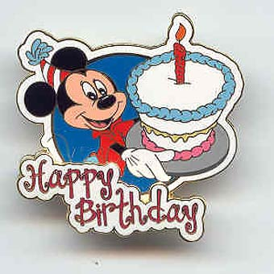
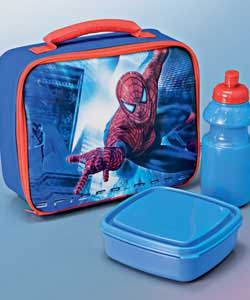
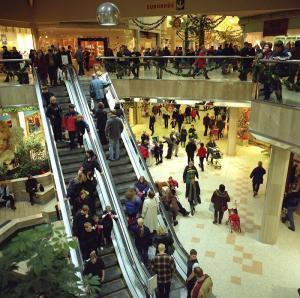

Title: Hvað er Ævintýraland?
Slug: hvad-er-avintyraland
Date: 2007-11-08 11:03:00
UID: 193
Lang: is
Author: Unnur María Bergsveinsdóttir
Author URL: http://unnur.klaki.net
Category: Menningarfræði
Tags: 

Þegar ég var lítil voru barnaafmæli á skyndi&shy;bita&shy;stöðum bara haldin í sjón&shy;varpinu. Þau barna&shy;afmæli sem ég sótti voru haldin í heima&shy;húsum þar sem allur bekkurinn sat í kringum borð&shy;stofu&shy;borð sem svignaði undan stafla af ricekrispies&shy;kökum og svampköku með karamellubráð. Í dag eru fjölmargar afmælisveislur hinsvegar haldnar á veitinga&shy;stöðum og veislu&shy;maturinn sem í boði er framleiddur samkvæmt alþjóðlegum stöðlum alþjóðlegra veitinga&shy;húsa&shy;keðja. Flestir eru enda sammála um það að á síðasta aldar&shy;fjórðungi hafi markaðs&shy;væðing barn&shy;æskunnar ekki gert nema að aukast. Afmælis&shy;hald á veitinga&shy;stöðum eru að sjálfsögðu hluti þeirrar þróunar. 

Í bók sinni _[Sold Separeatly](http://www.amazon.com/Sold-Separately-Children-Consumer-Communications/dp/081352198X)_ bendir Ellen Seiter á það að allt niður í tveggja ára börn séu nú meðvituð um vörumerki og taki virkan þátt í menningu sem gengur út á skil&shy;greiningu sjálfsins út frá neyslu og yfir&shy;færðri ímynd neyslu&shy;varningsins.[^1] Ung börn eru þannig meðvituð um félagslegt mikilvægi þess að eiga rétta dótið, klæðast réttu fötunum og borða á réttu veitinga&shy;stöðunum. Barnafmæli á veitinga&shy;stöðum eru því flóknara fyrirbæri en svo að þau megi skýra alfarið sem svo að þau séu undan&shy;komuleið foreldra frá þeirri kvöð að bjóða heim til sín krakkahóp sem muni hlaupa sykursjokkeraður upp um alla veggi. 

Ævintýra&shy;land er einn þeirra staða hér í Reykjavík sem býður upp á afmælisveislur. [Á vefsíðu Kringlunnar](http://www.kringlan.is/?PageID=13) segir að það sé skemmtileg tilbreyting fyrir barnið halda afmælið sitt í Ævintýra&shy;landi og njóta góðra veitinga í samvinnu við vinsæla veitingastaði í Kringlunni. Eflaust á það síðarnefnda að heita sérstaða Ævintýra&shy;landsafmæla. Allir eru réttirnir sem í boði eru þó keimlíkir og velja verður það sama fyrir alla gestina sem allir fá sama staðlaða skammtinn. 

Ég hafði búist við því að sjá á heimasíðu Ævintýra&shy;landsins myndir af  glöðum börnum í litríku umhverfi en á heimsíðu fyrir&shy;tækisins eru engar slíkar myndir, hvorki af börnum né sjálfri aðstöðunni. Síðan er myndskreytt með tveim myndum af teiknimynda&shy;fígúrum sem eftir minni bestu eftir&shy;grennslan hafa engar tengingar við afþreyingar&shy;iðnaðinn. Heimasíða Ævintýra&shy;landsins er enda hluti af upplýsingasíðu Kringlunnar og er væntanlega fyrst og fremst ætlað að vera foreldrum til upplýsingar en ekki hugsuð til þess að höfða sérstaklega til barna. Þess í stað nálgast Ævintýra&shy;landið markhóp sinn með því að vera staðsett á veitinga&shy;svæðinu, en þangað er líklegt að margir foreldrar sem taki börn sín með í Kringluna leggi leið sína. Af veitinga&shy;svæðnu blasir skrautlegur og lokkandi inngangur Ævintýra&shy;landsins þar við sem hin raunverulega auglýsing Ævintýra&shy;landsins. Sé tekið mið af umfjöllun Seiter er þessi aðferð mjög rökrétt. Það er jú vænlegra fyrir þá sem bjóða vörur eða þjónustu sem er stíluð inn á barna&shy;markaðinn að höfða beint til barnanna sjálfra en ekki forráða&shy;manna í von um að þrýstingur barnanna muni fá foreldrana til að opna budduna.[^2]

Samkvæmt Seiter er ein skilvirkasta leiðin til þess að fá unga neytendur til að taka eftir vörunni sú að tengja hana þekktum fígúrum.[^3] Þannig enda teikni&shy;mynda&shy;hetjur, oft að því er virðist án samhengis, á morgun&shy;verðar&shy;pökkum, rúmfötum og reiðhjóla&shy;hjálmum. Eins og ég minntist á hér að ofan er ekki að sjá að Ævintýra&shy;landið notist við þetta vel þekkta bragð á heimsíðu sinni enda er henni beint til foreldra sem hvort sem er eru ekki líklegir til að … en Bæði Judith Williamson og Sut Jhally hafa fjallað um auglýsingar&shy;menningu og bent á að auglýsingar séu ekki merkingar&shy;bærar í sjálfu sér, fyrir tilstilli texta þeirra eða myndmáls, heldur sé verði merkingin til fyrir tilstilli þess menningarlega tilvísana&shy;kerfi sem viðtakandinn lifir og hrærist í. Það hefði því lítill tilgangur verið í því að kaupa leyfi til að nota á heimasíðu Ævintýra&shy;landsins fígúrur sem börnin elska en foreldrarnir bera ekki skynbragð á. 

Það er þó ekki bara sjálft Ævintýra&shy;landið sem á að vera heillandi heimur. Í Jihad vs. McWorld fjallar Benjamin R. Barber um það hvernig staði á borð við sjálfa umgjörð Ævintýra&shy;landsins, Kringluna, má flokka sem skemmti&shy;garða. Barber notar hug&shy;takið skemmti&shy;garður ekki aðeins í hefð&shy;bundnum skilningi til að vísa til staða á borð við Disney&shy;land heldur líka til að tala um verslana&shy;mið&shy;stöðvar, verslana&shy;hverfi[^4]  og veitinga&shy;húsa&shy;keðjur. Þessir staðir eru mun meira en verslanir eða matsölu&shy;staðir, margir þeirra selja sig sem stemmnings&shy;umhverfi þangað sem viðskipta&shy;vinirnir sæki ákveðið andrúms&shy;loft og upplifan og sjálf varan sem skiptir um hendur er í raun sett í annað sætið. Barber kallar staði á borð við Stjörnu&shy;torg í Kringlunni leikhús neyslunnar og lífstíls&shy;þema&shy;garð[^5]  og má eflaust setja þessar pælingar hans í samhengi við hug&shy;myndir um sýndar&shy;neyslu.[^6] Staðir af þessum toga eru oft reknir samkvæmt umboðs&shy;módeli og því er mikil áhersla lögð á að stemmningin sem er seld sé stöðluð að viðl&shy;ögðum leyfis&shy;sviftingu standist útibúin ekki kröfur höfuð&shy;stöðvanna. 

Samlíking Barbers er ekki úr lausu lofti gripin. Skemmti&shy;garðar nútímans eiga uppruna sinn að rekja til heims- og iðnaðar&shy;sýninga þeirra sem tíðkuðust á 19. öld og snemma á 20. öld. Markmið þeirra var að sýna fram á hvernig hin ýmsu tækni&shy;undur myndu hönd í hönd við framgang kapítalisma og hnatt&shy;væðingar létta almenningi lífið, eða að minnsta kosti þeim sem hefðu efni á því að festa kaup á hinum væntanlegu nýjungum. Mörkin milli skemmti&shy;garða, bendir Barber á, eru svo alltaf að renna meira saman. Verslana&shy;mið&shy;stöðvar bæti við sig bíó&shy;húsum og leik&shy;tækjas&shy;ölum á meðan verslana&shy;rými í skemmtana&shy;görðum aukist sífellt.[^7]  Tilkoma Ævintýra&shy;lands í Kringluna fellur óneitanlega vel að þessum hug&shy;myndum Barbers. Verslana&shy;mið&shy;stöðvar nútímans eru skemmti&shy;garðar hverra þema er verslana&shy;gleðin. Þær eru einangraðar frá öðrum hlutum samfélagsins og þannig er í raun skorið á tengslin milli raunveru&shy;leikans fyrir utan og sýndarveruleika verslana&shy;mið&shy;stöðvarinnar.[^8] Verslana&shy;mið&shy;stöðin er sjálfstæð og manngerð veröld. Kona þarf ekki lengi að hugsa um Kringluna, árstíða&shy;búninga hennar og þemadaga til þess að eiga auðvelt með að samþykkja samlíkingu Barbers og í þessu samhengi er skemmtilegt að hugsa um slagorð elstu verslanar Kringlunnar, Hagkaupa, að það sé þar sem _Íslendingum finnst skemmtilegast að versla_! 

Hér í upphafi var minnst á það að það sem við fyrstu sýn virtist vera fjöl&shy;breyti&shy;leiki, þ.e. að hægt sé að velja milli nokkurra veitinga&shy;staða hvað veislu&shy;kost varðar, er í raun og veru eins&shy;leitni. Foreldrar geta ekki valið að koma með eigin veitingar enda er hætt við því að slíkt myndi spilla þeirri stemmningu, þann sýndar&shy;veru&shy;leika, sem tilheyrir Ævintýra&shy;landi.  Það gefur auga leið að heima&shy;bökuð svamp&shy;kaka með karamellu&shy;bráð er ekki hluti af glamúrös ímynd Kringlunnar. 

Töluvert hefur verið skrifað um verslana&shy;mið&shy;stöðvar sem eitt þeirra rýma þar sem allt er gert til þess að stýra hegðan þeirra sem þangað leggja leið sína. Bæði er hér um að ræða pan&shy;optískar pælingar[^9] en einnig miðar öll hönnun og arkitektúr verslana&shy;mið&shy;stöðva að því að fá gesti til að eyða bæði tíma og peningum þar inni. Berger lýsir þessu sem svo að skipulag verslana&shy;mið&shy;stöðva „has as it’s sole object the facilation of consumption.“[^10] Þetta kom ber&shy;sýnilega í ljós hvað Kringluna varðar árið 2001 þegar níu fyrir&shy;tæki og verslanir kærðu rekstrar&shy;aðila Kringlunnar fyrir það að hafa fært rúllu&shy;stiga og þannig breytt umferðar&shy;mynstri gesta.[^11] Það að afmæli í Ævintýra&shy;landi taki slétta og nákvæma tvo klukku&shy;tíma er án efa úthugsað. Tveir tímar eru líklega að fæstra mati nægur tími til þess að það taki því að keyra heim og aftur til baka. Vafa&shy;laust bregðast flestir foreldrar afmælis&shy;gestanna því við á réttan hátt og nota tækifærið til að versla í Kringlunnni. 

Það er því ljóst að ævintýrið er staðlað og útpælt, hvort sem við hugsum til barnsins í Ævintýra&shy;landinu eða foreldrisins sem vafrar um ganga Kringlunnar og hefur ofan af sér með því að kíkja í búðir, skoða og síðast en ekki síst með því að versla, meðan beðið er eftir barninu. 

[^1]: Ellen Seiter: _Sold Separately. Parents & Children in Consumer Culture_, Rutgers University Press, New Jersey 1995, bls. 193.
[^2]: Idem, bls. 221.
[^3]: Idem, bls. 196.
[^4]:  Benjamin R. Barber:  _Jihad vs. McWorld. How Globalism and tribalism are reshaping the world_, Ballentine Books, New York 1995. Barber talar í texta sínum um Highway commercial strips og á þá við klasa verslana sem eru ekki í neinu samhengi við íbúðabyggð eða borgarmenningu. Þegar uppbygging Smáralindar hófst minnti hún um margt á staði sem ég hef séð af þeim toga erlendis en síðan hefur gríðarleg uppbygging íbúða hér um bil upp að dyrum Smáralindarinnar breytt yfirbragði hverfisins mjög mikið. 
[^5]: Idem, bls. 129
[^6]: Sjá t.d. Úlfhildur Dagsdóttir: „Þar vaxa laukar og gala gaukar. Verslunarmiðstöðvar og dögun dauðans“, _Lesbók Morgunblaðsins_ 23. nóvember 2002, bls 8-9.
[^7]: Benjamin R. Barber:  _Jihad vs. McWorld. How Globalism and tribalism are reshaping the world_, Ballentine Books, New York 1995, bls. 132
[^8]: Idem, bls. 129-130
[^9]: Eiríkur Guðmundsson: „Fleira þarf í dansinn en fiman fót. Um líkama, vald og þekkingu.“ _Flögð og fögur skinn._ Ritstjóri Jón Proppé; ritstjórn Úlfhildur Dagsdóttir. Reykjavík, 1998 bls 253-264.
[^10]: Benjamin R. Barber:  _Jihad vs. McWorld. How Globalism and tribalism are reshaping the world_, Ballentine Books, New York 1995, bls. 131
[^11]: Sjá m.a. http://mbl.is/mm/gagnasafn/grein.html?grein_id=671267

