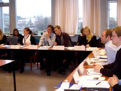
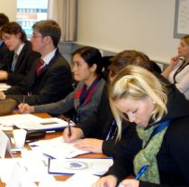

Title: Hvað er IceMUN?
Slug: hvad-er-icemun
Date: 2006-11-07 13:32:00
UID: 108
Lang: is
Author: Una Særún Jóhannsdóttir
Author URL: 
Category: Alþjóðasamskipti, Stjórnmálafræði
Tags: 

IceMUN stendur fyrir Iceland Model United Nations. Eins og nafnið gefur til kynna snýst starfsemi félagsins um að halda ráðstefnu þar sem sett er upp hermilíkan af fundum í nefndum og ráðum Sameinuðu Þjóðanna. Fjórða ráðstefna félagsins var haldin í október síðastliðnum, nánar tiltekið frá fimmtudeginum 26. október til sunnudagsins 29. október. Á þeirri ráðstefnu var sett á svið fundarhald innan Öryggisráðs Sameinuðu Þjóðanna. Í sumar var tekin ákvörðun um að fjalla um Norður-Kóreu og kjarnorkuvopnaeign landsins á IceMUN-ráðstefnunni í haust. Eftir að ákvörðunin var tekin vildi svo til að Norður-Kórea fór að gera tilraunir með kjarnorkuvopn. Þær tilraunir hafa mikið verið í brennideplinum undanfarið og Öryggisráð Sameinuðu þjóðanna ályktaði um tilraunasprengingar Norður-Kóreumanna í upphafi nýliðins októbermánaðar. 

Fyrsta dag IceMUN-ráðstefnunnar voru haldnir fyrirlestrar í Norræna húsinu. IceMUN fékk til liðs við sig fjóra fyrirlesara. Dr. Michael T. Corgan, prófessor við Boston háskóla í Bandaríkjunum og gestakennari í Háskóla Íslands, hélt fyrirlestur um það hvernig Öryggisráð Sameinuðu þjóðanna starfar undir þrýstingi stórveldanna. Agnes Bragadóttir, blaðamaður hjá Morgunblaðinu, hélt fyrirlestur um ferð sína til Norður Kóreu fyrir tuttugu árum og náði hún athygli allra með afar skemmtilegri frásögn. Þórir Guðmundsson, varafréttastjóri NFS, fjallaði um sögu Norður-Kóreu og gaf innsýn í það hvernig aðstæður voru í landinu þegar hann starfaði þar á vegum Rauða Krossins. Síðasti fyrirlesari dagsins var Dr. David Wall. Hann er prófessor við Cambridge University og starfsmaður Chatham House í London, sem er rannsóknarstofnun á sviði alþjóðasamskipta. David Wall er hagfræðingur og sérfræðingur í málefnum norður- og austur-Asíu. Hann hefur ferðast tvisvar til Norður-Kóreu og var meðal annars fyrsti hagfræðingurinn sem fenginn var til að halda fyrirlestur um hagfræði í Norður-Kóreu. Wall lýsti aðstæðum í Norður-Kóreu út frá sínu sjónarhorni og færði okkur nýja sýn á ástandið í landinu. 

Við sem sátum í framkvæmdanefnd ráðstefnunnar kynntum okkur málefni Norður-Kóreu töluvert vel fyrirfram. Flestar þær greinar, stuttmyndir og önnur umfjöllun sem við nýttum okkur við upplýsingaöflun lýsti Norður-Kóreu á afar neikvæðan hátt. Því er lýst sem landi þar sem fólk lifir í sárri fátækt, stöðugum ótta og hefur lítil tengsl við umheiminn. Wall var alls ekki sammála þessari umfjöllun og gat þess m.a. að hann hafi komið að landamærum Norður-Kóreu við Kína. Þar streymdi fólk jafnt út sem inn. Wall nefndi einnig að litlar búðir, veitingastaðir og karaokee klúbbar væru víðsvegar um Pyongyang, höfuðborg Norður-Kóreu. Það kom líka fram í umfjöllun hans að Norður-Kóreumenn séu með verksmiðjur víðs vegar um landið sem framleiða m.a. fatnað fyrir Evrópu- og Bandaríkjamarkað. Hann benti á, því til sönnunar, að þegar að á flíkum stendur “Made in Korea“, þá álykti flestir að um Suður Kóreu sé að ræða, en í raun og veru séu flíkurnar framleiddar í Norður-Kóreu. Samkvæmt Wall er efnahagskerfi landsins í örum vexti og líkti hann því við þá þróun sem verið hefur í þessum efnum í Kína. Davið Wall heldur því þannig fram að umfjöllun um Norður-Kóreu í fjölmiðlum víðsvegar í hinum vestræna heimi sé að miklu leyti röng. 

Á föstudeginum hófst dagskráin á fyrirlestri í samningatækni, sem fluttur var af Aðalsteini Leifssyni, prófessor við Háskólann í Reykjavík. Í þeim fyrirlestri fengu þátttakendur kennslu í grundvallartriðum í samningatækni sem nýttist þeim vel við samningaborðið síðar á ráðstefnunni. Fundir öryggisráðs IceMUN hófust eftir hádegi á föstudeginum. Þátttakendur unnu tveir til þrír saman í hópum. Hver hópur kom fram sem fulltrúar þeirra landa sem nú eiga sæti í Öryggisráði Sameinuðu þjóðanna. Auk þess voru fulltrúar fyrir Suður-Kóreu og Norður-Kóreu, en algengt er að álitsgjafar þeirra þjóða sem tengjast umræðuefninu hverju sinni sitji fundina. 

Undirbúningur þátttakenda fyrir IceMUN-ráðstefnu felst í að kynna sér bakgrunn landsins sem þátttakendum er úthlutað; hver sé afstaða þess innan Öryggisráðsins; við hvaða ríki landið sé í samstarfi; og fleira sem hjálpað getur við að átta sig á því hlutverki sem þátttakendur verða að fylgja. Lykilatriði er að þátttakendur séu samkvæmir sínu landi og fylgi stefnu þess án þess að láta persónulega afstöðu skína í gegn. Það getur á tíðum reynst erfitt. Að þessu sinni átti það sérstaklega við um fulltrúa Norður-Kóreu sem stóðu sig prýðilega og voru mjög sannfærandi sem umboðsmenn foringjans, Kim Jong-il.  

Fundir öryggisráðs stóðu yfir frá föstudegi til sunnudags og voru mjög viðburðarríkir. Á IceMUN ráðstefnunni er farið eftir sömu starfsreglum og gilda á fundum nefnda og ráða Sameinuðu Þjóðanna og fulltrúar verða að sýna forseta og öðrum fulltrúum virðingu. Vinnan sem fer fram yfir helgina snýst í raun og veru um að skila frá sér ályktun til að leysa það vandamál sem sett er fram í upphafi fundarins. Niðurstaðan varð að ein ályktun var samþykkt og tvíhliða samningur var gerður milli Bandaríkjanna og Norður-Kóreu. Óvíst er að samningaviðræður hefðu gengið svo snurðulaust fyrir sig í hinu raunverulega alþjóðasamfélagi, en hugmyndin með uppsetningu líkansins er fyrst og fremst að kynna starfsemi og framkvæmd innan Öryggisráðs Sameinuðu þjóðanna og fá fólk til að setja sig í spor þeirra sem sitja þar við samningaborð á hverjum degi. 

Þátttakendur IceMUN-ráðstefnunnar í ár, voru nemendur úr Háskóla Íslands, Háskólanum í Reykjavik og Háskólanum á Akureyri. Stjórnmálafræðinemar og laganemar eru yfirleitt meirihluti þátttakenda. Í ár mátti þó einnig finna í hópnum eðlisfræðinema, stærðfræðinema og sálfræðinema, ásamt nemendum úr fleiri deildum háskólanna.

Model United Nations ráðstefnur eru haldnar víðsvegar um heiminn. Í Bandaríkjunum eru háskólanemar í ákveðnum deildum t.a.m. skyldugir að taka þátt í MUN ráðstefnum á hverju ári. Í byrjun október fór ég á MUN ráðstefnu við Yale háskóla í Bandaríkjunum. Fjöldi þátttakanda var gífurlegur eða um 600 nemendur, aðallega úr öðrum háskólum í Bandaríkjunum. Í Yale var ekki aðeins sett upp hermilíkan af ráðum og nefndum Sameinuðu Þjóðanna, heldur einnig af öðrum áhrifamiklum alþjóðastofnunum. Þannig var ég t.d. fulltrúi Portúgal í OSCE (Organization for Security and Cooperation in Europe) og ein samferðakona mín var fulltrúi Argentínu í WHO (World Health Organization). Félagsmenn IceMUN hafa sótt ráðstefnur víðsvegar um heim, meðal annars í Norðurlöndunum, Bandaríkjunum og Austurríki. Reynslan frá þeim ráðstefnum hefur nýst afar vel við skipulagningu IceMUN-ráðstefnanna. Markmiðið er að auka ennfremur starf IceMUN á næstu árum. Til marks um það má nefna að fyrsta MenntóMUN-ráðstefnan var haldin í september á þessu ári, en sú ráðstefna er fyrir nemendur á menntaskólaaldri.  

Þátttaka í MUN ráðstefnum er mjög góð reynsla fyrir fólk sem hefur áhuga á alþjóðasamskiptum og alþjóðastjórnmálum. Fundahöld öryggisráðsins innan IceMUN ráðstefnunnar eru keimlík hinum raunverulegu fundahöldum öryggisráðsins í höfuðstöðvum Sameinuðu þjóðanna í New York. Þannig lærir fólk á regluverk Sameinuðu þjóðanna, ályktanagerð og starfsreglur. Þetta er einnig góð æfing í ræðumennsku og ensku tungumáli, en ráðstefnan fer öll fram á ensku. Síðast en ekki síst öðlast þátttakendur innsýn í hinn margslungna heim alþjóðastjórnmálanna og þá sérstaklega út frá sjónarhorni Sameinuðu þjóðanna.  

