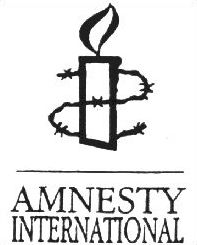

Title: Hvað er það sem skiptir máli?
Slug: hvad-er-thad-sem-skiptir-mali
Date: 2006-06-08 08:26:00
UID: 78
Lang: is
Author: Kári Páll Óskarsson
Author URL: 
Category: Í útlöndum, Fjölmiðlar
Tags: 

Landið Íran hefur verið svo áberandi í fréttaflutningi á Íslandi að það sætir furðu, og ólíklegt má teljast að nokkurt annað ríki sem ekki er vestrænt komist jafn oft í fréttir nema kannski nágrannaríkið Írak. Ástæðan er auðvitað sú að stjórnvöld í Íran vilja auðga úran til að öðlast kjarnorku til innanlandsnota, vestrænum ríkjum (aðallega Bandaríkjunum) hugnast það ekki og skyndilega er orðin til „kjarnorkudeila“. Fyrir utan það þegar forseti Írans, Dr. Mahmoud Ahmadinejad, sýnir populistatilburði á borð við að lýsa yfir að þurrka skuli út Ísraelsríki, þá er þetta ástæðan fyrir vinsældum landsins á fréttasíðum. Eina ástæðan, vel að merkja.

Það er synd að miðlar hafi bara áhuga á þessu tilbúna þrætuepli í milliríkjapólitík, því nú er ýmislegt annað áhugavert sem á sér stað í Íran. Sé litið yfir farinn veg undanfarinna ára er mjög stutt síðan klerkabyltingin alræmda átti sér stað árið 1979, aðeins 27 ár. Það er t.d. styttra en síðan fasistinnleiðtoginn Franco dó á Spáni, en það var 1975. Svo stutt er liðið frá byltingunni, að enn hafa aðeins tveir menn gegnt stöðu „Æðsta Leiðtoga“ í landinu eftir hana, fyrst auðvitað Ayatollah Ruhollah Khomeini, frá byltingunni, og svo Ayatollah Ali Khameini, sem tók við 1989. Frú Shirin Ebadi hlaut friðarverðlaun Nóbels 2003, og hefur það stuðlað að nokkurri þróun í átt til upplýstara samfélags í landinu. En því miður tók núverandi ríkisstjórn við völdum í maí í fyrra, eftir kosningar í febrúar sama ár sem þóttu afar umdeildar og gallaðar, en í þeim báru sigur úr býtum hópar sem eru eindregið á móti félagslegum og stjórnarfarslegum umbótum. Yfirlýsingar frá nýju stjórninni voru til að mynda ákúrur til kvenna sem þóttu vera „ósæmilega klæddar“. Tilviljanakenndar handtökur, fangelsanir og einangrun fanga hefur aukist, og sömuleiðis það að fólki sé neitað um málsvara til að verja sig fyrir rétti. Blaðamenn hafa einnig fengið að kynnast þessu í auknum mæli. 

Því hefur mannréttindaástandið í Íran, sem lengi hefur verið mjög ábótavant, ekki farið batnandi eins og ársskýrsla Amnesty International frá í fyrra sýnir. Nokkur fjöldi samviskufanga má enn dúsa í fangelsum landsins eftir ósanngjörn réttarhöld á undangengnum árum. Nokkur fjöldi fólks til viðbótar hefur verið handtekinn fyrir skrif í blöð eða á Internetið sem hafa þótt „ógna þjóðaröryggi.“ Árið 2004 voru 159 manns tekin af lífi í landinu, þar af einn einstaklingur undir lögaldri. Hún hét Atefeh Rajabi, sextán ára, og var hengd þann 15. ágúst fyrir hórdóm eftir ósanngjörn réttarhöld og opinbera niðurlægingu, þrátt fyrir efasemdir um að hún gengi heil til skógar. Maðurinn sem hún átti að hafa drýgt hór með var hýddur 75 sinnum. Hýðingar eru nokkuð stundaðar í landinu. Árið 2004 voru t.d. 36 manneskjur hýddar (skv. opinberum tölum) og þar af dóu tvær. Pyntingar í fangelsum landsins eru ekki óalgengar. Fólki er óspart mismunað eftir trúarbrögðum og stjórnmálaskoðunum í skjóli Gozinesh reglugerðarinnar, sem miðar að því að meina fólki að vinna hjá hinu opinbera. 

Kúrdar eru um 7-10% af íbúafjölda Íran. Þeir eru flestir búsettir í norðausturhéruðum landsins þar sem helsti atvinnuvegurinn er landbúnaður. Þeir eru kúgaður minnihlutahópur. Árum saman stóðu samtök Kúrda í vopnuðum átökum við ríkisstjórnina í Teheran, en í seinni tíð hafa þeir látið af því og tekið að berjast fyrir sjálfræði sinna svæða eftir friðsamlegum og diplómatískum leiðum. 

Í júní í fyrra var maður að nafni Massoud Barzani kjörinn fyrsti forseti Írakska Kúrdistan, í Norður-Írak. Þegar Kúrdar í nágrannaríkinu Íran fögnuðu þessum atburði sló í brýnu milli þeirra og öryggissveita klerkaveldisins, og fjölmargir Kúrdar voru handteknir. Í næsta mánuði skutu öryggissveitirnar til bana kúrdíska aðgerðasinnann Shivan Quaderi og drógu lík hans um stræti aftan í jeppa. Við mótmælin sem spruttu af þessu framferði var a.m.k. 21 Kúrdi skotinn til bana og a.m.k. 190 voru handteknir. 

Í mars síðastliðnum voru Azad Rasouli og Abu Bakr Bapiri handteknir í heimaborg sinni Bukan í Vestur-Azerbaijan héraði ásamt a.m.k. 92 öðrum Kúrdum. Amnesty International telur að þeim sé nú haldið í einangrun og eigi á hættu að verða pyntaðir. Ekki er vitað hvar þeir eru látnir dúsa á þessari stundu, né fyrir hvað þeir hafa verið ákærðir. Amnesty International hafa sent út aðgerðabeiðni vegna þeirra. Þessir menn höfðu það til saka unnið að vera fyrrverandi meðlimir í kúrdískum andspyrnuhreyfingum. Þeir voru handteknir fyrir nokkrum árum en var síðar sleppt og heitið friðhelgi, en leyniþjónusta klerkaveldisins mun áfram hafa haft á þeim gætur. Klerkastjórnin hefur kannski saknað þess að hafa þá ekki sem gesti, og sent lögregluna til að ná í þá aftur? 

Það fer aldrei mikið fyrir fólki eins og Atefeh Rajabi eða Azad Rasouli í fréttum. Það sama virðist gilda um þau og Guð sem ekki sér mann í heimspeki Berkeleys Biskups: esse est percipi, að vera er að sjást. Það er mikið vald sem fjölmiðlar hafa; þeir eru eins og Guð Berkeleys. Þeir sjá ekki fólk eins og Rasouli, þess vegna er eins og það sé ekki til. Sem betur fer eru til samtök eins og Amnesty International sem taka að sér að sópa upp týndum blaðsíðum heimsbókarinnar. Á meðan keppast fréttastofur heimsins við að færa okkur fregnir af tilboðum sem Ahmadinejad forseta hafa verið gerð, eða honum munu hugsanlega vera gerð, og gagntilboðum sem hann gerir þjóðum heimsins; eða af gífuryrðum Dick Cheney um hernaðaríhlutun í Íran og hvernig Ahmadinejad andmælti þeim gífuryrðum; eða hvernig Ahmadinejad neitar að gera eins og vesturveldin segja honum; eða öðrum vita þarflausum upplýsingum. Einhvern veginn virka slíkar upplýsingar ekki áríðandi þegar maður hefur heyrt af saklausu fólki sem verið er að hýða til bana.

---

#### Heimild

* Amnesty International: report 2005. London: Amnesty International Publications, 2005.

