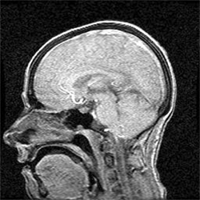
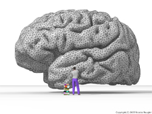

Title: Hvað vitum við um mannsheilann?
Slug: hvad-vitum-vid-um-mannsheilann
Date: 2007-01-30 10:37:00
UID: 128
Lang: is
Author: Þórdís Linda Þórarinsdóttir
Author URL: 
Category: Raunvísindi
Tags: 

Það var Hippókrates sem fyrstur staðsetti meðvitundina í heilanum í stað hjartans. Hann trúði því að heilinn væri miðstöð skynjunar, þar sem svo mörg af skynfærum okkar — til dæmis augun, eyrun og tungan — eru staðsett nálægt heilanum. Ennfremur trúði hann því að þær stöðvar sem stjórna greind og gáfum væri að finna í heilanum. Þessar kenningar Hippókratesar náðu þó ekki vinsældum fyrr en rúmum 500 árum eftir hans daga, þegar rómverski læknirinn Galen gat fært sönnur fyrir kenningum þessum. Galen var læknir skylmingarþrælanna og hann veitti því athygli að heilaskaði leiddi oft til vitræns skaða hjá sjúklingunum.[^1]

Síðan þá hafa vísindamenn löngum velt vöngum yfir starfsemi þessa flókna líffæris sem vegur ekki nema um 2% af heildar líkamsþunga okkar en notar um fimmtung af þeirri orku sem líkaminn þarfnast.[^2] Tækniframfarir síðustu áratuga hafa leitt til mikilla framfara á þessu sviði. Þróaðar hafa verið aðferðir eins og heilaritun[^3] og segulómun[^4] sem gera okkur kleift að greina virkni í lifandi heilum án þess að valda rannsóknarefninu skaða. Viðfangsefni slíkra tilrauna spanna allt frá einföldum rannsóknum á stjórnun hreyfinga, sjón og minni til mun flóknari fyrirbæra á borð við muninn á móðurást og rómantískri ást.[^5] Með tilraunum af þessu tagi hefur þekking okkar og skilningur á heilanum aukist til muna, en að sama skapi hefur skapast þörf fyrir að finna trúverðugt líkan fyrir starfsemi heilans sem samræmir líffræðilegar og huglægar kenningar. 

Það líkan sem þykir hvað líklegast byggir á þeirri tilgátu að ósjálfráðri virkni og vitsmunalegri starfsemi heilans megi lýsa með svokallaðri „reynsluþekkingu“. Reynsluþekking byggir á þeirri hugmynd að til þess að skynja umhverfið, þá verði heilinn sífellt að spá fyrir um þær upplýsingar sem skynfærin veita honum í stað þess að skrá einungis þær upplýsingar sem honum berast. Til dæmis, ef við sjáum glitta í stuðara á bíl bak við hús, þá gerum við ráð fyrir því að við okkur blasi heill bíll ef við göngum fyrir húshornið. Þessi hugmynd er þó ekki alveg ný af nálinni. Undir lok 17. aldar skrifaði enski heimspekingurinn John Locke að „hugur okkar ætti oft að gera hugmyndir skynjunar sinnar að hugmyndum dómgreindar sinnar og nýta annað einungis til að örva hitt“.[^6] Tæpum hundrað árum síðar skrifaði þýski læknirinn og eðlisfræðingurinn Hermann von Helmholtz: „Það getur oft verið erfitt að segja til um hversu stór hluti af skynjun okkar á því sem við sjáum verður til við beina skynjun og hversu stór hluti verður til vegna reynslu og þjálfunar“.[^7]

Líkanið um reynsluþekkingu tengir saman fjölda rannsóknarsviða, frá líffræði og tölfræði til sálfræði, heimspeki og mannfræði. Frá sjónarhorni sálfræðingsins eða mannfræðingsins gæti þetta líkan aukið skilning okkar á ýmsum atriðum tengdum hlutum eins og skynjun og félagslegri hegðun einstaklinga. Fyrir hina líffræðilegu hlið má nota líkanið til að útskýra tengsl á milli virkni í hinum mismunandi hlutum heilans. Ennfremur gæti líkanið veitt svör við spurningum í taugalífeðlisfræði um eðli og forgangsröðun taugaboða.[^8]

Allt þetta kemur þó að litlum notum nema hægt sé að setja líkanið fram á stærðfræðilegan hátt og beita því á gögn sem innihalda upplýsingar tengdar því sem rannsaka skal. Stærðfræðileg framsetning á líkaninu byggir á hugmyndum sem kenndar eru við 18. aldar stærðfræðinginn Thomas Bayes. Á fyrstu áratugum 18. aldar komu fram svör við ýmsum spurningum tengdum líkindum á ákveðnum atburðum að gefnum sérstökum skilyrðum. Einfalt dæmi um þess konar spurningar er eftirfarandi: Á borði stendur skál með hvítum og svörtum kúlum. Ef vitað eru hversu margar hvítar kúlur og hversu margar svartar kúlur eru í skálinni, hverjar eru þá líkurnar á því að dregin sé svört kúla ef dregin er ein kúla af handahófi úr skálinni? Einnig má spyrja: Ef dregnar hafa verið nokkrar kúlur úr skálinni, hvað má þá segja um fjölda hvítra og svarta kúlna í skálinni?   

Líkan fyrir reynsluþekkingu, byggt á kenningum Bayes, reynir að spá fyrir um atburði (hluti í umhverfinu) út frá þeim upplýsingum sem skynfærin, gefin reynsla og þekking einstaklingsins veita. Samkvæmt líkaninu fer þetta hugarferli fram í mörgum þrepum og fleiri aðskilin svæði í heilaberkinum koma við sögu. Villur í spánni eru lagfærðar í hverju þrepi uns niðurstaða fæst, niðurstaða sem segir til um líklegustu ástæður fyrir þeim upplýsingum sem skynfærin veita.[^9] Oftast tekur þetta ferli örfáar sekúndur eða einungis brot úr sekúndu, en einstaka sinnum lendum við þó öll í því að heyra eða sjá eitthvað sem við getum ekki áttað okkur á. Stundum skortir heilann næga reynslu eða þekkingu til þess að geta greint upplýsingarnar, en á öðrum tímum er hann einfaldlega of upptekinn af öðru. Heilinn greinir þó oft mun fleiri upplýsingar úr umhverfinu heldur en við gerum okkur grein fyrir. Sem dæmi um þetta má nefna þegar við áttum okkur allt í einu á umræðum sem eiga sér stað í hinum enda herbergisins ef kunnuglegt nafn ber á góma. 

Sem stendur eru tveir stórir annmarkar á líkönum af þessu tagi. Sá fyrri tengist þeim gögnum sem notuð eru. Tæknin sem hér er notuð er í stöðugri framþróun, en þó er enn langt í land að við getum greint bæði staðsetningu og tímasetningu taugaboða í heilanum af mikilli nákvæmni. Það er því sama hversu gott stærðfræðilíkan við vinnum með, við getum ekki ályktað af vissu um alla þá þætti sem taldir eru upp hér að ofan. En því eru einnig takmörk sett, hversu nákvæmt stærðfræðilíkanið getur verið. Því flóknara og nákvæmara líkan, því erfiðara er að greina gögnin með líkaninu og komast að niðurstöðu um þær spurningar sem velt er upp. Í þessu samhengi getur verið mikilvægt að leita hins gullna meðalvegar og hafa í huga það sem tölfræðingurinn Georg Box sagði eitt sinn, að „öll líkön eru röng, sum þeirra geta verið gagnleg“. Þau atriði sem hér eru upp talin eru þó í stöðugri þróun og við öðlumst sífellt betri skilning á því flókna og mikilvæga líffæri sem mannsheilinn er. 

[^1]: http://en.wikipedia.org/wiki/Neuroscience

[^2]: Raichle, M.E. og Mintun, M.A. (2006): Brain work and brain imaging. _Annual Review of Neuroscience_ 29 449-476.

[^3]: Við heilaritun er fjölda lítilla rafskauta komið fyrir í hársverði viðfangsefnisins og þannig má mæla rafvirkni tauga í heilanum. Nánar má lesa um heilaritun á http://en.wikipedia.org/wiki/Electroencephalography

[^4]: Við segulómun eru segulsvið og útvarpsbylgjur notuð til þess að mynda mjúka vefi í líkamanum. Tækið getur tekið þunnar sneiðmyndir af hvaða hluta líkamans sem er. Við heilarannsóknir eru teknar endurteknar sneiðmyndir af heilanum með örfárra sekúndna millibili. Til að greina virkni í heilanum eru þessar myndir síðan bornar saman og leitað að þeim stöðum í heilanum þar sem greina má ákveðnar breytingar með tíma. Nánar má lesa um þetta á http://en.wikipedia.org/wiki/Functional_MRI

[^5]: Bartels, A. og Zeki, S. (2004): The neuronal correlates of maternal and romantic love. _NeuroImage_ 21 1155-1166.

[^6]: Locke, J. (1690/1976): _An essay concerning human understanding_. London. Dent. 

[^7]: von Helmholtz, H. (1867): _Handbuch der physiologischen Optik_. Leipzig. Leopold Voss. 

[^8]: Hohwy, J. og Roepstorff, A. (2006): Predictive coding and the mind: Prospects and prespectives, http://www.pet.au.dk/~andreas/ccc/predictive/PredCodWorkshop.doc

[^9]: Friston, K. (2005): A theory of cortical responses. _Philosophical Transactions of the Royal Society, Series B_ 360 815-836.

