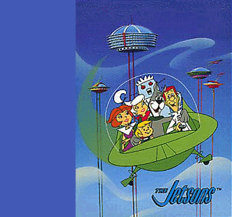

Title: Hvert fór framtíðin?
Slug: hvar-er-framtidin
Date: 2006-12-12 16:19:00
UID: 118
Lang: is
Author: Unnur María Bergsveinsdóttir
Author URL: http://unnur.klaki.net
Category: Upplýsingasamfélagið, Menningarfræði
Tags: 

Árið 1987 gaf Setberg út bókina _Svona er tæknin_[^1]. Hvað fékk Setberg til að íslenska fræðslubók um _nútímatækni_ sextán árum eftir að hún var skrifuð veit ég ekki en altént rataði hún í einn harða jólapakkann minn þegar ég var lítil og nördalegar spurningar bögguðu foreldra mína og ættingja marga mánuði í kjölfarið. Sú opna sem mér er minnisstæðust fjallaði um framtíðarskólaumhverfið og sýndi litrík myndskreyting hóp nemenda sem allir höfðu risastórar og gamaldags tölvur í stað höfuðs. Hér er auðvitað á ferðinni súrrealísk sýn Joe Kaufmans, en sú mynd sem hann dregur upp er þó engu að síður í góðu samræmi við þá trú sem var almenn í árdaga tölvualdar; að tæknin myndi bylta námsumhverfinu, að hún myndi gera okkur kleyft að læra meira, hraðar, ódýrar. Við myndum drekka í okkur heimsbókmenntirnar meðan við svæfum og vera geisluð milli frægra listasafna á sekúndubroti. 

Reyndin hefur hinsvegar orðið sú að líkt eins og við fljúgum ekki milli heimilis og vinnustaðar í glærum plastkúlum né heldur klæðumst við silfurlitum samfestingum, þá hefur ekki heldur á síðustu 3 áratugum í raun orðið nein róttæk breyting á því hvernig fróðleik er miðlað. Og þá hlýtur kona að spyrja sig, hvert fór framtíðin?

### Tæknilegir erfiðleikar, nýir samskiptamöguleikar

Á hinum stafrænu tímum er dreifing gagna á sama tíma bæði einfaldari og flóknari en hún var á analógöld. Unnt er að skoða stafræna eftirgerð efnis sem varðveitt er á fjarlægum bókasöfnum en jafnframt er tækniþróun svo hröð að erfitt er að fylgjast með henni, staðlar og skráarsnið óteljandi, og sá búnaður sem einstaklingar nota til að skoða það efni sem þeir taka við afar sundurleitur. Í síðustu viku sat ég með Rob Perks yfirmanni [deildar munnlegrar sögu í hljóðdeild British Library](http://www.bl.uk/collections/sound-archive/nsaabout.html) á kaffiteríu safnsins og hann útskýrði fyrir mér að við opnun [nýrrar vefgáttar deildarinnar](http://sounds.bl.uk/) hefði allt starf miðast við það að ná fram sem mestri fágun í útfærslu á sama tíma og þær tæknilegu kröfur sem vefgáttin gerir til endabúnaðar notenda hefðu þurft að vera miðaðar við einfaldasta samnefnarann. 

Tilkoma internetsins hefur ekki aðeins skapað nýja möguleika á miðlun efnis, heldur liggur mikilvægi fyrirbærisins ekki síst í því að vera samskiptavettvangur þar sem landfræðilegar hindranir hafa verið yfirstignar. Reyndin hefur enda verið sú að á síðustu árin hafa ótal mörg spennandi verkefni sprottið upp þar sem evrópskar stofnanir vinna saman að því að þróa tækni og aðferðir til þess að yfirfæra texta, myndir og upptökur yfir á stafrænt form og miðla á sem aðgengilegastan hátt til sem flestra. 

Reyndar má hér í framhjáhlaupi nefna til sögunnar þriðja höfuðverkinn sem plagar þá sem vinna að því að miðla menningararfinum á stafrænu formi, nefnilega það hversu flókið það reynist yfirleitt einstaklingum sem koma úr mismunandi fagumhverfi að tala saman um sjálft ferlið. Það að komast niður á sameiginlegt tungumál, eða að minnsta kosti að ná að skilja tungutak annarra fagstétta er út af fyrir sig ærið verkefni[^2].

### Stafræn Evrópa

Það er hagur allra að þetta samtal gangi sem greiðlegast og að sem flestir geti tekið þátt í umræðunni. Í því skyni hefur Evrópubandalagið hefur mótað skýra stefnu um upplýsingasamfélagið þar sem mikil áhersla er lögð á rafræna miðlun menningararfsins, með sérstakri áherslu á miðlun í því markmiði að jafna aðgengi. Aðgerðaáætlun Evrópubandalagsins um evrópskt upplýsingasamfélag nefnist [i2010](http://www.i2010.org.uk/) og tekur til aðgerða og áætlana fram til ársins 2010. Meginmarkmið aðgerðaáætlunarinnar eru að auka vöxt og fjölga störfum innan upplýsingasamfélagsins og í margmiðlunargeiranum. 

Sá hluti i2010 aðgerðaáætlunarinnar sem snýr að evrópskum menningararfi leggur áherslu á að því að hámarka nýtingu upplýsingatækni við varðveislu hans og miðlun. Árið 2001 funduðu fulltrúar Evrópusambandsríkjanna í Lundi í Svíþjóð og sammæltust um að skapa vettvang þar sem hægt væri að sníða samevrópska sýn og vinna að því að móta leiðir til að gera menningararf Evrópu, yfirfærðan á stafrænt form, sem sýnilegastan. [The Lund Principles](http://cordis.europa.eu/ist/digicult/lund-principles.htm) eru afsprengi þessa fundar og byggði samnefnd aðgerðaáætlun á þeim. Árið 2005 tók svo aðgerðaáætlunin [Dynamic Action Plan](http://www.minervaeurope.org/publications/dap.htm) við sem framhald af Lund áætluninni. Markmið DAP er að þróa leiðir til að opna almenningi vefleið inn í evrópsk söfn, bókasöfn og skjalasöfn og gera þannig fleirum kleift að nýta sér þau verðmæti sem þessar stofnanir geyma, – burtséð frá búsetu og burtséð frá þeim hömlum sem hefðbundnir opnunartímar óhjákvæmilega skapa. 

### European (Digital) Library

Ein grunnstoð aðgerðaáætlunarinnar byggir á því að evrópskar menningarstofnanir komi sér niður á sameiginlega staðla og verklag. Eitt athyglisverðasta verkefnið sem unnið er á þessum vettvangi nefnist [European Digital Library Initiative](http://europa.eu.int/information<em>society/activities/digital_libraries/index_en.htm) en þar er um að ræða átak um að koma sem mestu af safnkosti evrópskra bókasafna og menningarstofnana á stafrænt form. Markmiðið er stofnun sameiginlegrar vefgáttar þar sem hægt verður að nálgast á stafrænu formi efni af sem flestum bókasöfnum í Evrópu.  Vefgáttin byggir á annarri eldri gátt, [The European Library](http://www.theeuropeanlibrary.org/) en unnið hefur verið að þróun þeirrar vefgáttar í nokkur ár. Þar er að finna upplýsingar um safnkost fjölmargra evrópskra bókasafna og hluta þeirra er hægt að nálgast hluta þeirra á stafrænu formi. [Landsbókasafn Íslands](http://landsbokasafn.is/) er meðal þeirra evrópsku safna sem þátt taka í þessu verkefni. 

Átak um að koma safnkosti evrópska bókasafna á stafrænt form nær til bóka, myndbanda, kvikmynda, ljósmynda, skjala og fleiri efnisflokka. Vinna að átakinu byggir á þrem meginstoðum; a) hvernig má best færa efni af eldri sniðum yfir á stafrænt form, b) hvernig er sem best hægt að gera stafræn gögn aðgengileg yfir netið og c) hvernig tryggja megi varðveislu þeirra þannig að þessi gögn verði aðgengileg komandi kynslóðum. Framkvæmdastjórn Evrópubandalagsins mun í gegnum aðgerðaráætlunina [eContentPlus](http://www.econtentplus.net/), koma að fjármögnun verkefna sem snúast um að auka aðgengileika og notkunarmöguleika þess efnis sem þegar hefur verið fært yfir á stafrænt form. Ekki er hægt að sækja fé í eContentPlus til að fjármagna stafræna endurgerð efnis og vill framkvæmdastjórnin með því leggja áherslu á að miðlunin er ekki síður mikilvægur hluti áætlunarinnar en sjálf yfirfærslan. form. Eru stofnanir hvattar til að leita samstarfs við einkaaðila til að fjármagna síðarnefnda liðinn. 

### Rúv og Video Active

Safnkostur Rúv og skortur á bæði aðgengi á honum og viðunandi varðveislu hans  hafa verið til umræðu í íslenskum fjölmiðlum undanfarna daga[^3]. Lengi hefur skort bæði meðvitund um verðmæti þess efnis sem er að finna í Efstaleitinu og einnig vilja yfirvalda til að fjármagna aðgerðir. Þetta viðhorf getur reyndar ekki talist neitt íslenskt sérkenni því sé litið til alþjóðasamfélagsins er tiltölulega stutt síðan menningarlegt mikilvægi hljóð- og sjónræns efnis var viðurkennt. Fyrstu alþjóðlegu tilmælin á þessu sviði voru samþykkt á aðalráðstefnu UNESCO 27. október árið 1980. Því var lýst yfir að menningarlegt og sögulegt mikilvægi hljóð- og myndefnis væri jafngilt textaheimildum og kallað eftir aðgerðum til að tryggja varðveislu þess.  Þennan sama dag nú í ár var svo í fyrsta skipti haldinn alþjóðadagur UNESCO helgaður  hljóð- og myndrænum menningararfi. Stefnt að því að þessi dagur verði árlegur viðburður. Markmiðið er að vekja athygli á því að um allan heim liggja stórir hlutar menningararfsins undir skemmdum og kallað er eftir aðgerðum til varðveislu og björgunar hans[^4].

Eitt verkefnanna sem fjármagnað er af eContentPlus aðgerðaráætluninni nefnist [Video Active](http://videoactive.wordpress.com/) og var hleypt af stokkunum nú í haust. Að verkefninu koma sjónvarpsstöðvar og rannsóknarstofnanir í fjölmörgum evrópulöndum og er markmiðið það að gera það efni sem hingað til hefur að mestu legið svo til óaðgengilegt í geymslum sjónvarpsstöðva, aðgengilegt með kennslu og rannsóknir að markmiði. Fyrsta skrefið í þessu samstarfi markast af ráðstefnu sem haldin verður nú í vor þar sem rætt verður um það hvernig skuli skilgreina þann menningararf sem bjarga skal.  Þetta merka samstarf undirstrikar enn frekar mikilvægi þess að þeir aðilar sem að málefnum Rúv koma fari að líta safnkost þess réttum augum. 

### Gildismat og sjálfsmynd

Hér að ofan hefur verið rætt um það hvernig samræðan er grundvöllur þess að hægt sé að þróa hinar tæknilegu lausnir og á sama tíma forsenda þess að sjálf samskiptin geti átt sér stað. Hér krystallast sá skilningur sem mannfræðingurinn Clifford Gertz lagði í tungumálið, að það öðlast ekki merkingu nema í gegnum samskiptin. Að lokum er það einnig augljóst að þegar við höfum talað okkur saman um það hvernig við getum bjargað menningararfinum, þá komumst við ekki undan því að ræða það hverju skuli bjarga. Sem er síst einfaldari samræða en hinar tvær sem hér á undan eru taldar. Á degi íslenskrar tónlistar er enda sérdeilis auðvelt að minnast þess að það ríkir sjaldnast sátt um það hvað skuli teljast til menningarverðmæta á hverjum tíma og að þær skilgreiningar geta breyst svo til yfir nótt. Samræðan um menningararfinn snýst samtímis um það hver við erum og um það hver við viljum vera. Hún snýst um sjálfsmynd samfélagsins. 

Þegar ég hugsa aftur til nemendanna með tölvuhöfuðin og leita að framtíðinni er nærtækast að álykta að hin raunverulega upplýsingabylting felist ekki endilega í sístækkandi hörðum diskum , öflugri örgjörvum eða aukinni burðargetu ljósleiðara heldur felist hún í hinum auknu samræðumöguleikum. Ólíkt þeirri mynd sem brugðið var upp í barnabók Kaufmans eru vandamálin ekki leyst af  ofurtölvum sem tengjast saman þvert á landamæri til að leysa vandamál heldur einstaklingum sem sitja hver við sinn tölvuskjáinn og taka þátt í samræðubyltingunni. 

[^1]: Kaufman, Joe, _Svona er tæknin: bók um bíla, skip, flugvélar, heimilistæki, verkfæri, hljóðfæri, útvarp, hljóðrita, sjónvarp, myndavélar og margt fleira_, Reykjavík, 1987. 

[^2]: Seadle, Michael, ,,Spoken Words, Unspoken Meanings. A DLI2 Project Ethnography", D-Lib Magazine Vol. 6, # 11, nóvember 2000. Sjá [hér](http://www.dlib.org/dlib/november00/seadle/11seadle.html).

[^3]: Sjá t.d. ,,Bjartsýn á að skriður komist á safnamál RÚV“, _Morgunblaðið laugardaginn 9. desember 2006_ 

[^4]: ,,Recommendation for the safeguarding and preservation of moving images“, Tekið af heimasíðu UNESCO 29. nóvember 2006. Sjá: [http://www.unesco.org/culture/laws/cinema/html_eng/page1.shtml](http://www.unesco.org/culture/laws/cinema/html_eng/page1.shtml)

