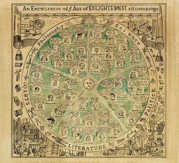

Title: Hver er ábyrgð sagnfræðingsins?
Slug: hver-er-abyrgd-sagnfraedinsins
Date: 2008-01-08 14:00:00
UID: 207
Lang: is
Author: Unnur María Bergsveinsdóttir
Author URL: http://unnur.klaki.net
Category: Sagnfræði
Tags: 

Er það í verkahring sagnfræðinga að draga úr fordómum og sleggjudómum í samtímanum? Þessi spurning hlýtur fyrst og fremst að vera siðferðisleg og persónulega kýs ég að svara henni játandi. Þegar litið er til þess hversu gífurlega áhugi á sögu bæði minnihluta- og undirmálshópa hefur vaxið á síðustu áratugum er freistandi að álykta að stór hluti þeirra sem leggja stund á eða hafa áhuga á sagnfræði séu sammála þessu sjónarmiði. 

Sagnfræðingurinn Michael Howard gerir þessa spurningu að sérstöku umræðuefni í upphafi bókar sinnar _The Lessons of History_.[^1] Þar heldur hann því fram að það að fyrirbyggja og/eða afhjúpa fordóma og ranghugmyndir sé ekki aðeins göfugt markmið heldur hreint og beint nauðsynlegt til að tryggja öryggi okkar og framtíð á þessum síðustu og verstu tímun. Howard gerir fáfræði valdhafa og menntamanna að sérstöku umtalsefni. Fáfræði þessara aðila sé enda sérstaklega hættuleg. Hann minnist þó einnig á það hvernig það sé ekki síður mikilvægt að grunnmenntun þjóða miði að því að gera þegnana færa um að geta að minnsta kosti reynt að setja sig í spor þegna annarra þjóða eða eigin samlanda af annarri kynslóð í stað þess að horfa stöðugt á umheiminn með sjálfa sig staðsetta fyrir miðju. Markmið sagnfræðinga á að mati Howards að vera að afhjúpa viðtekna misskilninga, að auðvelda fólki að skilja hvert annað og skapa okkur það andrúmsloft sem þarf til að lifa saman í sátt ef ekki samlyndi. 

_,,Hearsay is a kind of a fact when people belive it"_ segir Luise White í _Speaking with Vampires_.[^2] Í þessari einföldu setningu, sem ég held mikið uppá, finnst mér felast mikill sannleikur. Hér á White við þær sögusagnir (og í sumum tilfellum þau kerfi mýta) sem þjóðfélagshópar dikta upp um aðra hópa innan eða utan samfélagsins, í þeim tilgangi að höndla tilhugsunina um tilvist hins. White bendir á að um leið og fólk trúi sögusögnunum sem útskýra eiga framandleika hinna, öðlist sögurnar það mikið vægi að það skipti ekki lengur máli hvort þær séu sannar eða ekki. Þær hafi jafn mikil áhrif engu að síður bæði, á bæði þá sem tala og þá sem er talað um. 

Það er einmitt gegn öðruninni sem Howard vill að sagnfræðingar berjist. Hann vill að sagnfræðingar reyni að miðla skilningi á menningarlegum mun í því augnmiði að draga úr þeirri öðrun sem okkur er svo eðlislægt að beita þau fyrirbæri sem við skiljum ekki eða finnst ógnandi. Tími óríentalismans er ef til vill liðin undir lok en það hefur aðeins orðið til þess að fjölga gráu svæðunum á milli okkar og ,,hinna". Veröldin hefur síst af öllu orðið einfaldari. Þetta er sérstaklega augljóst þegar litið er til umræðunnar um menningarleg áhrif hnattvæðingar og einnig hvað varðar samskipti vesturveldanna og arabaþjóða og þá togstreitu sem múslímskir íbúar vesturlanda hafa þurft að takast á við eftir ellefta september. 

Það er að sjálfsögðu munur á því að vilja beita sagnfræði til að draga úr fordómum og því að beita áróðri í þágu tiltekins málsstaðar. Línan þar á milli er hinsvegar afskaplega fín og vandmeðfarin. Eflaust þurfa hugsjónamanneskjur að beita sig miklum aga til að halda sig réttu megin við strikið. Áróður þarf í sjálfu sér ekki að vera af hinu illa eða áróðurskenndur málflutningur sjálfkrafa jafngildur því að farið sé með ósannindi. En um leið og málflutningurinn tekur á sig form áróðurs hefur fræðimaðurinn ávallt, hvort sem það er meðvitað eða ómeðvitað, sett miðið á ákveðinn endapunkt. Hvort sem það er gert meðvitað eða ómeðvitað, er undir slíkum kringumstæðum hætt við að aðferðafræðileg heilindi víkji eða að hinn æskilegi sannleikur verði svo yfirgnæfandi að hann taki að byrgja sagnfræðingnum sýn og honum yfirsjáist mikilvæg atriði. 

A. Adu Boahen talar í umfjöllun um Clio og sköpun Afrískra þjóðríkja[^3] um mikilvægi þess að afríkuþjóðir losi sig algerlega við forsendur nýlenduherranna, að sagnfræðingar sem leggi stund á afríska sögu leitist við að segja sögu Afríku út frá eigin forsendum, að þeir hugsi upp nýjar forsendur og aðgerðir, í stað þess að kallast á við þá afríkusögu sem evrópskir sagnfræðingar höfðu skrifað. Aðeins á þann hátt sé hægt að forðast mýtur, bæði hvítar og svartar. Ef saga afríkuríkja sé skrifuð á áróðurskenndan hátt er aftur á móti hætta á því að afhjúpun einnar goðsagnar geri ekki nema skapa aðra. 

Til þess að ná því markmiði að sætta samfélög en forðast jafnframt áróður er mikilvægt að leita nýrra sjónarhorna, sem er einmitt það sem fræðimenn sem fást við kvennasögu og sögu samkynhneigðra hafa gert. Til þess þarf að smíða ný verkfæri og hanna nýjar skilgreiningar sem er svo aftur hægt að beita á fleiri svið og viðfangsefni. Það að stíga út fyrir hinn hefðbundna ramma gagnast þannig ekki einungis þeim hópi sem verið er að fást við heldur getur það að mati Smith-Rosenberg[^4], leitt til algers endurmats á samfélaginu í heild sinni.

Saga sem sögð er undir formerkjum áróðurs er tæplega saga sem er til þess fallin að koma á sættum. Hún hlýtur alltaf að enda á því að verða einhliða sem er gagnstætt þeim markmiðum sem Howard lýsir. En er mögulegt að kenna sögu þannig að þau markmið sem Howard lýsir náist? Er yfirleitt mögulegt að skapa fullkomlega upplýstan einstakling, hvað þá heilar þjóðir? Nei, það er auðvitað ekki mögulegt og Howard gerir sér fyllilega grein fyrir því. Viðleitnin er hinsvegar markmið í sjálfu sér og svo lengi sem sagnfræðingar leitast af heilindum við að auka skilning manna á milli, í stað þess að þjóna hagsmunum tiltekinna afla eða sjónarmiða, ná þeir þannig samtímis að standa vörð um frelsið til þess að stunda frjálsa og gagnrýna umræðu.

[^1]: Howard, Michael, _The Lessons of History_, Oxford University Press, 1989, bls. 12-20.
[^2]: White, Louise,  _Speaking with Vampires_, Berkley, 2000. Bls. 34.
[^2]: Boahen, A. Adu, _Clio and Nation-Building in Africa_, Ghana Universities Press, 1975, bls. 9-22.
[^4]: Smith-Rosenberg, Carroll, ,,Hearing Women’s Words: a Feminist Reconstruction of History” í _Disorderly Conduct: Visions of Gender in Victorian America_, Oxford University Press, 1986, bls. 11-9. 

