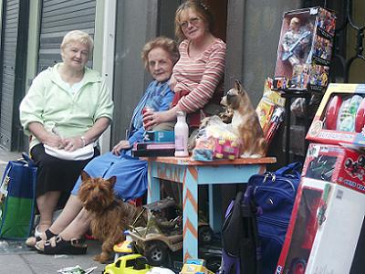

Title: Hvernig gengur drengur?
Subtitle: Af samfélagdrifinni þjóðfræðasöfnun í Írlandi
Slug: hvernig-gengur-drengur
Date: 2008-09-16 18:34:24
UID: 597
Lang: is
Author: Unnur María Bergsveinsdóttir
Author URL: http://unnur.klaki.net
Category: Munnleg saga, Þjóðfræði
Tags: Þjóðfræði, Munnleg saga, Írland, Samfélag

Síðastliðinn fimmtudag steig írski þjóðfræðingurinn dr. Cliona O’Carrol í pontu í Odda og skýrði frá afar áhuga&shy;verðu verkefni sem félaga&shy;samtökin Northside Folklore Project hafa á síðustu árum unnið að í borginni Cork á Írlandi. Cork er ein af stærri borgum Írlands með um tvisvar sinnum fleiri íbúa en Reykjavík. Söfnunar&shy;verkefni samtakanna snýr að söfnun þjóð&shy;fræðilegra heimilda um borgina og það samfélag sem þar þrífst. Snýst það annars vegar að söfnun ljósmynda og hinsvegar munnlegra heimilda, bæði á hljóð- og mynd&shy;formi. Rekja má upphaf verkefnisins til útvarps&shy;þátta sem gerðir voru þegar Cork var menningar&shy;borg Evrópu árið 2005, en í þáttunum var borgin rannsökuð út frá sjónarhorni borgarbúa.

Sjálf félagasamtökin voru stofnuð árið 1996 og byggja á samvinnu fræðimanna, yfirvalda og borgarbúa. Þjóðfræða&shy;deild háskólans í Cork sér um verkefna&shy;stjórn og þjálfun sjálf&shy;boðaliða og sérfræðingar í tækni&shy;málum sjá um að kenna notkun tækni&shy;búnaðar. Verkefnið hefur félagslega hlið, en margir þeirra sem að verkefninu hafa unnið hafa komið að því í gegnun atvinnu&shy;bótaplan borgarinnar. Frá því verkefninu var hrundið af stað hafa rúmlega áttatíu manns unnið að því og hlotið þjálfun í viðtalstækni, rannsóknar&shy;vinnu, notkun upptöku- og tölvu&shy;búnaðar, skjalfræði og miðlun. Þátt&shy;takendur eru hvattir til þess að rækta eigin styrkleika með því að rannsaka þau viðfangsefni sem eru þeim hjartfólgin og taka þátt í miðlun þess, með því að skrifa upp úr rannsóknum sínum greinar fyrir tímarit verkefnisins _The Archive_ eða með því að koma að stuttmynda- eða útvarps&shy;þáttagerð á vegum samtakanna.

Borgarbúar hafa tekið verkefninu og viðtalsbeiðnum afar vel. Cliona benti á að líklega spilaði það inn í að söfnunin hefði hafist í andrúms&shy;lofti hátíðar&shy;halda og tilbreytingar. Það hefði án efa haft þau áhrif að Corkbúar hefðu verið opnari fyrir því að ræða borg og eigin tilveru við rannsakendur.  Þau þemu sem verkefnið hefur tekið á eru svo nokkur dæmi séu nefnd bingóspil og skemmtanir, Roy Keane, barnaleikir og vísur, leikföng og tíska, textíl&shy;framleiðsla, trúar&shy;athafnir og hátíðis&shy;dagar, bátasmíði og flökku&shy;fjölskyldur. Safn verkefnisins inniheldur í dag mörg hundruð klukkustundir frásagna, bæði í formi hljóð- og vídeó&shy;upptakna og rúmlega tíu þúsund ljósmyndir. Allt þetta efni er opið jafnt almenningi og  þeim sem áhuga hafa á því að rannsaka Cork.

Eitt þeirra þema sem sérstaklega var tekið fyrir er koma og aðlögun innflytjenda til Cork. Lengi vel var Írland land sem fólk flutti frá. Á síðustu árum hefur stöðugur straumur innflytjenda hinsvegar legið til Írlands og hefur cork ekki farið varhluta af þessum breytingum. Flestir innflytjendanna koma frá vestur Evrópu, þá sérstaklega frá Frakklandi og Spáni. Nýlega hafa austur-Evrópu og Afríkubúar svo bættst í hópinn. Augljós afleiðing þessa er að upp hafa sprottið veitinga&shy;staðir og verslanir sem sérhæfa sig í matar&shy;gerð ólíkra þjóða. Eitt markmiða verk&shy;efnisins er að skrásetja það hvernig þeir sem fyrir voru upplifa þessar breytingar, hvernig þeim aðkomnu gengur að aðlagast sam&shy;félaginu og hvernig þeir upplifa sambandið við sín fyrri heim&shy;kynni. Cliona spilaði fyrir salinn skemmtilegt hljóð&shy;dæmi þar sem indverskur maður skýrði frá því hvernig sérstakt orðfæri Corkbúa olli honum til að byrja með miklum heilabrotum.

Það að efni hafi verið safnað með miðlun að markmiði hafði töluverð áhrif á rann&shy;sóknina. Sér í lagi laðaði það að efnið skyldi henta til gerðar útvarpsþátta fram spurningar sem annars hefðu ekki þótt henta í dæmi&shy;gerðri söfnun þjóð&shy;fræðaefnis. Sem dæmi um slíkt nefndi Cliona (og spilaði hljóðdæmi) að viðmælendur hefðu verið beðnir um að nefna 3 fyrstu orðin sem þeim dytti í hug þegar þeir heyrðu orðið „Cork“. Afrakstur þessarar nálgunar var athyglis&shy;verður, sagði Cliona. Hluti viðmælendanna fraus og stamaði, margir þeirra aftur á móti svöruðu með athyglis&shy;verðum hugrenninga&shy;tengslum og hugmyndum. Hún taldi rannsóknina hafa grætt á þessari óhefð&shy;bundnu aðferð, með þessu móti fengust fram upplýsingar sem hefðb&shy;undari spurningar&shy;máti hefði trauðla lokkað fram

Í fyrirlestri sínum lagði Cliona áherslu á mikilvægi þess að verkefni af þessum toga væru unnin í góðri samvinnu við það samfélag sem þau rannsökuðu og ekki síður að þeirri orku og samhyggð sem þau uppskæru væri veitt aftur út í samfélagið með miðlun verk&shy;efnisins.  Að einstaklingar úr samfélaginu fái tækifæri til þess að taka þátt og að niður&shy;stöðum verkefnisins sé miðlað aftur út í samfélagið, með það að markmiði að styrkja samfélagið og sjálfs&shy;mynd þess. Þetta markmið hefur frá upphafi verið haft að leiðar&shy;ljósi hjá Northside Folklore Project; Afrakstri söfnunar Northside Folklore Project hefur verið miðlað á marg&shy;víslegan hátt. Auk útvarps&shy;þátta og stuttmynda hafa valdir bútar úr viðtölum verið gefnir út á geisladiskum. Út hafa komið ellefu tölublöð tíma&shy;ritsins _The Archive_ en því er dreift ókeypis í verslanir, bókasöfn, skóla, til fjölmiðla, á bæjar&shy;skrifstofur, félags&shy;miðstöðvar, hótel og pöbba, ekki aðeins í Cork heldur til allra þeirra staða þar sem ætla má að finna megi fólk frá Cork. Markmiðið með útgáfu tíma&shy;ritsins er að kynna starf&shy;semi samtakanna og er almenningur hvattur til þess að senda inn eigin greinar.

Cliona hafði meðferðis nokkur eintök af tímaritinu sem reyndist mjög áhugavert aflestrar. Þar er að finna stuttar frásagnir af persónum og mannlífi í Cork auk ljósmynda. Frásögnum úr nútíð er blandað saman við greinar um gengna Cork búa, sögum og mýtum um tiltekna staði í borginni, tilurð ýmissa siða og vana rakin auk þess sem fjallað er um sögu hinna og þessarra menningar&shy;stofnana og samtaka. Efnið er fjölbreytt og augljóst að það endur&shy;speglar marg&shy;breytileika þess hóps sem að tímaritinu kemur; fjallað er um hópa nútímanorna, veðurfar í aldanna rás, brúarsmíði á 19. öld, nýlegan eldsvoða á leikskóla, byltingu í almennings&shy;samgöngum, húðflúr og aðrar líkams&shy;umbreytingar, líf verksmiðju&shy;kvenna, geit sem fjölskylda hélt sem gæludýr og svo framvegis og svo framvegis. Þess má geta að nokkrar greinanna eru á írsku.

Félagið hefur einnig gefið út tvær bækur _Life Journeys_ og _How’s it goin’, boy?_ Þar er blandað  saman ljós&shy;myndum og uppskriftum frásagna og skýrði Cliona frá því að bókin hefði notið fádæma vinsælda, væntanlega vegna þess að Cork er þrátt fyrir allt nægilega smá borg til þess að flestir sem tóku bókina upp í bóka&shy;búðum og blöðuðu í henni af forvitni gátu fundið í henni einhvern sem þeir þekktu. Síðast en ekki síst má finna búta úr rúmlega 200 viðtölum á [efnismikilli heimasíðu verkefnisins](http://www.ucc.ie/research/nfp/index.php).

Verkefninu hefur ekki aðeins verið vel tekið af íbúum Cork heldur hefur breska menningararfsráðið (e. Heritage Council) mælt með því sem ákjósanlegri fyrirmynd slíkra verkefna. Ráðgjöf samtakanna er eftirsótt og gegna þau hlutverki stuðningsaðila fjöl&shy;margra hópa sem vinna að því að koma svipuðum verkefnum á koppinn. Samtökin hafa staðið að mál&shy;þingum og fyrirlestrum, tekið þátt í ráðstefnum og haldið námskeið. Þau eru opinber aðili að fimm ára áætlun um uppbyggingu menningar&shy;arfs á svæðinu. Þessum góðu viðtökum fylgja þó einnig ókostir. Líkt og gildir um mörg svipuð verkefni er fjármögnun helsti höfuð&shy;verkur Northside Folklore Project.  Aðspurð að því hvernig hún sæi fyrir sér að verkefnið myndi þróast skýrði Cliona frá þeim þversagnar&shy;kenndu aðstæðum að samhliða batnandi efnahags&shy;ástandi í Írlandi hefðu yfirvöld dregið úr fjár&shy;stuðningi við verkefnið. Þar sem atvinnu&shy;leysi hafi farið minnkandi hafi sú stefna verið tekin að fækka hlut&shy;fallslega þeim stöðum sem kostaðar eru af atvinnubóta&shy;plani yfirvalda. Sömuleiðis er utanaðkomandi eftir&shy;spurn eftir ráðgjöf og aðstoð við hönnun svipaðra verkefna og stjórnun þeirra mun meiri en starfsmenn verkefnisins hafa ráð á að sinna.

Áheyrendur á fyrirlestri Clionu fögnuðu henni með háværu lófataki að erindi hennar loknu og greinilegt var að margar hugmyndir höfðu vaknað í salnum. Það að skrásetja sögu borga og samfélaga er enda viðfangsefni sem ætti að höfða til allra þeirra sem áhuga hafa á því að skoða samfélög ofan í kjölinn. Daginn eftir lá leið Clionu svo til Hólmavíkur þar sem hún hélt fyrirlestur á haustþingi nýopnaðrar Þjóðfræðistofu. 
