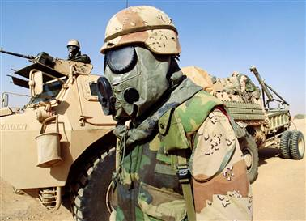

Title: Hvernig selja skal stríð
Slug: hvernig-selja-skal-strid
Date: 2008-04-03 14:57:13
UID: 244
Lang: is
Author: Unnur María Bergsveinsdóttir
Author URL: http://unnur.klaki.net
Category: Fjölmiðlafræði, Fjölmiðlar, Menningarfræði
Tags: Douglas Kellner, Persaflóastríðið, Bandaríkin, fjölmiðlar, stríð, Írak, áróður, Jim Hoagland, The Washington Post, óríentalismi, Hill og Knowlton, stríðssvæði, Jarhead, Anthony Swofford, General Electric, RCA, NBC, auglýsendur

Douglas Kellner er bandarískur menningarfræðingur sem unnið hefur að rannsóknum á sviði fjölmiðla. Sér í lagi hefur hann beint sjónum sínum að því hvernig fjölmiðlun hefur í síauknum mæli snúist um það að gera atburði að viðburðum. Það er skoðun Kellners að menningarfræðin sé sérstaklega vel til þess fallin að greina lykilatriði í pólítískri og samfélagslegri umræðu og að fræðimenn eigi ekki að forðast það að takast á við slík efni. Ennfremur sé það skylda sérhvers borgara að læra að þekkja þá tækni sem bæði fjölmiðlar og yfirvöld beita til þess að knýja almannaálitið að tilteknum málstöðum.Í bók sinni _Media culture: Cultural studies, identity and politics between the modern and the postmodern_ fjallar hann auk annars um umfjöllun stórra vestrænna fjölmiðla um Persaflóastríðið árið 1991. Lítur hann svo á að Persaflóastríðið hafi verið menningarpólítískur viðburður að jafn miklu leyti og það var hernaðarlegur atburður.Sú nálgunarleið sem Kellner styðst við byggist á því að skoða textann (í þessu tilfelli Persaflóastríðið) frá mörgum sjónarhornum samtímis. Hann beitir í þeim tilgangi tólum þeirrar menningarfræði sem kennd er við „Political Economy“, textafræðilegri greiningu og viðtökufræði fjölmiðlamenningar. 

Samkvæmt Kellnuer beittu stjórnvöld klókindum til þess að fá fjölmiðla til að framleiða þá ímynd af stríðinu að það væri nauðsynlegt, jafnvel óumflýjanlegt, að heyja það. Ógnin sem stafaði af Írökum var markvisst blásin upp úr öllu valdi með fölskum yfirlýsingum og á markvissan hátt var reynt að stjórna því hvaða upplýsingar fjölmiðlar komust yfir. Markmiðið var ekki bara að blekkja eigin þegna heldur líka að blekkja stjórnvöld í Sádí-Arabíu. Telur Kellner þessa framkvæmd eina best heppnuðustu almannatengslaherferð sem framkvæmd hefur verið í sögu nútíma pólitíkur. Kellner bendir á að frjáls og óháð fjölmiðlun sé forsenda þess að þegnarnir geti tekið upplýstar ákvarðanir. Með því að láta svo auðveldlega leiðast til þáttöku telur Kellner því að bandaríska fjölmiðlakerfið hafi í raun stefnt lýðræðinu í hættu. 

Kellner skiptir atburðarásinni, sem hófst þegar Íraksher réðst inn í Kuwait og lauk eftir að her Bandaríkjamanna hafði hertekið Baghdad, upp í tvo hluta.  Fyrra stigið kennir hann við framleiðslu samþykkis (e. Manufacturing of consent) og miðaði það stig að því að réttlæta staðsetningu bandarísks herafla á landamærum Kuwait og Sádi-Arabíu og í framhaldi af því beitingu herafla í því markmiði að reka Íraka út úr Kuwait. Seinna stigið á við tímabilið þar sem stríðið sjálft geysar og eru þar í brennidepli þær aðferðir sem stjórnvöld beittu til að stýra aðgengi fjölmiðla að upplýsingum. 

__Stig 1. Krísan:__ Athugun Kellners sýnir að frá upphafi fylgdu markaðsháðir fjölmiðlar þeim línum sem ríkisstjórn Bush og Pentagonið lagði. Skýringin á þessu, segir Kellner, er sú að viðkomandi aðilar eru háðir tekjum af áskrifendum og auglýsingum. Því séu þeir flestir afar tregir til þess að ganga í berhögg við opinbera stefnu og almannaálit, sérstaklega á tímum krísu. 

Markviss skoðanamótunarvinna af hálfu bandarísku ríkisstjórnarinnar svo til um leið og Íraksher réðst inn í Kuwait í ágúst 1990.  Ein helsta aðferð stjórnvalda til þess að hafa áhrif á fjölmiðla á þessu stigi málsins var sú að gefa beinlínis rangar upplýsingar um eðli ástandsins, athafnir Írakshers, pólítískt ástand í Írak, stefnu Husseins og hugmyndir Sádi-Araba um það hvernig best væri að bregðast við innrásinni í Kuwait. Þessar upplýsingar átu fjölmiðlar upp og endurtóku síðan hver eftir öðrum sem staðreyndir. Margt það sem stjórnvöld notuðu til þess að réttlæta aðgerðir reyndist síðar hafa verið byggt á uppspuna, til að mynda var því haldið fram frá upphafi að enginn möguleiki væri á því að leysa málið á friðsamlegan hátt þó svo Hussein hafi þegar í upphafi lýst sig reiðubúinn til slíkra viðræðna.  

Fjölmiðlar höfðu á þessu stigi málsins lítinn áhuga á því að skýra frá mótmælum friðarsinna og reynt var að gera þá og málsstað þeirra ótrúverðugan. Kellner bendir á að þetta hafi verið ríkisstjórninni í hag og dregur fram líkindi með þessum gjörningi og því hvernig neikvæð mynd var dregin upp af andstæðingum Víetnamstríðsins nokkrum áratugum fyrr. 

Kellner beinir sjónum sínum sérstaklega að einum lykilmanna The Washington Post, Jim Hoagland, og greinir orðræðu hans sem mettaða óríentalisma. Hoagland dró markvisst upp mynd af aröbum sem einsleitum hópi, sem aðeins skilji valdbeitingu en ekki rökræður eins og hinir þróuðu hvítu Vesturlandabúar. Skrif Hoaglands höfðu mikið vægi í umræðunni um Persaflóastríðið þar sem þau voru víðlesin og færa má rök fyrir því að hann hafi átt stóran þátt í að hjálpa til við að breiða út þá hugmyndafræði sem réttlætti innrásina í Írak.  Vitað er að bandarísk stjórnvöld fylgdust grannt með skrifum Hougland og í október 1990 hófu þau ásamt kúwaískum stjórnvöldum markvissa áróðursherferð sem miðaði að því að draga upp hugmyndafræðilega mynd af Saddam Hussein og Írökum sem holdgervingu hins illa. Í þeirri orðræðu var Saddam Hussein meðal annars líkt við Hitler og framleiddar voru fréttir af því hvernig íraskir hermenn höfðu átt að hafa myrt fyrirbura á kúwaísku sjúkrahúsi. 

Þessu samhliða var hreinlega ráðið almannatengslafyrirtæki: [Hill og Knowlton](http://www.hillandknowlton.com/). Meðal þess sem þeir gerðu var að setja upp ljósmyndasýningu sem sýndi meint grimmdarverk Íraka ásamt því að framleiða kvikmyndað efni af sama toga og þjálfa kúwaíska flóttamenn í því að segja frá innrás Íraka með sem hryllilegustum hætti. Það að djöfulgera óvininn var nauðsynlegt framhald af þeim hugmyndum, sem meðal annars Hougland hélt svo ötullega fram, að við „þetta fólk“ væri ekki hægt að ræða nema með byssukúlum. Fréttir á borð við þá um fyrirburana spiluðu á djúpstæðar tilfinningar almennings og vöktu hörð viðbrögð enda töngluðust bæði Bush og varaforsetinn Dan Quale á henni. Í kjölfar þessa fylgdi svo aurskriða af fréttum sem snerust um kynferðislegt óeðli Saddams en Kellner bendir á að frá upphafi amerísks samfélags hafi það að heimta hefnd fyrir nauðganir (og þá sérstaklega þegar hvítum konum er nauðgað af karlmönnum af öðrum kynþáttum) verið ein helsta leiðin til þess að réttlæta pólítíska og/eða hernaðarlega aðför gegn lituðu fólki.  Fjölmiðlar áttu þess varla annan kost en að skýra frá þessum „uppgötvunum“ sem stjórnvöld og aðilar á þeirra vegum skýrðu reglulega frá en Kellner bendir líka á að „æsilegur“ fréttaflutningur af þessu tagi hafi þar að auki beinlínis hentað sjónarhorni sumra fjölmiðla. 

Yfirvöld stjórnuðu frá upphafi aðgangi fjölmiðla að hernaðarlega mikilvægum stöðum og herliði með afar nákvæmum hætti sem kallaður er „Pool System“. Í gegnum þetta kerfi var aðgangi fréttamanna að stríðssvæðinu beint í litlum hópum að sérstökum upplýsingamiðstöðvum sem Bandaríkjaher rak. Þeir fengu ekki að heimsækja sjálfar vígstöðvarnar eða bækistöðvar hermanna nema undir eftirliti og þá aðeins valda staði. Dæmi voru um að minnispunktar fréttamanna væru ritskoðaðir. 

__Stig 2: - Stríðið:__ Bandaríkin hófu beinar hernaðaraðgerðir gegn Írökum í janúar 1991 og um leið urðu fjölmiðlar enn háðari upplýsingum frá stjórnvöldum. Segja má að fjölmiðlar hafi neyðst til að gerast áróðursmálpípa stjórnvalda um leið og stríðið varð að einskonar skemmtiefni sem var sent inn á öll heimili. Ímynd sú sem fjölmiðlar sköpuðu af stríðinu var sú að það væri hreint og hátæknivætt stríð þar sem mannfalli væri haldið í lágmarki og mannúð höfð að leiðarljósi. Áhersla var lögð á frásagnir af notkun svokallaðra „Precision/smart bombs“ þó svo reyndin væri önnur.  Frásögnin af stríðinu var spennandi og framsetningarmáti stóru sjónvarpsstöðvanna jaðraði við það að taka á sig mynd spennuþáttaraðar eða útsendingar frá íþróttakappleikjum. Föðurlandsást og fórnfýsi hermannanna og fjölskyldna þeirra voru mikilvæg þemu.  Þessu til viðbótar kyntu stjórnvöld undir ótta við kjarna- og efnavopn og hryðjuverk. 

Það er athyglisvert að bera greiningu Kellners saman við verk Anthony Swofford, -_Jarhead_, sem út kom árið 2003 og varð tveim árum síðar að kvikmynd sem hlaut töluverða aðsókn. Þar færir Swofford, sem var í landgönguliði Bandaríkjahers og tók þátt í Persaflóastríðinu upplifan sína í skáldævisögulegt form. Í frásögn hans kemur einmitt fram að þeir sem taka ákvarðanirnar í hernum eru hrifnir af hátæknivopnum og þróun þeirra en þegar á reynir er sú sérfræðiþekking sem skytturnar búa yfir lítt nýtt og þeir upplifa það sem svo að hlutverk þeirra hafi verið gengisfellt.  Þetta rímar ágætlega við umfjöllun Kellner um þá áherslu sem í fjölmiðlaumfjöllun um stríðið var lögð á hátæknivopn þegar reyndin var sú að í loftárásunum var mest notað af venjulegum sprengjum. Sömuleiðis er framvinda verksins gerólík þeirri ímynd sem Persaflóastríðinu var sköpuð, í stað þess að vera spennandi er framvinda mála í eyðimörkinni þvert á móti hrútleiðinleg og stöðug óvissa ríkir um það hvenær megi treysta yfirlýsingum heryfirvalda og hvenær upplýsingar um framvindu stríðsins séu uppspunninnar í áróðursskyni. Sú mynd sem dregin var upp af heimsókn fjölmiðlafólksins í eyðimerkurherbúðirnar dregur sömuleiðis upp mjög kaldhæðna mynd af tilraunum hersins til að stjórna umfjöllun. 

Það er auðvelt að hneykslast á því frá hvaða sjónarhorni bandarískir fjölmiðlar fjalla um stríðið en Kellner bendir á að fjölmiðlar eru ekki hugsjónastofnanir heldur háðir markaði. og Ef stríð sé vinsælt þá muni þeir fjalla um það í jákvæðu ljósi. Reynslan hefur sýnt að flestar aðgerðir Bandaríkjahers hafa verið vinsælar heima fyrir, að minnsta kosti í upphafi og því séu fjölmiðlar hikandi við það að fjalla á neikvæðan hátt um stríð. Kellner bendir á að að baki geti þar að auki legið margþættir hagsmundir, t.d. sé NBC sjónvarpsstöðin í eigu fyrirtækjanna General Electric og RCA og þar sem þessi fyrirtæki tengist vopnaframleiðslu hafi þau séð sér hag í því að styrkja framleiðsluna. Fjölmiðlar eru auk þess á tímum þjóðfélagsólgu tregir til að notast við raddir sem teljast umdeildar og bíða því frekar eftir því að skýrar línur liggi fyrir hvað varðar stefnu stjórnvalda og almenningsálit. Auglýsendur eru sömuleiðis tregir til að taka áhættu á að láta tengja vörur sínar við óvinsælar skoðanir og af því þurfa fjölmiðlar að taka mið. Samþjöppun á alþjóðlegum fjölmiðlamarkaði hefur að lokum þau áhrif að upplýsingauppsprettum fækkar, þ.e. fleiri reiða sig á upplýsingar sem færri afla. 

