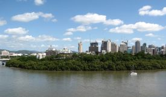

Title: Hvað skal lært og hvert skal haldið?
Subtitle: Í námi „down under“
Slug: i-nami-down-under
Date: 2006-09-12 08:46:00
UID: 92
Lang: is
Author: Eyrún Sigurðardóttir
Author URL: 
Category: Póstur að utan, Auglýsingar
Tags: 

Þriggja ára námi mínu við Háskóla Íslands lauk vorið 2003. Upp úr krafsinu hafði ég BA próf í sálfræði. Það helsta sem sú gráða gerir fyrir mann er að opna fyrir möguleika á frekara námi og var því nauðsyn að nýta sér það fyrr eða síðar. Námsframboð er mikið á Íslandinu góða en þó freistaði mín ekki að halda áfram þar enda ævintýraþráin farin að gera vart við sig, auk þess sem óska-greinin er ekki kennd heima á Íslandi. Ekki freistaði heldur að fara til hinna Norðurlandanna enda allt of mikið af Íslendingum þar (ekki svo að skilja að þeir séu slæmir heldur frekar að ef maður er að fara út á annað borð þá er skemmtilegra að kynnast einhverju alveg nýju) og svo langaði mig að gera eitthvað meira öðruvísi. Lengi vel var Nýja Sjáland efst á óskalistanum en á endanum varð Ástralía fyrir valinu og þangað hélt ég í upphafi árs 2006. 

Þrátt fyrir að hafa stundað nám í sálfræði heima þá varð það ekki fyrir valinu sem framhaldsnám. Ég kaus að fara í nám sem væri ekki eins fræðilegt og sálfræðin og þar sem mig hafði lengi langað að læra auglýsingagerð leitaði ég það uppi og fann loks í Brisbane í Ástralíu. Hér var nokkuð nýlega farið að bjóða upp á meistaranám í auglýsingagerð, Master of Advertising, og hægt er að fara tvær leiðir að þessu takmarki; creative og strategic eða listrænu-leiðina og skipulags-leiðina. Skipulags-leiðin byggist mest á viðskipta-, markaðs- og aðferðafræði og er meira bókleg en hin leiðin. Listræna-leiðin hefur meiri áherslu á hönnunun mynda og texta auk þess sem skipulagning og forvinna auglýsinga er mikilvægur þáttur á þessu sviði. Ég valdi að taka listrænu-leiðina. 

Áður en farið verður út í frekari útlistingar á náminu langar mig að segja stuttlega frá skólanum og staðnum. Skólinn heitir Queensland University of Technology (QUT) og er eins og nafnið gefur til kynna í Queensland, sem einnig er kallað Sunshine State (sem er viðeigandi nafn). Brisbane kallast borgin sem hýsir skólann. Þar búa tæplega 2 milljónir manna af ýmsum uppruna og er bæði skólinn og borgin mjög fjölþjóðleg. Í skólanum eru um 40.000 skráðir nemendur og þar af um 5000 alþjóðlegir nemendur (international students) samkvæmt mínum upplýsingum. Til vitnis um fjölþjóðleikann þá get ég nefnt að bestu vinir mínir eru frá Frakklandi, Thailandi, Suður-Afríku, Indlandi, Hong Kong og Ástralíu en í minni námsgrein eru einungis fimm Ástralir. Þó ég geti ekki sagt með fullkominni vissu að ég sé eini íslenski neminn í skólanum þá hef ég ekki frétt af öðrum síðan íslensk stelpa sem var hérna flutti sig um set frá QUT í skóla á Nýja Sjálandi. 

Kennslan í meistaranáminu sem ég stunda fer að mestu fram á kvöldin. Er það gert til að taka tillit til þeirra sem vinna með skólanum, sem er svo sem hið ágætasta mál en hentar þó ekki öllum. Skólinn hefur þrjú háskólasvæði (campus) og fer kennslan í auglýsingagerðinni fram á tveimur þeirra. Þetta fyrirkomulag er þó ekki til mikils ama þar sem strætó á vegum skólans gengur á milli háskólasvæðanna yfir daginn. Húsakynnin eru þokkaleg en kominn tími á að endurnýja margt og nú er raunar í gangi mikil byggingarvinna á einu háskólasvæðinu, þannig að þetta stendur til bóta. Í raun virðist mér staðan í þessum málum ekki ósvipuð stöðu Háskóla Íslands ef ég ber saman reynslu mína af báðum þessum stofnunum. Byggingarnar á hverju háskólasvæði eru margar, misstórar, mismunandi í laginu, standa þétt saman og mynda hálfgert völundarhús fyrir þá sem ekki þekkja til og mættu kortin gjarnan vera víðar. 

Komandi úr sálfræðináminu er ég vön miklu skipulagi, lestri, prófum og föstum formum á skýrslugerðum. Það var því nokkuð sjokk að koma í „skipulagið“ hérna, þá sérstaklega í listrænu greinunum. Eftir nokkra byrjunarörðugleika á því sviði er það nokkuð að venjast nú á annarri önninni. Lítið gagn var í fyrirlestrum á þessu sviði á fyrstu önninni og þurfti að þreyfa fyrir sér í myrkrinu með verkefnavinnuna en það hafðist á endanum þrátt fyrir miklar kröfur og of lítið aðhald. Í viðskiptagreinunum var mun betra skipulag, ekki ólíkt því sem bóklegu greinarnar í HÍ hafa, bæði voru fyrirlestrarnir betri og skýrara form á verkefnavinnu auk þess sem kennsluefni var gagnlegra. Nú á annarri önn minni hérna er staðan betri enda gerir maður sér nú grein fyrir kröfunum sem gerðar eru og vinna seinustu annar virðist hafa skilað meiru en útlit var fyrir í fyrstu. Enn er samt einhver ruglingur og stundum þegar maður leitar til kennaranna í listgreinunum með spurningar kemur maður ruglaðari út en þegar maður fór inn. Listgreinarnar eru þrátt fyrir gallana mun skemmtilegri og sérstaklega sá hluti sem snýr að því að vinna við auglýsingar, fá hugmyndir, skrifa texta og huga að myndvinnslu. Með þessu er ég þó ekki að segja að viðskiptagreinarnar séu leiðinlegar þvert á móti og hafa þær mikið hjálpað við skilning á listræna hluta námsins. Viðskiptagreinarnar eru að vissu leyti léttari miðað við þann grunn sem ég hef og felst næstum hvíld í því að reka nefið ofan í bækurnar þar. 

Námsmatið byggist að mestu leyti á verkefnavinnu auk hlutaprófa í viðskiptagreinunum. Verkefnin eru af ýmsum toga allt frá því að gagnrýna fræðigreinar og að því að skipuleggja, skapa og rökstyðja auglýsingaherferðir. Einnig er mjög vinsælt að meta framsögur og umræðustjórnun til einkunna og hefur stress í kringum það komið í staðinn fyrir stress í kringum lokapróf, sem lítið er um í listrænu leiðinni. Þó verður að viðurkennast að það er óneitanlega gott að hafa reynslu af því að undirbúa efni og kynna fyrir öðrum.

Lífið hérna „down under“ er yndislegt, svo til alltaf gott veður, fólkið er vinalegt, afslappað og ekkert stress í gangi. „No worries“ orðatiltækið er eiginlega besta leiðin til að lýsa Áströlum enda engin ástæða til að vera að stressa sig ef maður getur verið að njóta lífsins. Vonandi get ég tileinkað mér þetta lífsviðhorf áður en snúið verður heim en það er enginn hægðarleikur eins og er þar sem álagið í skólanum býður ekki upp á mikla afslöppun. Námið er erfitt enda ótrúlega mikil vinna sem liggur að baki auglýsinga en samt sem áður er það líka skemmtilegt. Hér hef ég lært margt nýtt sem var nú auðvitað tilgangurinn, og vonandi nýtist það vel í framtíðinni svo að slagorð skólans „a university for the real world“ rætist í mér.  

